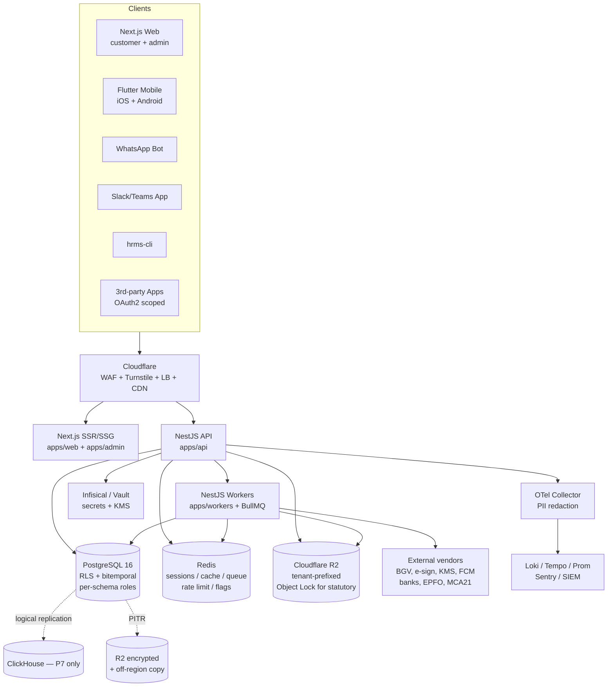
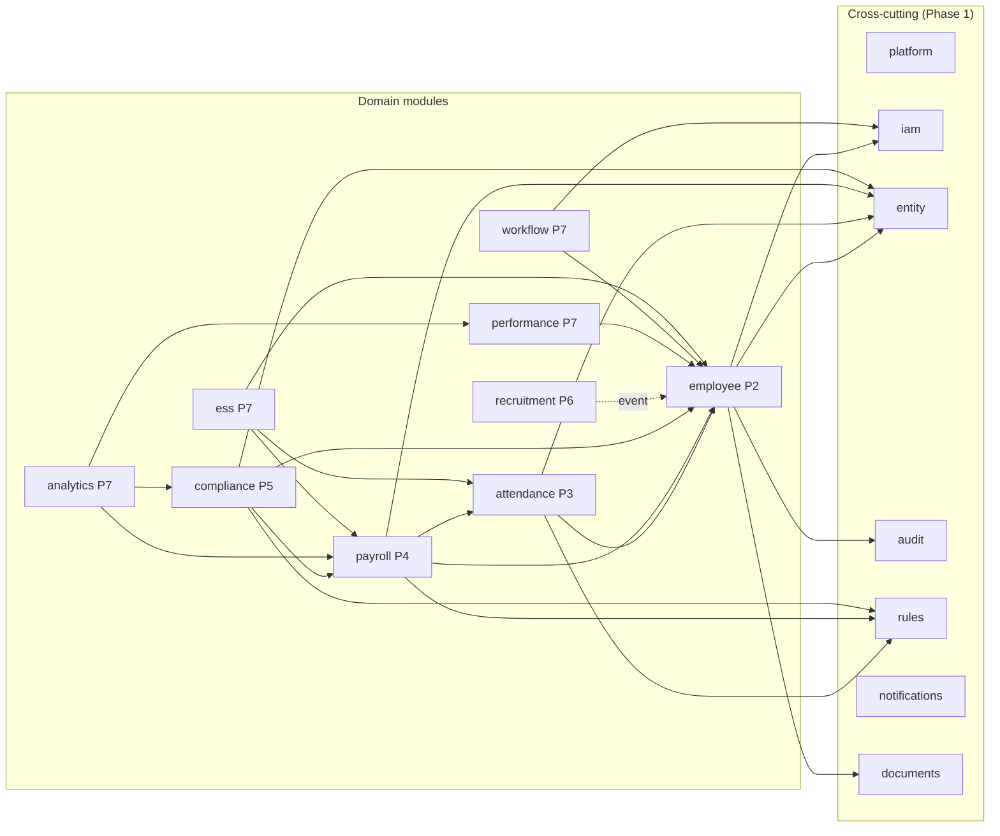
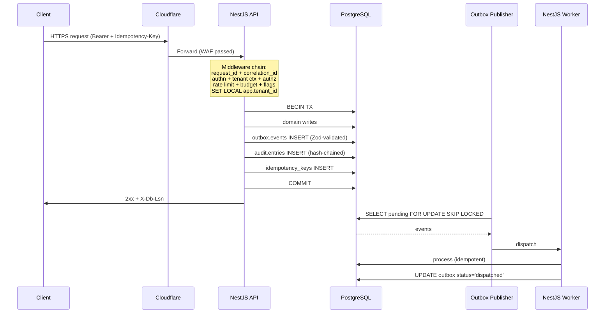
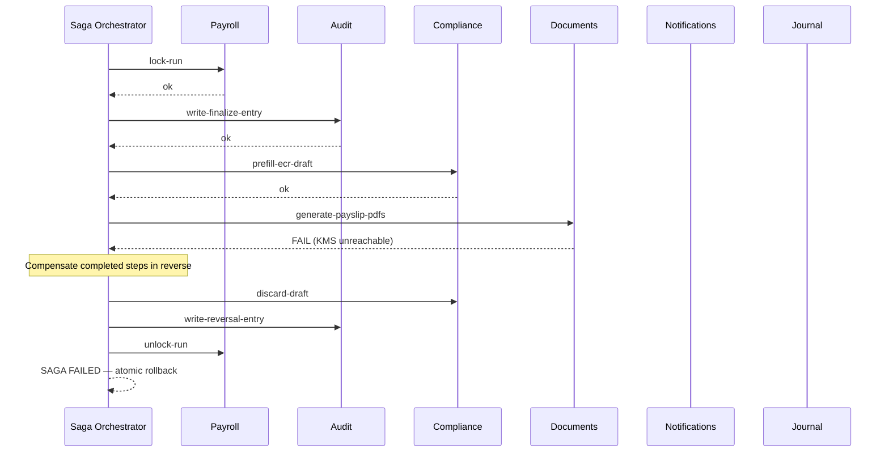
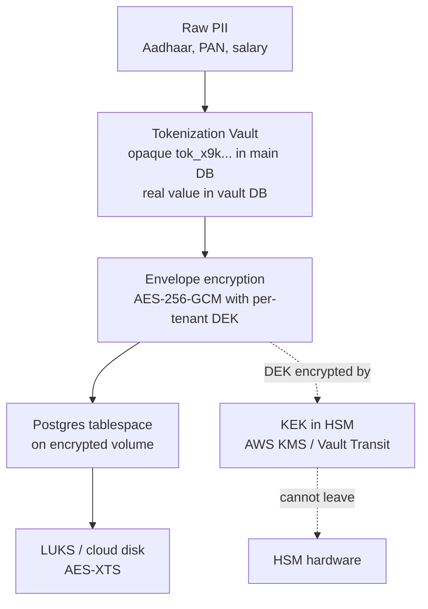

# HRMS — Architecture Design

| Field                    | Value                                                    |
| ------------------------ | -------------------------------------------------------- |
| Status                   | **Approved (brainstorming phase)**                       |
| Created                  | 2026-05-01                                               |
| Author                   | Founder (solo + AI-assisted)                             |
| Source spec              | `/Users/pj/Documents/hrms/spec/` (10 modules + appendix) |
| Brainstorming transcript | this conversation, 2026-04-30 → 2026-05-01               |
| Next step                | Implementation plan via `superpowers:writing-plans`      |

---

## 0 — Executive summary

A **compliance-first, multi-tenant HRMS SaaS for the Indian SMB-to-mid-market segment**, delivered in 8 sequential phases over 18-24 months by a solo founder with AI assistance.

**Architectural bet:** a **modular monolith** with **bounded contexts**, built on **NestJS + Next.js + Flutter**, backed by **PostgreSQL** with **Row-Level Security**, with a **statutory rules engine** versioned as data so yearly Indian law changes ship as JSON, not code releases. **Fortune-500-grade security posture** is non-negotiable from day one: passkeys + JIT elevation + envelope encryption + tokenization vault + bitemporal data + hash-chained append-only audit + Merkle anchoring + Postgres RLS + per-schema least-privilege + signed releases + continuous controls monitoring.

**Quality bar:** no shortcuts, no garbage code, no throwaway scaffolding. Every line ships with property-based tests, mutation testing, golden master snapshots, and architecture fitness functions enforcing module boundaries.

**Differentiator:** beyond the table-stakes HRMS surface, the product ships a layer of _cherries_ — AI copilot, WhatsApp ESS, statutory notice responder, migration tools from competitors, shadow-mode trial, ePayslip QR verifier, public Trust Center, right-to-know portal, scriptable extensions, marketplace — that compound into a category-defining product.

---

## 1 — Decisions locked

| #   | Decision                                                                                                                                                                                           | Rationale                                                                                                                                                                                       |
| --- | -------------------------------------------------------------------------------------------------------------------------------------------------------------------------------------------------- | ----------------------------------------------------------------------------------------------------------------------------------------------------------------------------------------------- |
| 1   | **Sequential 8-phase delivery**, no shortcuts, no parallel tracks until Phase 4                                                                                                                    | Quality bar; solo capacity; foundations must be perfect before building on them                                                                                                                 |
| 2   | **Phase order:** P1 Foundations → P2 Employee → P3 Attendance+Leave → P4 Payroll → P5 Compliance → P6 Recruitment → P7 Performance+Workflow+Analytics+ESS web → P8 Flutter mobile                  | Maps to commercial wedge (payroll closes deals); compliance immediately follows; mobile last because contract must stabilize                                                                    |
| 3   | **Stack:** NestJS + Next.js 15 + Flutter + PostgreSQL 16 + Drizzle + Redis + BullMQ + Better Auth + Cloudflare + Hetzner + Coolify                                                                 | Founder's existing production stack (Mantraksha, Paath, InAJam, Komatsu run on this); Postgres + RLS is strongest multi-tenant compliance story; spec's MongoDB choice walked back deliberately |
| 4   | **Modular monolith with bounded contexts** (Approach 2)                                                                                                                                            | Holds shape across 8 phases; testable in isolation; Go-extraction is mechanical when needed; Linear/Cal.com/Stripe pattern                                                                      |
| 5   | **Go-shaped seams from day one** for hot paths (payroll engine, statutory generators, rules-engine evaluator) implemented as port + TS adapter; can swap to Go binary later without caller changes | Avoids premature complexity while preserving optionality                                                                                                                                        |
| 6   | **Themes 1, 2, 3, 5 fully**, themes 4 and 6 deferred minimally                                                                                                                                     | Architecture rigor + security + code quality + compliance moat are non-negotiable; reliability/observability + mobile-specifics scale up as load demands                                        |
| 7   | **Solo + AI; CI replaces human review**                                                                                                                                                            | Process discipline (gates, fitness functions, mutation testing, AI PR review) substitutes for human reviewer until team grows                                                                   |
| 8   | **Realistic timeline: 18-24 months** for all 8 phases solo; 12-15 months with 2 devs                                                                                                               | Honest expectation, not aspirational                                                                                                                                                            |

---

## 2 — Repo + deploy topology

### 2.1 — Monorepo structure

Single Turborepo with pnpm workspaces.

```
hrms/
├── apps/
│   ├── api/                     # NestJS — modular monolith, all bounded contexts
│   ├── workers/                 # NestJS Bull processors (separate process, same codebase)
│   ├── web/                     # Next.js 15 — customer + tenant-admin web UI
│   ├── admin/                   # Next.js 15 — internal-platform admin (super-admin, ops, support)
│   └── mobile/                  # Flutter (kicks in at Phase 8; folder reserved)
├── packages/
│   ├── domain/                  # ⭐ pure-TS domain layer per bounded context (no NestJS, no Drizzle)
│   ├── contracts/               # Public TS interfaces between modules; OpenAPI source-of-truth fragments
│   ├── rules-engine/            # ⭐ Statutory rules engine — versioned packs + AST interpreter, no eval
│   ├── crypto/                  # Envelope encryption, KMS adapter, hashing, audit-chain helpers
│   ├── db/                      # Drizzle schema + migrations + RLS policies
│   ├── ui/                      # Shared React components for web + admin
│   ├── api-client-ts/           # Auto-generated from OpenAPI for Next.js
│   ├── api-client-dart/         # Auto-generated from OpenAPI for Flutter
│   ├── i18n/                    # Per-locale strings (English + Hindi + 6 regional Indian languages)
│   └── config/                  # Shared ESLint, TS, Tailwind, Vitest, Stryker configs
├── infra/
│   ├── coolify/                 # Coolify config
│   ├── docker/                  # Dockerfiles, compose for local
│   └── ops/                     # Backup scripts, restore drills, runbooks
└── docs/
    ├── adr/                     # Architecture Decision Records — every "why" lives here
    ├── superpowers/specs/       # Brainstormed designs (this is where this design lives)
    ├── runbooks/                # Incident response, deploy, restore-from-backup
    ├── compliance/evidence/     # Auto-collected SOC2 / ISO27001 / DPDPA evidence
    ├── changes/                 # Per-release artifacts (auto-generated)
    └── architecture/            # Living architecture docs (auto-generated)
```

### 2.2 — Why this shape

- `apps/api` and `apps/workers` share code via `packages/domain` — same business logic in HTTP and async paths, no drift
- `packages/domain` and `packages/rules-engine` have **zero NestJS or Drizzle imports** — framework-free, future Go-extraction is mechanical, unit tests run in milliseconds
- `packages/contracts` is the **only** way modules talk to each other — enforced by `dependency-cruiser`
- One Postgres, one Redis, one S3 (R2) bucket — no microservice plumbing
- All artifacts (CI evidence, ADRs, change-log, architecture docs) are part of the repo — auditable forever

### 2.3 — Deploy phasing

| Phase           | Compute                                             | Database                                                        | Storage                                    | Notes                                                  |
| --------------- | --------------------------------------------------- | --------------------------------------------------------------- | ------------------------------------------ | ------------------------------------------------------ |
| P1-P3           | Single Hetzner CCX22 (~₹1,500/mo)                   | Postgres + Redis on box                                         | R2 + S3 Object Lock for audit              | Coolify managing containers                            |
| P4 (Payroll)    | Split workers to dedicated VPS                      | Add Postgres read replica                                       | Dedicated audit-archive bucket             | Batch isolation                                        |
| P5 (Compliance) | Extract `compliance` worker queue                   | Logical replication slot pre-provisioned                        | Per-region storage policy enforced         | Inspector mode replicas spin up on demand              |
| P6-P7           | Web + admin scale horizontally behind Cloudflare LB | PgBouncer in transaction pooling mode; partitions on hot tables | Tenant-prefixed buckets                    | OpenSearch/SIEM live                                   |
| P8 (Mobile)     | API gets `/v1` URL prefix locked                    | No DB change                                                    | Direct-to-R2 presigned uploads from device | Force-update + min-version endpoint live before stores |

---

## 3 — Bounded contexts (modules)

16 modules total inside `apps/api`. Each owns its Postgres schema; cross-module talk only via `packages/contracts/<module>/` interfaces or domain events through the outbox.

| #   | Module          | Phase                 | Owns (Postgres schema)                                                                                          | Public contract surface                    |
| --- | --------------- | --------------------- | --------------------------------------------------------------------------------------------------------------- | ------------------------------------------ |
| 1   | `platform`      | P1                    | `platform.*` (tenants, plans, billing, idempotency keys, sagas)                                                 | `TenantReader`, `TenantLifecycle`          |
| 2   | `iam`           | P1                    | `iam.*` (users, sessions, roles, permissions, MFA, passkeys, OAuth clients)                                     | `UserReader`, `AuthGuard`, `Authorize`     |
| 3   | `entity`        | P1                    | `entity.*` (legal entities, statutory regs per state)                                                           | `EntityReader`, `EntityRegistration`       |
| 4   | `audit`         | P1                    | `audit.*` (append-only hash-chained log, Merkle anchors)                                                        | `AuditWriter` (event sink for all modules) |
| 5   | `rules`         | P1                    | `rules.*` (rule packs, versions, effective dating)                                                              | `RuleResolver`, `StatutoryConstants`       |
| 6   | `notifications` | P1 (skeleton) → grows | `notifications.*` (templates, dispatches, deliveries, channels, preferences)                                    | `NotificationDispatcher`                   |
| 7   | `documents`     | P1 (skeleton) → grows | `documents.*` (S3 metadata, versioning, signed URLs, classification)                                            | `DocumentReader`, `PresignedUploader`      |
| 8   | `employee`      | P2                    | `employee.*` (master, versions, KYC, family, lifecycle)                                                         | `EmployeeReader`, `EmploymentLifecycle`    |
| 9   | `attendance`    | P3                    | `attendance.*` (events, daily, shifts, rosters, leave types/policies/balances/applications, OT, regularization) | `AttendanceReader`, `LeaveBalanceReader`   |
| 10  | `payroll`       | P4                    | `payroll.*` (salary structure, components, runs, lines, payslips, F&F, bank files)                              | `PayrollReader`, `CompensationReader`      |
| 11  | `compliance`    | P5                    | `compliance.*` (filings, ECR, 24Q, Form16, PT, LWF, registers, notices, drift scans, inspection packs)          | `ComplianceReader`, `FilingScheduler`      |
| 12  | `recruitment`   | P6                    | `recruitment.*` (requisitions, candidates, applications, pipelines, interviews, offers, BGV, pre-joining)       | `RecruitmentReader`, `OfferLifecycle`      |
| 13  | `performance`   | P7                    | `performance.*` (goals, OKRs, feedback, 1:1s, cycles, reviews, calibration, PIP, promotion)                     | `PerformanceReader`                        |
| 14  | `workflow`      | P7                    | `workflow.*` (definitions, instances, approval chains, escalation, delegation)                                  | `WorkflowEngine`, `ApprovalGuard`          |
| 15  | `analytics`     | P7                    | `analytics.*` (custom reports, materialized read models, exports, schedules)                                    | `ReportRunner`                             |
| 16  | `ess`           | P7                    | shares with employee/attendance/payroll; thin BFF                                                               | `EssQuery` (read-only orchestrator)        |

### 3.1 — Hard import rules (enforced in CI by `dependency-cruiser`)

- Each domain module may import `packages/contracts` from cross-cutting modules (`audit`, `rules`, `iam`, `entity`, `notifications`, `documents`) and from modules earlier in the dependency graph
- `payroll` may import contracts from `employee`, `attendance`, `rules`, `entity`, `iam`, `audit` — and _no other domain module_
- `compliance` may import from `payroll`, `employee`, `entity`, `rules`, `audit`
- `recruitment` is fully isolated from `payroll` — talks only via the `EmployeeLifecycle.onCandidateConverted` event
- No domain module may import from `apps/web`, `apps/mobile`, or another module's `infrastructure/`
- The public contract package (`packages/contracts/`) has zero imports from any module's `application/` or `infrastructure/` (asserted by architecture fitness function)

---

## 4 — Request lifecycle, transactional outbox, sagas, concurrency

### 4.1 — Synchronous request path

```
Cloudflare WAF / Turnstile / per-IP DDoS
   ↓
NestJS controller
   ↓
[Middleware stack — runs in order]
  1. request-id + correlation_id assignment (or honor incoming)
  2. authn (JWT verify, session check, refresh-rotation reuse-detection)
  3. tenant-context (load tenant + entity + flags + tier)
  4. authz (@Authz('payroll:run:entity') guard with capability tokens)
  5. rate-limit (per-tenant tier + per-device + per-IP)
  6. request-budget initialization (DB queries / wall time)
  7. tenant-feature-flag prefetch into request context
  8. SET LOCAL app.tenant_id, app.entity_id, app.actor_user_id, app.correlation_id  ← RLS reads these
   ↓
Application service / Saga step
   ↓
Domain layer (pure TS, framework-free)
   ↓
DB transaction:
   ├── domain writes
   ├── outbox.events (Zod-validated, with version + correlation_id + causation_id)
   ├── audit.entries (hash-chained, prev_hash → this_hash)
   └── platform.idempotency_keys (if Idempotency-Key header)
   COMMIT
   ↓
Response with X-Db-Lsn header (read-your-writes)
   ↓
Outbox publisher → consumers → projections → notifications
   ↓
Saga compensation if any downstream step fails
```

**Atomicity claim:** the four writes (state, outbox, audit, idempotency) commit together. No half-state, no fired-but-state-not-saved event.

### 4.2 — Transactional outbox

```sql
[Domain transaction]
   ├── INSERT INTO payroll.payroll_runs (...)
   ├── UPDATE employee.compensation_versions SET ...
   ├── INSERT INTO outbox.events (id, aggregate, type, payload, status='pending', created_at)
   └── INSERT INTO audit.entries (id, prev_hash, this_hash, ...)
   COMMIT
        ↓
[Outbox Publisher (Bull worker, polls every 1s)]
   ├── SELECT * FROM outbox.events WHERE status='pending' FOR UPDATE SKIP LOCKED LIMIT 100
   └── for each: dispatch to Redis stream / Bull queue → status='dispatched'
   On failure: status stays 'pending', exponential retry; after 10 fails → poison-pill quarantine
        ↓
[Event consumers (per-module Bull processors)]
   • idempotent — every event has globally-unique event_id
   • consumer maintains processed_events table → SKIP if already processed
   • retry with backoff; dead-letter after N attempts
```

### 4.3 — Sagas with compensations

For multi-step workflows that span modules. Worked example — `payroll.run.finalize`:

```
Step 1  payroll.lock-run                    │ compensate: unlock-run
Step 2  audit.write-finalize-entry           │ compensate: write-reversal-entry
Step 3  compliance.prefill-ecr-draft         │ compensate: discard-draft
Step 4  documents.generate-payslip-pdfs      │ compensate: mark-pdfs-superseded
Step 5  notifications.send-payslip-emails    │ compensate: nothing (sent is sent)
Step 6  journal.publish-tally-voucher        │ compensate: mark-voucher-reversed
```

Each step is idempotent and records `(saga_id, step_id, status)`. On failure, orchestrator runs `compensate()` for completed steps in reverse. User sees one atomic outcome.

Implementation: thin TS orchestrator (no Temporal in v1; revisit if saga count crosses ~30). Each saga is `Saga<TInput, TOutput>` in `packages/domain/<module>/sagas/`.

### 4.4 — Versioned events + schema registry + upcasters

Every event in `packages/contracts/events/` is a Zod schema with a version. Upcasters transform old payloads to new shape on read. Old events from year 1 remain readable in year 5.

```typescript
export const PayrollRunFinalizedV1 = z.object({ version: z.literal(1), ... });
export const PayrollRunFinalizedV2 = z.object({ version: z.literal(2), ..., totalEmployerCost: Decimal });
export const upcastPayrollRunFinalized = (raw: unknown) => { ... };
```

### 4.5 — Distributed locking with fenced Redlock

Operations that must not run concurrently per `(tenant, entity, period)`:

- Payroll run finalize
- ECR file generation
- Salary structure publish
- Bank file generation
- Compliance drift scan

```typescript
await locks.withLock(
  `payroll.run.finalize:${tenantId}:${entityId}:${period}`,
  { ttlMs: 5 * 60_000, fenceToken: true },
  async (token) => {
    /* every write includes WHERE fence_token <= :token */
  },
);
```

Fence tokens close Redlock's GC-pause correctness gap.

### 4.6 — Audit hash chain with Merkle anchoring

Every audit entry hashes the previous: `this_hash = sha256(prev_hash || canonical_json(payload))`.

Every 5 minutes, Merkle root of new entries is:

1. Written to `audit.merkle_anchors`
2. Pushed to S3 Object Lock (compliance mode, 7-year retention) — even root admin can't modify
3. (Phase 5) anchored to OpenTimestamps for cryptographic proof-of-existence

`pnpm run audit:verify --tenant=X --range=...` returns chain integrity in one command.

### 4.7 — Causation + correlation chain

Every event carries `correlation_id` (original user action) and `causation_id` (immediate trigger). One recursive query reconstructs the entire ripple of any user action.

### 4.8 — Outbox poison-pill quarantine + per-tenant backpressure

Failed events after 10 retries → `outbox.poison_events`; other events keep flowing. If a tenant's `pending` event count crosses threshold → that tenant's writes return 429; no noisy-neighbor effect.

### 4.9 — Read-your-writes consistency

After write, response sends `X-Db-Lsn`. Subsequent reads with `X-Min-Db-Lsn` route to a replica only if `pg_last_wal_replay_lsn() >= requested`; otherwise primary. Phase 1: single primary, header recorded but always satisfied. Phase 4+: actual replica routing.

### 4.10 — Per-tenant tiers + request budgets

```
Tier         │ req/min │ DB queries/req │ wall time │ outbox lag tolerance
─────────────┼─────────┼────────────────┼───────────┼─────────────────────
Trial        │ 60      │ 30             │ 3 s       │ 1k events
Standard     │ 300     │ 50             │ 5 s       │ 5k events
Enterprise   │ 1500    │ 100            │ 10 s      │ 50k events
```

### 4.11 — Webhook signing

Inbound (BGV, e-sign, payment): HMAC-SHA256 with replay window + idempotency. Outbound: Ed25519 with public key at `/.well-known/hrms-keys`.

### 4.12 — Idempotency

Every mutation accepts `Idempotency-Key`. `(key, tenant_id) ON CONFLICT → return cached response`. TTL 24h. Required on every payment/payroll-finalize action; required from mobile.

### 4.13 — Error model

| Category       | HTTP       | Body                                                   | i18n                   |
| -------------- | ---------- | ------------------------------------------------------ | ---------------------- |
| Validation     | 400        | `{ code: 'validation', issues: [...] }`                | client renders by key  |
| Domain         | 4xx mapped | `{ code: 'employee.kyc.pan_invalid', context: {...} }` | client renders message |
| Infrastructure | 5xx        | `{ code: 'internal', request_id }`                     | generic only           |

Stable error codes are part of the API contract.

### 4.14 — Resilience

- Circuit breakers on every external call (`opossum`)
- Bulkheads per vendor (one slow doesn't starve others)
- Timeout cascade (outer > inner with margin)
- Retry with jitter (idempotent ops only)
- Graceful degradation registry (declared per feature)
- Cascading-failure protection (auto-disable transitively-dependent features)

---

## 5 — Module internal pattern (hexagonal)

Every module under `apps/api/src/modules/<name>/` follows the same shape.

### 5.1 — Folder structure

```
modules/employee/
├── domain/                       # pure TS — zero NestJS / Drizzle / Bull imports
│   ├── entities/                 # aggregate roots with invariants
│   ├── value-objects/            # branded types (EmployeeId, Pan, Aadhaar, ...)
│   ├── events/                   # Zod schemas + version + builder
│   ├── policies/                 # domain rules expressible as pure functions
│   ├── specifications/           # composable query criteria
│   ├── errors/                   # typed domain errors
│   └── ports/                    # interfaces — domain says "I need these"
├── application/                  # use cases / orchestration — imports domain only
│   ├── commands/                 # write handlers (return Result<unit, error>)
│   ├── queries/                  # read handlers (return DTOs, no mutation)
│   ├── sagas/                    # multi-step workflows with compensations
│   ├── unit-of-work.ts           # coordinates state + outbox + audit + crypto in one tx
│   └── event-listeners/          # reacts to other modules' events
├── infrastructure/               # adapters fulfilling ports
│   ├── persistence/
│   │   ├── *.drizzle.repository.ts
│   │   └── schema/               # Drizzle table defs + RLS policies + bitemporal exclusion constraints
│   ├── crypto/                   # envelope encryption, blind index
│   ├── search/                   # Meilisearch indexer
│   └── acl/                      # anti-corruption layer for external vendors
├── interface/
│   ├── http/                     # NestJS controllers + Zod DTOs → OpenAPI
│   ├── workers/                  # Bull processors for outbox events
│   └── public-contract/          # implements packages/contracts/<module>/
├── tests/
│   ├── domain/                   # property-based (fast-check)
│   ├── adapters/                 # contract tests against testcontainers
│   ├── handlers/                 # mutation testing target
│   └── architecture/             # fitness functions for this module
├── THREAT_MODEL.md               # STRIDE per module, abuse cases, mitigations
└── employee.module.ts            # NestJS module wiring (DI: ports → adapters)
```

### 5.2 — Hard import rules

| Layer             | May import                                                    |
| ----------------- | ------------------------------------------------------------- |
| `domain/`         | itself only — no NestJS, Drizzle, Bull, Node crypto, anything |
| `application/`    | `domain/` + `packages/contracts/<other-module>/`              |
| `infrastructure/` | `domain/`, `application/`, NestJS, Drizzle, libraries         |
| `interface/`      | all three above                                               |
| Other modules     | only `packages/contracts/<this-module>/`                      |

### 5.3 — Result types (no throwing for domain failures)

```typescript
type RevisionError = MinWageViolation | StructureMismatch | EffectiveDateInPast;
class Compensation {
  revise(input, policy): Result<CompensationRevised, RevisionError> { ... }
}
```

`neverthrow` library. Callers must handle both branches (compile-enforced). Throws reserved for genuine infrastructure failure.

### 5.4 — Branded value objects + capability tokens

```typescript
type EmployeeId = string & { readonly __brand: 'EmployeeId' };
type UserId     = string & { readonly __brand: 'UserId' };
// passing UserId where EmployeeId expected → compile error

type Capability<S extends string> = { readonly _scope: S; readonly _proof: symbol };
class UpdateCompensationHandler {
  async execute(cmd: UpdateCompensation, cap: Capability<'employee.compensation:update:entity'>) { ... }
}
// only authz.acquire() can mint a Capability — no handler can run unprotected
```

### 5.5 — Strict aggregate boundaries + optimistic concurrency

- Aggregates reference each other by ID, never by object reference
- One aggregate per transaction by default; multi-aggregate writes go through sagas
- Every aggregate carries `_version`; UPDATE includes `WHERE _version = :expected`; mismatch → `ConcurrencyConflict`

### 5.6 — Unit of Work

```typescript
await uow.run(async (tx) => {
  const employee = await employees.load(id, tx);
  const result = employee.reviseCompensation(input);
  if (result.isErr()) return result;
  await employees.save(employee, tx);
  uow.publish(result.value.events); // → outbox in same tx
  uow.audit(result.value.auditEntries); // → audit chain in same tx
  return ok(undefined);
});
```

### 5.7 — Anti-corruption layer for external integrations

Every external vendor (BGV, e-sign, Tally, EPFO, FCM, KMS, Razorpay) gets an ACL in `infrastructure/acl/<vendor>/`. Translates vendor concepts to internal domain. Domain depends on a port; swapping vendors is a new ACL, not a domain change.

### 5.8 — Specification pattern

```typescript
const spec = EmployeeSpecs.activeIn(entityId)
  .and(EmployeeSpecs.inDepartment(deptId))
  .and(EmployeeSpecs.joinedAfter('2025-04-01'));
const employees = await employees.findBy(spec);
```

Composable, named after business concepts, reusable in queries + policies + reports.

### 5.9 — Data classification driving auto-redaction

```typescript
class Employee {
  @PII({ classification: 'restricted', encrypt: 'envelope' }) pan: Pan;
  @PII({ classification: 'restricted', encrypt: 'envelope', mask: 'last4' }) aadhaar: Aadhaar;
  @PII({ classification: 'confidential' }) bankAccount: BankAccount;
  @Public() displayName: string;
}
```

Tags drive: crypto adapter (encrypt), logger (redact), error serializer (strip), audit serializer (hash sensitive), OpenAPI sensitivity headers, OTel collector redaction pipeline. **No human has to remember to redact.**

### 5.10 — CQRS-strict separation

| Path    | Returns                     | May mutate | Cacheable       |
| ------- | --------------------------- | ---------- | --------------- |
| Command | `Result<void, DomainError>` | yes        | no              |
| Query   | DTO snapshot                | no         | yes (with ETag) |

Queries can hit replicas / materialized views; commands always primary.

### 5.11 — Architecture fitness functions (rules as tests)

In `tests/architecture/`:

```typescript
test('no domain class transitively imports @nestjs/common', () => { ... });
test('every aggregate has at least one domain event', () => { ... });
test('every event has a Zod schema and a registered upcaster', () => { ... });
test('every command handler has ≥1 property-based test', () => { ... });
test('public contract has zero imports from application/infrastructure', () => { ... });
```

Lint rules can be bypassed with `eslint-disable`. Fitness function tests cannot — they fail the build.

### 5.12 — Three-axis temporality

Every domain table has three time axes:

| Axis          | Columns                      | Question                                |
| ------------- | ---------------------------- | --------------------------------------- |
| Valid time    | `valid_from / valid_to`      | When was this fact true _in the world_? |
| Decision time | `decided_at / superseded_at` | When did we _record_ this fact?         |
| System time   | `created_at / updated_at`    | When did the DB row physically change?  |

A backdated salary revision: `valid_from = 2026-01-01`, `decided_at = 2026-04-15`, `created_at = 2026-04-15T10:32`. Three axes answer different questions. Required for retros + statutory audits.

### 5.13 — Per-module THREAT_MODEL.md + retention metadata

```typescript
@Aggregate({
  retention: { statutoryMinYears: 7, dpdpaMaxYears: 10, basis: 'IT-Act-44AA' },
  classification: 'restricted',
})
class Employee { ... }
```

Right-to-erasure scanner reads this metadata and processes DPDPA requests automatically with statutory exceptions auto-flagged.

### 5.14 — Three-tier testing per module

| Tier                     | Tool                    | Coverage gate                                   |
| ------------------------ | ----------------------- | ----------------------------------------------- |
| Property-based on domain | `fast-check`            | every domain policy + every formula             |
| Adapter contract         | Vitest + testcontainers | every port has ≥1 contract suite                |
| Mutation on handlers     | Stryker                 | ≥95% (payroll/compliance/rules), ≥85% elsewhere |

### 5.15 — `pnpm run arch:report` generates living architecture docs

Module dependency graph, public contract surface, aggregate access graph, event flow, deprecated-since report. Committed to `docs/architecture/`. PR reviewers see drift at a glance.

---

## 6 — Database design (PostgreSQL 16+)

### 6.1 — Engine + extensions

PostgreSQL 16+ as single system of record. Extensions in initial migration:

```
pgcrypto, pg_partman, pg_stat_statements, pg_trgm, btree_gist, pgvector (Phase 6+)
```

### 6.2 — Schema per bounded context with isolated Postgres roles

One schema per module, one Postgres role per schema. `payroll_*` cannot SELECT from `recruitment.*` even with SQL injection — the connection lacks privilege. Statement timeout per role (5s/30s/5min/15min for `*_read`/`*_write`/`*_admin`/`payroll_*`).

### 6.3 — Row-Level Security (multi-tenant wall)

```sql
ALTER TABLE employee.employees ENABLE ROW LEVEL SECURITY;
ALTER TABLE employee.employees FORCE ROW LEVEL SECURITY;  -- applies even to table owner

CREATE POLICY tenant_isolation_select ON employee.employees
  FOR SELECT TO employee_read, employee_write
  USING (tenant_id = current_setting('app.tenant_id')::uuid);

CREATE POLICY tenant_isolation_modify ON employee.employees
  FOR ALL TO employee_write
  USING       (tenant_id = current_setting('app.tenant_id')::uuid)
  WITH CHECK  (tenant_id = current_setting('app.tenant_id')::uuid);
```

`FORCE` applies even to table owner. `WITH CHECK` blocks writes that would create a row in another tenant. `app.tenant_id` set via `SET LOCAL` per request.

### 6.4 — Bitemporal modeling with exclusion constraints

```sql
CREATE TABLE employee.compensation_versions (
  ...
  valid_from        date NOT NULL,
  valid_to          date NOT NULL DEFAULT 'infinity',
  decided_at        timestamptz NOT NULL,
  superseded_at     timestamptz,
  ...
  EXCLUDE USING gist (
    employee_id WITH =,
    daterange(valid_from, valid_to, '[)') WITH &&,
    tstzrange(decided_at, COALESCE(superseded_at, 'infinity'), '[)') WITH &&
  ) WHERE (is_deleted = false)
);
```

Postgres mathematically guarantees no two compensation versions overlap in both axes. **You cannot insert a contradicting row.**

### 6.5 — Field-level encryption: layered defenses

Four independent encryption layers:

| Layer                   | What                                                                 | Defeats             |
| ----------------------- | -------------------------------------------------------------------- | ------------------- |
| Volume                  | LUKS / cloud disk encryption                                         | Disk theft alone    |
| Tablespace              | Encrypted volumes via `pgBackRest` cipher                            | Backup theft        |
| Column-level (envelope) | AES-256-GCM with per-tenant DEK; DEK encrypted with KMS-resident KEK | DB dump             |
| KMS-hierarchical        | KEK in HSM (AWS KMS / Vault Transit)                                 | Application secrets |

DEKs in `platform.tenant_deks` (KEK-encrypted). Domain row stores `(ciphertext, dek_id, iv, auth_tag, algorithm)`. Plaintext only in memory; redacted from logs by classification tags.

### 6.6 — Tokenization vault for highest-sensitivity PII

Aadhaar and full bank account numbers stored in a **separate Postgres instance** (different VPC, different role, different KMS hierarchy). Main DB stores only opaque tokens (`tok_x9k...`). Compromising main DB yields nothing. Resolution requires authenticated mTLS call to vault + tenant-scoped JWT + audit-on-read.

### 6.7 — Searchable encryption (HMAC blind index)

Per-tenant `tenant_blind_key` (KMS-managed, separate from DEK). `pan_blind_hash = HMAC-SHA256(tenant_blind_key, normalize(pan))`. Equality search by PAN works without decryption. Cross-tenant rainbow tables impossible because keys are per-tenant.

### 6.8 — Audit log: append-only, hash-chained, partitioned

```sql
CREATE TABLE audit.entries (
  id, tenant_id, occurred_at,
  prev_hash bytea NOT NULL,
  this_hash bytea NOT NULL,  -- sha256(prev_hash || canonical_json(...))
  actor_type, actor_id, action, resource_type, resource_id,
  changes jsonb,             -- sensitive fields hashed
  reason, correlation_id, causation_id, ip, user_agent, request_id
) PARTITION BY RANGE (occurred_at);
```

Monthly partitions auto-created by pg_partman. **REVOKE UPDATE, DELETE on the table from PUBLIC.** Append-only at the role level. DPDPA redaction goes through dedicated stored procedure that hashes specific paths and writes a redaction-event entry.

### 6.9 — Database-level audit triggers (defense in depth)

Trigger on every PII-containing table writes to `audit.entries_db_layer` even if the application path skips writing audit. Reconciliation job compares app-layer vs db-layer audit nightly; mismatches alert security on-call.

### 6.10 — Migration discipline

1. **Forward-only.** No `down()` migrations in production.
2. **Expand-contract** for breaking changes (4 releases minimum, 24h apart).
3. **Idempotent** migrations (`IF NOT EXISTS` everywhere).
4. **No business-hour locks** (`CREATE INDEX CONCURRENTLY`, `ALTER ... NOT VALID` then `VALIDATE`).
5. PR includes `shadow-diff.sql` from prod-shaped DB; CI fails if diff doesn't match.
6. Statement timeout for migration sessions (5 min).
7. Every migration ships with description block: phase, locks acquired, business-hour safety, expected duration.

### 6.11 — Schema fingerprinting + drift detection

Every release computes SHA-256 of live schema. Nightly job compares vs latest released. Mismatch = manual production patch → alerts + investigation via `pgaudit` log.

### 6.12 — Continuous data integrity validation

Nightly job samples ~10k rows per critical table:

- Audit hash chain reconstructs correctly
- Bitemporal exclusion constraints actually exclude
- FK integrity (no orphans)
- Encrypted-column auth tags verify
- `_version` monotonicity per aggregate

Single failure pages on-call.

### 6.13 — Provenance metadata on every row

```sql
created_by_request_id, created_by_release, created_by_actor_id,
last_modified_by_request_id, last_modified_by_release, last_modified_by_actor_id
```

Forensics: which release, which deploy, which actor, which exact request. One SELECT.

### 6.14 — Anonymized seeding pipeline

`prod backup → restore to isolated PG → run anonymization SQL → snapshot → distribute as dev-seed-YYYY-MM-DD.sql.gz`. PII columns faker-generated deterministically by `(tenant_id, original_id)`. Statutory IDs regenerated as valid-format-but-fake. **Real prod data never leaves prod.**

### 6.15 — `pgaudit` SQL-level audit alongside app-level

`pgaudit` extension catches privileged queries, schema changes, manual psql sessions. Ships to separate write-once storage. Together with app-level audit: complete coverage.

### 6.16 — Two-person integrity for prod migrations

Migrator credentials in Vault behind two-person approval (Shamir 2-of-3 for solo founder + 2 advisors). Time-boxed (60 min). Auto-rollback path if `db:doctor` fails post-migration.

### 6.17 — Backups, restore, DR drills

| Layer           | Tool                                  | RPO         | RTO       |
| --------------- | ------------------------------------- | ----------- | --------- |
| Continuous WAL  | `pgBackRest` to encrypted R2          | < 60 s      | n/a       |
| Full daily      | `pgBackRest` snapshot                 | 24 h        | < 30 min  |
| Off-region copy | Cross-region R2 replication           | < 5 min lag | DR        |
| Audit archive   | S3 Object Lock 7-year compliance mode | weekly      | regulator |

**Quarterly automated restore drill** with signed `restore-drill-YYYY-Hn.pdf` artifact. Backups encrypted with KMS keys _separate_ from app DEKs.

### 6.18 — Connection pooling, replicas, read-your-writes

PgBouncer transaction-pool. Pool sized `4 * cpu_cores * app_instances` per role. Per-tenant connection budget. Phase 1 single primary; Phase 4+ read replicas via streaming replication; LSN-based read routing per Section 4.9.

### 6.19 — Indexing playbook

- Compound indexes start with `tenant_id`
- Partial indexes for soft-deleted (`WHERE is_deleted = false`)
- BRIN for time-series (attendance events, audit log)
- GIN for full-text + JSONB
- All FKs indexed
- Monthly index review job surfaces unused + missing indexes

### 6.20 — Right-to-erasure (DPDPA) data flow

On approval: identify all aggregates referencing the data subject (via aggregate metadata), anonymize in place where retention floor applies (e.g., 7-year IT Act), hard delete elsewhere, re-run hash chain on affected ranges, issue confirmation certificate with hash.

### 6.21 — Forensic snapshots on demand

`pnpm run forensic:snapshot --reason="INC-X" --target-time="..." --retention-years=7` takes pgBackRest PITR-ready backup, copies to isolated S3 with Object Lock. Read-only, separately credentialed, retained regardless of normal cycles.

### 6.22 — Logical decoding for CDC (Phase 1 ready)

Logical replication slot `analytics_cdc` set up from day one (no consumer yet). When Phase 7 analytics arrives, the slot has been streaming changes safely all along. Slot lag monitored as a SLO.

### 6.23 — Per-tenant tablespaces (enterprise tier)

Enterprise customers under stringent data sovereignty get dedicated encrypted tablespace via LIST partitioning by `tenant_id`. Same Postgres, no co-mingling on disk.

### 6.24 — `pnpm run db:doctor` self-check

Verifies: all tables RLS-enabled + FORCE'd, bitemporal tables have exclusion constraints, no plaintext PII in schema, audit append-only role-enforced, no missing tenant_id indexes, replica lag, latest backup verified, restore drill within last quarter. CI runs nightly against shadow-prod; failures block next release.

---

## 7 — Cross-cutting concerns

### 7.1 — Authentication

- **Better Auth** as foundation
- Access JWT (RS256, 15 min); refresh (30 days, httpOnly Secure SameSite=Strict)
- **Refresh-token reuse detection** revokes session family on detected reuse
- **Passkeys (WebAuthn) primary**; TOTP fallback; SMS only for non-admin (flagged weak factor in audit)
- Recovery codes hash-stored; mandatory MFA for tenant-admin/finance/payroll-runner/super-admin/support
- Concurrent session limit per user; force-logout-all on password/role change; device-fingerprint mismatch forces re-auth
- **Step-up auth** for sensitive ops (compensation change, payroll finalize, audit export)
- Login rate-limit per account (5 fails/15 min, exponential backoff); per-IP and per-device separately
- HIBP k-anonymity check at registration + password change
- Generic error messages (`auth.failed`); never leak email-exists vs password-wrong

**Tenant-vs-platform separation:** customer users in `iam.users`; platform admins in `platform_admin.users` (separate schema, role, cookie domain, JWT issuer, hardware-key MFA, IP allowlist, 30-min session timeout). Customer-side support impersonation via tenant-admin grant, time-bound, reason-required, audit-logged.

**Phase 8 mobile:** OAuth2 PKCE, biometric unlock, refresh token in Secure Enclave, app attestation (DeviceCheck/Play Integrity).

### 7.2 — Authorization

Layered: RBAC → scope resolution → ABAC narrowing → field-level filter → audit-on-read.

- Roles + permissions in DB
- ABAC policies in code (`packages/contracts/policies/`); IDE-navigable, fitness-function-tested
- **Capability tokens** at handler level (compiler-enforced)
- Negative permissions (`deniedPermissions`) override grants
- `iam.user_effective_permissions` materialized view; UI shows "why can/can't I do X?"

### 7.3 — Continuous risk scoring + adaptive auth (Phase 4+)

Every request scored on (device trust, geo-velocity, time-of-day, behavioral entropy, credential age). Score → action: low → proceed; medium → silent extra factor; high → step-up; critical → freeze + alert.

### 7.4 — Just-in-Time privilege elevation

No persistent admin roles. Tenant-admin / platform-admin permissions claimed for a window with reason. Permanent baseline = read + self-service. Anything destructive is JIT.

### 7.5 — Enterprise SSO + SCIM (designed P1, ship P5)

OIDC (Okta, Azure AD, Google), SAML 2.0, SCIM 2.0 auto-provisioning. Tenant-level config in `iam.tenant_sso_config`. Strict mode option (SSO only, no password fallback).

### 7.6 — OAuth2 Resource Server (Phase 4+)

Tally connector, Zoho Books, third-party tools get scoped tokens via Auth Code + PKCE. Tenant-admin grants; revocable per app; usage attributed in audit. Lays groundwork for App Marketplace.

### 7.7 — ReBAC (Zanzibar-style) — Phase 4+

OpenFGA sidecar for hierarchical scopes. Reporting hierarchies, dotted-line managers, project teams collapse to relationship queries.

### 7.8 — Policy dry-run + permission delegation

Before policy change: simulate against last 30 days of audit log; show what would have flipped. Permission delegation: time-bounded, scope-limited, non-re-delegable.

### 7.9 — Secrets management

- **Infisical** (or HashiCorp Vault), self-hosted
- App fetches at startup via OIDC-authenticated service account (Workload Identity / SPIFFE/SPIRE)
- Cached in process memory only; never written to disk
- Rotations: DB passwords monthly, JWT keys quarterly, KMS KEK annually, DEK quarterly per tenant, webhook HMAC quarterly
- Personal access tokens 90-day max, never refreshable
- Break-glass: physically-stored bootstrap admin credential, audit-logged when broken
- No secrets in: git, container images, CI variables (unmasked), logs, error messages

### 7.10 — HSM tier for KEK (enterprise)

AWS CloudHSM, YubiHSM 2, or Azure Dedicated HSM for Enterprise tier. Tenant-visible attribute on security page.

### 7.11 — Forward-secrecy token rotation

JWT signing keys rotated every 30 days; old keys retained only for max access-token TTL + margin. Tokens issued under compromised key become unverifiable within hours.

### 7.12 — Observability stack

| Concern      | Tool                             |
| ------------ | -------------------------------- |
| Tracing      | OpenTelemetry SDK → Jaeger/Tempo |
| Metrics      | OTel → Prometheus → Grafana      |
| Logs         | pino → JSON → Loki/ClickHouse    |
| Errors       | Sentry (web + API + Flutter)     |
| Uptime       | Uptime Kuma multi-geo            |
| RUM          | Sentry Performance + PostHog     |
| SIEM         | OpenSearch (P5)                  |
| SLO tracking | Sloth (P4)                       |

End-to-end trace propagation including outbox events. Tenant-aware sampling: 100% for payroll/compliance/errors/Enterprise; 5% routine reads. SLO burn-rate alerting, no threshold spam.

Every log line carries: `request_id, correlation_id, causation_id, tenant_id, entity_id, actor_user_id, actor_type, module, command, latency_ms, outcome, error_code`.

### 7.13 — eBPF runtime security (Phase 4+)

Falco monitors containers for unexpected syscalls, sensitive file reads, container escapes.

### 7.14 — OTel Collector with PII redaction pipeline

All telemetry flows through self-hosted OTel Collector with classification-tag-driven redaction processor. Sentry, Loki, etc. **never see PII.**

### 7.15 — Continuous chaos engineering (staging)

Bi-weekly fault injection (kill workers, block Redis, latency injection, vendor failures, partition collector). Quarterly breach drill simulating leaked refresh token. Reports archived signed.

### 7.16 — Privacy-preserving RUM

Strict mode: no canvas/WebGL fingerprint; no session replay on PII pages; explicit DPDPA consent banner.

### 7.17 — Notifications

Channels: email, SMS (DLT-compliant), WhatsApp Business, push (FCM), in-app, webhook.

- Templates versioned + localized (English + Hindi + 6 regional Indian languages); render-tested in CI
- DPDPA opt-in/out per category
- **Quiet hours** per user timezone; **per-channel budget** (anti-fatigue); **channel fallback chain** with deduped delivery
- DKIM/SPF/DMARC strict; per-tenant From address optional (BYOD email)
- Anti-abuse: per-tenant per-template hourly threshold; over-threshold batched

### 7.18 — DPDPA-compliant consent receipts

Every consent action issues a cryptographically signed receipt (Ed25519). Retrievable by user.

### 7.19 — Documents

Cloudflare R2 with tenant-prefixed keys: `tenants/<tid>/<eid>/<module>/<doc_id>/<version>`.

**Upload flow:** client → presigned URL (5-min, size + MIME bound) → direct upload → R2 webhook → metadata + classification + virus-scan-pending → ClamAV scan → available.

**Sanitization pipeline:** mime sniff, dimension/size limits, EXIF strip (images), PDF JS strip, Office macro strip, ClamAV, Yara rules. Quarantine queue for failures.

**DRM mode** (Phase 4+): payslips/offers viewed via secure viewer; FLAG_SECURE on Android; screen-record blocked iOS; per-viewer watermark.

**OCR + auto-classification** (Phase 4+): Tesseract + Claude vision for ambiguous; auto-fill form fields; flag misclassified docs.

**Object Lock retention** for statutory documents (Form 16, ECR receipts, audit archives).

### 7.20 — Feature flags

Self-hosted Unleash. Types: release, permission, operational (kill switch), experiment.

- Loaded once into request context at middleware
- Cached per-tenant (60s TTL)
- Audit-logged on toggle of operational flags
- **Two-of-N approval for operational kill-switches**
- Flag dependency graph + mutual exclusion checked in CI
- Sunset enforcement (>30d at 100% → CI fails)

### 7.21 — Validation, error model, i18n

Zod at every boundary. Stable error codes part of API contract. UIs match on code, never message.

i18n: English + Hindi + Tamil + Telugu + Kannada + Marathi + Bengali + Gujarati. Indian formatters: lakh/crore display, Indian comma grouping, DD-MM-YYYY default, no enforced last-name, structured addresses with state codes.

### 7.22 — Configuration

Three layers: code defaults → Vault env overrides → per-tenant DB config. All Zod-validated. Config immutable per release; tenant config audit-logged. App refuses to start on misconfiguration.

### 7.23 — API contract management

OpenAPI 3.1 from NestJS decorators + Zod DTOs. Codegen targets: TS client, Dart client, Postman, mock server (Prism).

URL versioning (`/v1/`, `/v2/`). Deprecation: 6-month sunset with `Sunset` header. Mobile force-update endpoint returns `min_supported_app_version`.

Backward-compat enforced by `oasdiff` in CI: adding optional fields OK; required additions / renames / type changes / enum value changes are breaking.

`/v1/_capabilities` returns user's resolved permissions + flags + UI hints. `/v1/_changelog?since=<release_id>` for client warnings on deprecated fields. Rate-limit headers (`X-RateLimit-*`, `Retry-After`) standard.

### 7.24 — Background scheduling

BullMQ + scheduler. Queues:

| Queue                            | Concurrency                   | Retry                        |
| -------------------------------- | ----------------------------- | ---------------------------- |
| `events.{module}`                | tuned                         | 5 attempts, exp backoff, DLQ |
| `jobs.payroll-run`               | 1 per tenant (Redlock-fenced) | 3 attempts, alert on 2nd     |
| `jobs.statutory-file-generation` | 4                             | 5 attempts                   |
| `jobs.notifications`             | 16                            | 5 attempts, channel-DLQ      |
| `jobs.compliance-drift-scan`     | 2                             | nightly                      |
| `jobs.audit-archive`             | 1                             | weekly                       |

Scheduled jobs declared via `@Cron` decorator. Bull dashboard internal-only. DLQ reviewable, replayable. Job idempotency via `jobId` + `processed_jobs` table.

### 7.25 — Cost & abuse metering

Per-request signals: DB queries, query time, vendor calls, AI tokens, storage bytes, wall time. Aggregated daily per tenant. Drives:

- Customer billing for usage-based items (AI, BGV, e-sign, SMS passthrough)
- Cost attribution
- Abuse detection (3σ deviation alerts on-call)
- Per-tenant monthly budgets with soft-fail on exceed

### 7.26 — Health & self-checks

`/health/liveness` (process up), `/health/readiness` (deps reachable), `/health/dependencies` (detailed, internal admin). Each module exposes `module.health()`. `pnpm run system:doctor` runs every layer's doctor. CI runs nightly against shadow-prod.

### 7.27 — DevSecOps pipeline

Every PR runs in parallel:

| Gate                 | Tool                            | Blocks merge     |
| -------------------- | ------------------------------- | ---------------- |
| Lint+format          | ESLint + Prettier               | Yes              |
| Type                 | tsc --noEmit                    | Yes              |
| Module boundary      | dependency-cruiser              | Yes              |
| Architecture fitness | Vitest in `tests/architecture/` | Yes              |
| Unit + integration   | Vitest + testcontainers         | Yes              |
| Property-based       | fast-check                      | Yes              |
| Mutation (changed)   | Stryker                         | Score gate       |
| SAST                 | Semgrep                         | High blocks      |
| Deps                 | Snyk + osv-scanner              | High blocks      |
| Secrets              | Gitleaks                        | Any blocks       |
| Container            | Trivy                           | High blocks      |
| OpenAPI breaking     | oasdiff                         | Breaking blocks  |
| Schema drift         | shadow-apply                    | Drift blocks     |
| AI review            | Claude                          | Comments only    |
| Licenses             | license-checker                 | Forbidden blocks |
| Bundle (web)         | size-limit                      | Over blocks      |
| A11y (web)           | axe-playwright                  | Violations block |

Branch protection on `main` even solo. Conventional commits + signed commits + linear history (squash) + no force-push. Deploy pipeline (full detail in §8.16): build → sign image (Cosign) → SLSA attestation → SBOM (CycloneDX) → staging → e2e + system:doctor → manual approval → canary → progressive rollout → auto-rollback on SLO burn.

### 7.28 — DPDPA / India-specific

- **DPO console** (Phase 4+): data subject request inbox, consent register, breach incident management with 72hr clock, DPIA templates
- **Breach notification automation**: classify → 72hr clock → auto-drafted templates (CERT-In, DPDPA Board, tenants, subjects) → evidence pack assembled → DPO approves
- **Data residency at infra level**: tenant-config region pinning enforced at DB, storage, cache, telemetry, vendor selection
- **Consent receipts** signed Ed25519
- **Right-to-portability**: per-employee self-serve export within 5 minutes

### 7.29 — Mobile-specific hooks (server-side, P1)

- API serves pinning policy at `/v1/_security/pinning`
- Refresh tokens accepted only with `X-App-Integrity` header (Play Integrity / DeviceCheck)
- High-risk operations refuse on rooted devices unless tenant explicitly allows
- Encrypted push payloads (FCM/APNS see only ciphertext + key reference)

---

## 8 — Testing, verification, release engineering

### 8.1 — Testing pyramid

| Tier                | Where                               | Speed              | Coverage gate                          |
| ------------------- | ----------------------------------- | ------------------ | -------------------------------------- |
| Domain unit         | `tests/unit/`                       | <100ms each        | 100% line, 95% mutation                |
| Property-based      | `tests/property/`                   | <30s suite         | every domain policy                    |
| Application handler | `tests/handlers/`                   | <500ms each        | 95% line, 85% mutation                 |
| Adapter contract    | `tests/contracts/` (testcontainers) | seconds            | every port                             |
| Module integration  | `tests/integration/`                | seconds            | every cross-module listener            |
| API contract        | `tests/api/`                        | seconds            | every public endpoint                  |
| E2E web             | `tests/e2e/web/` Playwright         | minutes            | golden paths                           |
| E2E mobile (P8)     | `tests/e2e/mobile/` Patrol          | minutes            | onboarding + ESS happy paths           |
| Visual regression   | `tests/visual/`                     | minutes            | top 30 screens                         |
| Accessibility       | `tests/a11y/` axe + manual SR       | minutes            | WCAG 2.2 AA                            |
| Performance         | `tests/perf/` k6                    | nightly            | per-endpoint SLO                       |
| Load                | `tests/load/` k6                    | weekly             | system scenarios                       |
| Soak                | `tests/soak/`                       | monthly            | 72h synthetic load                     |
| Chaos               | `tests/chaos/`                      | bi-weekly          | scheduled fault injection in staging   |
| Security            | `tests/security/`                   | every PR + nightly | SAST + DAST + fuzzing + SBOM diff      |
| Compliance evidence | `tests/compliance/`                 | weekly             | every rule pack vs historical fixtures |

### 8.2 — Property-based + mutation + golden master

**Property-based** (`fast-check`): mandatory for payroll engine, rules engine, accrual, OT, F&F, tax. 1k-10k inputs per property per CI run.

**Mutation** (Stryker): payroll/compliance/rules ≥95%; everything else ≥85%. Below gate = release blocked.

**Golden master** for payroll + statutory files: `fixtures/golden-masters/` holds historical inputs + expected outputs. Every PR replays; byte-identical or build fails. Ships of new rule packs require explicit acknowledgment + compliance team approval + new golden masters generated forward. **Backward compatibility of historical computations is mathematically guaranteed.**

**Snapshot rule packs:** every released pack is frozen forever; future runs assert byte-identical against the snapshot fixtures (200 worked cases each: PF, ESI, TDS, PT per state, LWF, Bonus, Gratuity).

### 8.3 — Adapter contract testing

Same suite runs against in-memory adapter + real Drizzle adapter (testcontainer). If both pass, unit tests using in-memory are trustworthy.

### 8.4 — Production traffic replay (Phase 4+)

Capture sanitized prod traffic (PII-redacted at OTel collector). Replay against staging/canary on every release. Catches regressions invisible in synthetic tests.

### 8.5 — Differential + metamorphic testing

Differential: refactors run both versions side-by-side; outputs must match across prod-shaped corpus.

Metamorphic: properties without known answers expressed as relations ("doubling CTC ≤ doubles gross", "adding LOP day cannot increase net").

### 8.6 — Approval testing for binary outputs

PDFs, statutory file outputs reviewed by compliance team and locked as gold. CI fails on unapproved diff. Compared structurally (text + layout), not bit-for-bit (font subset variations).

### 8.7 — Negative test enforcement

Every endpoint test must have matching denial tests: unauthenticated 401, cross-tenant 403, invalid input 400, idempotency replay, cross-scope abuse 403 + audit. Missing = build fails.

### 8.8 — Test impact analysis

Dependency-graph-driven: PR only runs tests transitively touching changed code. Full suite nightly + before prod. PR feedback in seconds.

### 8.9 — Flaky test auto-quarantine

Failing 1× then passing on retry recorded; 3 occurrences in 7 days → quarantined + ticket auto-filed + owner pinged. Weekly review.

### 8.10 — Security testing

| Layer                 | Tool                                                         | Schedule             |
| --------------------- | ------------------------------------------------------------ | -------------------- |
| SAST                  | Semgrep                                                      | every PR             |
| Deps                  | Snyk + osv-scanner + Renovate                                | every PR + daily     |
| Container             | Trivy + Grype                                                | every build          |
| IaC                   | Checkov                                                      | every PR             |
| Secrets               | Gitleaks + GH native                                         | pre-commit + daily   |
| Licenses              | allowlist                                                    | every PR             |
| DAST                  | OWASP ZAP authenticated                                      | weekly + pre-release |
| Fuzzing               | Custom Zod-schema + REST fuzzer                              | nightly on changed   |
| **Authz fuzzing**     | enumerate all roles × endpoints × scopes; assert deny matrix | nightly              |
| Auth-tag verification | sample re-decrypt 1k random rows                             | nightly              |
| Pen test              | CERT-In empanelled vendor                                    | annual               |
| Bug bounty            | HackerOne                                                    | always-on (Phase 4+) |
| Supply chain          | Sigstore + SLSA L3                                           | every release        |

### 8.11 — Privilege escalation + insider threat simulation

Daily: enumerate roles × endpoints × scopes; confirm no role escalates above grant. Insider: confirm DB-direct-access cannot read encrypted PII, forge audit, tamper statutory outputs, bypass RLS, modify rule packs silently.

### 8.12 — Cryptographic agility verification

Quarterly drill: rotate KEK + DEK + JWT keys + webhook HMAC end-to-end without disruption. Document RTO. Proves response capability.

### 8.13 — Threat hunting on audit logs

Weekly automated scan for: impossible-travel, bulk PII reads, permission grant → data export, off-hours admin actions, credential stuffing landed. Findings to security on-call.

### 8.14 — Test data strategy

| Dataset                | Purpose                              | PII               |
| ---------------------- | ------------------------------------ | ----------------- |
| Synthetic seed         | Property/unit/E2E deterministic      | None (synthetic)  |
| Anonymized prod-shaped | Integration/perf/load/E2E regression | None (anonymized) |
| Compliance fixtures    | Statutory rule pack snapshots        | None (fictional)  |

### 8.15 — Pre-prod environments

| Env                            | Data                                      | Promotion                                       |
| ------------------------------ | ----------------------------------------- | ----------------------------------------------- |
| Local dev                      | Synthetic seed                            | n/a                                             |
| PR preview (Coolify ephemeral) | Synthetic seed                            | spun up on PR, torn down on close               |
| Staging                        | Anonymized prod-shaped                    | E2E + integration must pass                     |
| Shadow-prod (no live traffic)  | Anonymized prod-shaped, refreshed nightly | always available; chaos + DAST + restore drills |
| Canary                         | Real prod data                            | manual gate + auto-rollback on SLO burn         |
| Production                     | Real                                      | canary green ≥30 min                            |

### 8.16 — Release engineering

**Cadence:** standard 2× weekly (Tue + Thu afternoons IST avoiding payroll cycles); emergency hotfix anytime; rule-pack monthly + ad-hoc; mobile every 2 weeks max.

**Flow:** PR merged → CI gates green → build + Cosign + SLSA + SBOM → staging deploy → E2E smoke + system:doctor → manual approval (AI-assisted for solo) → canary 5% via Cloudflare LB split → 30-min observation (SLO burn, errors, latency, outbox lag, tenant issues) → progressive 25%/50%/100% over 2h → post-deploy verification → signed release certificate to `docs/changes/`.

**Auto-rollback triggers:** error rate >2× baseline 5min; p99 >1.5× SLO 10min; outbox lag >30s sustained; system:doctor fail; Sentry alert volume threshold. Rollback = single command (re-route to prior signed image). Schemas forward-only (Section 6.10), so rollback is code-only.

### 8.17 — Feature-flag-driven release

Code release ≠ feature activation. Toggle path: internal → 1 friendly tenant → 5% → 25% → 50% → 100% → flag sunset → flag removed.

### 8.18 — Hotfix process

Branch off current prod tag (not main). Compressed CI. Two-person approval (Shamir 2-of-3). Direct to canary with documented justification. Same observation gate, lower threshold for rollback. Post-incident: PR forward to main, post-mortem within 5 business days, runbook updated, regression test added. **Drilled quarterly; ≤90 min target.**

### 8.19 — Mobile release engineering (Phase 8)

Force-update via `/v1/_app-config`; phased rollout 10%→50%→100% over 7 days; crash-free-sessions drop >1pp halts rollout; OTA config via remote config; native API versioned separately.

### 8.20 — Compliance evidence pipeline

`docs/compliance/evidence/` auto-collected:

- Quarterly access reviews
- Per-release artifacts
- Incident + post-mortems
- Backup/restore drills (signed quarterly)
- Vulnerability scans (weekly)
- Pen tests (annual + ad-hoc)
- Chaos drill reports (bi-weekly)
- Policy attestations (annual)
- Vendor reviews (SOC2 reports + DPAs)
- Security training records
- Audit-log integrity reports (monthly)

Auditor asks "show me Q1 change management" → one folder, signed artifacts, dates aligned. **Audit goes from 6-week panic to 2-week walkthrough.**

### 8.21 — Continuous Controls Monitoring

Real-time dashboard: every SOC2 / ISO27001 / DPDPA control mapped to automated check with current status, last verification, freshness.

### 8.22 — Policy-as-code with OPA

Rego policies in `policies/`; CI runs every config change through `conftest`. Misconfigurations caught before merge.

### 8.23 — Evidence freshness tracker

Every evidence type has expected refresh cadence. Stale evidence pages compliance owner. Auditor never finds expired control before we do.

### 8.24 — Auditor sandbox

Pre-built read-only environment: anonymized data, pre-loaded queries, evidence folders mounted, dashboards filtered, time-bound credential, audit-trailed access.

### 8.25 — Dark launches

New computation paths run in production; results compared to current path; **results discarded** until 30 days zero discrepancies → flip flag. Used for engine rewrites, statutory generators. **Customers literally cannot tell the refactor happened.**

### 8.26 — Tenant release rings

Bleeding edge (us) → Early access (5-10 friendly tenants) → Standard → Conservative (regulated/enterprise, ≥2 weeks stable) → Locked (customer-defined windows). Operational kill-switches still apply across rings.

### 8.27 — Production validation tests

Read-only suite runs against live production every 5 min: health, login (synthetic tenant), critical endpoints, search, audit chain. Failure → page on-call.

### 8.28 — Release readiness checklist

Signed pre-release: all CI gates, golden master pass, mutation thresholds, no high SAST/DAST, OpenAPI compat, schema fingerprint match, expand-contract migrations, no flag debt, no new vendor without DPA, compliance sign-off if rules touched, DPDPA classification verified, rollback documented + rehearsed.

### 8.29 — GitOps-style production state

Every prod change is a git PR (containers, config, flag toggles, tenant onboarding). CI applies desired state. Drift detector reverts manual changes within 10 min. **Audit log of prod state = git log.**

### 8.30 — DR drills + game days

DR drill every 6 months: failover to secondary region, verify all critical paths, document actual RTO/RPO, signed artifact. Quarterly game days: 4-hour incident simulation with full team, runbook execution, communication drill, post-game review.

### 8.31 — Vendor SLA monitoring + contract tests

Synthetic probes every 5 min on each external vendor; contract tests record/replay; SLA dashboard; auto-circuit-break with manual reset. Mock parity audit weekly: real vendor sandbox vs our mock.

### 8.32 — CI pipeline observability

Per-test duration trend, flake rate, pipeline cost per PR, slowest gates, cache hit rates, container build time. Surfaced in `docs/test-health/`. Slow tests are bugs. PR pipeline ≤12 min healthy.

### 8.33 — Verification certificate per release

Signed JSON in git per release tag: image digest, SBOM digest, schema fingerprint, migrations applied, all test results (counts, durations, mutation score), security scan summary, system:doctor pre+post, canary observation result, Cosign signature, SLSA provenance URI.

### 8.34 — Dogfooding

From Phase 2, we run our own HR on `tenants.us` in prod. New features get tried by people with full context; bugs hit us first.

---

## 9 — Cherries on top (differentiators)

These are the experience and ecosystem layers that turn HRMS from "great product" into "category-defining."

### 9.1 — Cross-cutting cherries

**AI superpowers:** conversational policy assistant, payroll variance auto-explainer, statutory notice responder, resume screening + bias detection, attendance anomaly explainer, offer/PIP draft generator, onboarding checklist generator, AI cost dashboards.

**WhatsApp ESS bot** for blue-collar workforce — leave, payslip, attendance, helpdesk in 6 Indian languages.

**Migration tool** from Keka/Zoho/GreytHR/Darwinbox/SAP/BambooHR with confidence scores, dry-run, side-by-side payroll comparison.

**Shadow-mode trial** — parallel run for 60 days, divergence reports, 100% match SLA.

**Compliance Health Score** — single 0-100 gauge with drill-down + remediation.

**ePayslip QR verifier** — every payslip publicly verifiable via short URL.

**Public Trust Center** at `trust.hrms.example.com` — status, SOC2/ISO/DPDPA docs, sub-processors, transparency report, bug bounty, public roadmap.

**Right-to-know portal** — every employee sees every audit log entry where they were the resource.

**Bulk operations** with preview + commit + 24h rollback (saga compensation).

**Tenant scriptable extensions** — sandboxed V8 isolate, time + memory budget, curated `hrms.*` SDK, on-event/on-cron/on-webhook triggers.

**White-label / brand customization** — custom domain, theme, From: address, PDF templates.

**CLI for admins** (`hrms-cli`) — auto-completion, JSON output, distributed via Homebrew/apt/pkg.

**Public API + webhooks + integration marketplace** — Tally, Razorpay Payouts, Slack/Teams, Google Calendar, Notion, Aadhaar e-sign, Karma Health.

**Apple Watch / Wear OS** — clock-in from wrist, Live Activities, Wear OS Tiles.

**Voice input multilingual** — Hindi/Tamil/Telugu/Kannada/Marathi/Bengali/Gujarati/Punjabi for ESS via Whisper or Bhashini.

**Diversity & pay-equity audit** — regression analysis controlling for role/level/location/tenure; demographic hiring funnel; promotion equity.

**People Map** — searchable graph of skills + projects + org via pgvector.

**Inspector mode polish** — watermarked UI, curated views, auto-Inspection-Pack PDF, identity-verified inspector, tenant admin sees real-time activity.

**Carbon/ESG dashboard** — Hetzner per-server data attributed per tenant, TCFD-aligned export.

**In-product coaching + smart suggestions** — empty-state guidance, "3 employees haven't completed KYC — send reminder?", anniversary auto-recognition.

**Right-to-portability per employee** — encrypted signed export within 5 min.

**Acquihire data room mode** — pre-built reports, watermarked exports, full activity log of acquirer's accesses.

**Annual statutory pre-fill** — 70%+ of filings pre-filled from prior period; review diffs.

**Smart payslip insights** — AI-generated explanation per slip ("Your net is ₹2,400 higher because...").

**Vendor risk panel** — sub-processor visibility per tenant, approve/reject, replacement workflow.

### 9.2 — Indian government integration cherries

**DigiLocker auto-fetch** for KYC. **UMANG/EPFO** PF balance live in dashboard. **Aadhaar e-Sign** for offer letters / Form 16 (free, legally binding under IT Act §3A). **Bhashini** machine translation for 22 Indian languages.

### 9.3 — Compliance niche cherries

**POSH committee + complaints portal** — IC roster, anonymous complaints with E2E encryption, statutory timelines, annual report. **Anonymous whistleblower / ethics hotline.** **Policy acknowledgment + attestation tracking.** **Mandatory training tracker.**

### 9.4 — Power-user cherries

**Cmd-K command palette.** **Cross-module global search** (Meilisearch + pgvector). **Saved views per user.** **Global undo** (5-min reversible). **Email-to-ticket** auto-conversion with AI classification.

### 9.5 — Employee experience polish

**Holiday optimization assistant.** **Tax planning wizard with regime comparison** (saves ₹15-30k/yr per employee). **Career path explorer.** **30/60/90 onboarding tracker.** **Birthday/anniversary auto-recognition.** **Day-zero kit auto-orchestrated.** **Manager Briefing weekly digest.** **Family medical / emergency-info vault.** **Exit interview AI summary.**

### 9.6 — Mobile / blue-collar daily-life

**Geofence + BLE passive auto-attendance.** **Cafeteria menu + ordering.** **Cab booking integration.** **Smart shift handover** (factory). **Office building access integration.**

### 9.7 — Recognition & culture

**Peer kudos / recognition feed.** **Anonymous wellness pulse.** **Town hall scheduler + anonymous Q&A.** **Alumni network** (re-hire pipeline + referrals).

### 9.8 — Acquisition / marketing moat

**Free public tools** at `tools.hrms.example.com` — paystub generator, gratuity calculator, PF projection, regime comparator, CTC structure planner, notice-period buy-out. SEO + lead-gen. **Anonymous industry benchmarking** with differential privacy. **Templates marketplace** (free, version-controlled, drives stickiness).

### 9.9 — Customer success / retention

**Adoption metrics for tenant admin.** **Quarterly business review auto-report.** **In-app live chat with full context** (Phase 4+ AI tier-1 with human handoff).

### 9.10 — Tax & employee finance benefits

**Salary advance / early-wage-access** (Refyne/Jify integration, employer-zero-cost). **Group health + ULIP/NPS marketplace** (Plum/Kenko/Onsurity). **Reimbursement OCR + auto-policy-check.**

### 9.11 — Phase 1 (Foundations) native cherries

Foundations is the dullest phase in most products. We make it the most magical because it sets first impressions for every tenant admin.

**Self-onboarding wizard with statutory ID auto-validation** — Tenant founder signs up at `app.hrms.example.com/start`. Wizard auto-fills via MCA21 (CIN, PAN, registered address, directors), GSTN portal lookup (state, principal place), IT dept TAN validation, EPFO portal PF code verification. Founder confirms ~90% pre-filled data; tenant + first entity provisioned in **~3 minutes** without a sales call. Self-serve up to ~50 employees; sales involvement above. Single biggest top-of-funnel conversion lever.

**Visual org chart builder with what-if mode** — Drag-drop org structure; simulate reorgs and see ripple impacts ("Move Engineering under new CTO Bob → 47 employees affected, 12 manager-of-manager updates needed, 3 dotted-line conflicts"). Save scenarios, compare side-by-side, only commit one. Tracks who edited what; reverts via global undo. Photos, search, filters by department/level/location/skills.

**Role builder UI with live permission simulation** — Admin clicks "Create custom role for our internal Compliance Officer." UI shows permission matrix; toggling a checkbox **immediately shows** sample of 5 actions the role can/can't perform, 3 typical resources visible, diff vs the base role they cloned from. No more "I have to test this in a separate env to know what it actually does."

**Audit log natural-language query** — Search bar in audit log: "Show me everyone who edited Alice Krishnan's compensation in March 2026." NL → structured query (Claude API with strict prompt + classification-tag-aware redaction) → results with the structured query also visible. Replaces 30-min database forensics with a 3-second answer.

**Rule pack diff viewer (plain-English)** — When the FY27 statutory rule pack ships, tenant admin sees plain-English diff of changes ("PF wage ceiling: ₹15,000 → ₹21,000; impact on 312 employees; employer monthly outflow up by ~₹4.2 lakh"). Approve or defer until statute mandates. Compliance becomes a controlled change, not a surprise.

**Time machine UI** — Slider at top of any record: "View as of [DATE]" — leverages bitemporal model (§5.12). See Alice's compensation as we knew it on Jan 15, 2026 even though we have updates from March. Same for org chart, leave balance, anything time-versioned. Audit team workflow magic.

**Tenant data residency dashboard** — Visual map: "Your data is in Hetzner-Mumbai (primary), Hetzner-Falkenstein (anonymized backup), Cloudflare R2 (Mumbai region pinned)." Last verified ✓ 2 hrs ago. Real-time. DPDPA + enterprise procurement want this proof in seconds.

**Onboarding completeness gauge** — Single 0-100 number on admin dashboard with checklist of what's done vs missing ("✗ 12 employees missing PAN", "✗ Leave policy not yet active for Mumbai", "✗ Payroll cycle not configured for Q4"). Click any line → guided fix. Drives setup completion from average 3 weeks to 5 days.

**Sandbox tenant (anonymized clone)** — Every Standard+ tenant gets a free sandbox: snapshot of their real data anonymized, refreshed weekly. Used for training new HR staff, testing salary structure changes, simulating reorgs, dry-running new compliance rules. Customers stop doing risky experiments in prod.

**Master data templates by industry** — On first signup, tenant picks "Indian IT services" / "Manufacturing (Tamil Nadu)" / "Retail (multi-state)" / "Healthcare" / "Fintech" — pre-loads designation hierarchy, departments, industry-typical leave types (manufacturing weekly off vs IT no-WO), salary structures (compliant to industry minimum wages), holiday calendar, default approval workflows. Saves ~10 hours of setup.

**Slack / Teams "HR Bot" workspace app** — Tenant installs HRMS Slack/Teams app. Inside Slack: `/leave apply 13-14 May PL` → submits leave; `/balance` → shows leave balances; `/payslip` → DM with latest payslip download; `/approvals` → list of pending approvals with inline buttons; DM the bot a question → AI HR assistant (with cited policy + audit-on-read). Massive engagement driver for tech tenants. Replaces a dedicated app for 80% of daily uses.

**Webhooks UI with history + replay + signing inspector** — Tenant developer console: subscribe to events with filters; see history of last 1000 deliveries (status, latency, response, payload); one-click replay any failed delivery; test endpoint by firing synthetic event; HMAC signature inspector (verify their endpoint is checking signatures). Reduces 80% of "your webhook didn't fire" support tickets.

**Approval chain visual simulator** — Admin building a workflow sees: "If Alice Krishnan submits this, who approves?" → renders the actual chain with names + SLAs + escalation paths. Catches "the chain is broken because the dotted-line manager left" issues before they happen.

**Deletion vault (30-day review window)** — Soft-deleted items move to a vault, visible to admin for 30 days, restorable in one click. After 30 days → hard delete via DPDPA pipeline (§5.20). No "I accidentally deleted Alice" panics.

**Mobile QR-pair onboarding for admin** — Tenant admin on web; clicks "Pair my phone" → web shows QR; admin scans with mobile; **device bound + biometric registered + push token paired** in 10 seconds. Replaces email-link-with-OTP-and-password setup.

### 9.12 — Phase 2 (Employee) native cherries

**Bulk import wizard with paste-from-Excel + dry-run + 24h rollback** — Three modes: upload Excel, paste from clipboard, or sync from Keka/Zoho/GreytHR via migration adapters. Inline validation (column mapping suggested via header + content; bad rows highlighted with specific errors); edit-in-place (fix errors right in the wizard); dry-run preview ("Will create 142 employees, update 23, skip 5 duplicates"); one-click commit with idempotency; **24-hour rollback via saga compensation**. Doubles tenant onboarding speed.

**Smart duplicate detection** — On any employee creation: fuzzy match by (name + PAN + phone + email + DOB + Aadhaar last-4 hash). Catches "Krishna A" vs "A. Krishna" vs "Krishna Aravindan", boomerang re-hires with different employee codes, same person across two entities of same tenant. Surfaces "Is this the same person? Last seen at this entity in 2022, current status: ex-employee." → admin chooses merge/separate. Eliminates the duplicate-record disease that haunts every Indian HR DB.

**Document expiry monitoring** — Passport, visa, work permit, driving license, professional certifications, insurance: each upload tagged with expiry. Auto-reminders **30 / 14 / 7 / 1 day** before, with employee notified, manager copied, HR dashboard surfaced. Auto-block on payroll if statutorily-required doc expires (e.g., work permit for foreign nationals). Replaces a separate Excel tracker every HR team maintains.

**Probation auto-tracker** — For every employee in probation: countdown to confirmation visible to manager + HR; required actions surfaced ("30-day check-in due", "60-day feedback due", "90-day review T-7 days"); auto-trigger probation review at T-30 days (links to Performance module Phase 7); auto-confirm action on review pass; extension workflow if not passing. **Mandatory by Indian labor law to confirm/extend in writing — easy to miss otherwise.**

**Family event auto-actions** — Employee submits "got married" / "had a child" / "spouse passed": auto-creates the right leave application with statutory entitlements pre-filled (marriage leave, paternity, bereavement); auto-triggers nominee update reminder; auto-triggers insurance dependent update; auto-sends congratulations/condolences (configurable templates); manager + HR auto-notified; updates statutory PF nominee if applicable. Currently each of these is a separate manual step.

**DigiLocker + PAN + bank verification at onboarding** — User's onboarding form has "Aadhaar / PAN / Driving License." They tap **"Fetch from DigiLocker"** → OAuth flow → docs arrive verified, signed by the issuing authority. PAN validated via IT department API. Bank verified via **penny-drop** (₹1 deposit + name match) before salary disbursal. Eliminates wrong-account-number salary credits + KYC fraud + 30 minutes of typing. India-only, free, government-provided.

**Onboarding NPS** — Day 30, day 60, day 90: anonymous 1-question survey ("Rate your onboarding experience 0-10"). Aggregate score per cohort visible to HR; open feedback comments → AI summarizes themes; drives continuous improvement of the onboarding flow itself. Most companies have no idea their onboarding scores 4/10.

**Auto-org-chart updates with smart notifications** — When Alice gets promoted to manage Engineering: old manager notified ("your team size will reduce by 12"), new reportees notified ("Alice is your new manager; here's her bio + first-1:1 prompt"), HR notified to update access groups, workflow templates auto-update (approvals re-route to Alice), org chart published company-wide (configurable scope). Replaces 7 emails currently sent manually.

**Buddy program management** — Every new joiner auto-paired with a buddy via algorithm (similar role + similar location + 1-3 yr tenure + opt-in). First-week meeting auto-scheduled; buddy gets a checklist (introductions, lunch, FAQ); 30/60/90-day check-ins prompted; buddy effectiveness rated by new joiner (anonymous). Makes onboarding personal. Very loved feature in services orgs.

**Internal directory with rich profiles** — Searchable directory: every employee has a public-within-tenant page with photo, role, reporting line, skills, expertise, interests, languages spoken (huge in distributed Indian companies), current projects, recent recognition, availability status (in office today / remote / on leave), quick actions (ping on Slack, add to calendar, request 1:1). Stops "where do I find someone who knows Kafka in Bangalore" Slack messages.

**Confidentiality agreements + IP assignments e-signed at onboarding** — NDA, IP assignment, code-of-conduct, anti-bribery — all e-signed (Aadhaar e-Sign, free, legally binding under IT Act § 3A) at onboarding, stored in employee record, retrievable on demand. **SOC2 + investor due-diligence golden.**

**"Surprise me" colleague spotlight** — Every Tuesday, employee sees: "Meet Raji from Procurement, Bangalore, has been here 3 years, speaks 4 languages, has climbed Mt. Everest base camp." Cross-team awareness. Tiny feature, builds culture in distributed companies.

**Reverse-mentoring matchmaker** — Pairs senior employees who want to learn from junior (e.g., social media trends, new tech) with juniors who opt in. Quarterly cohorts, structured agenda. Forward-thinking enterprises love this.

**Visa & immigration tracker** — For tenants with international employees: passport expiry, visa renewal dates, work permit milestones, RPT (Return Permit) tracking, FRRO compliance. Auto-reminders 90/30/14/7 days before expiry; auto-block on payroll if compliance lapses.

**Asset management hooks** — Laptop / badge / phone / SIM / vehicle allocation tied to employee record. Allocation timeline visible per employee. Return checklist auto-triggered on offboarding. Integrates with asset management vendors when tenant has one; standalone otherwise.

### 9.13 — Phase 3 (Attendance + Leave) native cherries

This phase is daily-life. Cherries here drive day-1 engagement.

**Team calendar with leave swap marketplace** — Visual team calendar; everyone sees who's off when (configurable privacy). When Alice wants to take May 20 but team's already short: "Alice wants May 20. Team capacity: 60% (below 70% threshold)" → **swap marketplace:** Bob says "I'd swap; I want May 27 instead" → auto-pair → both leaves approved if mutual. Manager auto-notified; can override. Reduces leave-conflict overhead massively.

**Leave balance projection** — "If you take 5 days now, you'll still have 8.5 PL by year-end given your accrual rate of 1.5/month and current balance." Live-updated as employee types into the leave form. Plus year-end forecast: "On track to lose 3 days due to capping at 30." Triggers behavior — employees take leaves more thoughtfully.

**Maternity / paternity wizard** — Indian Maternity Benefit Act + state laws have multi-stage rules: pre-natal, post-natal, work-from-home eligibility, salary continuance, statutory medical bonus, return-to-work guarantees. Wizard guides employee through application + medical certificate upload (DigiLocker), pre-natal leave window, delivery date entry + post-natal calc, work-from-home post-leave option (if entitled), statutory medical bonus payout trigger, crèche facility info, return-to-work date + reduced-hours option. Massive empathy moment. Many SMBs get this wrong and face statutory penalties; we make it impossible to get wrong.

**Auto-OOO Slack/Teams/Gmail/Outlook integration** — Employee approves their leave → on day-of, OOO message auto-set in Slack/Teams/Gmail/Outlook (with their approval). Custom message templates per tenant. Auto-revoked on return. **Today this is 4 separate manual steps.**

**Smart attendance reconciliation** — Multiple attendance signals (biometric, GPS, WiFi, swipe) auto-reconcile. "Biometric IN at 09:02; GPS in office geofence 09:00-18:23; WiFi connected 08:58-18:25; no biometric OUT" → system auto-resolves: present, used WiFi-OUT as 18:25, no LOP. Conflicting signals surface for review. Eliminates 90% of regularization tickets in tech offices.

**WiFi-network-based zero-tap attendance** — Connect to office WiFi → silently marks present (with employee opt-in + one-time setup). Works alongside biometric for redundancy. Particularly loved by tech offices where biometric devices are flaky.

**Burnout watch** — Auto-flags employees with: punch-out time consistently >2hrs past shift end; working on >4 weekends per quarter; calendar fully booked >50hrs/week consistently; skipped breaks >10 consecutive days. Surfaces to manager + HR (employee notified privately first). Optional anonymous nudges to employee. Employer brand differentiator.

**Predictive arrival time** — Based on historical commute pattern + current traffic data (Google Maps API or Bhuvan), forecasts arrival. Manager view: "team's projected to be at 87% by 9:30am due to monsoon traffic." Optional cancellation of standup meeting.

**Bulk regularization with reason templates** — For workers who didn't punch in for a week (traveled, network down, biometric broken): select date range; pick reason ("Biometric device down" / "Off-site at client" / "Network outage" / "Custom"); pick standard punches ("Apply standard shift" / "Apply previous-week pattern"); one-click submit for entire week; manager bulk-approves with comment. Today this is 5 separate forms.

**Attendance heatmap visual** — Calendar grid view: green = present, yellow = late, red = absent, blue = leave, gray = WO/holiday. Employee + manager see months at a glance. Hover for details. Dramatically better than the table-row UX every competitor uses.

**Selfie attendance with liveness check** — For remote workers / field staff: app captures selfie + GPS + timestamp; **liveness check** (head turn) prevents photo-of-photo fraud; face match against enrolled photo (stored hashed via biometric template, not raw); encrypted; viewable only by HR with audit-on-read. Optional, opt-in. Critical for distributed sales/service teams (insurance, FMCG distribution, field service).

**Comp-off auto-tracking** — Employee works on a Saturday (or holiday): system auto-creates comp-off credit per policy ("Saturday work eligible for 1 comp-off if shift > 6hrs, valid 90 days"). Visible in leave balance. Auto-prompt to use before expiry. **Today this is HR's biggest manual reconciliation task.** Eliminated.

**Leave forecasting for HR** — HR dashboard shows next quarter outlook: "Bangalore Engineering will be 18% understaffed June 23 - July 5 (5 senior engineers overlap on leave)"; "Mumbai Sales: critical role at 1 person July 12-18; risk of unstaffed customer escalations"; "December typical: schedule moderation; suggest team-wise blackout dates." Stops the December "everyone's out" disasters that every Indian SaaS faces.

**Floor-plan view of who's in office today** — Office floor plan rendered with cube/desk allocation; live "in office today" indicators (subject to privacy + opt-in). Helps with hot-desking allocation, find-a-colleague visually, capacity planning, visitor wayfinding. Beautiful, not core, but impressive in demos.

**Project / client tagging on attendance** — For consulting / IT services / professional firms (massive Indian segment): daily/weekly punch tagged with project/client; auto-feeds timesheets for billing; manager approves both attendance + project-time in one flow; reports per client showing billable hours. **Converts entire IT services SMBs from "we use Greythr for HR + Toggl for time + Excel for invoices" to "we use HRMS for everything."**

**Sandwich rule live-warning** — While applying leave, real-time warning: "⚠️ Sandwich rule will apply. Sat May 11 + Sun May 12 will be deducted as leave because Mon May 13 is a leave day. Total: 5 days will be deducted, not 1. Suggested alternative: take May 14 instead (Wed). Total: 1 day, no sandwich impact." Stops the **#1 employee complaint about Indian HRMS.**

**Leave dependency rules visualizer** — Some leave types have dependencies: maternity → must apply 2 months before; sick > 3 days → medical cert required; LWP > 30 days → triggers PF/ESI review. Visual rule engine shows what triggers what, configurable per tenant + per leave type.

**Mass-leave approval (manager weekly digest)** — Friday evening, every manager gets one email/WhatsApp: "12 leave applications from team awaiting approval; 3 timesheet regularizations awaiting approval; 2 OT submissions; one-click approve all that match team-coverage rules + override rules." Inbox-zero for manager. Reduces approval-cycle time by ~70%.

**Public holiday auto-import + state-aware** — Curated public holiday calendar for India (national + every state + every union territory). Tenant turns on relevant locations → holidays auto-populate. Updated within 24hr of govt announcements (rare mid-year holidays like state elections). **Indian state-wise holidays differ enormously; getting this right is unsexy but critical.**

**Festive bonus / gift workflow** — For Diwali / Eid / Pongal / Onam / Christmas: tenants run gift-or-bonus campaigns. Pick employees (auto-filter eligible); pick gift type or cash bonus; tax-exempt gift card vendor integration (Sodexo, Pluxee, Zaggle, Gyftr); auto-distribution + tracking + delivery confirmation. Tiny, joyful, dramatically reduces HR ops burden every festival.

**Visitor management integration** — Office reception app/kiosk: visitors sign in → host (employee) auto-notified → calendar event auto-created → attendance system records visitor in office. Useful for security audit + emergency evacuation lists.

**Statutory shift compliance auto-check** — Manufacturing/factory tenant config: continuous work > 4hr without break → flag (statutory violation per Factories Act § 55); total daily hours > 9 (or > 48/week) → OT computed correctly + flagged; less than 12hr rest between shifts → flagged; women working past 7pm without consent → flagged (varies state); children under 18 in hazardous shifts → blocked. Tenant sees compliance score (rolls into Compliance Health Score). **Single biggest factor in failed Factories Act inspections.**

**Worked-day reasonability check (anti-fraud)** — Anomaly detector: same biometric punch from 2 locations within impossible time? → flag (someone shared biometric); punch at 09:01 every single day? → flag (likely fake); punch out exactly 09:00 each day for 3 weeks? → flag (template-stamping); worker's GPS shows them at home but biometric says "in"? → flag. Surfaced to HR for investigation. **Catches ~₹50k-5L/month in attendance fraud at typical SMBs.**

**Smart shift handover (factory)** — Outgoing shift worker records (text + voice + photos) handover notes: equipment status, pending QA issues, unresolved customer complaints, special instructions for incoming shift. Incoming shift worker reads on punch-in. Audit-trail per shift. Hugely valuable for manufacturing safety + quality. Differentiates manufacturing-vertical sales.

**WhatsApp leave + attendance bot** — Worker sends "leave" → bot offers interactive list (CL/SL/PL/LWP) → calendar picker → balance preview + sandwich-rule warning → submit. Same on receiving payslips, marking attendance (geo-validated), checking shift roster, raising helpdesk tickets. Approved templates only (Meta business policy). Multilingual auto-detected. **Wins blue-collar deals in India** — most factory workers, drivers, retail staff don't install apps; they live in WhatsApp.

**Holiday optimization assistant** — "If you take May 13-14 off, you'll get 6 days continuous (Sat 11 + Sun 12 + your 2 days + Buddha Purnima 16 + weekend 17-18). Use 2 days, get 6 off." Indian-festival-calendar-aware. Suggestions per region (state holidays differ). Employees love it; HR loves it because it spreads vacations away from quarter-ends.

### 9.14 — Phase 4 (Payroll) native cherries

Payroll is THE wedge phase — these cherries directly close deals.

**Salary structure visual designer with live take-home preview** — drag components, see CTC → Net flow visualized; tax impact per component; statutory contribution ladder; comparison with industry templates.

**One-click structure copy from any employee** — "Use Bob's structure for Alice with these tweaks."

**Compensation what-if simulator** — "If I give 10% increment to engineering team: PF/ESI/PT/TDS impact + employer cost delta + effective dates."

**Mid-month payroll preview** — partial run shows projected payslips before period closes; HR catches issues early.

**Run wizard with traffic-light readiness** — ✓ attendance synced, ✓ approvals cleared, ⚠ 3 OT submissions pending, ✗ 2 employees missing PAN. Block-and-fix flow.

**Bank file generator with format auto-detection** — pick bank → generate exactly that bank's format (HDFC NEFT, SBI CMP, ICICI CIB, Axis, Kotak, generic NEFT/RTGS/IMPS); pre-validates account numbers via penny-drop.

**Payslip drafts visible before lock** — employees see "draft" payslip 3 days before payday; raise concerns before lock.

**F&F calculator with statutory recovery rules** — leave encashment per § 10(10AA), gratuity per Payment of Gratuity Act, notice period, deductions, NEW vs OLD regime adjustment.

**Gratuity provisioning visible per employee + total balance sheet** — accrual visible, fund linked.

**Bonus scheduler** — Diwali/Eid/Onam campaigns with eligibility filter; statutory bonus auto-calculation per Bonus Act.

**Ad-hoc one-time pay/deduction with policy check** — joining bonus, recovery, garnishment — runs through approval workflow with reason templates.

**Multi-period parallel runs** — different entities can run on different cycles; tenant dashboard shows status across.

**Reverse-payroll** — undo a finalized run with full audit trail and customer comms automation.

**Tally / Zoho / SAP journal voucher** — auto-generated and pushed via integration; not a CSV download.

**Multi-language salary slip** — Hindi/regional language for blue-collar employees.

**Pre-payday push notification** — every employee gets "your salary will be credited tomorrow ₹X,XXX." Trust-building.

**Tax projection slider** for employees throughout the year — "submit ₹X more in 80C proofs, save ₹Y in tax."

**Form 12BB AI assist** — voice/photo of investment proofs; AI extracts; pre-fills Form 12BB.

**Statutory bonus eligibility tracker** — flags employees becoming eligible mid-year; auto-prepares bonus.

**Cross-entity transfer with statutory continuity** — when employee moves between entities of same tenant, payroll history preserved, UAN portability, gratuity transferred.

**Payroll cost dashboard for finance** — by entity, by department, by location, by component; trend over months; forecast next 3 months.

**Pre-tax-deadline TDS reconciliation** — mismatch alerts before filing, Form 16 vs 26AS comparison, employer challan reconciliation.

### 9.15 — Phase 5 (Compliance) native cherries

This is where the moat compounds.

**One-click ECR upload to EPFO** — generated, signed, uploaded via EPFO portal API; receipt auto-archived. Same for ESI Challan, Form 24Q.

**Form 16 self-serve generation per employee** with employer Aadhaar e-Sign (legally binding under IT Act § 3A).

**Statutory deadlines calendar with regulator notifications** — pull official EPFO/ESIC/IT/labour-dept feeds; auto-update when govt extends.

**Filing tracker dashboard** — every filing's status (drafted, signed, filed, acknowledged, rejected); ack receipts attached.

**Penalty + interest auto-calc** — overdue filings show exact penalty per current rates ("missing filing X by Z will cost ₹Y").

**Multi-state PT auto-route** — employee in Maharashtra one half of month, Karnataka the other; PT split per state rules.

**LWF state-specific routing** — different rates, different periods, different forms. Auto-handled.

**CA hand-off package** — one click bundles all statutory data for CA review (Excel + PDF + JSON, signed); CA sees what they need without HR back-and-forth.

**Bank challan auto-fill** — PF/ESI/PT/TDS challans pre-filled; submit-and-pay flow.

**Cross-state operations dashboard** — for tenants in multiple states, single view of compliance across all PT/LWF/S&E registrations.

**EPFO/ESIC member ledger sync** — keep system aligned with regulator's view of who's an active member; flag mismatches before they become demand notices.

**Statutory bonus eligibility scanner** — runs annually pre-Diwali; auto-flags eligible employees + computes bonus.

**Maternity benefits compliance** — pregnancy disclosure (private to HR + designated DPDPA officers), MB eligibility, 26-week + extended maternity, return-to-work guarantee tracking.

**Factories Act Forms 1, 11, 18, 21, 22, 25, 26** — auto-generated for manufacturing tenants.

**CLRA returns** for tenants using contract labour — Form V, VI, XII, XIII auto-generated.

**Apprenticeship Act compliance** — for tenants under apprenticeship scheme, monthly reporting auto-generated.

**Statutory archive vault** — every filed return, receipt, notice, reply — Object-Locked, retrievable by year/quarter/type/employee/inspector.

**Compliance report card per quarter** — automated PDF "Q3 FY26 Statutory Health" delivered to tenant admin + CA.

**Auto-import statutory rate updates** — when EPFO/ESIC/CBDT publishes a circular, our compliance team pre-validates → publishes rule pack → tenants see diff (Cherry F5) → approve/defer.

**Late-payment penalty auto-deduct** — for employer who missed deadline, system computes interest under § 7Q + damages under § 14B.

**Statutory complaint resolver** — when employee files complaint with EPFO/ESIC/IT, employer sees in dashboard, AI suggests response with case-law citations.

**ESIC dispensary mapping** — each employee mapped to nearest ESIC dispensary; helpful for medical claims.

**PF transfer automation** — UAN-based, in-bound + out-bound transfers handled automatically.

### 9.16 — Phase 6 (Recruitment) native cherries

**Smart JD generator** — describe role in 2 lines; AI generates full JD in tenant's tone; tenant edits.

**Candidate self-service portal** — status, interview schedule, document upload, offer accept/reject in one place.

**Interview scheduler with calendar Tetris** — finds slots across multiple panels' calendars with constraints (no back-to-backs, lunch buffer, travel time).

**Pipeline kanban with SLA timers** — visible "candidate in 'tech-1' for 4 days; SLA 3 days; warning."

**Auto-stage progression** — feedback submitted → auto-move to next stage if all panel approves.

**BGV vendor abstraction** — switch AuthBridge/IDfy/NetSepio/OnGrid without changing recruitment workflow.

**Offer letter video personalization** — hiring manager records 30-sec video; AI subtitles; embedded in offer letter.

**Salary structure simulator at offer stage** — recruiter sees take-home for various structures; candidate chooses preferred layout.

**Sourcing channel ROI dashboard** — cost per hire, time-to-hire, quality-of-hire (from performance data Phase 7).

**Pre-joining engagement plan** — automated nudges before joining: company info, team intros, first-week schedule, paperwork upload.

**No-show prediction** — flags candidates likely to no-show based on signals (delayed responses, ghosting, competing offers); HR pre-emptively engages.

**Reference check automation** — emails reference, structured Q&A, AI summarizes responses.

**Candidate experience NPS** — every candidate (hired or rejected) surveyed anonymously; aggregate score visible to recruiting team.

**Talent pool with re-engagement campaigns** — rejected good candidates flagged for re-engagement on future similar roles.

**Bias-detection on interview feedback** — flags consistent demographic patterns in negative feedback.

**Internal job posting** — open roles visible to current employees; internal applications get priority.

**Referral program automation** — track referrals through pipeline; auto-pay referral bonus on hire success + 90-day retention.

**Diversity-aware sourcing dashboard** — shows representation in sourced/screened/interviewed/hired across stages; identifies leakage.

**Boomerang detection** — when an applicant matches a former employee, alert with their tenure history.

**Auto-rejection with personalized feedback** — high-volume reject path with AI-personalized message respecting candidate dignity.

### 9.17 — Phase 7 (Performance + Workflow + Analytics + ESS web) native cherries

**Continuous feedback nudge** — based on calendar events ("you had a 1:1 with Alice 3 days ago — share feedback?").

**360 review with AI summarization** — multiple peer feedbacks → coherent narrative respecting anonymity.

**Calibration grid with what-if** — drag employees on 2D grid (potential vs performance); see distribution before publishing.

**Goals as Code** — OKR templates per role family; cascade visualization with "you're 73% aligned with org OKRs."

**Skip-level review** — second-level manager reviews their reportees' employees; surfaces blind spots.

**PIP with weekly check-ins** — PIP creation triggers weekly cadence; outcomes auto-recorded; legal documentation auto-prepared.

**Promotion calculator** — based on tenure + level + performance + comp band → suggests promotion-eligible employees with rationale.

**1:1 meeting templates with action item tracking** — agenda, notes, action items; carry-forward; trend over quarters.

**Employee NPS / engagement survey** — quarterly anonymous; AI summarizes themes; comparative trends.

**Pulse anomaly detection** — sudden drop for a team → manager + HR alerted.

**Custom report builder** — drag-drop fields, filters, group-by, aggregations, viz; saved + shareable.

**Scheduled reports** — weekly/monthly/quarterly auto-generated and emailed/posted.

**Dashboard marketplace** — tenants share dashboards (anonymized), other tenants clone.

**Workflow visual designer** — drag-drop states, transitions, approvers, conditions; simulate before publish.

**Approval delegation auto-handover** — when approver goes on leave, auto-delegate per pre-set rules.

**Workflow templates marketplace** — every common Indian HR workflow pre-built; cloneable.

**ESS personalized dashboard per persona** — employee/manager/HR/finance/admin see different defaults.

**Helpdesk with AI tier-1** — common queries auto-resolved; escalation to human only when needed.

**Internal community / culture feed** — peer kudos, anniversary, town halls in production.

**Forecasting models** — attrition prediction per team; hiring plan vs attrition gap visualization.

**ROI dashboards** — cost-per-hire, training-ROI, retention-by-tenure cohort.

### 9.18 — Phase 8 (Flutter mobile) native cherries

**Geofence + BLE passive auto-attendance** — Cherry 48 in production.

**Live Activities (iOS Dynamic Island) + Wear OS Tiles** — Cherry 14 in production.

**Apple Watch / Wear OS clock-in** — Cherry 14 in production.

**Voice input multilingual ESS** — Cherry 15 in production.

**Selfie + liveness attendance** — Cherry A11 in production.

**Encrypted push payloads** — server-side hooks already in P1; client decrypt in P8.

**Offline-first with conflict resolution** — sync queue + server-wins + user-notified.

**Force-update + min-supported-version** — leverage server endpoint built in P1.

**Biometric unlock + Secure Enclave refresh** — leverage server hooks built in P1.

**Push action buttons (Approve/Reject inline)** — common pattern but loved.

**Smart Reply suggestions** in WhatsApp/Slack bot — AI-suggested replies for HR.

**Lock-screen widgets with privacy controls** — leave balance, next holiday, approval pending.

**Carplay / Android Auto integration** — for sales/field staff (drive-time stand-ups, voice-only attendance mark).

**Siri Shortcuts / Assistant integration** — "Hey Siri, mark me present at office."

**Native deep links** — share-payslip, share-policy, share-org-chart all open native screens.

**Native dark mode** with OLED-friendly true black for blue-collar shift workers using phones at night.

**Battery-aware sync** — defers heavy sync when battery <20%.

**Network-aware features** — degrades gracefully on 2G/3G; bundle smaller payloads; tolerates packet loss.

**Native profiling + crash reporting** — Sentry + native symbolication.

**Mobile dev test farm** — Android + iOS device matrix in CI via Browserstack or local farm.

---

## 10 — Phasing (high level)

Detailed milestones + hiring triggers + budgets are out of scope for this design doc; will live in the implementation plan.

| Phase                                                 | What ships                                                                                                                                | Solo target |
| ----------------------------------------------------- | ----------------------------------------------------------------------------------------------------------------------------------------- | ----------- |
| **P1 — Foundations**                                  | platform, iam, entity, audit, rules, notifications skeleton, documents skeleton, deploy + CI/CD baseline, security baseline, Trust Center | 8-10 weeks  |
| **P2 — Employee**                                     | employee module, KYC, lifecycle, documents flow, bulk import, dogfood begins                                                              | 6-8 weeks   |
| **P3 — Attendance + Leave**                           | attendance + leave, shifts, rosters, OT, regularization, blue-collar shift patterns                                                       | 8-10 weeks  |
| **P4 — Payroll**                                      | salary structure, run engine, payslip, bank files, F&F, journal voucher                                                                   | 10-12 weeks |
| **P5 — Compliance**                                   | PF ECR, ESI, TDS 24Q, Form 16, PT, LWF, registers, deadlines, drift scanner, inspection pack                                              | 8-10 weeks  |
| **P6 — Recruitment**                                  | requisitions, candidates, pipelines, interviews, offers, BGV, pre-joining                                                                 | 8-10 weeks  |
| **P7 — Performance + Workflow + Analytics + ESS web** | goals, reviews, calibration, PIP, workflow engine, custom reports, dashboards, ESS web                                                    | 10-14 weeks |
| **P8 — Flutter mobile**                               | employee + manager features, offline-first, push, biometric, geofence                                                                     | 8-10 weeks  |

**Total solo: ~66-84 weeks (15-20 months).** With 2 developers post-Phase 4: ~12-15 months. Integration overhead (cross-phase regressions, dogfood findings, customer migrations) typically adds another 10-15% on top — plan for 18-24 months solo end-to-end.

Cherries layered in: 🟢 day-one cherries ship in their owning phase; 🟡 cherries primarily Phase 4-5; 🔵 cherries Phase 7+.

---

## 11 — Open questions / decisions deferred

| #   | Question                                                                       | Default until decided                                                                                          |
| --- | ------------------------------------------------------------------------------ | -------------------------------------------------------------------------------------------------------------- |
| 1   | Hetzner location: Falkenstein vs Helsinki vs custom Mumbai for India residency | Investigate Indian DC partners pre-launch; default Falkenstein with India-residency tenants on dedicated infra |
| 2   | Self-host Vault vs Infisical                                                   | Start Infisical (lower ops burden), revisit if scale demands                                                   |
| 3   | OpenFGA vs custom ReBAC implementation                                         | Defer — RBAC sufficient through P3; revisit P4                                                                 |
| 4   | OAuth provider: Better Auth all the way vs Auth0/Clerk for SSO                 | Better Auth for v1; consider Clerk for SSO if SCIM proves complex                                              |
| 5   | Self-hosted Sentry/Loki vs cloud                                               | Start cloud (faster), self-host if cost demands                                                                |
| 6   | Local Qwen vs Claude API for routine inference                                 | Claude API only Phase 1-3; evaluate local Qwen for cost optimization Phase 4+                                  |
| 7   | gqlgen-style GraphQL layer                                                     | Out of scope v1; revisit only if mobile needs it Phase 8                                                       |
| 8   | Temporal for sagas                                                             | Custom orchestrator v1; revisit if saga count crosses ~30                                                      |
| 9   | Whisper vs Bhashini for ASR (Phase 8 voice ESS)                                | Try Bhashini first (free, govt-backed, tuned for Indian languages); Whisper fallback                           |
| 10  | Public-cloud KMS vs self-hosted Vault Transit for KEK                          | Cloud KMS for v1 (HSM-backed, lower ops); evaluate self-hosted Vault Transit if data sovereignty demands       |

---

## 12 — Glossary

| Term                              | Meaning                                                                                  |
| --------------------------------- | ---------------------------------------------------------------------------------------- | ------------------------------- |
| **Tenant**                        | Top-level customer organization (one company that signed up)                             |
| **Entity**                        | Legal employer with its own PAN under a tenant                                           |
| **Bounded context**               | A module owning its schema + interface; talks to others only via contracts/events        |
| **RLS**                           | Row-Level Security — Postgres feature that filters rows based on session settings        |
| **FORCE RLS**                     | RLS policies apply even to the table owner                                               |
| **Bitemporal**                    | Data has both _valid time_ (when fact is true) and _decision time_ (when we recorded it) |
| **Outbox**                        | Pattern: write events to a DB table in same tx as state, separate publisher dispatches   |
| **Saga**                          | Multi-step workflow with explicit compensation on failure                                |
| **Capability token**              | Compile-time-enforced proof of authorization                                             |
| **Result type**                   | `Ok(value)                                                                               | Err(error)` instead of throwing |
| **DEK / KEK**                     | Data Encryption Key / Key Encryption Key (envelope encryption)                           |
| **HSM**                           | Hardware Security Module — tamper-resistant crypto hardware                              |
| **Tokenization vault**            | Separate DB storing only token→ciphertext, isolated from main DB                         |
| **Blind index**                   | HMAC of a field value, enables equality search without decryption                        |
| **Merkle anchor**                 | Root hash of a batch of audit entries, anchored to write-once storage                    |
| **Property-based testing**        | Generates random inputs against pure functions; shrinks failures                         |
| **Mutation testing**              | Mutates code, runs tests; surviving mutations = weak tests                               |
| **Golden master**                 | Captured historical input + output; future runs must match byte-for-byte                 |
| **Approval testing**              | Outputs reviewed by human, locked as gold; future runs diff against gold                 |
| **Architecture fitness function** | Test that asserts an architectural rule (e.g., "domain has no NestJS imports")           |
| **Cherry on top**                 | Differentiating feature beyond core spec that wins deals or builds moat                  |
| **Compliance Drift**              | Salary structure / employee state silently violating current statutory rules             |
| **Notice Responder**              | AI-assisted parser of EPFO/ESIC/IT department notices                                    |
| **Inspection Pack**               | Bundle of statutory docs prepared for an inspection                                      |
| **Inspector mode**                | Time-bound read-only access for statutory inspectors                                     |
| **DPDPA**                         | Digital Personal Data Protection Act 2023 (India)                                        |
| **POSH**                          | Sexual Harassment of Women at Workplace (Prevention, Prohibition and Redressal) Act      |
| **CCM**                           | Continuous Controls Monitoring — real-time SOC2/ISO control verification                 |
| **JIT elevation**                 | Just-in-Time privilege elevation; admins claim elevated rights with reason + TTL         |
| **ReBAC**                         | Relationship-based access control (Zanzibar-style)                                       |
| **ESS**                           | Employee Self Service                                                                    |
| **F&F**                           | Full and Final settlement on employee exit                                               |
| **ECR**                           | Electronic Challan-cum-Return (PF filing)                                                |
| **24Q**                           | Quarterly TDS return for salaries                                                        |
| **PT**                            | Professional Tax (state-level)                                                           |
| **LWF**                           | Labour Welfare Fund                                                                      |
| **CLRA**                          | Contract Labour (Regulation and Abolition) Act                                           |
| **MCA21**                         | Ministry of Corporate Affairs portal for Indian corporate registry                       |
| **UAN**                           | Universal Account Number (PF identifier)                                                 |
| **CIN**                           | Corporate Identification Number                                                          |

---

## 13 — Approval

| Stage               | Approver  | Date                    | Notes                                   |
| ------------------- | --------- | ----------------------- | --------------------------------------- |
| Brainstorming       | Founder   | 2026-04-30 → 2026-05-01 | Approved sections 1-7 + cherries        |
| Design doc          | Founder   | _pending_               | Review this document                    |
| Implementation plan | _pending_ | _pending_               | Created via `superpowers:writing-plans` |

---

## Appendix A — Architecture diagrams

### A.1 — System topology



### A.2 — Module dependency graph



### A.3 — Request lifecycle (sequence)



### A.4 — Saga compensation flow



### A.5 — Encryption layers



---

## Appendix B — Non-Functional Requirements (NFRs)

### B.1 — Performance targets

| Metric                           | Target                                      |
| -------------------------------- | ------------------------------------------- |
| API p50 latency (read)           | <100 ms                                     |
| API p99 latency (read)           | <500 ms                                     |
| API p99 latency (write)          | <2 s                                        |
| Web LCP (Core Web Vital)         | <2.5 s (Good)                               |
| Web INP (Core Web Vital)         | <200 ms (Good)                              |
| Mobile cold start                | <2 s                                        |
| Mobile screen render after fetch | <500 ms                                     |
| Login flow end-to-end            | <3 s                                        |
| Payroll engine throughput        | 1,000 employees/min per entity run          |
| ECR generation                   | 5,000 employees in <5 min                   |
| Bulk import                      | 5,000 employees in <10 min                  |
| Outbox dispatch rate             | 10,000 events/min sustained                 |
| Search query                     | <300 ms p99 (Meilisearch + pgvector hybrid) |

### B.2 — Scale targets (Phase 1 → 5)

| Dimension                | P1                       | P3       | P5        |
| ------------------------ | ------------------------ | -------- | --------- |
| Tenants                  | 10                       | 50       | 200-500   |
| Avg employees per tenant | 100                      | 300      | 500       |
| Total employee records   | 1k                       | 15k      | 250k-1M   |
| Concurrent users         | 1k                       | 10k      | 50k       |
| Attendance events/day    | 10k                      | 100k     | 3M        |
| Payroll lines/run (max)  | 5k per entity per period | 5k       | 5k        |
| Audit entries            | 1M/month                 | 5M/month | 50M/month |
| Storage per tenant (avg) | 1 GB                     | 5 GB     | 10 GB     |

### B.3 — Availability SLOs

| Tier       | Uptime SLO | Error budget/month | RPO    | RTO     |
| ---------- | ---------- | ------------------ | ------ | ------- |
| Trial      | 99.5%      | 3h 39m             | <5 min | <2h     |
| Standard   | 99.9%      | 43m 49s            | <60s   | <30 min |
| Enterprise | 99.95%     | 21m 54s            | <60s   | <30 min |

Maintenance windows pre-announced, off-payroll-day, off-fiscal-quarter-end.

### B.4 — Resource budgets per tenant tier

| Resource                 | Trial | Standard | Enterprise |
| ------------------------ | ----- | -------- | ---------- |
| API requests/min         | 60    | 300      | 1,500      |
| DB queries per request   | 30    | 50       | 100        |
| DB connections           | 5     | 10       | 50         |
| Storage (included)       | 1 GB  | 10 GB    | 100 GB     |
| AI tokens/month          | 10k   | 100k     | 1M         |
| SMS/month                | 1k    | 10k      | 100k       |
| Webhook deliveries/month | 10k   | 100k     | 1M         |

### B.5 — Security NFRs

| Concern                  | Standard                                                        |
| ------------------------ | --------------------------------------------------------------- |
| Password complexity      | NIST 800-63B aligned (12+ chars, no comp rules, breach check)   |
| Session idle timeout     | Customer 60 min; admin 30 min                                   |
| Session max              | Customer 8 h; admin 4 h                                         |
| Failed login lockout     | 5 attempts in 15 min → 30-min lockout                           |
| MFA mandatory            | tenant-admin / finance / payroll-runner / super-admin / support |
| Refresh token TTL        | 30 days, rotated each use                                       |
| Access token TTL         | 15 min                                                          |
| JWT signing key rotation | 30 days                                                         |
| KMS KEK rotation         | 365 days                                                        |
| Per-tenant DEK rotation  | 90 days                                                         |
| Backup encryption        | AES-256, separate KMS keys                                      |
| TLS minimum              | TLS 1.3 external; mTLS internal                                 |

### B.6 — Compliance NFRs

| Standard                    | Status                         |
| --------------------------- | ------------------------------ |
| DPDPA (India)               | Full compliance from P1 launch |
| SOC 2 Type I                | Target 6 months post-launch    |
| SOC 2 Type II               | Target 18 months post-launch   |
| ISO 27001                   | Target 24 months post-launch   |
| ISO 27701                   | Phase 6+                       |
| CERT-In empanelled pen test | Annual from pre-launch         |
| WCAG 2.2 AA                 | Day-one for web; P8 for mobile |

---

## Appendix C — Risk register

| ID  | Category   | Risk                                          | Likelihood | Impact       | Mitigation                                                                                        | Owner            |
| --- | ---------- | --------------------------------------------- | ---------- | ------------ | ------------------------------------------------------------------------------------------------- | ---------------- |
| S1  | Security   | Cross-tenant data leak via missing RLS filter | Low        | Catastrophic | RLS + FORCE RLS + per-schema roles + WITH CHECK + nightly authz fuzzing + insider-threat tests    | Security         |
| S2  | Security   | Encryption key compromise                     | Low        | High         | KMS HSM + envelope + per-tenant DEK + quarterly rotation drill (§8.12)                            | Security         |
| S3  | Security   | Audit log tampering                           | Very Low   | Catastrophic | Hash chain + Object Lock + Merkle anchors + DB-trigger layer + pgaudit cross-check                | Security         |
| S4  | Security   | DDoS / volumetric attack                      | Medium     | High         | Cloudflare WAF + Turnstile + tier-based rate limits + per-IP + per-device                         | Platform         |
| S5  | Security   | Insider threat / rogue employee               | Low        | High         | JIT elevation + 2-of-N for prod + audit-on-everything + access reviews + classification redaction | Security         |
| S6  | Security   | Supply-chain attack via dep                   | Medium     | High         | Snyk + Renovate + osv-scanner + Trivy + SBOM + Cosign signing                                     | Platform         |
| S7  | Security   | Phishing / credential theft                   | Medium     | Medium       | Passkeys + reuse-detection + step-up + risk scoring                                               | IAM              |
| S8  | Security   | Vendor compromise (BGV/e-sign/etc.)           | Medium     | Medium       | Per-vendor secrets + circuit breakers + bulkheads + ACL isolation                                 | Per-module       |
| S9  | Security   | Stolen device with active session             | Medium     | Medium       | Biometric unlock + device fingerprint + revoke-on-suspicion + remote logout-all                   | Mobile           |
| C1  | Compliance | DPDPA non-compliance penalty                  | Medium     | High         | DPO console + breach automation + residency enforcement + consent receipts                        | Compliance       |
| C2  | Compliance | Statutory rule miscalculation                 | Medium     | High         | Rules engine + golden masters + property-based tests + compliance review per pack                 | Compliance       |
| C3  | Compliance | Failed inspection (Factories/PF/IT)           | Medium     | High         | Drift scanner + Inspector mode + Inspection Pack + statutory deadlines + filing tracker           | Compliance       |
| C4  | Compliance | Statutory archive lost from disaster          | Very Low   | Catastrophic | WAL backup + cross-region + Object Lock + quarterly drill                                         | Platform         |
| C5  | Compliance | Long-term loss of historical recomputation    | Low        | High         | Golden master + snapshot rule packs forever                                                       | Compliance       |
| C6  | Compliance | POSH / labour-court complaint mishandling     | Low        | High         | POSH portal + statutory timelines + audit-trail + counsel-reviewed templates                      | Legal            |
| T1  | Technical  | DB scaling beyond single Postgres             | Medium     | Medium       | Bitemporal partitioning + per-tenant tablespaces + 1M record headroom                             | DB               |
| T2  | Technical  | Migration breaks prod                         | Low        | High         | Expand-contract + shadow-apply + two-person + drift detector                                      | DB               |
| T3  | Technical  | Library / framework EoL                       | Medium     | Low          | Renovate + version-support matrix + quarterly review                                              | Platform         |
| T4  | Technical  | OpenAPI breaking change leaks to clients      | Low        | Medium       | oasdiff in CI + URL versioning + 6-month sunset                                                   | API              |
| T5  | Technical  | Outbox lag growth                             | Medium     | Medium       | Per-tenant backpressure + poison quarantine + monitoring                                          | Platform         |
| T6  | Technical  | Hot-path performance regression               | Medium     | Medium       | Performance budgets + nightly benchmarks + traffic replay                                         | Platform         |
| T7  | Technical  | Saga compensation incorrectness               | Low        | High         | Property-based saga tests + compensation idempotency + manual review                              | Per-module       |
| T8  | Technical  | AI cost runaway                               | Medium     | Medium       | Per-tenant token budget + cost anomaly detection + Qwen fallback                                  | AI               |
| T9  | Technical  | Vendor SLA breach affects us                  | Medium     | Medium       | Vendor SLA monitoring + circuit breakers + multi-vendor support per category                      | Per-module       |
| B1  | Business   | Slow customer onboarding                      | High       | High         | Migration tools + shadow-mode + onboarding wizard + completeness gauge                            | Customer Success |
| B2  | Business   | Compliance vendor exits market                | Low        | Medium       | ACL pattern + multi-vendor support per category                                                   | Compliance       |
| B3  | Business   | Customer churn from missed feature            | Medium     | Medium       | Adoption metrics + QBR auto-report + feature flag rings                                           | CS + Product     |
| B4  | Business   | Stricter Indian data sovereignty law          | Medium     | High         | Residency enforcement + per-tenant tablespaces + Indian-DC option                                 | Platform         |
| B5  | Business   | Big competitor adds compliance moat           | Medium     | High         | Continuous moat-deepening (Notice Responder, Drift Scanner, etc.)                                 | Product          |
| P1  | People     | Solo founder burnout                          | High       | Catastrophic | Sustainable cadence + AI assistance + delegation triggers + advisor support                       | Founder          |
| P2  | People     | Inability to hire mid-level Indian Node devs  | Low        | Low          | Stack chosen for Indian talent pool depth                                                         | Founder          |
| P3  | People     | Knowledge concentration in founder            | High       | High         | ADRs + living docs + dogfooding + recorded decisions + onboarding doc                             | Founder          |

Reviewed quarterly; risks added/closed/re-rated with rationale.

---

## Appendix D — Caching, search, and AI integration architecture

### D.1 — Caching strategy (Redis use cases)

| Cache                          | TTL            | Invalidation                   | Notes                                   |
| ------------------------------ | -------------- | ------------------------------ | --------------------------------------- |
| Sessions                       | sliding 60 min | on logout / role change        | hash + per-user list of active sessions |
| Rate limit counters            | 60 s windows   | natural expiry                 | token bucket, per-tier                  |
| Idempotency keys               | 24 h           | natural expiry                 | scoped per-tenant                       |
| Feature flags per tenant       | 60 s           | on toggle (pub/sub invalidate) | hot path                                |
| JWKS                           | 1 h            | on key rotation (pub/sub)      | crypto                                  |
| Authz effective permissions    | 60 s           | on role change                 | per-user materialized                   |
| Tenant config                  | 60 s           | on update (pub/sub)            | per-tenant hash                         |
| Statutory rule pack (decoded)  | 1 h            | on rule pack publish           | versioned key                           |
| Decryption DEKs                | 1 h            | on rotation                    | AEAD-decrypted, in-memory only          |
| OpenAPI capability resolver    | 60 s           | on permission change           | per-user                                |
| Tenant-feature flag resolution | 60 s           | per F flag toggle              | per-tenant + per-user merge             |
| BullMQ queue state             | persistent     | n/a                            | BullMQ-managed                          |
| Distributed locks (Redlock)    | per-lock TTL   | natural / explicit release     | fenced tokens                           |

### D.2 — Search architecture

**Two-tier hybrid search:** lexical (Meilisearch) + semantic (pgvector).

- **Meilisearch:** instance per tenant tier (Trial/Standard share, Enterprise dedicated). Indexed via outbox events: every employee/document/payslip/policy/ticket CRUD → index update via `notifications.search_index_update` event. Per-tenant API keys with scoped indexes. Backfill job for new tenants from Postgres.
- **pgvector:** semantic embedding search for skills, policy Q&A, candidate matching, AI copilot RAG. Embeddings via OpenAI `text-embedding-3-small` (cheap, 1536-dim) initially; evaluate local `bge-large-en-v1.5` once volume warrants self-hosting.
- **Hybrid retrieval:** Meilisearch lexical → top 20; pgvector semantic → top 20; merged via reciprocal rank fusion → top 10 returned to UI. Best of both.

### D.3 — AI integration architecture

```
Application code
   ↓
AiServicePort (in domain/contracts)
   ↓
AiAdapter (in infrastructure/acl/ai/)
   ├── primary: Claude API (Anthropic SDK)
   │   ├── prompt caching (5-min TTL on tool defs + system prompts)
   │   ├── tool use for structured outputs (JSON-schema enforced)
   │   ├── retry with exponential backoff + jitter
   │   ├── per-tenant cost tracking (prompt + completion tokens)
   │   └── output validation against Zod schemas
   ├── fallback: Qwen 2.5 (local Ollama / vLLM)
   │   └── routine inference, budget-exceeded fallback, sub-100ms latency
   ├── budget enforcer
   │   ├── per-tenant monthly token budget
   │   ├── soft-fail at 80%, hard-fail or downgrade at 100%
   │   └── alert tenant admin when 50% / 80% / 100%
   ├── prompt registry (versioned + git-tracked)
   └── audit logger (every AI call: tenant, prompt hash, output hash, cost)
```

### D.4 — AI use case → model mapping

| Use case                       | Model                       | Pattern                                | Cost class |
| ------------------------------ | --------------------------- | -------------------------------------- | ---------- |
| Conversational policy Q&A      | Claude Haiku                | RAG with policy docs + cited sources   | Low        |
| Payroll variance explainer     | Claude Sonnet               | Structured input → narrative output    | Medium     |
| Notice Responder               | Claude Opus / Sonnet        | Long-context PDF + citation extraction | High       |
| Resume screening (filter)      | Claude Haiku                | Bulk classify                          | Low        |
| Resume ranking                 | Claude Sonnet               | Pairwise compare against JD            | Medium     |
| Document classification        | Local Qwen                  | Routine inference                      | ~Free      |
| Email-to-ticket classification | Local Qwen                  | Routine inference                      | ~Free      |
| OCR ambiguous case             | Claude vision               | Multi-modal                            | Medium     |
| OCR routine case               | Tesseract                   | Local                                  | Free       |
| Pulse summary                  | Claude Haiku                | Anonymous aggregation                  | Low        |
| Calibration bias detection     | Statistical + Claude review | Hybrid                                 | Medium     |
| Holiday optimization           | Programmatic                | No AI                                  | Free       |
| Sandwich rule                  | Programmatic                | No AI                                  | Free       |
| Salary insight per payslip     | Claude Haiku                | Structured + cached prompt             | Low        |
| Career path explorer           | pgvector + Claude Haiku     | RAG over org skills graph              | Low        |
| Smart Reply suggestions        | Local Qwen                  | Routine inference                      | ~Free      |

### D.5 — AI safety guards

- Strict prompt injection defense (input sanitization, output validation, classification-tag enforcement)
- PII never sent to AI prompts (auto-stripped via classification tags before any call)
- Tool use / function calling for structured outputs; reject unstructured outputs
- Human-in-the-loop for consequential actions always (offer letters, PIPs, payroll changes)
- Audit-log every AI invocation (tenant, prompt hash, output hash, cost, model, version)
- Per-tenant cost budget with soft/hard caps (Section 7.25)
- Rate limit per user per AI feature
- Prompt registry version-controlled in git; A/B testing requires release

---

## Appendix E — API design conventions

### E.1 — Versioning

URL-based: `/v1/...`, `/v2/...`. **Sunset header** (RFC 8594) on deprecated endpoints. **6-month minimum sunset window**. Mobile force-update endpoint `/v1/_app-config` returns `min_supported_app_version`.

### E.2 — HTTP methods

| Method | Purpose                         | Idempotent                    | Cacheable       |
| ------ | ------------------------------- | ----------------------------- | --------------- |
| GET    | read                            | yes                           | yes (with ETag) |
| POST   | create or non-idempotent action | no (Idempotency-Key required) | no              |
| PATCH  | partial update                  | no (If-Match required)        | no              |
| PUT    | full replace (rare)             | yes (If-Match required)       | no              |
| DELETE | soft delete                     | yes                           | no              |

### E.3 — Pagination

Cursor-based always, never offset.

```
GET /v1/employees?after=eyJpZCI6ImFiYyJ9&limit=50
HTTP/1.1 200 OK
Link: </v1/employees?after=eyJpZCI6ImRlZiJ9>; rel="next"
X-Total-Count: 1234
```

### E.4 — Filtering

Structured: `filter[<field>]=<op>:<value>`. Supported ops per field declared in OpenAPI.

```
GET /v1/employees?filter[joined_at]=gte:2026-01-01&filter[department]=in:eng,product
```

Ops: `eq, ne, gt, gte, lt, lte, in, not_in, contains, starts_with, ends_with, between, is_null, is_not_null`.

### E.5 — Sorting

`sort=<field>` ascending; `sort=-<field>` descending; comma-separated.

```
GET /v1/employees?sort=-joined_at,name
```

### E.6 — Sparse fieldsets

`fields=id,name,email` returns only listed fields. Reduces payload, drives mobile efficiency.

### E.7 — Embedding related resources

`include=manager,department`. Limited depth (max 2 levels). Documented per endpoint.

### E.8 — Idempotency

`Idempotency-Key` header required for: all writes from mobile, all payment/payroll-finalize from web. TTL 24h. Server caches `(tenant_id, key) → response`.

### E.9 — Concurrency

`If-Match: <version>` required on PATCH/PUT/DELETE. Mismatch → 412 Precondition Failed. Eliminates lost updates.

### E.10 — Error format (RFC 7807-aligned)

```json
{
  "type": "https://hrms.example.com/errors/employee.kyc.pan_invalid",
  "title": "PAN invalid",
  "status": 400,
  "detail": "PAN format does not match Verhoeff",
  "code": "employee.kyc.pan_invalid",
  "instance": "/v1/employees/abc/kyc",
  "request_id": "req_abc123",
  "context": { "field": "pan" }
}
```

Stable error codes are part of the API contract.

### E.11 — Rate-limit headers

```
X-RateLimit-Limit: 300
X-RateLimit-Remaining: 287
X-RateLimit-Reset: 1714512060
Retry-After: 23   (only on 429)
```

### E.12 — Caching

`Cache-Control` per endpoint; `ETag` on GETs; `Last-Modified` where applicable. Internal CDN caches public assets only.

### E.13 — Bulk operations

Dedicated endpoints `/v1/employees/_bulk` with preview-commit-rollback flow per Section 9.1.

### E.14 — Webhook delivery semantics

- **At-least-once** delivery
- **Per-event signature** (HMAC-SHA256 with shared secret + replay window 5 min)
- **Outbound:** Ed25519 signed; public key at `/.well-known/hrms-keys`
- **Retry policy:** exponential backoff for 24h; after 24h → DLQ + tenant alert
- **Subscription UI** with history + replay (Cherry F12)
- **Per-tenant rate cap** to prevent retry storms

### E.15 — Real-time

Server-Sent Events (SSE) preferred over WebSockets for one-way streams (notifications, approval status, payroll progress). WebSockets for two-way collaboration (chat, calibration sessions in P7) — using Socket.io or self-hosted Soketi.

### E.16 — File uploads/downloads

**Upload:** always presigned URL (Section 7.19) — never proxy through API. **Download:** signed short-lived URL (5 min) with audit-on-issue for restricted documents.

---

## Appendix F — Data retention matrix

| Data type                       | Hot retention                      | Cold retention                | Reason                 | After cold                   |
| ------------------------------- | ---------------------------------- | ----------------------------- | ---------------------- | ---------------------------- |
| Tenant business records         | active + 90d post-cancel           | 7 years                       | IT Act § 44AA          | DPDPA hard delete            |
| Employee master                 | active + 90d post-exit             | 7 years                       | IT Act + Labour        | anonymize per DPDPA          |
| Employee KYC docs               | active                             | 7 years post-exit             | KYC + IT               | hard delete                  |
| Payslips                        | 5 years online                     | 7 years archive               | IT Act § 209           | hard delete                  |
| Salary structures               | versioned forever                  | n/a                           | retros                 | n/a                          |
| PF / ESI / Form 16 / 24Q files  | 5 years online                     | 7 years Object Lock           | EPFO/ESIC/IT statutory | regulator review then delete |
| Audit log                       | 90 days hot                        | 7 years Object Lock           | SOC2 + DPDPA           | regulator review then delete |
| Application logs                | 30 days                            | 1 year archived               | debugging              | delete                       |
| OTel traces                     | 7 days                             | 30 days archived              | debugging              | delete                       |
| Metrics                         | 1 year online                      | 3 years rolled up             | trend                  | delete                       |
| Sentry errors                   | 90 days                            | 1 year archived               | trend                  | delete                       |
| Backup snapshots                | continuous WAL + 30d full          | 1 year monthly + 7y statutory | DR + audit             | delete                       |
| Email/SMS/push delivery records | 90 days                            | 1 year archive                | dispute resolution     | delete                       |
| Webhook delivery records        | 30 days                            | 90 days                       | debugging              | delete                       |
| Idempotency keys                | 24 hours                           | n/a                           | dedup window           | natural expiry               |
| Sessions                        | until expiry                       | 30 days post-revoke           | forensics              | delete                       |
| Rate limit counters             | minutes                            | n/a                           | sliding window         | natural expiry               |
| Forensic snapshots              | until investigation closes         | 7 years per declaration       | regulatory             | delete or extend             |
| Tokenization vault              | aligned with main entity retention | aligned                       | encryption             | tokens deleted with data     |
| Recruitment data — rejected     | 1 year                             | 2 years                       | rehire / compliance    | DPDPA delete on request      |
| Recruitment data — hired        | becomes employee data              | aligned                       | n/a                    | n/a                          |
| Performance reviews             | 7 years                            | aligned                       | dispute / IT           | delete                       |
| Compliance evidence             | 1 year hot                         | 7 years Object Lock           | audit                  | delete or extend             |
| Vendor records / DPAs           | active + 7 years post-termination  | aligned                       | contract               | delete                       |

---

## Appendix G — Compliance certification roadmap, DR targets, incident severity

### G.1 — Compliance certification roadmap

| Certification                | Scope                                                      | Target start          | Target completion    | Auditor                            |
| ---------------------------- | ---------------------------------------------------------- | --------------------- | -------------------- | ---------------------------------- |
| DPDPA self-attestation       | Full platform                                              | Phase 1               | Phase 1 launch       | Internal + external counsel review |
| SOC 2 Type I                 | Trust principles (security, availability, confidentiality) | 3 months post-launch  | 6 months post-launch | Big-4 or AICPA-member firm         |
| SOC 2 Type II                | Above, 6-month observation                                 | 6 months post-launch  | 12-18 months         | Same auditor                       |
| ISO 27001                    | ISMS                                                       | 12 months post-launch | 18-24 months         | Accredited (BSI / DNV / BV)        |
| ISO 27701                    | Privacy extension                                          | 24 months post-launch | 30 months            | Same auditor                       |
| CERT-In empanelled pen test  | Annual                                                     | Pre-launch            | Annual               | CERT-In list                       |
| ISO 22301 (BCM)              | Phase 6+ if enterprise tier demands                        | TBD                   | TBD                  | optional                           |
| RBI cyber security framework | Banking tenant onboarding                                  | per-tenant attest     | optional             | optional                           |

### G.2 — Disaster recovery RTO/RPO targets

| Scenario                         | RTO                             | RPO              | Drill cadence                     |
| -------------------------------- | ------------------------------- | ---------------- | --------------------------------- |
| Primary region failure           | <30 min                         | <60 s            | every 6 months                    |
| Database corruption              | <2 h                            | <60 s (PITR)     | quarterly                         |
| Application bug                  | <30 min (rollback)              | 0 (forward-only) | continuous (every release)        |
| KMS / Vault unavailable          | <15 min (cached secrets)        | 0                | bi-annual                         |
| R2 / storage unavailable         | <30 min (degraded mode)         | <5 min lag       | continuous (graceful degradation) |
| Confidential data exfiltration   | <72 h breach notification       | n/a              | annual game day                   |
| Ransomware                       | <4 h (clean restore)            | <60 s            | annual                            |
| Vendor outage (BGV, e-sign, FCM) | <15 min (circuit-break + queue) | n/a              | continuous                        |

### G.3 — Incident severity matrix

| Severity | Definition                                                                      | Response time     | Communication                                       |
| -------- | ------------------------------------------------------------------------------- | ----------------- | --------------------------------------------------- |
| **SEV1** | Multi-tenant outage; data integrity issue; security breach                      | 15 min            | Public status page within 30 min; CEO + ad hoc team |
| **SEV2** | Single-tenant outage; major feature broken; significant data loss limited scope | 1 h               | Tenant comms within 1 h                             |
| **SEV3** | Single feature degraded; workaround exists; localized impact                    | 4 h               | Status page within 4 h                              |
| **SEV4** | Cosmetic / minor / non-impacting                                                | next business day | release notes                                       |

### G.4 — Post-incident process

- Post-mortem published within 5 business days for SEV1/SEV2
- Blameless format; root cause + contributing factors + preventive actions + commitments
- Linked to runbook updates + new automated tests
- Customer-facing summary (sanitized) on Trust Center if relevant
- Annual retrospective on incident trends

---

## Appendix H — Local development environment

### H.1 — Prerequisites

- **Node 20 LTS** managed via `mise` or `nvm`
- **pnpm 9+**
- **Docker** (or **Colima** on Mac)
- **Bun** for scripts (faster than ts-node)
- **VS Code** recommended (settings + extensions in `.vscode/`)

### H.2 — Single-command bootstrap

```
$ pnpm setup
✓ tool versions verified
✓ deps installed
✓ docker-compose started:
    postgres (5432), redis (6379), meilisearch (7700),
    otel-collector (4318), mailpit (8025), clamav (3310),
    minio (9000) — local R2-compatible
✓ migrations applied + synthetic seed loaded (50 employees, 1 tenant, 2 entities)
✓ codegen done (Drizzle types, OpenAPI clients TS+Dart, GraphQL types)
✓ packages built (Turbo cache hit)
Ready:
  Web:    http://localhost:3000
  Admin:  http://localhost:3002
  API:    http://localhost:3001
  Docs:   http://localhost:3001/docs
  Mailpit: http://localhost:8025
  OTel UI: http://localhost:16686
```

### H.3 — Dev-mode features

- **Hot reload** (NestJS HMR, Next.js, Vite for packages)
- **Mocked external vendors** via `infrastructure/acl/<vendor>/__mocks__/` — every vendor has a mock with parity to vendor docs (Section 8.31)
- **Synthetic notifications** delivered to Mailpit (no real emails / SMS / push leak)
- **AI calls** route to local Qwen (Ollama) by default; opt-in to Claude API with explicit env var
- **Test tenants** pre-seeded with realistic data
- `pnpm dev:reset` to nuke and re-bootstrap
- `pnpm dev:seed --kind=anonymized-prod-shaped` to switch to large realistic dataset

### H.4 — Dev tools shipped

| Command                    | Purpose                                           |
| -------------------------- | ------------------------------------------------- |
| `pnpm db:doctor`           | Run all DB self-checks                            |
| `pnpm system:doctor`       | Run every layer's doctor                          |
| `pnpm arch:report`         | Generate architecture docs                        |
| `pnpm test:unit`           | Vitest unit tests                                 |
| `pnpm test:property`       | fast-check property-based suite                   |
| `pnpm test:contract`       | Adapter contract tests against testcontainers     |
| `pnpm test:integration`    | Integration tests                                 |
| `pnpm test:e2e`            | Playwright E2E (web)                              |
| `pnpm test:golden`         | Replay golden-master payroll runs                 |
| `pnpm test:mutation`       | Stryker on changed files                          |
| `pnpm test:replay`         | Production traffic replay (against staging)       |
| `pnpm release:certificate` | Generate release cert locally for review          |
| `pnpm policy:dry-run`      | Simulate authz policy change against last 30 days |

### H.5 — Editor config

- `.vscode/settings.json` — Prettier on save, ESLint fix on save, TS strict
- `.vscode/extensions.json` — recommended: ESLint, Prettier, Tailwind, MDX, GitLens, errorlens, vitest-explorer, dbml-extension
- `tsconfig.base.json` strict + noUncheckedIndexedAccess + exactOptionalPropertyTypes
- `package.json` scripts standardized across all apps + packages

### H.6 — Onboarding documentation

- `docs/dev/onboarding.md` — "Set up in 30 minutes" experience target
- `docs/dev/troubleshooting.md` — common issues + fixes
- `docs/dev/architecture-tour.md` — guided walk through code organization
- `docs/dev/contributing.md` — PR conventions, commit message format, branch naming
- `docs/adr/` — every "why" lives here, indexed by chronology

---

_End of design document._
