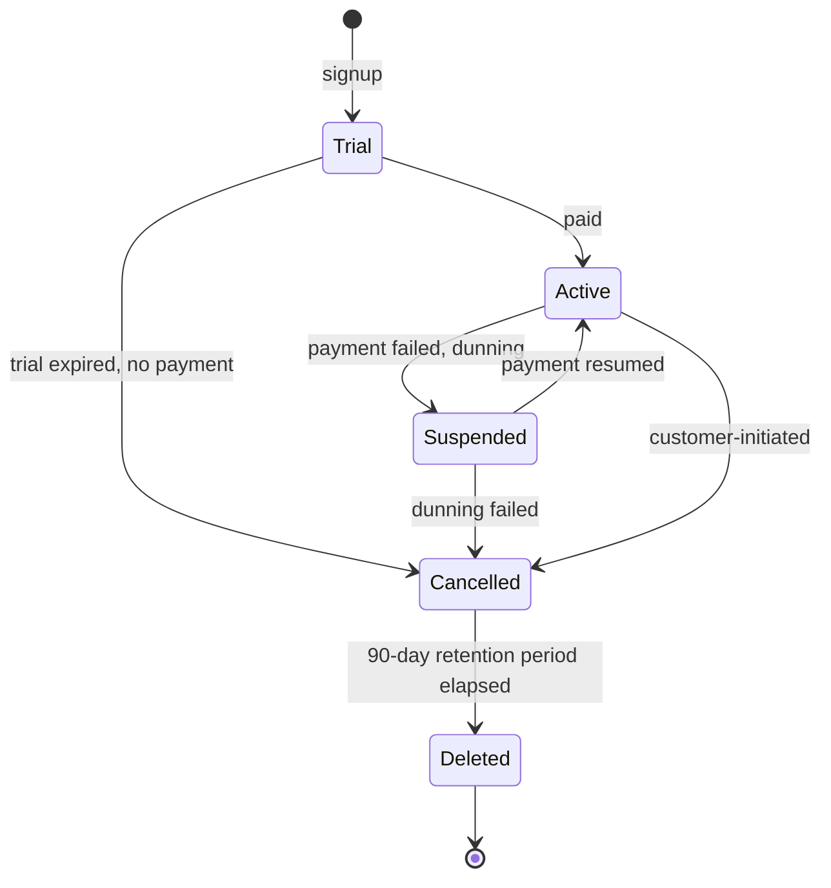
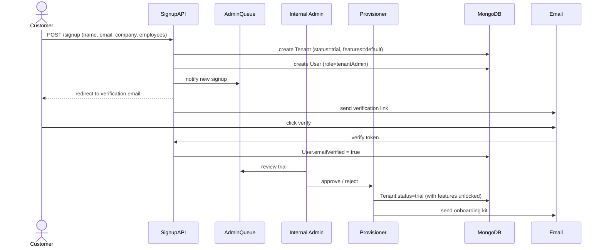

# 01 — Multi-Tenancy

## Purpose

This file defines how a single deployment of the HRMS serves many independent customer companies (tenants) with strict data isolation. Every other module in this spec depends on the tenancy model defined here.

## What "tenant" means

A **tenant** is one paying customer organization. It is the top-level isolation boundary.

- One tenant might be `Acme Industries Pvt Ltd` with 1 legal entity, 80 employees
- Another tenant might be `Tata Consultancy Services Ltd` with 12 legal entities, 600,000 employees
- A third tenant might be `Bansal Group` (a holding entity) with 6 sister companies under different PANs

Tenants never see each other's data. There is no cross-tenant query path. Even "we have 25,000 customers" aggregate stats are computed offline from anonymized exports, never via a live tenant-spanning query.

## Tenancy models considered

There are three textbook models for SaaS multi-tenancy. We pick one.

| Model | Description | Pros | Cons |
|---|---|---|---|
| Database-per-tenant | Separate MongoDB database per customer | Strongest isolation; easy backup/restore per customer | 1000s of databases hard to operate; expensive |
| Schema/collection-per-tenant | One DB, separate collections per customer | Some isolation; easier ops | Schema migrations × N tenants; index bloat |
| Shared collection with `tenantId` | One DB, one set of collections, every doc has `tenantId` | Cleanest ops; easy migrations; cheap | Isolation depends on every query enforcing `tenantId` |

**`[DECISION]` We use the shared-collection model with strict `tenantId` enforcement, with one exception:** statutory file outputs (PF ECR, TDS Form 24Q, payslip PDFs) are stored in tenant-prefixed S3 paths and signed URLs, providing a second layer of isolation on the document side.

Rationale: Frappe HR uses database-per-tenant and ops at scale becomes brutal. Bilpaid's existing multi-tenant pattern works; same approach reused. The risk (cross-tenant leak via missing `tenantId` filter) is mitigated by query middleware (described below).

## Tenant entity

```typescript
interface Tenant {
  _id: ObjectId;                          // also used as tenantId in every other doc
  name: string;                           // "Acme Industries Pvt Ltd"
  slug: string;                           // "acme-industries" — URL-safe, unique globally
  legalName: string;                      // legal name as on incorporation certificate
  status: 'trial' | 'active' | 'suspended' | 'cancelled' | 'deleted';

  // billing
  plan: 'foundation' | 'growth' | 'enterprise' | 'custom';
  billingCycle: 'monthly' | 'annual';
  subscriptionStartedAt: Date;
  subscriptionRenewsAt: Date;
  trialEndsAt?: Date;
  pricePerEmployeePerMonth: Decimal128;   // INR
  minimumEmployees: number;

  // operational
  primaryContactUserId: ObjectId;         // ref Users
  industry: string;                       // "IT Services" | "Manufacturing" | "Retail" | ...
  primarySegment: 'white-collar' | 'blue-collar' | 'mixed';
  estimatedEmployeeCount: number;
  countryCode: 'IN';                      // currently always IN; reserved for future

  // data residency
  dataRegion: 'in-mum' | 'in-hyd';        // [ASSUMPTION] Mumbai primary, Hyderabad DR
  dpdpaConsentVersion: string;            // version of DPDPA consent the customer accepted

  // configuration flags
  features: {
    multiEntity: boolean;                 // default true
    contractLabour: boolean;              // CLRA module enabled
    factoriesAct: boolean;                // factory registers enabled
    gigWorkforce: boolean;                // gig module enabled
    aiCompliance: boolean;                // Compliance Drift, Notice Reader
    whatsappPayslip: boolean;
    multiLanguage: boolean;
  };

  // operational
  createdAt: Date;
  updatedAt: Date;
  createdBy: ObjectId;                    // internal admin user who provisioned
  isDeleted: boolean;
  deletedAt?: Date;
  deletionScheduledFor?: Date;            // 30-day soft-delete grace per DPDPA right-to-erasure
}
```

### Tenant lifecycle



State transition rules:
- `Trial → Active`: on first successful payment, or on admin override
- `Active → Suspended`: after 7 days payment overdue (3 retry attempts)
- `Suspended → Cancelled`: after 30 days suspended
- `Cancelled → Deleted`: after 90 days, all PII purged; aggregated/anonymized data may be retained for product analytics
- `Deleted` tenants cannot be undeleted; admins must re-onboard

`[DPDPA-2023]` Right-to-erasure: customer-initiated deletion request must purge all PII within 30 days. Some statutory data (Form 16 issued, statutory challans filed) must be retained for 7 years per Income Tax Act § 230. Retain on tenant-level "compliance archive" with no PII fields, just statutory facts. `[CA-REVIEW]`

## `tenantId` enforcement

Every collection except `tenants` and `globalConfig` has `tenantId` as the first field after `_id`. Every index begins with `tenantId`. Every query begins with `tenantId`.

### Schema requirement

```typescript
// Mandatory shape for every domain collection
interface TenantScopedDocument {
  _id: ObjectId;
  tenantId: ObjectId;
  // ... domain fields
  createdAt: Date;
  updatedAt: Date;
  isDeleted: boolean;
}

// MongoDB index requirement (enforced at startup):
// every collection must have at least one compound index starting with tenantId
db.collection.createIndex({ tenantId: 1, /* ...other fields */ });
```

### Query middleware enforcement

Direct MongoDB driver calls are forbidden in business logic. All reads and writes go through a typed repository layer that injects `tenantId` from the request context.

```typescript
// Repository pattern
class EmployeeRepository {
  constructor(private ctx: RequestContext) {}    // ctx has tenantId, userId, roles

  async find(filter: Partial<Employee>): Promise<Employee[]> {
    return Employee.find({
      ...filter,
      tenantId: this.ctx.tenantId,                // injected, not user-provided
      isDeleted: false,
    });
  }

  // Same pattern for findOne, update, delete
}
```

If business logic ever needs to bypass tenant scoping (e.g., super-admin operations), it must use a separate `SystemRepository` that requires explicit `superadmin` role and emits an audit event for every cross-tenant read.

### Defense in depth

Three layers prevent cross-tenant leaks:

1. **Repository layer** — injects `tenantId` from context, refuses writes without it
2. **Database constraint** — every index begins with `tenantId`; queries that omit it perform full collection scans which alert in monitoring
3. **API layer** — every GraphQL resolver and REST handler validates that `ctx.tenantId` matches the resource's `tenantId` before returning data

Mongo doesn't have row-level security like Postgres RLS. The repository pattern is our equivalent and must be code-reviewed strictly.

## Tenant-scoped vs system-scoped collections

| Collection | Scope | Notes |
|---|---|---|
| `tenants` | system | Tenant master |
| `globalConfig` | system | Feature flags, statutory rules registry, system settings |
| `statutoryRules` | system | Versioned PF/ESI/PT/TDS/etc. rules — shared across all tenants |
| `holidayCalendars.national` | system | Indian national holidays — shared |
| `holidayCalendars.state` | system | State-wise gazetted holidays — shared |
| `users` | tenant | Login accounts |
| `employees` | tenant | Employee master |
| `entities` | tenant | Legal entities under tenant |
| `payrollRuns` | tenant | Per-tenant, per-entity payroll executions |
| `auditLog` | tenant | Per-tenant evidence stream |
| `documents` (S3) | tenant | Path prefix is `s3://hrms-prod/tenants/{tenantId}/...` |

[VERIFY] System-scoped statutory rules and holiday calendars are shared by reference but tenant-scoped overrides exist. E.g., a tenant can declare a non-gazetted optional holiday for their offices. Override mechanism documented in `/02-attendance/03-leave-types-and-policies.md` (Phase 2).

## Tenant provisioning

Tenant creation is an internal admin operation, not self-serve. Self-signup creates a `Trial` tenant with restricted features. Reasoning: HR data is sensitive enough that we want at least a name + email + company verification before a tenant goes live. Reduces fraud; reduces "test accounts" polluting production.

### Provisioning sequence



Provisioning sets up:
- Default holiday calendar for Indian national holidays + state of registered office
- Default leave policy template (CL/SL/EL based on Shops & Establishments Act of registered state) `[CA-REVIEW]`
- Default salary structure template (Basic + HRA + Special Allowance, basic 40% of CTC) `[ASSUMPTION]`
- Default approval workflow (single-level manager approval for leave, two-level for salary revision)
- Empty entity created as the primary entity using tenant's PAN

## Tenant data export & portability

`[DPDPA-2023]` Customer must be able to export all their data on demand. Implementation:

- Self-service export from admin panel: "Download all data"
- Generates a multi-file ZIP with employees, payroll runs, statutory files, documents, audit log
- Format: JSON for structured data, original PDF/files for documents, CSV mirror of structured data for non-developer use
- Generated async via BullMQ job; download link emailed (signed URL, 7-day expiry)
- File: `tenants-{tenantSlug}-export-{ISO-timestamp}.zip`

`[OPEN]` Question: do we encrypt the export ZIP with a customer-set password? Default to yes, optional to disable. Email contains link, password set in admin panel separately.

## Tenant data deletion

When a tenant cancels:
- Day 0: status → `Cancelled`. Read-only access for 30 days for download.
- Day 30: status → `Deleted`. PII fields scrubbed. Statutory archive retained.
- Day 90 (`[VERIFY: 90 days vs 30 days legal minimum?]`): physical deletion. Only statutory archive remains.
- Year 7: statutory archive may be deleted per IT Act § 230 retention period.

**Statutory archive contents** (retained even after PII purge):
- Aggregated PF/ESI/TDS amounts deposited per month
- Statutory file hashes (proof that these files were generated)
- Filing acknowledgment numbers
- Anonymized employee count per month

This balances DPDPA right-to-erasure with Income Tax Act retention requirements. `[CA-REVIEW]` essential before code is written.

## Tenant configuration vs entity configuration

Tenant-level config:
- Branding (logo, primary color, custom domain)
- Subscription plan and billing
- Feature flags
- Default workflows (can be overridden at entity level)
- Tenant-wide policies (e.g., POSH policy applicable to all entities)

Entity-level config (covered in [02-multi-entity.md](./02-multi-entity.md)):
- Statutory registration numbers (PF, ESI, PT, etc.)
- Bank accounts for salary disbursement
- Holiday calendar (entity may operate in different state from tenant HQ)
- Salary structure templates
- Leave policy
- Workflows specific to entity

## Tenant impersonation by support

Internal support staff may need to log into a tenant to debug. This is **always audited and time-bound**:

- Support requests impersonation via internal panel
- Tenant admin gets notification (email + in-app)
- Impersonation session expires after 4 hours `[ASSUMPTION]`
- Every action during impersonation is tagged in audit log with both `userId` (the support user) and `impersonatedAs` (the tenant admin)
- A tenant can disable impersonation entirely in admin settings; if disabled, support cannot debug without explicit one-time consent from tenant admin

`[DPDPA-2023]` This is required: customer must control access to their data, including by us.

## Open questions

`[OPEN]` What is the maximum employee count per tenant before we offer dedicated infrastructure? Suggest 5,000 as the threshold for "enterprise tier" with potentially dedicated MongoDB Atlas cluster.

`[OPEN]` Do we support tenant mergers (acquisition: tenant A acquires tenant B, all of B's data must move into A)? Hard problem. Suggest deferring to v3.

`[OPEN]` Do we support sub-tenants / franchisee model? E.g., a parent company has a master tenant and franchisees are sub-tenants, with central reporting. Suggest deferring to v3.

`[OPEN]` Pricing/billing logic for active employees only, or all employees on roster? Most competitors charge for active employees only (terminated employees don't count). Industry standard. Default: active employees as of bill-cycle date.

## Cross-references

- See [03-identity-and-rbac.md](./03-identity-and-rbac.md) for how users belong to tenants
- See [02-multi-entity.md](./02-multi-entity.md) for legal entity model within a tenant
- See [04-audit-and-compliance-hooks.md](./04-audit-and-compliance-hooks.md) for tenant-scoped audit log
