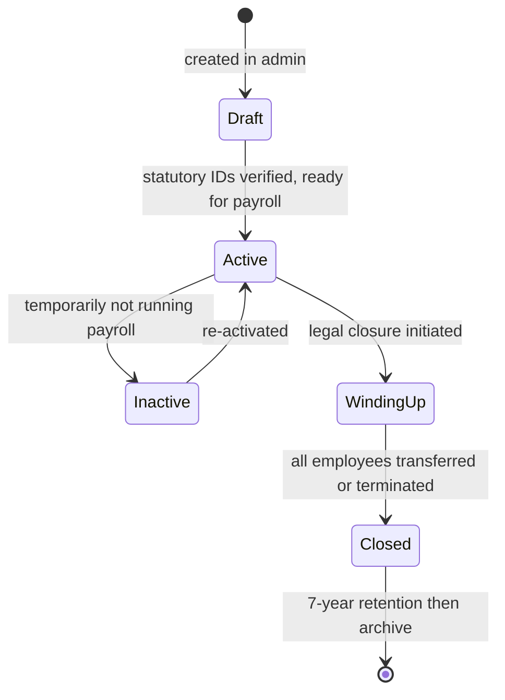

# 02 — Multi-Entity

## Purpose

This file defines the legal entity model that lives within a tenant. Multi-entity is non-optional: virtually every Indian SMB above ~150 employees has more than one legal entity, and statutory filings happen per entity, not per tenant.

## What "entity" means

An **entity** is a single legal employer with a unique PAN.

Examples:

- `Acme Industries Pvt Ltd` (CIN: U72200KA2015PTC123456, PAN: AAACA1234B) is one entity
- `Acme Trading LLP` (LLPIN: AAA-1234, PAN: AAFCA5678C) is a separate entity, even if owned by the same parent
- A foreign branch / liaison office of a non-Indian parent is one entity (with its own PAN even if no incorporation in India)

Entities under the same tenant typically share:
- HR policies
- Performance review cycles
- Common employees in some cases (rare; usually employees belong to one entity at a time)
- A common HR team

But each entity has independent:
- Statutory registrations
- Bank accounts
- Payroll runs
- Statutory filings

## Why multi-entity matters

The naive view: "we'll add multi-entity later." This is the same mistake every founder makes and every founder regrets.

Concrete problems if you skip multi-entity in v1:

1. **Statutory filings break.** PF ECR is filed per establishment registration code. If you have one customer with three PF codes, they need three ECRs every month. A single-entity model produces one ECR with the wrong code.
2. **Form 16 issuance breaks.** Form 16 is issued per TAN (Tax Deduction Account Number). Different entities have different TANs.
3. **Employee transfers break.** When employee moves from Entity A to Entity B mid-year, the F&F at A is fully separate from the joining at B. PF transfer happens via UAN. Gratuity continuity is a question. Single-entity models cannot represent this.
4. **Multi-state PT breaks.** Each entity may operate in different states; PT registration is per state per entity. Cannot model with one entity.
5. **Reports break.** "Show me consolidated payroll cost across the group" requires entity-aware aggregation. "Show me the salary register for the tax department audit at Entity B specifically" requires per-entity filtering.

## Entity schema

```typescript
interface Entity {
  _id: ObjectId;
  tenantId: ObjectId;

  // identity
  name: string;                           // "Acme Industries Pvt Ltd"
  legalName: string;                      // exactly as on incorporation cert
  shortName: string;                      // "Acme" — for display in dropdowns
  entityType:
    | 'private-limited'
    | 'public-limited'
    | 'llp'
    | 'partnership'
    | 'sole-proprietorship'
    | 'opc'                               // One Person Company
    | 'huf'                               // Hindu Undivided Family
    | 'section-8'                         // non-profit
    | 'foreign-branch'
    | 'liaison-office';

  // statutory IDs (ALL ENCRYPTED — see /00-foundations/04 for encryption)
  pan: EncryptedString;                   // 10-char PAN, mandatory
  tan?: EncryptedString;                  // 10-char TAN, mandatory if employer with >0 employees
  cin?: EncryptedString;                  // 21-char CIN for Pvt/Public Ltd
  llpin?: EncryptedString;                // 7-char LLPIN for LLPs
  gstin?: EncryptedString;                // 15-char GSTIN per state of operation
  // Note: GSTIN is per-state; an entity operating in 5 states has 5 GSTINs

  gstRegistrations?: Array<{              // multi-state GST handling
    state: StateCode;                     // see glossary for state codes
    gstin: EncryptedString;
    registeredAddress: Address;
  }>;

  // PF
  pfRegistration?: {
    establishmentCode: string;            // EPFO format MH/BAN/0123456/000 etc
    establishmentName: string;
    registeredOn: Date;
    pfOffice: string;                     // PF regional office
    employerPfShare: number;              // 12% by default, can be 10% for some industries
    employerEpsShare: number;             // 8.33% portion of employer's 12%
    epfWageCeiling: Decimal128;           // ₹15,000 — references rules engine
    [VERIFY] adminCharges: number;        // 0.5% (was 0.65% pre-2017, was 1.1% pre-2014)
    edliCharges: number;                  // 0.5%
    optedOutOfEPS: boolean;               // some entities opt out for high-wage employees
  };

  // ESI
  esiRegistration?: {
    employerCode: string;                 // ESIC format
    registeredOn: Date;
    esiOffice: string;
    employerEsiShare: number;             // 3.25% as of [VERIFY: latest rate]
    employeeEsiShare: number;             // 0.75%
    wageCeiling: Decimal128;              // ₹21,000
    [VERIFY] disabledEmployeeCeiling: Decimal128;  // ₹25,000 for differently-abled (IIRC)
  };

  // Professional Tax — multi-state
  ptRegistrations?: Array<{
    state: StateCode;
    enrollmentNumber: string;             // PTEC: enrollment for entity itself
    registrationNumber: string;           // PTRC: registration for deducting from employees
    registeredOn: Date;
    [VERIFY] ptDepositFrequency: 'monthly' | 'quarterly';  // varies by state
  }>;

  // Labour Welfare Fund — multi-state
  lwfRegistrations?: Array<{
    state: StateCode;
    registrationNumber: string;
    registeredOn: Date;
    [VERIFY] depositFrequency: 'monthly' | 'half-yearly' | 'yearly';
  }>;

  // Shops & Establishments — multi-state
  shopsActRegistrations?: Array<{
    state: StateCode;
    licenseNumber: string;
    issuedOn: Date;
    expiresOn: Date;
    establishmentType: 'shop' | 'commercial-establishment';
  }>;

  // Factories Act registration (if any factory)
  factoriesActRegistration?: {
    licenseNumber: string;
    issuedOn: Date;
    expiresOn: Date;
    factoryAddress: Address;
    licensedManpower: number;             // max workers permitted
  };

  // CLRA registration (if engaging contract labour over threshold)
  clraRegistration?: {
    state: StateCode;
    registrationNumber: string;
    registeredOn: Date;
    issuedBy: string;
  };

  // Address
  registeredOffice: Address;
  corporateOffice?: Address;
  branchOffices?: Array<{
    name: string;                         // "Mumbai Branch", "Bangalore Office"
    address: Address;
    state: StateCode;
    isOperational: boolean;
  }>;

  // banking
  bankAccounts: Array<{
    bankName: string;                     // "HDFC Bank"
    branchName: string;
    accountNumber: EncryptedString;
    ifscCode: string;
    accountType: 'current' | 'savings' | 'salary-disbursement';
    purpose: 'salary' | 'statutory-deposits' | 'general';
    isPrimary: boolean;
    bankFileFormat: BankFileFormatCode;   // see /03-payroll/11-bank-file-formats
  }>;

  // operational
  fyStartMonth: number;                   // 4 (April) for Indian FY; configurable but always 4 in v1
  defaultCurrency: 'INR';
  countryCode: 'IN';
  timeZone: string;                       // "Asia/Kolkata"
  payrollCycleType: 'monthly' | 'bi-monthly' | 'weekly';  // [BLUE-COLLAR] often weekly
  payrollPeriodStart: number;             // day of month, e.g., 1 = 1st to last; 26 = 26th to 25th

  // accounting integration
  accountingSystem?: 'tally' | 'zoho-books' | 'quickbooks' | 'sap' | 'oracle' | 'manual';
  accountingExportFormat?: 'tally-xml' | 'zoho-csv' | 'json' | 'csv';
  accountingExportConfig?: {
    chartOfAccountsMapping: Record<string, string>;  // PF Payable → Acc 234001
    journalVoucherTemplate: string;
    autoExportOnPayrollLock: boolean;
  };

  // metadata
  isActive: boolean;
  isPrimary: boolean;                     // tenant has exactly one primary entity
  createdAt: Date;
  updatedAt: Date;
  createdBy: ObjectId;
  isDeleted: boolean;
}

interface Address {
  line1: string;
  line2?: string;
  area?: string;
  city: string;
  state: StateCode;
  pincode: string;                        // 6-digit
  country: 'IN';
}

type StateCode =
  | 'AN' | 'AP' | 'AR' | 'AS' | 'BR' | 'CG' | 'CH' | 'DD' | 'DL' | 'DN'
  | 'GA' | 'GJ' | 'HP' | 'HR' | 'JH' | 'JK' | 'KA' | 'KL' | 'LA' | 'LD'
  | 'MH' | 'ML' | 'MN' | 'MP' | 'MZ' | 'NL' | 'OR' | 'PB' | 'PY' | 'RJ'
  | 'SK' | 'TG' | 'TN' | 'TR' | 'UK' | 'UP' | 'WB';
// 28 states + 8 UTs per Indian Constitution
```

## Mandatory indexes

```typescript
// Tenant + entity name (for fast tenant entity dropdowns)
{ tenantId: 1, name: 1 }

// Tenant + entity status
{ tenantId: 1, isActive: 1, isDeleted: 1 }

// PAN lookup (for de-duplication)
{ tenantId: 1, 'pan.ciphertext': 1 }, { unique: true, partialFilterExpression: { isDeleted: false } }

// PF establishment code (for ECR file lookup)
{ tenantId: 1, 'pfRegistration.establishmentCode': 1 }
```

## Validation rules

| Field | Rule |
|---|---|
| `pan` | 10 chars, regex `^[A-Z]{5}\d{4}[A-Z]$`, must be encrypted before save |
| `tan` | 10 chars, regex `^[A-Z]{4}\d{5}[A-Z]$` |
| `cin` | 21 chars, regex `^[ULS]\d{5}[A-Z]{2}\d{4}[A-Z]{3}\d{6}$` |
| `gstin` | 15 chars, regex `^\d{2}[A-Z]{5}\d{4}[A-Z][1-9A-Z][Z][\dA-Z]$` |
| `pincode` | 6 digits |
| `ifscCode` | 11 chars, regex `^[A-Z]{4}0[A-Z0-9]{6}$` |
| `pfRegistration.establishmentCode` | varies by region; minimum format `^[A-Z]{2,3}/[A-Z]{2,4}/\d{7}/\d{3}$` `[VERIFY]` |
| `entityType + statutoryId` | `private-limited` requires CIN; `llp` requires LLPIN; etc. |

`[VERIFY]` All regexes against current GSTN, NSDL, EPFO official documentation.

## Entity lifecycle



State transitions:
- `Draft → Active`: requires PAN + TAN + at least one statutory registration (PF or ESI or PT) verified
- `Active → Inactive`: no employees can be hired into an inactive entity; existing employees can be processed, but new payroll runs are blocked
- `Active → WindingUp`: locks new hires; allows F&F for existing; flags all pending statutory filings
- `WindingUp → Closed`: all employees count = 0, all statutory filings done
- `Closed`: entity remains in DB for historical reporting and statutory inquiries; all data read-only

## Cross-entity employee scenarios

The hardest problem in multi-entity HRMS is the cross-entity employee. Spec must handle:

### Scenario A — Inter-entity transfer (same tenant, both entities active)

Employee `EMP123` works in `Acme Industries Pvt Ltd` (Entity A). On April 15, 2026, they transfer to `Acme Trading LLP` (Entity B).

- Employment record at Entity A is closed with `terminatedOn = April 15, 2026, terminationReason = inter-entity-transfer`
- New employment record at Entity B is created with `joinedOn = April 16, 2026, joiningSource = inter-entity-transfer-from-{EntityAId}`
- Employee master record (`EMP123`'s personal data, PAN, Aadhaar) remains the same
- A new "linked employment" reference is created for reporting continuity
- PF: UAN remains the same. Employer share at Entity A stops; employer share at Entity B starts. Employee should file PF transfer request from Entity A's establishment to Entity B's establishment via UAN portal `[CA-REVIEW]` — does the HRMS initiate, or just notify the employee?
- Gratuity: Service period continuity question. **Default: gratuity service breaks at transfer unless tenant explicitly configures "treat as continuous service across group entities" (rare; requires legal docs)** `[ASSUMPTION] [CA-REVIEW]`
- Income tax: Form 16 issued by Entity A for April 1–15; Form 16 issued by Entity B for April 16–March 31. Total annual income reconciled by employee at ITR filing.

### Scenario B — Concurrent employment (rare but real)

Employee is on payroll at two entities of the same tenant simultaneously. E.g., a director who draws salary from both holding co. and operating co.

- Two active employment records, same employee master
- Two separate payslips per month
- TWO separate PF accounts (different establishment codes; UAN can have multiple member IDs)
- ESI: only one entity deducts (whichever has the relationship documented)
- Income tax: employee declares "income from another employer" via Form 12B to one of the employers; that employer computes consolidated TDS

`[OPEN]` Does v1 support concurrent employment? Recommended: **No, defer to v2.** Direct customers under 1,000 employees rarely have this. Adding it doubles the complexity of payroll, attendance, and tax computation.

### Scenario C — Tenant has only one entity

Most SMB tenants. v1 must handle elegantly without forcing entity dropdowns everywhere. Solution: tenant has one auto-created primary entity, UI hides entity selectors when only one exists, all schemas still carry `entityId` for forward compatibility.

## Entity-scoped queries

Every domain query must scope to BOTH `tenantId` and `entityId`:

```typescript
// Wrong (will accidentally show employees across entities for some screens):
const employees = await Employee.find({ tenantId, status: 'active' });

// Right:
const employees = await Employee.find({ tenantId, entityId, status: 'active' });
```

The repository layer enforces this. Any "show me everyone in the tenant across entities" view is an explicit operation called `findAcrossEntities()` that requires a special permission and is audited.

## Statutory filing per entity

| Filing | Per Entity | Notes |
|---|---|---|
| PF ECR | ✅ | One file per `pfRegistration.establishmentCode` |
| ESI Challan | ✅ | One per `esiRegistration.employerCode` |
| ESI Return (Form 5/6) | ✅ | Half-yearly per ESI code |
| TDS Form 24Q | ✅ | Quarterly per TAN |
| Form 16 | ✅ | Issued per entity per FY |
| Form 12BA | ✅ | Issued per entity per FY (perquisites disclosure) |
| PT Challan | ✅ per state | Per state PTRC |
| LWF Challan | ✅ per state | Per state LWF registration |
| Shops & Estab. Annual Return | ✅ per state | Where applicable |
| Factories Act Returns | ✅ per factory | Form 21, 22, etc. |
| CLRA Half-yearly Return | ✅ per registration | |
| Bonus Form A/B/C/D | ✅ | Per entity per FY |

The compliance module ([04-compliance/](../04-compliance/)) generates these per entity, never aggregated across entities.

## Cross-entity reports

Some reports legitimately span entities:
- Group-level salary cost dashboard
- Group-level headcount trend
- CXO compensation across all group entities
- Group-level attrition

These are explicit "consolidated" reports with a flag `consolidationMode: 'tenant' | 'entity'`. Default is entity. Consolidated mode requires `tenantAdmin` role.

## Branch offices vs entities

A common confusion. Clear rule:

- Different PANs → different entities
- Same PAN, different physical location → different branches under the same entity

Branches matter for:
- Multi-state PT (each branch's state determines applicable PT)
- Multi-state Shops & Establishments registration
- Holiday calendar (different states have different state holidays)
- Salary disbursement (some companies disburse from a regional bank account)

Branches are modeled as `Entity.branchOffices` array. Employee record references both `entityId` and `branchOfficeId`.

## Open questions

`[OPEN]` Should branches be first-class collections, or remain embedded in entity? At 50+ branches, embedded becomes painful. Recommended: keep embedded for v1, promote to top-level collection in v2 when we have a customer with >20 branches.

`[OPEN]` Cross-entity reporting line: a manager in Entity A managing an employee in Entity B. Does v1 support? Recommend: yes for read (reporting visibility), no for write (manager cannot directly change employee record in another entity, must go through HR).

`[OPEN]` Group-level performance review: same employee evaluated by people in different entities. Defer to v2.

## Cross-references

- See [01-multi-tenancy.md](./01-multi-tenancy.md) for tenant model
- See [04-audit-and-compliance-hooks.md](./04-audit-and-compliance-hooks.md) for entity-level audit
- See [/01-employee/02-employment-record.md](../01-employee/02-employment-record.md) for how employees are linked to entities
- See [/04-compliance/](../04-compliance/) (Phase 3) for per-entity statutory filings
