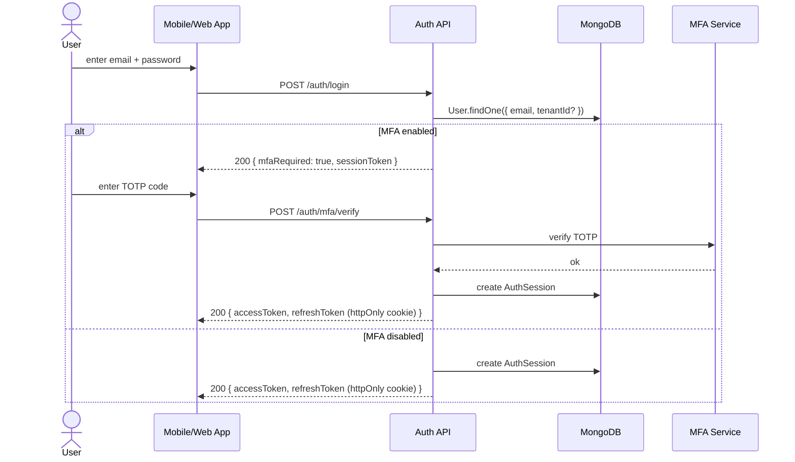
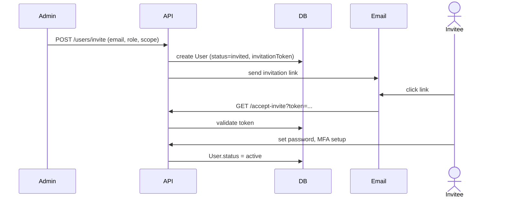

# 03 — Identity, Users & RBAC

## Purpose

This file defines who can log in, what roles exist, and how permissions are checked. RBAC mistakes in HRMS are catastrophic: they leak salary information, expose Aadhaar/PAN, or let unauthorized users run payroll. Therefore the model is field-level, not just module-level.

## User vs employee

Two separate concepts that beginners conflate:

- **User**: an entity that can log in (has email/password, can authenticate)
- **Employee**: a person with an employment relationship; may or may not have a login

A user is **not** always an employee:
- Tenant admin (might be the company's CFO using HRMS to run payroll, but not an employee on records)
- HR Manager (might be an employee, might be an outsourced HR consultant with login but no employment record)
- Internal support user from our company impersonating customer admin

An employee is **not** always a user:
- Factory worker without a smartphone or email
- Daily wage laborer
- Many blue-collar employees do not have ESS access at all

The two are linked by an optional `employeeId` field on `User`.

## User schema

```typescript
interface User {
  _id: ObjectId;
  tenantId: ObjectId;                      // user belongs to one tenant
  employeeId?: ObjectId;                   // ref Employees (optional)

  // identity
  email: string;                           // unique within tenant
  emailVerified: boolean;
  emailVerifiedAt?: Date;
  phoneNumber?: string;                    // for SMS OTP, WhatsApp
  phoneVerified: boolean;

  // authentication
  passwordHash: string;                    // argon2id
  passwordChangedAt: Date;
  mustChangePassword: boolean;             // forced reset
  mfaEnabled: boolean;
  mfaSecret?: EncryptedString;             // TOTP secret if mfaEnabled
  recoveryCodes?: EncryptedString[];       // backup MFA codes

  // session control
  lastLoginAt?: Date;
  lastLoginIp?: string;
  lastLoginUserAgent?: string;
  failedLoginAttempts: number;
  lockedUntil?: Date;

  // authorization
  roles: UserRole[];                       // see roles below
  customPermissions?: Permission[];        // grants beyond role
  deniedPermissions?: Permission[];        // explicit denies (override role)
  scopedTo?: {                             // scoping limits role's reach
    entities?: ObjectId[];                 // null = all entities in tenant
    departments?: ObjectId[];
    locations?: ObjectId[];
    employees?: ObjectId[];                // for restricted views (e.g., reporting line only)
  };

  // status
  status: 'active' | 'invited' | 'suspended' | 'deactivated';
  invitedAt?: Date;
  invitedBy?: ObjectId;
  invitationToken?: string;                // hashed; for invitation acceptance
  invitationExpiresAt?: Date;

  // ESS-specific
  preferredLanguage: 'en' | 'hi' | 'ta' | 'te' | 'mr' | 'bn' | 'kn' | 'gu' | 'ml' | 'pa';
  notificationPreferences: NotificationPreferences;

  // metadata
  createdAt: Date;
  updatedAt: Date;
  createdBy: ObjectId;
  isDeleted: boolean;
  deletedAt?: Date;
}

interface NotificationPreferences {
  channels: {
    email: boolean;
    inApp: boolean;
    sms: boolean;
    push: boolean;
    whatsapp: boolean;
  };
  categories: {
    payroll: boolean;                      // payslip released, etc.
    leave: boolean;
    performance: boolean;
    statutory: boolean;                    // tax declarations due, etc.
    announcements: boolean;
    helpdesk: boolean;
  };
}
```

## Role taxonomy

The HRMS ships with a fixed set of system roles. Tenants can create custom roles by composition (combining permissions) but cannot create new role primitives.

### System roles

| Role | Scope | Description |
|---|---|---|
| `superadmin` | system | Internal staff at our company; can read across tenants for support |
| `tenantOwner` | tenant | The owner of the tenant; can do everything within tenant; only one per tenant; cannot be removed except by self-transfer |
| `tenantAdmin` | tenant | Full admin within tenant; can manage entities, users, billing |
| `entityAdmin` | entity | Full admin within one or more entities |
| `hrManager` | tenant or entity | Manages employees, payroll, attendance; cannot manage billing |
| `hrExecutive` | tenant or entity | HR operations: data entry, approvals, but cannot run payroll |
| `payrollAdmin` | tenant or entity | Specifically empowered to run payroll, approve salary changes |
| `payrollExecutive` | tenant or entity | Pre-payroll input collection, payroll dry-run; cannot finalize |
| `complianceOfficer` | tenant or entity | Statutory filings, audits, inspections |
| `accountant` | tenant or entity | Read-only on payroll outputs; can post journal vouchers |
| `manager` | self + reportees | A manager in the org chart; sees their team's data |
| `employee` | self | Standard employee ESS access |
| `recruiter` | tenant or entity | ATS access; cannot see compensation of confirmed employees |
| `interviewer` | tenant or entity | Interview feedback only |
| `auditor` | read-only across tenant or entity | External auditor with time-bound access |
| `inspector` | read-only, time-bound, audit-logged | Statutory inspector mode (you'll learn why this exists in compliance) |

### Permission primitives

Permissions are tuples of `(resource, action, scope)`:

```typescript
type Permission =
  | `${Resource}:${Action}`                    // basic
  | `${Resource}:${Action}:${ScopeQualifier}`; // scoped

type Resource =
  | 'employee' | 'employee.compensation' | 'employee.statutoryId'
  | 'attendance' | 'leave' | 'shift' | 'overtime'
  | 'payroll' | 'payroll.input' | 'payroll.run' | 'payroll.lock' | 'payroll.output'
  | 'salary-structure' | 'salary-revision'
  | 'compliance.report' | 'compliance.filing' | 'compliance.notice'
  | 'recruitment' | 'recruitment.offer' | 'recruitment.bgv'
  | 'performance' | 'performance.review' | 'performance.calibration'
  | 'document' | 'document.confidential'
  | 'workflow' | 'workflow.template'
  | 'tenant.config' | 'tenant.billing' | 'tenant.user'
  | 'entity.config' | 'audit.log';

type Action =
  | 'create' | 'read' | 'update' | 'delete'
  | 'approve' | 'reject' | 'submit' | 'cancel'
  | 'export' | 'import'
  | 'lock' | 'unlock'
  | 'impersonate';

type ScopeQualifier =
  | 'self'                                 // only my own
  | 'reportees'                            // only people who report to me (direct + indirect)
  | 'department'                           // my department
  | 'location'                             // my location
  | 'entity'                               // my entity
  | 'tenant';                              // anywhere in tenant
```

### Example permission strings

```typescript
'employee:read:self'                       // can read my own employee record
'employee:read:reportees'                  // can read my team's records
'employee:read:tenant'                     // can read everyone (HR)
'employee.compensation:read:reportees'     // manager can see team compensation (configurable per tenant)
'employee.compensation:read:tenant'        // HR/payroll can see all
'payroll:run:entity'                       // payroll admin per entity
'payroll:lock:entity'                      // higher privilege than run
'recruitment.bgv:read:tenant'              // BGV reports - sensitive
'compliance.filing:create:entity'          // file PF ECR
'audit.log:read:tenant'                    // see audit trail
```

## Field-level security

Some fields are sensitive enough that even users with `employee:read:tenant` should not see them by default. Field-level security overrides resource-level.

### Field-level redaction map

```typescript
interface FieldSecurityRule {
  resource: 'employee' | 'employee.compensation' | ...;
  field: string;                           // dotpath like 'salary.basic' or 'kyc.aadhaar'
  defaultVisibility: 'visible' | 'masked' | 'hidden';
  // Permission needed to see unmasked
  requiredPermission?: Permission;
  // Mask format if visibility=masked
  maskFunction?: 'last4' | 'first2last2' | 'asterisks' | 'redact';
}

// Examples
[
  { resource: 'employee', field: 'kyc.pan', defaultVisibility: 'masked',
    maskFunction: 'first2last2',           // shows "AB****1234B"
    requiredPermission: 'employee.statutoryId:read:tenant' },

  { resource: 'employee', field: 'kyc.aadhaar', defaultVisibility: 'masked',
    maskFunction: 'last4',                 // shows "XXXX-XXXX-1234"
    requiredPermission: 'employee.statutoryId:read:tenant' },

  { resource: 'employee', field: 'compensation.ctc', defaultVisibility: 'hidden',
    requiredPermission: 'employee.compensation:read:tenant' },

  { resource: 'employee', field: 'bankAccount.accountNumber', defaultVisibility: 'masked',
    maskFunction: 'last4',
    requiredPermission: 'payroll:run:entity' },
];
```

The repository layer applies field redaction automatically based on the user's effective permissions. UI never receives unredacted data without authorization.

## Reporting line and "manager" semantics

A user with role `manager` has access scoped to their team. Team is computed from the org chart in the Employee record (covered in [/01-employee/02-employment-record.md](../01-employee/02-employment-record.md)).

```typescript
function getReporteeIds(managerEmployeeId, depth = 'all'): EmployeeId[] {
  // Recursively walk the reporting tree
  // depth='direct' = only direct reports
  // depth='all' = direct + all indirect (use with care; can be expensive)
}
```

`[DECISION]` Default scope for `manager` role is "all reportees, recursively". A division head sees everyone in their division. To restrict to direct reports only, use scoped permission `:reportees-direct`.

## RBAC evaluation algorithm

Every API call goes through this:

```typescript
function authorize(
  user: User,
  permission: Permission,
  resource: Resource,
  resourceId?: ObjectId
): boolean {
  // 1. Superadmin override (audited)
  if (user.roles.includes('superadmin')) return true;

  // 2. Compute effective permissions
  const rolePerms = user.roles.flatMap(r => ROLE_PERMISSIONS[r]);
  const customGrants = user.customPermissions ?? [];
  const denies = user.deniedPermissions ?? [];
  const effective = new Set([...rolePerms, ...customGrants]);
  for (const d of denies) effective.delete(d);

  // 3. Permission match (exact or wildcard)
  if (!matches(effective, permission)) return false;

  // 4. Scope check
  const scope = parseScope(permission);   // 'self' | 'reportees' | 'entity' | 'tenant'
  if (resourceId && !inScope(user, scope, resource, resourceId)) return false;

  // 5. Field-level (caller passes the field path if checking field access)
  // Handled separately in repository layer

  return true;
}
```

## Authentication flow



### Token strategy

`[DECISION]` Match the Bilpaid pattern:

- Access token: JWT, 15-minute expiry, returned in response body
- Refresh token: opaque random string, 30-day expiry, set as `httpOnly; Secure; SameSite=Lax` cookie
- Refresh endpoint rotates refresh token (refresh token reuse is blocked)
- Logout invalidates the refresh token in a Redis denylist
- Cross-subdomain cookie pattern handled per Bilpaid's existing config

### Session storage

```typescript
interface AuthSession {
  _id: ObjectId;
  tenantId: ObjectId;
  userId: ObjectId;
  refreshTokenHash: string;                // hash of opaque token
  issuedAt: Date;
  expiresAt: Date;
  rotatedAt?: Date;
  revokedAt?: Date;
  revokedReason?: 'logout' | 'password-change' | 'admin-revoke' | 'suspicious-activity';
  ipAddress: string;
  userAgent: string;
  device?: string;                          // 'web' | 'ios' | 'android'
}
```

Indexes:
```
{ refreshTokenHash: 1 } unique
{ userId: 1, expiresAt: 1 }
{ tenantId: 1, userId: 1 }
```

## Password requirements

`[ASSUMPTION]` Standard sane defaults:

- Minimum 12 characters
- Must contain at least 3 of: lowercase, uppercase, digit, symbol
- Cannot match last 5 password hashes
- Argon2id with sensible cost parameters
- Force change every 180 days `[OPEN]` — many security guidelines now recommend NOT forcing change; consider making this configurable per tenant

## Multi-factor authentication

- TOTP (RFC 6238) via app like Google Authenticator, Authy, 1Password
- Backup codes (8 single-use codes)
- Optional WebAuthn (FIDO2) in v2

`[DECISION]` MFA is mandatory for these roles: `tenantOwner`, `tenantAdmin`, `payrollAdmin`, `complianceOfficer`. Optional for others. Tenant admin can enforce MFA tenant-wide.

## SSO (v2)

`[v2]` SAML 2.0 and OIDC for enterprise tenants. Common providers: Google Workspace, Microsoft Azure AD, Okta, OneLogin.

When SSO is enabled for a tenant, password login is disabled; users authenticate via the IdP. Service account / break-glass admin password remains for emergencies.

## Invitation and onboarding

A new user is created via invitation:



Token validity: 7 days `[ASSUMPTION]`. After expiry, admin must re-invite.

## Impersonation

Already covered in [01-multi-tenancy.md](./01-multi-tenancy.md). Re-stated here for completeness:

- Internal `superadmin` users can impersonate a tenant user for support
- Audit log records both impersonator and impersonated
- Tenant admin gets notification
- Time-bound (4 hours)
- Tenant can disable impersonation entirely

In addition, a `manager` role can NEVER impersonate their reportees. Only `superadmin` can impersonate, and only for support purposes.

## Permission matrix samples

Three examples illustrating role differences:

### Tenant Admin

```
employee:create:tenant
employee:read:tenant
employee:update:tenant
employee:delete:tenant
employee.compensation:read:tenant
employee.compensation:update:tenant
payroll:run:tenant
payroll:lock:tenant
compliance.filing:*:tenant
tenant.user:*:tenant
tenant.config:*:tenant
tenant.billing:*:tenant
audit.log:read:tenant
```

### Payroll Admin (entity-scoped)

```
employee:read:entity
employee.compensation:read:entity
employee.compensation:update:entity
salary-structure:*:entity
payroll.input:*:entity
payroll.run:entity
payroll.lock:entity
payroll.output:read:entity
compliance.report:read:entity
compliance.filing:create:entity
audit.log:read:entity
```

### Manager (reportees-scoped)

```
employee:read:reportees
employee.compensation:read:reportees     # if tenant config allows
attendance:read:reportees
attendance:approve:reportees
leave:read:reportees
leave:approve:reportees
performance.review:create:reportees
performance.review:update:reportees
helpdesk:assign:reportees
```

### Employee (self only)

```
employee:read:self
employee:update:self                     # limited fields only
attendance:create:self
attendance:read:self
leave:create:self
leave:read:self
leave:cancel:self
payroll.output:read:self                 # own payslips
compliance.report:read:self              # own Form 16
helpdesk:create:self
```

## Edge cases

### Manager change

Employee A's manager changes from B to C on May 1. Before May 1, B has access to A's data. After May 1, C does. B's access is revoked at the manager-change effective date.

`[DECISION]` Pending approvals (e.g., leave application B was about to approve) auto-reroute to C, with a notification to both.

### Manager on leave

Manager B is on planned leave May 10–20. Pending approvals during this period must reroute. Two options:
- Auto-delegate to B's manager (skip-level)
- B nominates a delegate at leave time

`[DECISION]` v1: B nominates a delegate when applying for leave (>3 days). v2: tenant configures default escalation policy.

### Employee terminated mid-month while having pending approvals

E.g., manager B is terminated on May 15 but had 3 leave approvals pending.
- All B's pending approvals immediately reroute to skip-level manager
- B's user account is deactivated (cannot log in)
- B's audit history is retained

### Cross-entity manager-reportee

If org chart says manager B (Entity X) manages employee A (Entity Y):
- B can read A's data (read access)
- B cannot directly edit A's compensation, attendance, or employment record (these are Entity Y's HR's job)
- B can approve A's leave (cross-entity workflow)

## Open questions

`[OPEN]` Should the spec support "no manager" employees? E.g., the CEO. Yes — `reportingManagerId` is optional. Reports must handle null manager gracefully.

`[OPEN]` Multiple managers (matrix org)? Common in IT services. v1: dotted-line manager as a separate field, primary manager has approval authority. Matrix workflows in v2.

`[OPEN]` "Acting" / temporary role assignments. A manager going on sabbatical assigns acting manager for 3 months. v2.

`[OPEN]` API token authentication for integrations (Tally connector, biometric devices) — separate from user auth. Use service accounts with scoped permissions. Documented in [/08-workflow/](../08-workflow/) (Phase 5).

## Cross-references

- See [01-multi-tenancy.md](./01-multi-tenancy.md) for tenant scoping
- See [02-multi-entity.md](./02-multi-entity.md) for entity scoping
- See [04-audit-and-compliance-hooks.md](./04-audit-and-compliance-hooks.md) for permission-check audit
- See [/01-employee/02-employment-record.md](../01-employee/02-employment-record.md) for reporting line schema
