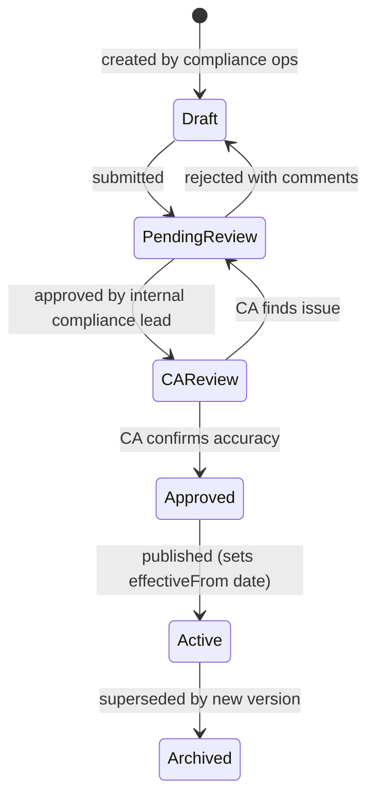

# 06 — Statutory Rules Engine

## Purpose

The single most important architectural decision in a compliance-first HRMS. This file defines how Indian statutory rules (PF rates, ESI thresholds, TDS slabs, PT slabs, LWF rates, gratuity formulas) are stored, versioned, and consumed.

Statutory rules in India change at least once per year. Some change mid-year. Hard-coded rules mean every change is a code release with regression risk. Versioned rules in data mean we ship a JSON update.

## Core principle

**Rules are data, not code.** The payroll engine reads rules; it doesn't know specific values.

```typescript
// ❌ Hard-coded (wrong)
function calculatePF(basicSalary: number): number {
  const PF_RATE = 0.12;
  const PF_CEILING = 15000;
  return Math.min(basicSalary, PF_CEILING) * PF_RATE;
}

// ✅ Rule-driven (right)
function calculatePF(
  basicSalary: Decimal128,
  asOf: Date,
  jurisdiction: PFJurisdiction
): Decimal128 {
  const rule = rulesEngine.lookup('pf', asOf, jurisdiction);
  return rulesEngine.apply(rule, { basicSalary });
}
```

When EPFO changes the rate or ceiling, we publish a new rule with a new `effectiveFrom` date. No code change. Re-running historical payroll uses historical rules.

## Rule taxonomy

Rules are organized by **statute** and **jurisdiction**:

```
statute = pf | esi | tds | pt | lwf | bonus | gratuity | minimum-wage | overtime | leave-statutory
jurisdiction = central | state-{StateCode} | establishment-type-{type}
```

Examples:
- `pf:central:default` — central PF rules applicable everywhere
- `pf:central:cinema-industry` — special PF rate for cinema (10% per Schedule 1) `[VERIFY]`
- `pt:state-MH` — Maharashtra Professional Tax slabs
- `pt:state-KA` — Karnataka Professional Tax slabs
- `lwf:state-MH` — Maharashtra LWF
- `tds:central` — Income Tax TDS slabs
- `minimum-wage:state-MH:industry-textile:skill-skilled` — Maharashtra textile, skilled worker

## Rule schema

```typescript
interface StatutoryRule {
  _id: ObjectId;
  // No tenantId — rules are global

  ruleKey: string;                          // unique key like 'pf:central:default'
  statute: 'pf' | 'esi' | 'tds' | 'pt' | 'lwf' | 'bonus' | 'gratuity' | 'minimum-wage' | 'overtime' | 'leave-statutory';
  jurisdiction: 'central' | string;         // 'state-MH', 'state-KA-textile', etc.

  // versioning
  effectiveFrom: Date;                      // first day rule applies
  effectiveTo: Date | null;                 // null = currently in force; non-null = superseded
  supersededBy?: ObjectId;                  // forward link to next version
  supersedes?: ObjectId;                    // back link to previous version

  // metadata
  citation: {
    actName: string;                        // 'Employees Provident Funds & Misc. Provisions Act, 1952'
    section?: string;                       // 'Section 6'
    notification?: string;                  // 'Notification G.S.R. 234(E) dated 22-08-2014'
    notificationDate?: Date;
    sourceUrl?: string;                     // link to PIB/EPFO/CBDT publication
  };
  description: string;                      // human-readable summary
  notes?: string;                           // implementation notes for engineers

  // the actual rule payload — shape varies by statute
  ruleType: string;                         // discriminator
  rulePayload: any;                         // shape depends on ruleType (see below)

  // operational
  status: 'draft' | 'pending-review' | 'approved' | 'active' | 'archived';
  approvedBy?: ObjectId;                    // ref Users (internal admin)
  approvedAt?: Date;
  reviewedByCa?: boolean;                   // CA reviewed flag
  reviewedByCaAt?: Date;
  reviewerCaName?: string;

  // tracking
  createdAt: Date;
  updatedAt: Date;
  createdBy: ObjectId;
  updatedBy: ObjectId;
  publishedAt?: Date;
  isDeleted: boolean;
}
```

## Rule payload shapes

Each statute has a different payload shape. The engine knows how to apply each.

### PF rule payload

```typescript
interface PFRulePayload {
  ruleType: 'pf-contribution-rates';

  // contribution rates
  employeeShare: number;                    // 0.12 = 12%
  employerShare: number;                    // 0.12 = 12%
  employerEpsShare: number;                 // 0.0833 = 8.33% (portion of employer's 12% diverted to EPS)
  employerEpfShare: number;                 // 0.0367 = 3.67% (employer's 12% minus EPS)

  adminCharges: number;                     // 0.005 = 0.5% on EPF wages, paid by employer
  edliCharges: number;                      // 0.005 = 0.5% on EPF wages (capped at ₹15,000), paid by employer
  edliAdminCharges: number;                 // 0.0001 = 0.01% (was 0.01%, now nil per [VERIFY])

  // wage ceiling
  wageCeiling: string;                      // "15000.00" — Decimal128 as string
  // wages above ceiling, employer/employee can OPT to contribute on actuals or restrict to ceiling

  // EPS specifics
  epsApplicableMaxAge: number;              // 58 — beyond this age, no EPS contribution
  epsCeilingForNewMembers: string;          // ₹15,000 ceiling for EPS specifically

  // applicable establishments
  applicableEstablishmentTypes?: string[];  // null = all
  excludedEstablishmentTypes?: string[];

  // VPF (voluntary)
  vpfMaxRate: number;                       // 0.88 — employee can voluntarily contribute up to 88% of basic
}
```

`[VERIFY]` Current PF admin charges and EDLI admin charges from latest EPFO notification. Have varied historically.

### ESI rule payload

```typescript
interface ESIRulePayload {
  ruleType: 'esi-contribution-rates';

  employeeShare: number;                    // 0.0075 = 0.75%
  employerShare: number;                    // 0.0325 = 3.25%
  wageCeiling: string;                      // "21000.00"
  disabledEmployeeWageCeiling?: string;     // ₹25,000 [VERIFY]

  // ESI applies on gross wages (broader than PF's basic+DA)
  // The components includable/excludable are listed
  includedComponents: string[];             // 'basic', 'da', 'hra', 'special-allowance', 'overtime', etc.
  excludedComponents: string[];             // 'pf-employer-contribution', 'gratuity', 'leave-encashment-on-exit'

  // benefit periods and contribution periods
  contributionPeriods: { name: string; startMonth: number; endMonth: number }[];
  // April-September, October-March

  // employee crosses ceiling mid-period — has special rule
  // [VERIFY] employee remains contributory for the rest of the contribution period even if wage exceeds ceiling
  ceilingCrossingMidPeriodRule: 'continue-till-period-end' | 'immediate-stop';
}
```

### TDS rule payload (Income Tax)

The most complex. Slabs differ by old regime vs new regime, FY, age.

```typescript
interface TDSRulePayload {
  ruleType: 'tds-income-tax-slabs';
  financialYear: string;                    // 'FY-2026-27'
  assessmentYear: string;                   // 'AY-2027-28'
  regime: 'old' | 'new';                    // optional regime flag

  // age-based variants
  variants: {
    ageGroup: 'below-60' | '60-to-80' | 'above-80';
    slabs: {
      from: string;                         // "0" (Decimal128 as string)
      upto: string | 'infinity';
      rate: number;                         // 0.05 = 5%
      surcharge?: number;
      cess?: number;                        // 0.04 = 4% Health & Education Cess
    }[];
    standardDeduction: string;              // "75000" for new regime FY26-27 [VERIFY]
    rebateUnder87A?: { incomeUpto: string; rebate: string };
  }[];

  // Section 10 exemptions (old regime)
  hraExemption: {
    rule: 'minimum-of-three';               // min of 3 amounts
    formula: 'standard-hra';
  };

  // Chapter VI-A deductions (old regime)
  chapter6ADeductions: {
    section: '80C' | '80D' | '80E' | '80G' | '80GG' | '80TTA' | '80TTB' | '80EE' | '80EEA';
    maxAmount: string | 'no-limit';
    notes?: string;
  }[];

  // perquisite valuation rules
  perquisiteRules: any;                     // detailed in /04-compliance/03-tds-and-income-tax.md
}
```

`[VERIFY]` All TDS slabs against latest Finance Act / Income Tax Act 2025 notification. Slabs for FY 2026-27 are particularly important since IT Act 2025 was effective April 1, 2026.

### Professional Tax rule payload (per state)

```typescript
interface PTRulePayload {
  ruleType: 'pt-state-slabs';
  stateCode: StateCode;

  // PT can be deducted monthly, half-yearly, or annually depending on state
  deductionFrequency: 'monthly' | 'half-yearly' | 'annual';

  slabs: {
    salaryRangeFrom: string;                // monthly gross
    salaryRangeTo: string | 'infinity';
    ptAmount: string;                       // monthly PT amount
    notes?: string;                         // 'extra ₹300 in February' — Maharashtra has this
  }[];

  // some states have special rules for the last month of FY
  marchAdjustment?: { extraDeduction: string };

  // exemptions
  exemptions: {
    type: 'senior-citizen' | 'differently-abled' | 'specific-categories';
    description: string;
    notes?: string;
  }[];

  // employer registration thresholds
  ptEcThreshold?: { minEmployees: number };
  ptRcThreshold?: { minEmployees: number };

  // depositing
  depositDayOfMonth: number;                // e.g., 21 (deposit by 21st of next month)
  challanFormat: string;                    // varies by state
  filingFormat: string;                     // 'Form-III-MH', etc.
}
```

`[VERIFY]` PT slabs for Maharashtra, Karnataka, Tamil Nadu, West Bengal, Gujarat, AP, Telangana, MP, Odisha, Kerala, Bihar, Punjab, Haryana, Assam, Tripura, Meghalaya, Manipur, Mizoram, Nagaland, Sikkim. (PT not levied: UP, Rajasthan, Delhi, Goa, Jharkhand, J&K, AN, CH, DD, DN, LD, PY, LA, AR.) Confirm each state's notification.

### Gratuity rule payload

```typescript
interface GratuityRulePayload {
  ruleType: 'gratuity-formula';

  // standard formula: (15 days × last drawn (Basic+DA) ÷ 26) × completed years
  formulaType: 'standard' | 'cinema' | 'seasonal';
  daysPerMonth: number;                     // 26 for non-piece-rated
  daysFactor: number;                       // 15 days

  // applicability
  minimumServiceYears: number;              // 5 years standard
  alternateMinimumServiceMonthsForDeath: number; // 0 — death/disablement waives 5-year rule

  // tax exemption ceiling (Income Tax Act § 10(10))
  taxExemptionCeiling: string;              // ₹20,00,000 [VERIFY current]

  // continuous service definition
  continuousServiceRules: {
    rule: 'four-years-240-days' | 'four-years-190-days-mining';
    description: string;
  };

  // notification reference
  applicableFrom: Date;                     // gratuity ceiling raised from ₹10L to ₹20L on date X
}
```

### Leave statutory rule payload

```typescript
interface LeaveStatutoryRulePayload {
  ruleType: 'leave-minimums';
  jurisdiction: string;                     // varies by state Shops Act + Factories Act

  shopsActMinimums: {
    earnedLeaveMin: { daysPerYear: number; eligibility: string };
    sickLeaveMin?: { daysPerYear: number };
    casualLeaveMin?: { daysPerYear: number };
  };

  factoriesActMinimums: {                   // for factory workers
    annualLeave: { daysPerWorkedDays: number; baseDays: number };  // 1 day per 20 worked
  };

  maternityBenefit: {
    paidLeaveDays: number;                  // 182 days (26 weeks)
    minimumWorkedDays: number;              // 80 days in last 12 months
    applicableFromDate: Date;
  };

  paternityBenefit?: { days: number };      // 15 days, becoming statutory under Code on Social Security [VERIFY]
}
```

## Rule lookup

```typescript
class StatutoryRulesEngine {
  /**
   * Find the rule applicable for a given statute, jurisdiction, and date.
   * Returns the rule whose effectiveFrom <= asOf < effectiveTo (or effectiveTo is null).
   */
  async lookup(
    ruleKey: string,
    asOf: Date
  ): Promise<StatutoryRule | null> {
    return StatutoryRule.findOne({
      ruleKey,
      effectiveFrom: { $lte: asOf },
      $or: [{ effectiveTo: null }, { effectiveTo: { $gt: asOf } }],
      status: 'active',
    });
  }

  /**
   * Apply a rule to a given input.
   * The rule's ruleType determines the calculation strategy.
   */
  async apply<TInput, TOutput>(
    rule: StatutoryRule,
    input: TInput
  ): Promise<TOutput> {
    const strategy = strategyRegistry[rule.ruleType];
    if (!strategy) throw new Error(`No strategy for rule type ${rule.ruleType}`);
    return strategy.apply(rule.rulePayload, input);
  }
}
```

## Strategy registry

Each `ruleType` has a strategy implementation:

```typescript
const strategyRegistry: Record<string, RuleStrategy> = {
  'pf-contribution-rates': new PFContributionStrategy(),
  'esi-contribution-rates': new ESIContributionStrategy(),
  'tds-income-tax-slabs': new TDSCalculationStrategy(),
  'pt-state-slabs': new PTSlabStrategy(),
  'gratuity-formula': new GratuityCalculationStrategy(),
  'leave-minimums': new LeaveStatutoryStrategy(),
  // ...
};

interface RuleStrategy<TPayload, TInput, TOutput> {
  apply(payload: TPayload, input: TInput): TOutput;
}
```

This pattern keeps the rules engine extensible. Adding a new statute = adding a new strategy class.

## Rule publishing workflow

Rules are not edited in production. They go through a controlled publishing workflow:



Steps:
1. Compliance ops drafts rule from latest gazette notification / EPFO circular
2. Internal compliance lead reviews
3. External CA reviews (especially for TDS and PT changes)
4. Approved rule stays in `Approved` status until publish date
5. On publish, status becomes `Active`. Previous version's `effectiveTo` is set to new version's `effectiveFrom - 1ms`.

## Rule integrity

Daily integrity job:
- For every (ruleKey, jurisdiction), check that rules form a contiguous timeline with no gaps
- For every active rule, check that supersedes/supersededBy links are consistent
- For every rule with `reviewedByCa = true`, check that reviewer info is complete
- Alert if any inconsistency

## Caching

Rules are read on every payroll line calculation. Aggressive caching:
- In-memory LRU cache with TTL = 5 minutes
- Cache key: `{ruleKey}:{ISODate(asOf)}`
- Cache invalidation on rule publish

## Custom tenant overrides

Some tenants may have negotiated special arrangements (rare but real):
- "Our company opted out of EPS for high-wage employees" — already supported via Entity.pfRegistration.optedOutOfEPS
- "Our salary structure has a custom component that's PF-exempt" — handled in salary structure config, not rule engine

`[DECISION]` We do NOT support tenant-level override of statutory rules. The rules are statutory, not negotiable. If a tenant has a unique CA opinion that differs from default, they take responsibility; we offer "advisory mode" that warns rather than blocks.

## Historical accuracy

Re-running March 2024 payroll in 2026 must produce the same result as it did in March 2024. Test pattern:

- Time-machine test: run payroll for date X with rules-as-of-X
- Verify outputs match the audit log of the original run

This is critical for audit defense ("show me how you computed PF for John in March 2024").

## Worked example — PF calculation

Let's calculate PF for an employee with Basic = ₹25,000, DA = ₹5,000 in May 2026.

Inputs:
- `basicAndDA` = ₹30,000 / month
- `asOf` = 2026-05-15
- Looking up rule `pf:central:default`

Rule lookup result (current as of May 2026):
```json
{
  "ruleType": "pf-contribution-rates",
  "rulePayload": {
    "employeeShare": 0.12,
    "employerShare": 0.12,
    "employerEpsShare": 0.0833,
    "employerEpfShare": 0.0367,
    "adminCharges": 0.005,
    "edliCharges": 0.005,
    "wageCeiling": "15000.00"
  }
}
```

Calculation:
```
pfApplicableWage = MIN(basicAndDA, wageCeiling) = MIN(30000, 15000) = 15000
employeeContribution = pfApplicableWage * employeeShare = 15000 * 0.12 = 1800
employerEpsContribution = pfApplicableWage * employerEpsShare = 15000 * 0.0833 = 1249.50
employerEpfContribution = pfApplicableWage * employerEpfShare = 15000 * 0.0367 = 550.50
adminCharges (employer-borne) = pfApplicableWage * 0.005 = 75
edliCharges (employer-borne) = pfApplicableWage * 0.005 = 75 (capped at ₹15,000)
```

Output (per month, in paise):
```
employeeNet (deducted from salary) = ₹1,800 = 180000 paise
employerCost (in addition to wage) = ₹1,800 (eps + epf) + ₹75 (admin) + ₹75 (edli) = ₹1,950 = 195000 paise
totalPfDeposit = ₹3,600 (employee+employer) = 360000 paise
employerCharges = ₹150 = 15000 paise
```

`[ASSUMPTION]` Employer chooses to restrict contribution to wage ceiling. If they choose to contribute on actual ₹30,000, the math is:
```
pfApplicableWage = 30000
employeeContribution = 3600
... etc.
```
This is a per-entity (or per-employee) configuration on `Entity.pfRegistration`.

## Open questions

`[OPEN]` Does v1 support employee-level override of "contribute on actuals vs ceiling"? It's legitimate — some employees specifically request VPF on full salary. Recommended: yes, allow per-employee override of PF wage basis, but it must be approved by tenant admin.

`[OPEN]` Where do we source rule updates from? Options:
- Internal compliance ops team monitors PIB / gazette notifications
- Subscribe to LegalRaasta / VakilSearch / IndiaCode feeds
- Customer-reported (when their CA flags a change)
- Combination

Recommended: combination, with internal team as primary source.

`[OPEN]` Do we offer customer-facing change log? Yes — on a public page with versioned changes, citation links, effective dates. Builds trust.

`[OPEN]` What happens if a state changes PT slab retroactively? Historic rule may need to be replaced, not just superseded. Edge case but real (Maharashtra did this once).

## Cross-references

- See [05-data-model-conventions.md](./05-data-model-conventions.md) for time-versioning pattern (similar)
- See [04-audit-and-compliance-hooks.md](./04-audit-and-compliance-hooks.md) for rule application audit trail
- See [/04-compliance/](../04-compliance/) (Phase 3) for rule details per statute
- See [/03-payroll/05-payroll-engine.md](../03-payroll/05-payroll-engine.md) (Phase 3) for engine consuming these rules
