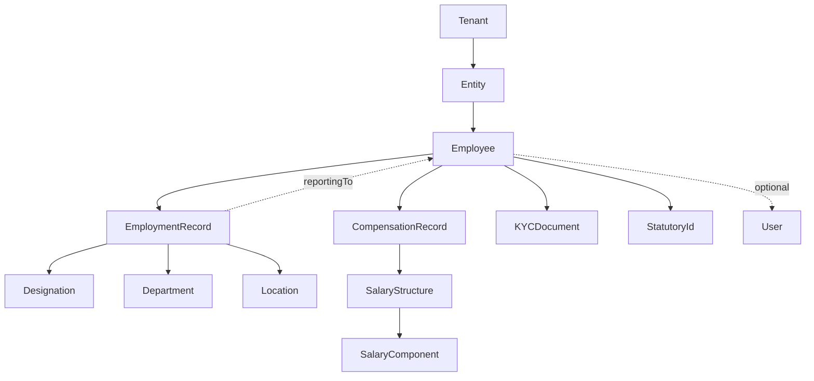

# 00 — Employee Module Overview

## Purpose

The Employee module is the foundational entity of the HRMS. Almost every other module references it. This folder defines:

- The Employee master record
- Employment lifecycle (hire to retire)
- Compensation (CTC, salary structure, revisions)
- Statutory IDs (PAN, Aadhaar, UAN, etc.)
- Documents and KYC
- White-collar vs blue-collar field differences
- Edge cases

Read [/00-foundations/](../00-foundations/) before this folder.

## What "employee" means

An **employee** is a person with an active or historical employment relationship with at least one entity in a tenant. Specifically:

- A new hire who hasn't joined yet → "Employee" (status: pre-joining)
- An active employee → "Employee" (status: active)
- An employee on long-term leave → "Employee" (status: on-leave)
- A resigned employee in notice period → "Employee" (status: notice-period)
- A terminated/separated employee → "Employee" (status: separated, isActive=false)
- A rehired ex-employee → New "Employee" record OR same record reactivated (covered in [07-edge-cases.md](./07-edge-cases.md))

Not employees:
- Job applicants (handled in `/05-recruitment/`)
- Vendors / contractors / consultants (separate concept)
- Candidates we made offers to but never joined (handled in recruitment as `JoiningStatus = no-show`)

## Architectural position

The Employee record is the hub. Most other modules query it.

## Core principle: identity vs employment

A **person** is unique (one PAN, one Aadhaar, one DOB). An **employment** is a relationship between that person and an entity. A person can have multiple employments over time.

This is why we separate:

- **Employee** — the person + their identity (PAN, Aadhaar, DOB, address, family info, statutory IDs, education, BGV)
- **EmploymentRecord** — the relationship (entity, designation, department, manager, location, dates, employment type, contract)

In v1 we link them 1-to-many (one Employee, many EmploymentRecords over time). In v2, if needed, we can model concurrent employments (rare).

## Files in this folder

1. [01-employee-master-schema.md](./01-employee-master-schema.md) — The Employee identity record (the person)
2. [02-employment-record.md](./02-employment-record.md) — Employment relationships (the job)
3. [03-compensation-record.md](./03-compensation-record.md) — CTC, salary structure, revisions, retros
4. [04-statutory-ids.md](./04-statutory-ids.md) — PAN, Aadhaar, UAN, etc. — encryption, validation, lookup
5. [05-documents-and-kyc.md](./05-documents-and-kyc.md) — Document collection, BGV, e-sign integration
6. [06-lifecycle-state-machine.md](./06-lifecycle-state-machine.md) — All transitions: hire → confirm → resign → exit, etc.
7. [07-edge-cases.md](./07-edge-cases.md) — 30+ scenarios that break naive models
8. [08-white-vs-blue-collar-differences.md](./08-white-vs-blue-collar-differences.md) — Field-by-field differences

## Integration points (forward references)

The Employee module is referenced by:

- `/02-attendance/` — every attendance / leave event references `employeeId`
- `/03-payroll/` — every payroll line references `employeeId`
- `/04-compliance/` — statutory filings list employees
- `/05-recruitment/` — hire converts candidate → employee
- `/06-performance/` — every review references `employeeId`
- `/07-ess-mobile/` — ESS displays the employee's own record
- `/08-workflow/` — workflows operate on employees

This folder defines the source of truth for employee data; downstream modules consume.

## Naming conventions used in this folder

- `employee` (lowercase) when referring to the concept
- `Employee` (TitleCase) when referring to the schema/collection
- `employeeId` (camelCase) for the foreign key reference
- `employeeCode` for the human-readable code (e.g., `ACM-EMP-0042`)

## What v1 supports vs defers

### v1 (Months 0–9)

- Full Employee master with all statutory IDs
- Single active employment record per employee
- Full compensation history with revisions and retros
- KYC document collection with manual approval workflow
- Lifecycle: pre-joining → active → notice-period → separated
- Inter-entity transfer (creates new EmploymentRecord)

### v2 (Months 10–18)

- BGV integration (AuthBridge / IDfy / OnGrid)
- E-sign integration (Aadhaar e-sign, Leegality, Docusign)
- Concurrent employments (rare cases)
- Aadhaar-UAN auto-linking
- Family member tracking for ESI dependents
- Education / experience verification automation

### v3 (Months 19–30)

- Skills graph and AI-driven internal mobility
- Predictive attrition flag based on Employee record signals
- Contractor / freelancer first-class support (separate from Employee)
- Multi-country employee support (visa, work permits)

## Cross-references

- See [/00-foundations/05-data-model-conventions.md](../00-foundations/05-data-model-conventions.md) for time-versioning patterns used here
- See [/00-foundations/03-identity-and-rbac.md](../00-foundations/03-identity-and-rbac.md) for permission model on employee data
- See [/00-foundations/04-audit-and-compliance-hooks.md](../00-foundations/04-audit-and-compliance-hooks.md) for audit log on employee changes
