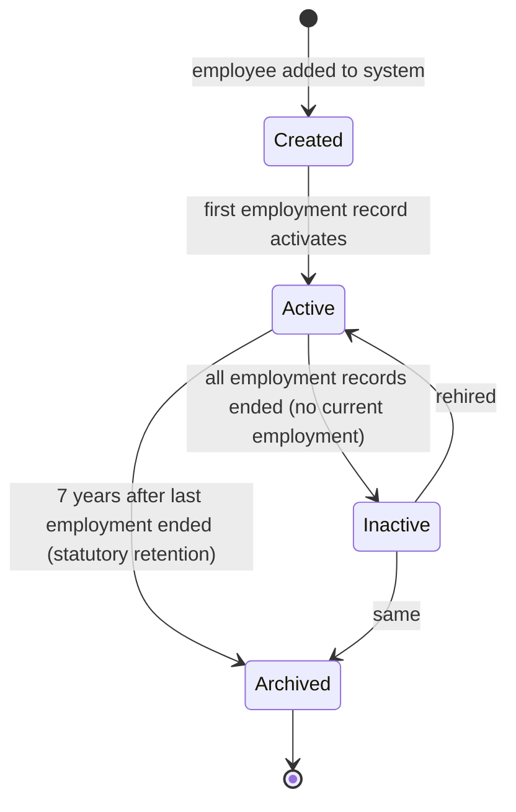

# 01 — Employee Master Schema

## Purpose

Defines the Employee identity record — the person, not the job. The job is in `EmploymentRecord` ([02-employment-record.md](./02-employment-record.md)).

## Schema

```typescript
interface Employee extends BaseDocument {
  _id: ObjectId;
  tenantId: ObjectId;
  // entityId is NOT on Employee — employee is tenant-scoped
  // Employee can have employments at multiple entities of the tenant over time

  // Identifiers
  employeeCode: string;                       // e.g., "ACM-EMP-0042" — unique within tenant
  legacyEmployeeCodes?: string[];             // for migrations from old systems

  // Personal — Required core
  personal: {
    salutation?: 'Mr' | 'Mrs' | 'Ms' | 'Dr' | 'Prof' | 'Mx';
    firstName: string;
    middleName?: string;
    lastName: string;
    displayName?: string;                     // for "preferred name" / mononyms
    fullLegalName: string;                    // exactly as on PAN — used for statutory docs

    gender: 'male' | 'female' | 'other' | 'prefer-not-to-say';
    dateOfBirth: string;                      // YYYY-MM-DD (calendar date)
    placeOfBirth?: string;
    nationality: string;                      // 'IN' default; ISO 3166-1 alpha-2
    bloodGroup?: 'A+' | 'A-' | 'B+' | 'B-' | 'AB+' | 'AB-' | 'O+' | 'O-';
    maritalStatus: 'single' | 'married' | 'divorced' | 'widowed' | 'separated';
    marriageDate?: string;
    religion?: string;                        // optional, sensitive
    category?: 'general' | 'obc' | 'sc' | 'st' | 'ews';  // optional, sensitive
    physicallyHandicapped?: {
      isPwd: boolean;
      disabilityType?: string;
      disabilityPercentage?: number;
      uniqueDisabilityId?: EncryptedString;   // UDID
    };
  };

  // Identity Documents — encrypted (see /01-employee/04-statutory-ids.md)
  identity: {
    pan: EncryptedString;                     // mandatory for tax-deducting employees
    panName?: string;                         // name as on PAN; matched against fullLegalName
    aadhaar?: EncryptedString;                // 12-digit; encrypted; subject to Aadhaar Act handling
    aadhaarVerified?: boolean;
    aadhaarVerifiedVia?: 'manual' | 'digilocker' | 'esign-flow';

    passport?: EncryptedString;
    passportExpiry?: string;
    passportIssuedAt?: string;

    drivingLicense?: EncryptedString;
    drivingLicenseExpiry?: string;

    voterId?: EncryptedString;
  };

  // Statutory IDs — also encrypted
  statutory: {
    uan?: EncryptedString;                    // UAN for PF
    uanLinkedAadhaar?: boolean;
    uanLinkedPan?: boolean;
    uanKycVerified?: boolean;

    pfMemberIds?: Array<{                     // historical / current PF accounts
      establishmentCode: string;
      memberId: string;
      isCurrent: boolean;
      employerName?: string;
    }>;

    esiNumber?: EncryptedString;              // 17-digit ESIC IP number
    esiPension?: boolean;

    pranNumber?: EncryptedString;             // for NPS
  };

  // Contact
  contact: {
    primaryEmail: string;                     // personal email
    workEmail?: string;                       // assigned by employer
    primaryPhone: string;                     // E.164
    alternatePhone?: string;

    addresses: {
      current?: Address;
      permanent?: Address;
      // Same flag if same as current
      permanentSameAsCurrent?: boolean;
    };
  };

  // Family
  family: {
    spouse?: FamilyMember;
    children?: FamilyMember[];
    parents?: { father?: FamilyMember; mother?: FamilyMember };
    siblings?: FamilyMember[];
    emergencyContact: {
      name: string;
      relationship: string;
      phone: string;
      email?: string;
      address?: Address;
    };

    // ESI dependents — eligible family members for medical benefits
    // Spouse, dependent children up to 25, dependent parents
    esiDependents?: ObjectId[];               // refs to FamilyMember._id
  };

  // Education
  education: EducationRecord[];

  // Experience (prior to current employment)
  priorExperience: PriorExperienceRecord[];
  totalPriorExperienceMonths: number;        // computed; cached

  // Skills, certifications
  skills?: string[];                         // string array; v3 may upgrade to skill graph
  certifications?: CertificationRecord[];
  languages?: { language: string; proficiency: 'basic' | 'conversational' | 'fluent' | 'native' }[];

  // Bank — for salary disbursement
  bank: {
    accounts: BankAccount[];                  // primary + optional secondary
    primaryAccountId: ObjectId;
  };

  // Employment relationship — denormalized references for fast lookups
  // Source of truth is EmploymentRecord collection
  cached_currentEmployment: {                 // DERIVED — recomputed on EmploymentRecord change
    employmentRecordId: ObjectId;
    entityId: ObjectId;
    designation: string;
    department: string;
    location: string;
    employmentType: EmploymentType;
    reportingManagerId?: ObjectId;
    joinedOn: string;                         // YYYY-MM-DD
    confirmedOn?: string;
    employmentStatus: EmploymentStatus;       // see /02-employment-record.md
  } | null;

  // Compensation — denormalized references for fast lookups
  cached_currentCompensation: {                // DERIVED
    compensationRecordId: ObjectId;
    ctcAnnual: Decimal128;
    grossMonthly: Decimal128;
    effectiveFrom: string;
  } | null;

  // Categorization
  category: 'white-collar' | 'blue-collar' | 'mixed';   // affects which features apply
  isExemptFromOvertime?: boolean;            // [WHITE-COLLAR] typically true
  isApprenticeUnderApprenticeshipAct?: boolean;
  isFixedTermContract?: boolean;
  isContractLabour?: boolean;                // [CLRA]; if true, lots of CLRA-specific tracking
  
  // Tax preferences
  taxPreferences: {
    regime: 'old' | 'new';                   // chosen tax regime for current FY
    regimeChosenAt: Date;
    regimeChangeAllowedThisFy: boolean;       // some regimes can switch only at FY start
  };

  // Profile
  profilePhotoDocumentId?: ObjectId;          // ref Documents collection

  // System
  user?: ObjectId;                            // ref Users — if employee has login

  // Status (denormalized for fast filtering)
  isActive: boolean;                          // currently employed (cached_currentEmployment is non-null)

  // Standard metadata
  createdAt: Date;
  updatedAt: Date;
  createdBy: ObjectId;
  updatedBy: ObjectId;
  version: number;
  isDeleted: boolean;
  deletedAt?: Date;
  deletedBy?: ObjectId;
  deletionReason?: string;
}

// Sub-schemas
interface FamilyMember {
  _id: ObjectId;
  name: string;
  relationship: 'spouse' | 'son' | 'daughter' | 'father' | 'mother' | 'father-in-law'
              | 'mother-in-law' | 'brother' | 'sister' | 'guardian' | 'other';
  dateOfBirth?: string;
  gender?: 'male' | 'female' | 'other';
  occupation?: string;
  monthlyIncome?: Decimal128;                 // for tax computation purposes
  isDependent: boolean;
  isNomineeForPf?: boolean;
  pfNomineePercentage?: number;               // total across nominees = 100%
  isNomineeForGratuity?: boolean;
  gratuityNomineePercentage?: number;
  isNomineeForEsi?: boolean;
  isCovered?: { underHealth?: boolean; underAccident?: boolean; underTermLife?: boolean };
}

interface EducationRecord {
  _id: ObjectId;
  level: 'high-school' | 'intermediate' | 'diploma' | 'bachelors' | 'masters' | 'phd' | 'professional' | 'certification' | 'other';
  qualification: string;                      // 'B.Tech Computer Science'
  specialization?: string;
  institution: string;
  university?: string;
  yearOfPassing: number;
  percentageOrCgpa?: string;                  // string: "85%" or "8.5/10"
  modeOfEducation?: 'regular' | 'distance' | 'open' | 'online';
  isHighest?: boolean;
  documentIds?: ObjectId[];                   // certificates uploaded
}

interface PriorExperienceRecord {
  _id: ObjectId;
  employerName: string;
  designation: string;
  industry?: string;
  fromDate: string;
  toDate: string;
  durationMonths: number;
  reasonForLeaving?: string;
  lastDrawnSalary?: Decimal128;
  documentIds?: ObjectId[];                   // experience cert / relieving letter
}

interface CertificationRecord {
  _id: ObjectId;
  name: string;
  issuingAuthority: string;
  issuedOn: string;
  expiresOn?: string;
  credentialId?: string;
  credentialUrl?: string;
  documentIds?: ObjectId[];
}

interface BankAccount {
  _id: ObjectId;
  accountHolderName: string;                  // must match employee or jointly with spouse
  bankName: string;
  branchName?: string;
  accountNumber: EncryptedString;
  accountNumberLast4: string;                 // for display (not encrypted)
  ifscCode: string;
  accountType: 'savings' | 'current' | 'salary';
  isVerified: boolean;
  verifiedAt?: Date;
  verifiedVia?: 'penny-drop' | 'document-upload' | 'manual';
  isActive: boolean;
  isPrimary: boolean;
  effectiveFrom: Date;
  effectiveTo?: Date;
}

type EncryptedString = {
  ciphertext: string;
  algorithm: 'aes-256-gcm';
  keyId: string;                              // KMS key reference
  // The plaintext is never stored
};
```

## Mandatory indexes

```typescript
// Employee code lookup (most common)
{ tenantId: 1, employeeCode: 1 }, unique
{ tenantId: 1, isDeleted: 1, isActive: 1 }

// Search by name (for HR finding employees)
{ tenantId: 1, 'personal.firstName': 1, 'personal.lastName': 1 }

// Cached current employment for filters
{ tenantId: 1, 'cached_currentEmployment.entityId': 1, isActive: 1 }
{ tenantId: 1, 'cached_currentEmployment.department': 1 }
{ tenantId: 1, 'cached_currentEmployment.reportingManagerId': 1 }

// User linkage
{ tenantId: 1, user: 1 }, unique sparse

// Statutory uniqueness within tenant — encrypted lookup
// We can't index encrypted PAN directly, so we use a hash for lookup
{ tenantId: 1, 'identity.panHash': 1 }, unique sparse
{ tenantId: 1, 'statutory.uanHash': 1 }, unique sparse
```

`[DECISION]` For lookup by sensitive ID (PAN, UAN), we store both ciphertext (decryptable) and a deterministic HMAC-SHA-256 hash with a per-tenant secret. The hash allows uniqueness checks and lookup without decrypting. The hash secret is rotated yearly with re-hashing background job.

## Validation rules

| Field | Rule |
|---|---|
| `employeeCode` | Unique within tenant; configurable format; cannot be changed once active |
| `personal.fullLegalName` | Required; must match `personal.firstName + middleName + lastName` allowing for ordering |
| `personal.dateOfBirth` | Required; must be ≥ 14 years ago (Apprentices Act minimum age) `[VERIFY]`; ≤ 100 years ago |
| `personal.gender` | Required |
| `identity.pan` | Required for tax-deducting employments; format `^[A-Z]{5}\d{4}[A-Z]$`; 4th char must match category (P=individual, F=firm, C=company, etc.) |
| `identity.panName` | Should match `fullLegalName`; flagged for review if mismatch |
| `identity.aadhaar` | Optional but encouraged; 12 digits; Verhoeff checksum validation `[VERIFY]` |
| `contact.primaryEmail` | Required; valid email; unique within tenant |
| `contact.primaryPhone` | Required; valid Indian mobile (10 digits, starts 6/7/8/9) |
| `bank.accounts[].ifscCode` | Required if account given; format `^[A-Z]{4}0[A-Z0-9]{6}$`; must validate against RBI IFSC list |
| `bank.accounts[].accountNumber` | Required; 9–18 digits typically; encrypted at rest |
| `family.emergencyContact.phone` | Required |

`[ASSUMPTION]` Some fields marked optional are practically mandatory in production (e.g., Aadhaar for PF/UAN linkage post-2023 EPFO mandate). Tenant admin can configure required-fields per entity.

## Field-level access control

Reiterating from [/00-foundations/03-identity-and-rbac.md](../00-foundations/03-identity-and-rbac.md):

| Field path | Default visibility | Required permission for full view |
|---|---|---|
| `personal.fullLegalName` | visible | n/a |
| `personal.dateOfBirth` | visible to self + manager + HR | `employee.read:tenant` for others |
| `personal.religion` | hidden | `employee.read:tenant` only with explicit grant |
| `personal.category` | hidden | same |
| `identity.pan` | masked (`AB****1234B`) | `employee.statutoryId:read:tenant` |
| `identity.aadhaar` | masked (`XXXX-XXXX-1234`) | `employee.statutoryId:read:tenant` + audit log entry |
| `statutory.uan` | masked | `employee.statutoryId:read:tenant` |
| `statutory.esiNumber` | masked | `employee.statutoryId:read:tenant` |
| `bank.accounts[].accountNumber` | masked | `payroll:run:entity` |
| `family.*` | self + HR | n/a (manager doesn't see family) |
| `priorExperience[].lastDrawnSalary` | hidden | `employee.compensation:read:tenant` |

## Lifecycle

The Employee record has its own lifecycle, but most lifecycle logic is on `EmploymentRecord`. The Employee record has:



`isActive` flag is a denormalization of "has at least one active EmploymentRecord". Recomputed on EmploymentRecord create/update/end.

## Time-versioning approach

Per [/00-foundations/05-data-model-conventions.md](../00-foundations/05-data-model-conventions.md), Employee uses Pattern A (effective-dated record + history collection).

```typescript
interface EmployeeVersion extends BaseDocument {
  employeeId: ObjectId;
  effectiveFrom: Date;
  effectiveTo: Date | null;
  // Full snapshot of Employee fields at this version
  snapshot: Omit<Employee, 'cached_currentEmployment' | 'cached_currentCompensation' | 'createdAt' | 'updatedAt' | ...>;
  changeReason?: string;
  changeApprovalId?: ObjectId;
  changedBy: ObjectId;
}
```

When an Employee field changes:
1. Current Employee doc updated with new values
2. New EmployeeVersion row inserted with effectiveFrom = change time, effectiveTo = null
3. Previous EmployeeVersion row updated with effectiveTo = change time

Point-in-time queries use the version table.

`[DECISION]` Not every field triggers a version. Cosmetic fields (preferred display name, profile photo) update in-place without versioning. Statutory and compliance-relevant fields (legal name, PAN, Aadhaar, address, family) trigger version. The full list of "versioned fields" is enforced at repository layer.

## Data migration considerations

Importing employees from existing HRMS / Excel:

- Bulk import accepts CSV / XLSX with mapped columns
- Per-row validation; bad rows go to a "rejected" report
- Encrypted fields (PAN, Aadhaar) are encrypted on import
- Generated fields (employeeCode if not provided) auto-generate
- Linked records (EmploymentRecord, CompensationRecord) created in same transaction
- Migration mode allows backdating createdAt/updatedAt to preserve history
- Audit log marks bulk-imported records with import batch ID

## Open questions

`[OPEN]` Multi-employer history. Should we track an employee's full career across multiple tenants if they move? **No.** Each tenant's HRMS is its own world. PriorExperience captures pre-current-employer history through self-declaration / manual entry.

`[OPEN]` Linking Employee to LinkedIn / Naukri profile? Useful for talent visibility. v2 feature.

`[OPEN]` Employee's photograph requirements. Min size, max size, aspect ratio. Spec in `/05-documents-and-kyc.md`.

`[OPEN]` Multilingual name handling. Some employees have names in regional scripts (e.g., തമിழ്). Store in original script as well? v2 feature.

## Cross-references

- See [02-employment-record.md](./02-employment-record.md) for employment relationship
- See [03-compensation-record.md](./03-compensation-record.md) for compensation
- See [04-statutory-ids.md](./04-statutory-ids.md) for encryption details
- See [05-documents-and-kyc.md](./05-documents-and-kyc.md) for document collection
- See [06-lifecycle-state-machine.md](./06-lifecycle-state-machine.md) for state transitions
- See [07-edge-cases.md](./07-edge-cases.md) for edge cases
- See [08-white-vs-blue-collar-differences.md](./08-white-vs-blue-collar-differences.md) for category-specific fields
