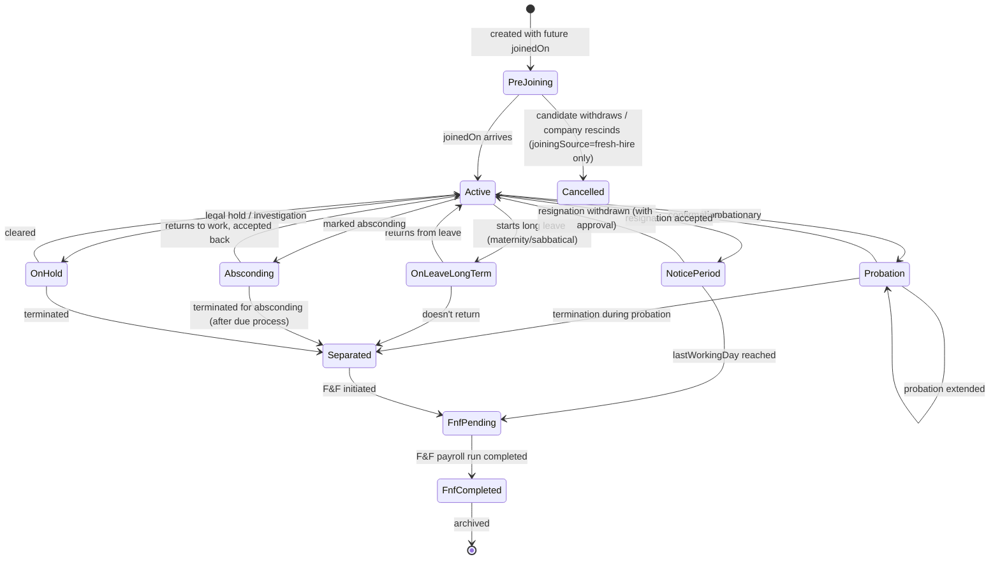
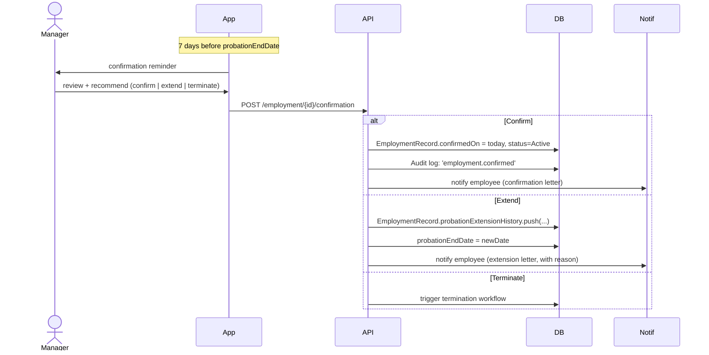
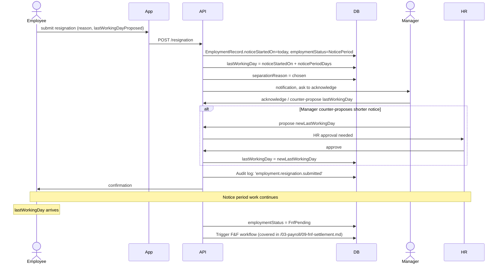

# 02 — Employment Record

## Purpose

The `EmploymentRecord` represents a single employment relationship between an Employee and an Entity over a time period. An employee can have multiple employment records over time (sequential) or, in v2, simultaneously (concurrent at different entities of the same tenant).

`EmploymentRecord` is the source of truth for: which entity the employee works at, designation, department, location, manager, employment type, joining date, separation date.

The `Employee.cached_currentEmployment` field is a denormalization of the most recent active EmploymentRecord for fast queries.

## Schema

```typescript
interface EmploymentRecord extends BaseDocument {
  _id: ObjectId;
  tenantId: ObjectId;
  entityId: ObjectId;                       // entity where employed
  employeeId: ObjectId;                     // ref Employee

  // sequence
  sequenceNumber: number;                   // 1, 2, 3 for the same employee's successive employments

  // dates
  offeredOn?: string;                       // YYYY-MM-DD; offer letter date
  acceptedOn?: string;                      // YYYY-MM-DD; offer accepted
  expectedJoiningDate?: string;             // YYYY-MM-DD; date offer specifies
  joinedOn: string;                         // YYYY-MM-DD; actual joining
  confirmedOn?: string;                     // YYYY-MM-DD; end of probation
  
  noticeStartedOn?: string;                 // YYYY-MM-DD; resignation date
  lastWorkingDay?: string;                  // YYYY-MM-DD; effective separation date
  exitedOn?: string;                        // YYYY-MM-DD; same as lastWorkingDay typically

  // status
  employmentStatus: EmploymentStatus;       // see below
  joiningSource:
    | 'fresh-hire'
    | 'inter-entity-transfer'
    | 'rehire'
    | 'data-migration'
    | 'acquisition';                        // brought in via M&A
  joiningSourceRefId?: ObjectId;            // refs prior EmploymentRecord for transfer/rehire

  // employment type
  employmentType: EmploymentType;
  isProbationary: boolean;
  probationDurationMonths?: number;         // typically 3-6
  probationEndDate?: string;
  probationExtensionHistory?: Array<{
    extendedOn: string;
    extendedTill: string;
    reason: string;
    extendedBy: ObjectId;
  }>;

  isFixedTerm: boolean;
  fixedTermStartDate?: string;
  fixedTermEndDate?: string;
  fixedTermRenewalCount?: number;

  isApprentice: boolean;                    // covered under Apprentices Act
  apprenticeshipDurationMonths?: number;
  isStipendOnly?: boolean;                  // [BLUE-COLLAR] some apprentices only get stipend, no salary

  // organizational placement
  designation: string;                      // 'Senior Software Engineer'
  designationLevel?: string;                // 'L4', 'M3' — internal grade
  jobTitle?: string;                        // public-facing title (may differ)
  jobFamily?: string;                       // 'Engineering'
  jobCode?: string;                         // 'SWE-04'
  
  departmentId: ObjectId;                   // ref Department
  department: string;                       // denormalized
  
  subDepartmentId?: ObjectId;
  subDepartment?: string;
  
  locationId: ObjectId;                     // ref Location
  location: string;                         // denormalized
  workMode: 'on-site' | 'remote' | 'hybrid';
  hybridSchedule?: { officeDaysPerWeek: number; specificDays?: string[] };
  
  branchOfficeId?: ObjectId;                // ref Entity.branchOffices

  // shift assignment [BLUE-COLLAR + factory + retail]
  defaultShiftId?: ObjectId;                // ref Shift; covered in /02-attendance/
  rosterPolicyId?: ObjectId;                // ref RosterPolicy
  weeklyOffPattern?: WeeklyOffPattern;

  // reporting
  reportingManagerId?: ObjectId;            // ref Employee
  dottedLineManagerId?: ObjectId;           // matrix org
  hrPartnerId?: ObjectId;                   // ref Employee — HR business partner
  
  // contractual
  contractType?: ContractType;
  contractDocumentId?: ObjectId;            // ref Documents
  
  // CLRA — if contract labour
  clraDetails?: {
    contractorName: string;
    contractorRegistrationNumber: string;
    workOrderNumber: string;
    workOrderFrom: string;
    workOrderTo: string;
    natureOfWork: string;
    licenseNumber?: string;
  };
  
  // notice period
  noticePeriodDays: number;                 // typical 30, 60, 90
  noticePeriodAfterConfirmation?: number;   // some companies have shorter notice during probation
  
  // separation
  separationReason?: SeparationReason;
  separationCategory?: 'voluntary' | 'involuntary' | 'retirement' | 'death' | 'absconding';
  separationDetail?: string;                // free text
  rehireEligibility?: 'eligible' | 'not-eligible' | 'with-approval';
  rehireEligibilityNote?: string;
  
  // F&F status
  fnfInitiatedOn?: string;
  fnfCompletedOn?: string;
  fnfPayrollRunId?: ObjectId;               // refs PayrollRun in /03-payroll/
  
  // exit interview
  exitInterviewCompleted?: boolean;
  exitInterviewDate?: string;
  exitInterviewDocumentId?: ObjectId;
  
  // documents handed over
  documentsReturned?: {
    laptop: boolean;
    accessCard: boolean;
    sim: boolean;
    other?: { item: string; returned: boolean; notedAt: Date }[];
  };
  
  // settlement clearances
  clearances?: {
    it: 'pending' | 'cleared' | 'na';
    hr: 'pending' | 'cleared' | 'na';
    finance: 'pending' | 'cleared' | 'na';
    admin: 'pending' | 'cleared' | 'na';
    manager: 'pending' | 'cleared' | 'na';
    library?: 'pending' | 'cleared' | 'na';
    cafeteria?: 'pending' | 'cleared' | 'na';
  };

  // notes
  internalNotes?: string;                   // HR-only notes
  
  // flags
  isCurrent: boolean;                       // exactly one EmploymentRecord per employee should be current at a time (in v1)
  isPrimary: boolean;                       // if employee has concurrent (v2), one is primary

  // standard metadata
  createdAt: Date;
  updatedAt: Date;
  createdBy: ObjectId;
  updatedBy: ObjectId;
  version: number;
  isDeleted: boolean;
}

type EmploymentStatus =
  | 'pre-joining'              // offer accepted, hasn't joined
  | 'active'                    // currently employed
  | 'probation'                 // active but in probation period
  | 'on-leave-long-term'        // on maternity / sabbatical / extended leave
  | 'notice-period'             // resigned, working notice
  | 'absconding'                // didn't show up, no resignation
  | 'separated'                 // exited
  | 'fnf-pending'               // exited, F&F not done
  | 'fnf-completed'             // exited, F&F done
  | 'on-hold';                  // legal hold, internal investigation

type EmploymentType =
  | 'permanent-full-time'
  | 'permanent-part-time'
  | 'fixed-term-full-time'
  | 'fixed-term-part-time'
  | 'probationary'
  | 'apprentice'
  | 'intern'
  | 'consultant'                // 1099 / 194J
  | 'retainer'
  | 'contract-labour'           // [CLRA] under principal employer
  | 'gig-worker'                // Code on Social Security 2020
  | 'piece-rated';              // [BLUE-COLLAR] paid per unit produced

type ContractType =
  | 'permanent'
  | 'fixed-term-1-year'
  | 'fixed-term-3-year'
  | 'fixed-term-custom'
  | 'consultancy-agreement'
  | 'gig-platform-agreement';

type SeparationReason =
  | 'resignation-personal'
  | 'resignation-better-opportunity'
  | 'resignation-relocation'
  | 'resignation-higher-studies'
  | 'resignation-health'
  | 'resignation-family'
  | 'termination-performance'
  | 'termination-misconduct'
  | 'termination-redundancy'
  | 'termination-business-closure'
  | 'retirement-superannuation'
  | 'retirement-voluntary'
  | 'death'
  | 'permanent-disability'
  | 'absconding'
  | 'end-of-contract'
  | 'inter-entity-transfer';
```

## Mandatory indexes

```typescript
{ tenantId: 1, employeeId: 1, sequenceNumber: 1 }, unique
{ tenantId: 1, employeeId: 1, isCurrent: 1 }
{ tenantId: 1, entityId: 1, employmentStatus: 1, isDeleted: 1 }
{ tenantId: 1, entityId: 1, departmentId: 1 }
{ tenantId: 1, entityId: 1, reportingManagerId: 1 }
{ tenantId: 1, entityId: 1, joinedOn: 1 }
{ tenantId: 1, entityId: 1, lastWorkingDay: 1 }
{ tenantId: 1, employmentStatus: 1, lastWorkingDay: 1 }   // for FNF queue
```

## Validation rules

| Field | Rule |
|---|---|
| `joinedOn` | Required; cannot be > today + 90 days (advance hires) `[ASSUMPTION]` |
| `joinedOn` | Cannot be earlier than employee's 14th birthday (Apprentices Act) `[VERIFY]` |
| `confirmedOn` | Must be ≥ `joinedOn`; ≤ today |
| `lastWorkingDay` | Must be ≥ `joinedOn` |
| `noticeStartedOn` | Must be ≥ `joinedOn`; ≤ `lastWorkingDay` |
| `probationDurationMonths` | 1–12; typical 3 or 6 |
| `noticePeriodDays` | 0–180 |
| `reportingManagerId` | Must be a different employee, in same tenant; cannot be self; manager must be active (or `null` for org-top employee) |
| `isCurrent` | Exactly one record per employee should have `isCurrent=true` (v1) |
| `employmentType` | If `apprentice`, employee.isApprenticeUnderApprenticeshipAct must be true |
| `clraDetails` | Required if `employmentType=contract-labour` |
| `separationReason` | Required if `employmentStatus IN ['separated', 'fnf-pending', 'fnf-completed']` |

## Lifecycle state machine



## Behavior

### Creating a new employment

When a new EmploymentRecord is created:

1. Validate `employeeId` exists in same tenant
2. Validate `entityId` is active in same tenant
3. Validate `reportingManagerId` (if any) — manager exists, is active, different employee
4. Validate `joinedOn` (range check)
5. Insert with `isCurrent=true`
6. **If employee already has a `isCurrent=true` record** (sequential employments, e.g., transfer):
   - Either the previous record must be `separated` already, OR
   - The flow is "inter-entity transfer": atomically end the previous record (`lastWorkingDay = newJoinedOn - 1day`) and create new one
7. Update `Employee.cached_currentEmployment` to point to new record
8. Compute `sequenceNumber = max(existing) + 1`
9. Audit log entry: `employment.created`
10. Trigger downstream:
    - PF: enroll in EPS / EPF if applicable
    - ESI: enroll if gross ≤ ceiling
    - Asset assignment workflow
    - Onboarding workflow
    - Welcome email / WhatsApp
    - Manager notified

### Confirming employment (end of probation)



`[ASSUMPTION]` Confirmation requires manager recommendation + HR approval. Auto-confirm option exists for tenants who don't want active confirmation (record auto-confirms on probationEndDate if no action).

### Resignation flow



### Inter-entity transfer

This is the most complex flow because it involves two EmploymentRecords atomically:

1. Source record at Entity A: `lastWorkingDay = transferDate - 1day`, `separationReason = 'inter-entity-transfer'`, `employmentStatus = 'separated'`
2. New record at Entity B: `joinedOn = transferDate`, `joiningSource = 'inter-entity-transfer'`, `joiningSourceRefId = sourceRecordId`
3. Employee record: `cached_currentEmployment` updated
4. PF: UAN remains; Member ID at Entity A becomes inactive, new Member ID at Entity B
5. ESI: deactivate at Entity A code, activate at Entity B code if applicable
6. Gratuity: by default, service breaks. If tenant-config "groupContinuousService=true", continuity preserved (rare)
7. Leave balances: configurable — usually carried over but tenant-specific
8. Documents: re-acknowledge new entity-specific NDA / policies
9. Manager change: new entity has different reporting structure
10. F&F at Entity A: only run if there are dues (typically a closing payslip, not full F&F)

### Absconding flow

`[BLUE-COLLAR]` Common scenario. Employee stops showing up without resignation.

State machine:
- Day 1–3 absent without information → status remains `active`, attendance marked LOP, manager flagged
- Day 4–7 → manager calls / WhatsApp
- Day 8 → HR sends "show cause" notice via registered post
- Day 8–22 → 14-day window for response (`[CA-REVIEW]` — varies by Standing Orders Act / company policy)
- Day 23 onwards → if no response, mark `absconding`
- After due process → terminate, separationReason=`absconding`

Spec must support all states and timeline tracking with audit trail of communications sent.

## Outputs / artifacts produced

When an employment is created or modified, generate:

- **Offer letter** (PDF) — pre-joining, can be e-signed
- **Appointment letter** (PDF) — on joining
- **Confirmation letter** (PDF) — on confirmation
- **Promotion letter** (PDF) — on designation change with grade up
- **Transfer letter** (PDF) — on inter-entity / location change
- **Resignation acceptance letter** (PDF) — on resignation acknowledgment
- **Relieving letter** (PDF) — on separation
- **Experience letter** (PDF) — on separation, after F&F
- **Service certificate** (PDF) — on request

Templates are tenant-configurable with merge fields.

## Edge cases (preview)

Detailed in [07-edge-cases.md](./07-edge-cases.md). Quick teasers:

- Employee resigns, withdraws resignation, re-resigns
- Employee on maternity at time of inter-entity transfer
- Employee terminated for misconduct during notice period
- Manager and reportee both resign with overlapping notice periods
- Employee dies during notice period — F&F goes to nominees, gratuity exempted from 5-year rule
- Employee on long sabbatical asked to return for transfer
- Probation employee transferred mid-probation
- Promotion + inter-entity transfer simultaneously
- Backdated joining (employee started, paperwork done later)
- Forward-dated separation (employee gives 6-month notice)

## Cross-references

- See [01-employee-master-schema.md](./01-employee-master-schema.md) for Employee record
- See [03-compensation-record.md](./03-compensation-record.md) for compensation linked to employment
- See [06-lifecycle-state-machine.md](./06-lifecycle-state-machine.md) for full state diagram
- See [07-edge-cases.md](./07-edge-cases.md) for edge case handling
- See [/00-foundations/02-multi-entity.md](../00-foundations/02-multi-entity.md) for inter-entity scenarios
- See [/03-payroll/09-fnf-settlement.md](../03-payroll/09-fnf-settlement.md) (Phase 3) for F&F flow
