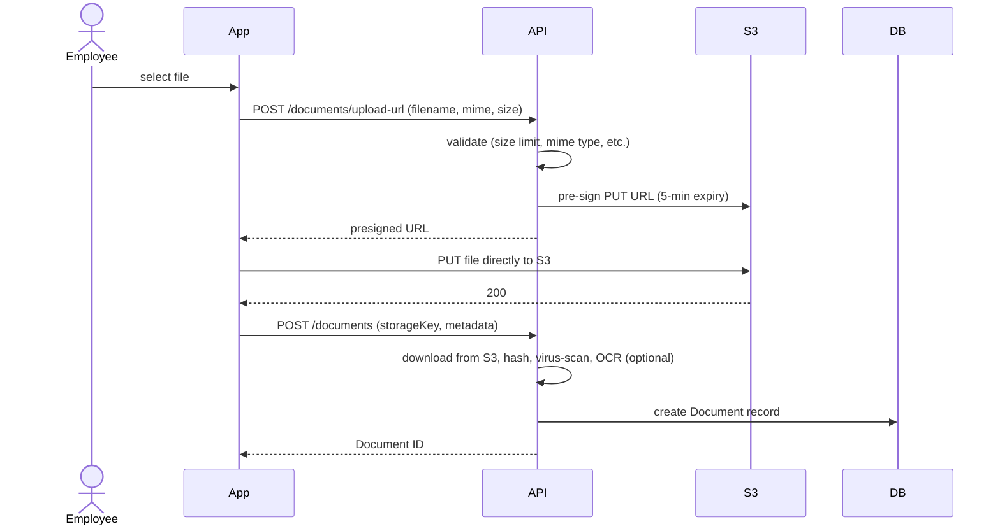

# 05 — Documents & KYC

## Purpose

Defines how employee documents are collected, stored, validated, and retained. Covers ID proofs, education certificates, prior experience documents, employment contracts, and lifecycle documents (offer letter, appointment letter, relieving letter).

Documents are referenced from many entities (Employee, EmploymentRecord, CompensationRecord); this file defines the canonical Document collection.

## Document schema

```typescript
interface Document extends BaseDocument {
  _id: ObjectId;
  tenantId: ObjectId;
  entityId?: ObjectId;                       // for entity-scoped documents

  // ownership
  ownerType: 'employee' | 'entity' | 'tenant' | 'workflow' | 'recruitment-candidate';
  ownerId: ObjectId;                         // ref Employee | Entity | Tenant | etc.

  // categorization
  documentCategory: DocumentCategory;
  documentType: string;                      // standardized type code (see catalog below)
  documentTypeName: string;                  // display name

  // file
  fileName: string;                          // original
  storedFileName: string;                    // sanitized for storage
  storageKey: string;                        // s3://bucket/tenants/{tid}/...
  storageProvider: 's3' | 'r2' | 'gcs';
  mimeType: string;
  sizeBytes: number;
  pageCount?: number;
  hash: string;                              // SHA-256 of contents
  
  // multi-file documents
  parentDocumentId?: ObjectId;               // if this is a page of a multi-page doc
  pageNumber?: number;
  
  // confidentiality
  confidentialityLevel: 'public' | 'internal' | 'confidential' | 'restricted';
  isPii: boolean;                            // contains personally identifiable info
  isFinancial: boolean;
  isMedical: boolean;
  
  // encryption
  isEncryptedAtRest: boolean;                // S3 SSE-KMS or app-layer encryption
  encryptionKeyId?: string;
  appLayerEncrypted?: boolean;               // additional layer for highly sensitive
  
  // signatures
  isDigitallySigned: boolean;
  signatureProvider?: 'aadhaar-esign' | 'docusign' | 'leegality' | 'signdesk' | 'manual-scan';
  signatures?: DocumentSignature[];
  
  // verification
  verificationStatus: 'pending' | 'submitted' | 'verified' | 'rejected' | 'expired';
  verifiedBy?: ObjectId;
  verifiedAt?: Date;
  verificationNotes?: string;
  rejectionReason?: string;
  
  // BGV linkage
  bgvCheckId?: ObjectId;                     // ref BgvCheck (v2)
  
  // dates
  documentIssueDate?: string;                // when the document was issued (e.g., PAN issuance, degree convocation)
  documentExpiryDate?: string;               // when it expires (passport, license)
  validFrom?: Date;                          // when this document becomes valid in HRMS
  validUntil?: Date;                         // when it must be re-collected
  
  // metadata
  uploadedAt: Date;
  uploadedBy: ObjectId;
  
  // tags
  tags?: string[];                           // free-form
  
  // versioning
  version: number;
  isLatest: boolean;
  previousVersionId?: ObjectId;
  
  // access tracking
  lastAccessedAt?: Date;
  accessCount: number;
  
  // standard
  createdAt: Date;
  updatedAt: Date;
  createdBy: ObjectId;
  updatedBy: ObjectId;
  isDeleted: boolean;
}

type DocumentCategory =
  | 'identity'                  // PAN card, Aadhaar card, passport, voter ID
  | 'address-proof'             // utility bill, rent agreement
  | 'education'                 // degrees, certificates, marksheets
  | 'experience'                // experience letter, relieving letter from prior employer
  | 'kyc-bank'                  // cancelled cheque, passbook
  | 'kyc-other'                 // PF nomination, gratuity nomination
  | 'employment-pre-joining'    // offer letter, joining letter
  | 'employment-post-joining'   // appointment letter, NDA, code of conduct ack
  | 'employment-lifecycle'      // confirmation letter, promotion letter, transfer letter
  | 'employment-exit'           // resignation, relieving, experience, FNF acknowledgment
  | 'compensation'              // salary structure, revision letter
  | 'tax'                       // Form 12B (prior employer), investment proofs, Form 16
  | 'leave'                     // medical certificate for SL
  | 'performance'               // PIP, warning letter, appreciation
  | 'misc'
  | 'medical'
  | 'visa'
  | 'background-verification';

interface DocumentSignature {
  signerType: 'employee' | 'employer' | 'witness' | 'third-party';
  signerId?: ObjectId;
  signerName: string;
  signerEmail?: string;
  signedAt: Date;
  signatureType: 'aadhaar-esign' | 'electronic' | 'digital-cert' | 'wet-signature-scan';
  signatureCertificate?: string;
  ipAddress?: string;
  geoLocation?: { lat: number; lng: number };
  signedDocumentHash: string;                // hash at signing — proves document not altered post-signature
}
```

## Indexes

```typescript
{ tenantId: 1, ownerType: 1, ownerId: 1, isLatest: 1, isDeleted: 1 }
{ tenantId: 1, ownerId: 1, documentCategory: 1 }
{ tenantId: 1, ownerId: 1, documentType: 1, isLatest: 1 }
{ tenantId: 1, verificationStatus: 1 }
{ tenantId: 1, documentExpiryDate: 1 }     // for expiry alerts
{ hash: 1 }                                  // for de-dup detection
```

## Document type catalog

Standardized type codes used across the platform. Tenant cannot create new categories but can define custom types within categories.

### Identity

| Type code | Name | Required for | Validation rules |
|---|---|---|---|
| `id-pan-card` | PAN Card | All employees | Must match identity.pan |
| `id-aadhaar-card` | Aadhaar Card | KYC compliance | Match identity.aadhaar |
| `id-passport` | Passport | International travel; some employments | Expiry > 6 months |
| `id-voter` | Voter ID | Alternate ID | |
| `id-driving-license` | Driving License | Driver roles | Expiry not passed |
| `id-pwd-certificate` | UDID / Disability Certificate | If physicallyHandicapped | Issued by approved authority |

### Address Proof

| Type code | Name | Required for | Notes |
|---|---|---|---|
| `addr-aadhaar` | Aadhaar (as address proof) | Default | Backup for `id-aadhaar-card` |
| `addr-passport` | Passport | | |
| `addr-utility` | Utility Bill (electricity / gas / water) | | < 3 months old |
| `addr-rent-agreement` | Rent / Lease Agreement | | Notarized preferred |
| `addr-bank-statement` | Bank Statement with address | | < 3 months old |

### Education

| Type code | Name | Required for | Notes |
|---|---|---|---|
| `edu-10th-marksheet` | 10th Standard Marksheet | DOB proof | |
| `edu-12th-marksheet` | 12th Standard Marksheet | | |
| `edu-bachelor-degree` | Bachelor's Degree Certificate | Most professional roles | |
| `edu-bachelor-marksheet` | Bachelor's Marksheets | | All semesters |
| `edu-master-degree` | Master's Degree Certificate | | |
| `edu-phd-certificate` | Doctorate | | |
| `edu-diploma` | Diploma | | |
| `edu-professional-cert` | Professional Certification | CA / CS / CFA / etc. | |

### Prior Experience

| Type code | Name | Required for | Notes |
|---|---|---|---|
| `exp-offer-letter-prior` | Prior Employer Offer Letter | Experience credit | |
| `exp-relieving-letter` | Relieving Letter from prior employer | Required if claiming experience | |
| `exp-experience-letter` | Service Certificate from prior employer | Verifies tenure | |
| `exp-payslip-prior` | Last 3 months' payslips | Salary verification | |
| `exp-form-16-prior` | Prior employer's Form 16 | For mid-year joiner tax computation | |
| `exp-form-12b` | Form 12B | Mid-year joiner declaration | |

### KYC Bank

| Type code | Name | Required | Notes |
|---|---|---|---|
| `bank-cancelled-cheque` | Cancelled Cheque | Yes | For salary disbursement |
| `bank-passbook` | Bank Passbook (front page) | Alternative | |
| `bank-statement` | Bank Statement | Alternative | |

### Employment Lifecycle

| Type code | Name | Generated by | Signed by |
|---|---|---|---|
| `emp-offer-letter` | Offer Letter | HR | Employer + Employee |
| `emp-appointment-letter` | Appointment Letter | HR | Employer + Employee |
| `emp-nda` | Non-Disclosure Agreement | HR | Employee |
| `emp-code-of-conduct` | Code of Conduct Acknowledgment | HR | Employee |
| `emp-posh-policy-ack` | POSH Policy Acknowledgment | HR | Employee |
| `emp-confirmation-letter` | Confirmation Letter | HR | Employer |
| `emp-promotion-letter` | Promotion Letter | HR | Employer |
| `emp-transfer-letter` | Transfer Letter | HR | Employer |
| `emp-warning-letter` | Warning / PIP Letter | HR | Employer |
| `emp-resignation-letter` | Resignation Letter | Employee | Employee |
| `emp-resignation-acceptance` | Resignation Acceptance | HR | Employer |
| `emp-relieving-letter` | Relieving Letter | HR | Employer |
| `emp-experience-letter` | Service / Experience Letter | HR | Employer |
| `emp-fnf-statement` | F&F Statement | Payroll | Employer + Employee |

### Compensation

| Type code | Name |
|---|---|
| `comp-salary-letter-initial` | Initial Salary Letter |
| `comp-revision-letter` | Salary Revision Letter |
| `comp-bonus-letter` | Bonus Award Letter |
| `comp-stock-grant-letter` | ESOP Grant Letter |

### Tax

| Type code | Name | Frequency |
|---|---|---|
| `tax-form-16` | Form 16 (annual TDS certificate) | Annual |
| `tax-form-12ba` | Form 12BA (perquisites disclosure) | Annual |
| `tax-form-12b` | Form 12B (declaration of prior income) | At joining if mid-year |
| `tax-investment-proof` | Tax saving investment proofs | Annual (Q4 typically) |
| `tax-rent-receipt` | Rent receipts (HRA exemption) | Quarterly / Annual |
| `tax-rent-agreement` | Rent Agreement (HRA exemption if rent > certain amount) | Annual |
| `tax-housing-loan-statement` | Home Loan Interest / Principal Statement | Annual |

### Leave

| Type code | Name | Notes |
|---|---|---|
| `leave-medical-cert` | Medical Certificate | For SL > 3 days `[CA-REVIEW]` |
| `leave-fitness-cert` | Fitness Certificate | Return from long medical leave |
| `leave-maternity-cert` | Maternity Medical Certificate | For ML eligibility |
| `leave-bereavement-proof` | Bereavement Proof | Some companies require |

## KYC workflow

```mermaid
sequenceDiagram
    participant HR
    participant App
    participant Employee
    participant Verifier as Verification Service [v2]
    participant DB

    Note over HR: New employee onboarded
    HR->>App: send onboarding kit
    App->>Employee: email + WhatsApp link to ESS portal
    
    Employee->>App: log in with invitation
    App->>Employee: shows KYC checklist (per tenant config)
    
    loop For each required document
        Employee->>App: upload document
        App->>DB: save Document (status=submitted)
        
        alt Auto-verify available [v2]
            App->>Verifier: verify document
            Verifier-->>App: result
            App->>DB: update Document.verificationStatus
        else Manual verify [v1]
            App->>HR: notify "doc submitted"
            HR->>App: review + verify/reject
            App->>DB: update Document.verificationStatus
        end
    end
    
    Note over App: All docs verified
    App->>HR: KYC complete; ready for confirmation
```

### Manual verification UI (v1)

HR sees a queue of "documents pending verification". For each:
- View document
- Cross-reference with employee data (PAN matches, name matches, address matches)
- Approve / reject with reason
- If approved, update employee data fields if needed
- Audit log

### Auto-verification (v2)

For supported documents, integrate with verification services:
- PAN: NSDL / Income Tax e-filing
- Aadhaar: DigiLocker (XML-based) or UIDAI offline e-KYC
- Bank account: penny-drop verification (Cashfree / Razorpay / Decentro)
- Education: Truecred / OnGrid / AuthBridge

## Document upload flow



### Constraints

- Max file size: 10 MB per file (configurable per type)
- Allowed mime types: `application/pdf`, `image/jpeg`, `image/png`, `image/webp`
- Virus scan via ClamAV in BullMQ worker
- OCR via AWS Textract or Tesseract (for searchable PDFs and field extraction `[v2]`)

## File storage layout

```
s3://hrms-prod/
├── tenants/
│   ├── {tenantId}/
│   │   ├── employees/
│   │   │   └── {employeeId}/
│   │   │       ├── identity/
│   │   │       │   └── {documentId}.pdf
│   │   │       ├── education/
│   │   │       └── employment/
│   │   ├── entities/
│   │   │   └── {entityId}/
│   │   │       └── statutory/
│   │   └── workflow/
```

Tenant-prefixed paths prevent any URL leak from crossing tenants. Signed URLs (15-minute default) for downloads.

## Document expiry & renewal

Documents with `documentExpiryDate` trigger alerts:
- 90 days before expiry: notification to employee
- 60 days before: reminder to employee + notification to HR
- 30 days before: escalated alert
- Day after expiry: document marked `expired`; relevant employment status flagged

Examples:
- Passport expiring → travel restrictions
- Driving license expiring → cannot operate company vehicle
- Health insurance card expiring → renewal needed
- Visa expiring → urgent

## Bulk document operations

### Bulk upload

HR can ZIP-upload a folder of documents with naming convention `{employeeCode}_{documentType}.pdf`. System parses, matches to employees, creates Document records.

### Bulk download

For audit / inspection: select employees + document types, generate ZIP. Async job, signed URL emailed.

### Document migration from old HRMS

Import tool:
- Accepts ZIP with manifest (CSV mapping filename → employeeCode + documentType)
- Validates against employee master
- Creates Document records
- Audit log marks bulk import

## E-sign integration (v2)

### Aadhaar e-sign

Uses UIDAI's eSign framework via licensed providers (NSDL, eMudhra, Capricorn, Leegality). Process:

1. HRMS generates document PDF
2. Employee receives link
3. Employee logs into eSign service, authenticates with Aadhaar OTP
4. PDF is signed with employee's certificate (issued by CA)
5. Signed PDF returned with signature embedded
6. HRMS stores signed PDF + verification metadata

Legal validity: equivalent to wet signature under IT Act 2000 / 2025.

### Other providers

- DocuSign (international standard; many enterprises use it)
- Leegality (popular in India)
- SignDesk
- Adobe Sign

Tenant chooses one provider; settings include API credentials.

## Document templates

For documents the HRMS generates (offer letter, appointment letter, relieving letter), tenants configure templates with merge fields:

```typescript
interface DocumentTemplate extends BaseDocument {
  _id: ObjectId;
  tenantId: ObjectId;
  entityId?: ObjectId;                       // entity-specific or tenant-wide
  
  documentType: string;                      // 'emp-offer-letter'
  templateName: string;
  
  templateBody: string;                      // HTML or markdown with {{merge_fields}}
  templateLogoId?: ObjectId;
  
  mergeFields: MergeFieldDefinition[];       // declared variables
  
  signatureRequirements: {
    requireEmployerSign: boolean;
    requireEmployeeSign: boolean;
    employerSignerRole?: 'tenantOwner' | 'tenantAdmin' | 'hrManager' | 'specific-user';
    employerSignerId?: ObjectId;             // if specific user
  };
  
  applicableTo?: {
    employmentTypes?: string[];
    designationLevels?: string[];
    locations?: ObjectId[];
  };
  
  isActive: boolean;
  createdAt: Date;
  updatedAt: Date;
  createdBy: ObjectId;
  isDeleted: boolean;
}

interface MergeFieldDefinition {
  fieldKey: string;                          // 'employee.fullLegalName'
  displayLabel: string;
  isRequired: boolean;
  fallbackValue?: string;
}
```

PDF rendering: HTML → Puppeteer → PDF. Or DOCX template via docx-templater. Tenant configurable.

## DPDPA considerations

- Documents are personal data under DPDPA
- Employee can request export of all their documents (right of access)
- Employee can request deletion (right of erasure) — but statutory documents (Form 16, contracts) must be retained per other laws
- Conflict resolution: retain statutory minimums, delete the rest
- Conflict log per employee: "we retained X document despite delete request because of Y statute"

## Open questions

`[OPEN]` Should we OCR all uploaded documents? Helps with search and data extraction. Cost: ~$0.001 per page on Textract. Recommended: yes for v1, paid tenant feature.

`[OPEN]` Document version control. If employee uploads new PAN card (e.g., name correction), does old version stay? Yes (with `isLatest=false`); both available for audit.

`[OPEN]` Photo (employee profile picture) requirements. Aspect ratio? Min/max dimensions? Recommend: 600×600 min, square aspect, max 2MB, JPEG/PNG/WebP.

`[OPEN]` Document de-duplication. If same file (same hash) is uploaded twice, do we store twice or share? Share, with two Document references pointing to same storage object. Saves storage cost.

`[OPEN]` Document watermarking. Some companies want a watermark with employee code on every confidential document download. v2 feature.

## Cross-references

- See [01-employee-master-schema.md](./01-employee-master-schema.md) for `profilePhotoDocumentId` and other doc references
- See [04-statutory-ids.md](./04-statutory-ids.md) for ID document validation
- See [/00-foundations/04-audit-and-compliance-hooks.md](../00-foundations/04-audit-and-compliance-hooks.md) for document access audit
- See [/05-recruitment/](../05-recruitment/) (Phase 4) for BGV documents
- See [/03-payroll/10-payslip-format.md](../03-payroll/10-payslip-format.md) (Phase 3) for payslip generation
