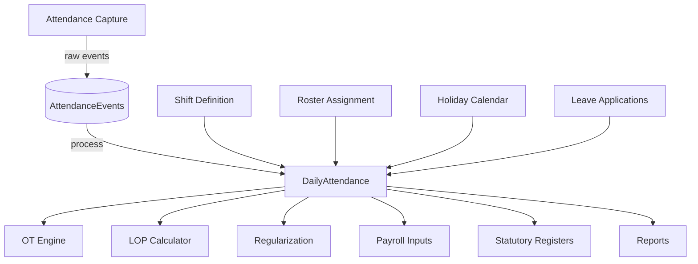

# 00 — Attendance & Leave Module Overview

## Purpose

The Attendance & Leave module captures when, where, and how long employees worked — and the time they didn't work, by entitlement or otherwise. This module is the input that drives:

- Payroll (LOP days, OT pay, attendance bonus)
- Statutory registers (muster roll, wage register under Wage Code)
- Compliance (Factories Act § 54 working hour limits, Maternity Benefit Act, ESI/PF eligibility based on worked days)
- Performance signals (chronic absenteeism, punctuality)
- Productivity analytics

Attendance is also where white-collar and blue-collar diverge most sharply. White-collar may submit a daily check-in via mobile; a factory worker punches a biometric four times a day across shifts that rotate weekly.

## Scope of this folder

`/02-attendance/` covers attendance capture, leave entitlements and applications, shifts and rosters, overtime, regularization, and statutory attendance registers.

**In scope:**

- Multi-mode attendance capture (web, mobile, biometric, RFID, kiosk, manual muster)
- Geo-fenced and geo-tagged attendance for field staff
- Shifts (fixed, rotating, split, night) with relay patterns for blue-collar
- Roster planning and publication
- Leave types: statutory (EL/PL, CL, SL, ML) and tenant-defined (compensatory, bereavement, sabbatical)
- Leave accrual engines (front-loaded, monthly, per-worked-day)
- Holiday calendars (national, state, optional, restricted)
- Overtime calculation (white-collar exempt, blue-collar at 2× under Factories Act § 59)
- Regularization workflow for missed punches and forgotten check-ins
- Attendance registers (Form A under Wage Code, Form 25 under Factories Act, Form B muster roll)

**Out of scope (handled elsewhere):**

- Pay calculation from attendance → `/03-payroll/`
- Performance rating influenced by attendance → `/06-performance/`
- Mobile UX for ESS attendance → `/07-ess-mobile/`
- Workflows (approvals, escalations) → `/08-workflow/`

## Files in this folder

1. [01-attendance-capture.md](./01-attendance-capture.md) — All capture methods, raw event schema, deduplication, late-arriving events
2. [02-shifts-and-rosters.md](./02-shifts-and-rosters.md) — Shift definitions, weekly off patterns, roster generation, swap/relay
3. [03-leave-types-and-policies.md](./03-leave-types-and-policies.md) — Leave catalog, tenant policies, applicability rules
4. [04-leave-accrual-engine.md](./04-leave-accrual-engine.md) — Accrual formulas (monthly, annual, per-worked-day), pro-ration, carry-forward
5. [05-overtime-engine.md](./05-overtime-engine.md) — OT eligibility, calculation rules, statutory caps, weekly off OT
6. [06-regularization-workflow.md](./06-regularization-workflow.md) — Missed punch correction, comp-off claim, on-duty marking
7. [07-statutory-attendance-registers.md](./07-statutory-attendance-registers.md) — Form A, Form B, Form 25, muster roll generation
8. [08-edge-cases.md](./08-edge-cases.md) — 30+ edge cases (DST, midnight crossover, two punches per shift, etc.)
9. [09-blue-collar-shift-patterns.md](./09-blue-collar-shift-patterns.md) — 3-shift rotation, relay, continuous process plants
10. [10-mobile-and-offline.md](./10-mobile-and-offline.md) — Offline punch buffering, geo-fencing, biometric on mobile

## Architectural position



The pipeline is:

1. **Raw events** are captured from various sources (web check-in, biometric, RFID).
2. Events are **processed** against the employee's shift, roster, leave, and holiday context to produce a **Daily Attendance** record per employee per day.
3. Daily records feed downstream consumers: payroll, OT engine, statutory registers, reports.

This separation matters because raw events are immutable (they are facts that occurred), while daily attendance is a derived state that may be recomputed when context changes (a shift was reassigned, a leave was retroactively approved, a regularization was filed).

## Daily attendance — the canonical record

The single most important entity in this module:

```typescript
interface DailyAttendance extends BaseDocument {
  _id: ObjectId;
  tenantId: ObjectId;
  entityId: ObjectId;
  employeeId: ObjectId;
  date: string;                            // YYYY-MM-DD calendar date

  // assigned context for the day
  assignedShiftId?: ObjectId;              // ref Shift
  assignedShiftCode?: string;              // 'S1', 'S2', 'NIGHT'
  isWeeklyOff: boolean;
  isHoliday: boolean;
  holidayType?: 'national' | 'gazetted' | 'optional' | 'restricted';
  holidayName?: string;

  // observed events (denormalized from AttendanceEvents)
  firstPunchAt?: Date;                     // first IN of the day
  lastPunchAt?: Date;                      // last OUT of the day
  punchPairs: PunchPair[];                 // in/out pairs; can be > 1 if breaks tracked
  totalWorkedMinutes: number;              // computed from pairs
  
  // derived status
  attendanceStatus: AttendanceStatus;
  attendanceStatusReason?: string;
  
  // leave / on-duty
  leaveApplicationId?: ObjectId;
  leaveType?: string;                      // 'EL', 'CL', 'SL', etc.
  leavePortion?: 'full-day' | 'first-half' | 'second-half';
  isOnDuty?: boolean;                      // outside office on official work
  isWfh?: boolean;
  
  // overtime
  otEligible: boolean;                     // based on employee.isExemptFromOvertime
  otMinutes?: number;
  otApprovalId?: ObjectId;
  otRate?: 'normal' | 'weekly-off' | 'holiday' | 'night';
  
  // regularization
  isRegularized: boolean;
  regularizationId?: ObjectId;
  regularizationReason?: string;

  // late / early
  lateMinutes?: number;                    // arrived after shift start
  earlyDepartureMinutes?: number;          // left before shift end
  graceUsed?: boolean;                     // tenant policy may grant grace minutes
  
  // half-day rule
  isHalfDay?: boolean;                     // e.g., worked < required hours
  
  // outputs flag
  contributesToLOP: boolean;               // does this day deduct from salary
  contributesToWorkedDays: boolean;        // for accrual / Factories Act

  // metadata
  createdAt: Date;
  updatedAt: Date;
  computedAt: Date;                        // last time derived fields were recomputed
  computedVersion: number;                 // bumps if context changes
  isDeleted: boolean;
}

type AttendanceStatus =
  | 'present'                              // worked the shift
  | 'absent'                               // didn't show, no leave
  | 'half-day'                             // worked partial
  | 'on-leave'                             // approved leave
  | 'on-duty'                              // outside but official
  | 'wfh'
  | 'weekly-off'                           // scheduled day off
  | 'holiday'                              // gazetted holiday
  | 'holiday-worked'                       // holiday but came in (eligible for special pay)
  | 'weekly-off-worked'                    // weekly off but came in (eligible for compensatory off / OT)
  | 'lop'                                  // unpaid absence
  | 'unknown'                              // no events, no leave; pending HR review
  | 'in-shift';                            // currently inside the shift (for live dashboard)

interface PunchPair {
  inAt: Date;
  outAt?: Date;                            // null if still inside / shift ended without out
  inSourceEventId: ObjectId;
  outSourceEventId?: ObjectId;
  breakMinutes?: number;                   // gap to next inAt if multi-pair
  durationMinutes?: number;                // outAt - inAt
}
```

`DailyAttendance` is recomputed on:

- New attendance event arrives
- Employee's shift assignment changes
- Leave is approved/rejected
- Regularization is approved
- Holiday calendar changes
- Manual override by HR

Recomputation is idempotent and uses the latest context. The `computedVersion` field increments on each recomputation.

## Multi-tenant rules engine reuse

Many statutory thresholds are referenced from this module:

- **Working hours per day:** 9 hours per Factories Act § 54 (with exceptions); 10.5 with OT cap
- **Working hours per week:** 48 hours per Factories Act § 51 (Wage Code retains)
- **Weekly off:** 1 day per week mandatory under Factories Act § 52, Shops Act per state
- **Spread-over:** 10.5 hours per Factories Act § 56 (limit on time elapsed including breaks)
- **OT rate:** 2× ordinary rate per Factories Act § 59
- **Min annual leave:** 1 day per 20 worked under Factories Act § 79; states differ for shops
- **Maternity Benefit:** 26 weeks paid per Maternity Benefit Act 1961 (amended 2017); 80 days qualifying period

These are stored in the statutory rules engine (`/00-foundations/06-statutory-rules-engine.md`) as `working-hours`, `weekly-off`, `overtime`, and `leave-statutory` rules. The attendance module reads them; it does not hard-code them.

## What changes when codes are notified

When the four Labour Codes are fully in force:

- **Code on Wages 2019** changes the definition of "wages" affecting OT base
- **OSH Code 2020** consolidates Factories Act + 12 other acts; some thresholds change
- **Industrial Relations Code 2020** changes Standing Orders thresholds (300 employees instead of 100 `[VERIFY]`)
- **Code on Social Security 2020** brings gig and platform workers into scope

The rules engine accommodates all of this with versioned rules. New rule versions activate on Code notification dates.

## Performance considerations

Attendance generates the highest event volume in the system:

- A 1,000-employee tenant: ~2,000 punch events per day × 250 working days = 500,000 events/year
- Most of these are auto-paired and become Daily Attendance records
- Daily attendance records: ~250,000 per year

Recommendations:
- AttendanceEvents collection sharded by `tenantId + date` chunk
- DailyAttendance pre-computed nightly (with on-demand recompute on context change)
- Reports aggregate from DailyAttendance (not raw events)
- Live dashboards (e.g., "who's in office now") use a separate cached view

## Cross-references

- [/00-foundations/05-data-model-conventions.md](../00-foundations/05-data-model-conventions.md) — event-sourced pattern (Pattern B)
- [/00-foundations/06-statutory-rules-engine.md](../00-foundations/06-statutory-rules-engine.md) — working hour rules
- [/01-employee/02-employment-record.md](../01-employee/02-employment-record.md) — `defaultShiftId`, `weeklyOffPattern`, `isExemptFromOvertime`
- [/03-payroll/04-pre-payroll-inputs.md](../03-payroll/04-pre-payroll-inputs.md) (Phase 3) — attendance flows into payroll
- [/04-compliance/12-statutory-registers.md](../04-compliance/12-statutory-registers.md) (Phase 3) — register generation
