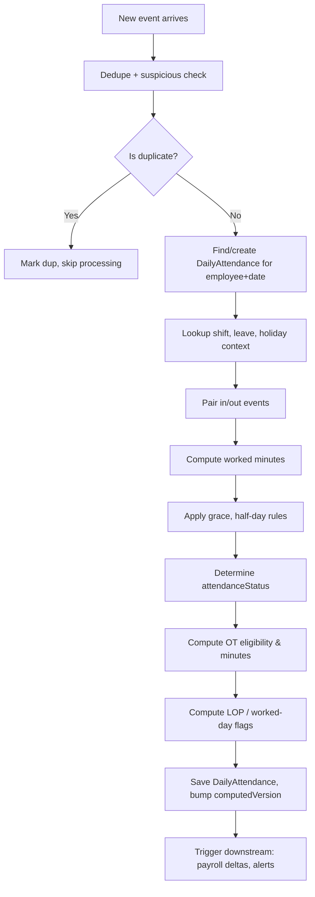

# 01 — Attendance Capture

## Purpose

Defines how attendance events enter the system from various sources, how they are stored as immutable raw events, deduplicated, and made available for daily attendance computation.

## Capture sources

| Source | Typical use | Trust level | Latency |
|---|---|---|---|
| Web check-in | White-collar, hybrid | Medium (geo-IP) | Real-time |
| Mobile app check-in | Field staff, hybrid | High (geo-fence + biometric optional) | Real-time |
| Biometric device (fingerprint / face / iris) | Factory, office gates | Highest | Near real-time (poll/push) |
| RFID / NFC card | Factory gates, smart card offices | High | Real-time |
| Kiosk (touchscreen) | Shop floor where workers don't have phones | Medium-High (PIN-based) | Real-time |
| Manual muster (supervisor entry) | Sites without devices | Low (signed by supervisor) | Daily/weekly batch |
| Excel/CSV upload | Bulk legacy entries, contractors | Medium (HR uploads) | Async |
| API integration | Time clock systems, third-party HR | Varies | Varies |
| WhatsApp bot | Field staff in low-connectivity areas | Medium | Async |
| IVR phone call | Drivers, field workers without smartphones | Medium | Real-time |
| QR scan (employee scans posted QR) | Site visits, multi-location field | Medium | Real-time |

A tenant typically uses 2-4 of these. Per-employee, per-location, or per-shift capture method is configurable.

## Raw event schema

Every attendance signal is stored as an immutable `AttendanceEvent` record. Daily attendance is derived; raw events are never mutated.

```typescript
interface AttendanceEvent extends BaseDocument {
  _id: ObjectId;
  tenantId: ObjectId;
  entityId: ObjectId;
  employeeId: ObjectId;

  // event details
  eventType: AttendanceEventType;
  occurredAt: Date;                        // wall-clock time of the event in employee's timezone
  occurredAtUtc: Date;                     // same instant in UTC for global queries
  timezone: string;                        // e.g., 'Asia/Kolkata'
  
  // source
  source: AttendanceSource;
  sourceDeviceId?: string;                 // biometric device serial, mobile device fingerprint
  sourceLocation?: {
    geo?: { lat: number; lng: number; accuracyMeters?: number };
    ipAddress?: string;
    geoFenceId?: ObjectId;                 // ref configured GeoFence
    geoFenceMatched?: boolean;             // was the punch within an allowed geo-fence
    distanceFromFenceMeters?: number;      // if outside, how far
    biometricVerified?: boolean;
    biometricScore?: number;               // 0-1 confidence
    photoCapturedDocumentId?: ObjectId;    // ref Document — selfie at punch
  };
  
  // raw payload (for debugging / audit)
  rawPayload?: any;                        // device-specific raw data
  
  // processing
  isProcessed: boolean;
  processedAt?: Date;
  dailyAttendanceId?: ObjectId;            // ref DailyAttendance after processing
  
  // duplicate / suspicious flags
  isDuplicate: boolean;
  duplicateOfEventId?: ObjectId;
  isSuspicious: boolean;
  suspiciousReasons?: string[];            // ['geo-fence-mismatch', 'rapid-double-punch', ...]
  
  // late arrival of event
  recordedAt: Date;                        // when the system received the event
  // if recordedAt - occurredAt > threshold, late-arriving event handling kicks in

  // context at event time (denormalized)
  shiftIdAtEvent?: ObjectId;               // employee's assigned shift at the moment
  
  // metadata
  createdAt: Date;
  createdBy?: ObjectId;                    // userId if entered manually
  isDeleted: boolean;                      // soft delete; events are usually never deleted
}

type AttendanceEventType =
  | 'punch-in'
  | 'punch-out'
  | 'break-start'
  | 'break-end'
  | 'on-duty-start'
  | 'on-duty-end'
  | 'wfh-start'
  | 'wfh-end'
  | 'shift-changeover'                     // for handover at relay
  | 'manual-mark-present'                  // supervisor marked
  | 'manual-mark-absent';

type AttendanceSource =
  | 'web'
  | 'mobile-android'
  | 'mobile-ios'
  | 'biometric-device'
  | 'rfid-reader'
  | 'kiosk'
  | 'manual-supervisor'
  | 'manual-hr'
  | 'csv-import'
  | 'api-integration'
  | 'whatsapp-bot'
  | 'ivr'
  | 'qr-scan';
```

## Indexes

```typescript
// primary lookup: per employee per day
{ tenantId: 1, employeeId: 1, occurredAt: -1 }

// processing pipeline
{ tenantId: 1, isProcessed: 1, occurredAt: 1 }

// device-level monitoring
{ tenantId: 1, sourceDeviceId: 1, occurredAt: -1 }

// duplicate detection (within a small time window)
{ tenantId: 1, employeeId: 1, eventType: 1, occurredAt: 1 }
```

## Deduplication

Multiple sources of duplicates:

1. **Same employee punches twice within seconds** (button press shudder, network retry)
2. **Same event arrives via two sources** (biometric + mobile redundancy)
3. **Device replay** (offline buffered events arrive after reconnection)
4. **Manual entry overlapping with auto-capture**

### Detection rules

```typescript
function isDuplicate(newEvent: AttendanceEvent, recentEvents: AttendanceEvent[]): {
  isDup: boolean; ofEventId?: ObjectId; reason?: string
} {
  // Rule 1: same employee + same eventType within DEDUPE_WINDOW seconds
  const DEDUPE_WINDOW_SECONDS = 30;          // [ASSUMPTION]
  const candidates = recentEvents.filter(e =>
    e.employeeId.equals(newEvent.employeeId) &&
    e.eventType === newEvent.eventType &&
    Math.abs(e.occurredAt.getTime() - newEvent.occurredAt.getTime()) < DEDUPE_WINDOW_SECONDS * 1000
  );
  if (candidates.length > 0) {
    return { isDup: true, ofEventId: candidates[0]._id, reason: 'same-event-within-window' };
  }
  
  // Rule 2: opposite event types within MIN_PUNCH_GAP (sanity check, not strict dup)
  // Don't mark as dup, but flag as suspicious
  
  return { isDup: false };
}
```

`[ASSUMPTION]` 30-second deduplication window. Tenant-configurable. Some setups need 5 seconds (high-throughput gate); others 2 minutes (slow biometric).

### Resolution

When a duplicate is detected:
- New event still stored with `isDuplicate=true, duplicateOfEventId=<original>`
- Audit trail preserved (don't lose the data)
- Daily computation uses only the original

## Suspicious event detection

Beyond duplicates, certain patterns trigger flags:

| Pattern | Reason flag |
|---|---|
| Punch-in followed by punch-in (no out between) | `unmatched-pair-in-in` |
| Punch-out without preceding in | `unmatched-pair-out-only` |
| Geo-coordinate outside allowed fence | `geo-fence-mismatch` |
| Biometric confidence below threshold | `low-biometric-score` |
| Device serial unrecognized | `unknown-device` |
| Punch from IP that doesn't match office subnet | `ip-mismatch` |
| Punch faster than 30s after previous | `rapid-double-punch` |
| Punch when employee is on approved leave | `punch-during-leave` |
| Punch outside any defined shift window | `outside-shift-window` |
| Same person punches at two locations within minutes | `geographically-impossible` |

Suspicious events are still stored (for audit). Resolution:

- Event proceeds through normal processing
- A flag is raised in the HR review queue
- HR can mark resolved (legitimate), invalid (set isDeleted), or trigger investigation

## Late-arriving events

A biometric device offline for 4 hours flushes events on reconnect. Mobile app submits buffered events from yesterday's field visit.

Spec rules:

1. `recordedAt` may be hours/days after `occurredAt`
2. Late events trigger recomputation of affected daily attendance
3. If the affected day's payroll has already locked, event is processed but flagged for retro
4. `lateArrivalThreshold = 5 minutes` `[ASSUMPTION]` — beyond this, event is flagged
5. Audit log entry per late event includes both timestamps

## Geo-fencing

A `GeoFence` is a configured polygon (or circle) representing a valid attendance location:

```typescript
interface GeoFence extends BaseDocument {
  _id: ObjectId;
  tenantId: ObjectId;
  entityId?: ObjectId;
  name: string;                            // 'Bangalore Office', 'Pune Plant Gate 3', 'Customer Site - ABC Pharma'
  type: 'circle' | 'polygon';
  center?: { lat: number; lng: number };   // for circle
  radiusMeters?: number;                   // for circle
  polygon?: { lat: number; lng: number }[]; // for polygon
  
  applicableTo?: {
    employeeIds?: ObjectId[];
    locationIds?: ObjectId[];
    employmentTypes?: string[];
    shiftIds?: ObjectId[];
  };
  
  isActive: boolean;
  toleranceMeters: number;                 // soft buffer; e.g., 50m allows GPS drift
  
  // policy when outside fence
  policyOnViolation: 'block' | 'allow-with-flag' | 'allow';
  
  createdAt: Date;
  updatedAt: Date;
  createdBy: ObjectId;
  isDeleted: boolean;
}
```

When a mobile/web punch arrives:
1. Look up applicable geo-fences for the employee
2. Compute distance from each fence boundary
3. If outside all applicable fences (including tolerance):
   - If `policyOnViolation = 'block'`: reject the punch with error to user
   - If `'allow-with-flag'`: accept but flag suspicious
   - If `'allow'`: accept silently

GPS accuracy varies (5m good, 50m typical, 200m poor in dense urban). Always include `accuracyMeters` from device; don't reject for being just outside if accuracy is poor.

## Biometric devices

Devices integrate via push (device → server) or pull (server polls device).

### Push integration (preferred)

Device makes outbound HTTP/HTTPS POST to a webhook:

```
POST https://api.hrms.example.com/v1/attendance/biometric-webhook
Authorization: Bearer <device-token>

{
  "deviceId": "ZK-ABC-001",
  "events": [
    {
      "userId": "EMP00042",                // device-side user code
      "eventType": "in",
      "timestamp": "2026-04-29T09:15:32+05:30",
      "verifyMode": "fingerprint",
      "score": 0.87
    }
  ]
}
```

The HRMS:
1. Validates the device token
2. Maps `deviceId + userId` to `tenantId + employeeId`
3. Creates AttendanceEvent records
4. Returns success/failure per event

### Device user mapping

Each biometric device has a local user database (template + ID). HRMS maintains:

```typescript
interface BiometricDeviceMapping extends BaseDocument {
  _id: ObjectId;
  tenantId: ObjectId;
  entityId: ObjectId;
  deviceId: string;                        // serial / asset tag
  deviceName: string;
  deviceModel: string;                     // 'ZKTeco K20', 'Mantra MFS100'
  manufacturer: string;
  
  installedAt: ObjectId;                   // ref Location
  ipAddress?: string;
  pollPort?: number;                       // for pull integrations
  webhookSecret?: EncryptedString;
  
  userMappings: {                          // device userId → employeeId
    deviceUserId: string;
    employeeId: ObjectId;
    enrollmentTemplateHash?: string;       // not the template itself; just hash for sync detection
    enrolledAt?: Date;
  }[];
  
  lastHeartbeatAt?: Date;
  status: 'active' | 'offline' | 'maintenance' | 'decommissioned';
  
  createdAt: Date;
  updatedAt: Date;
  createdBy: ObjectId;
  isDeleted: boolean;
}
```

`[BLUE-COLLAR]` Biometric template enrollment is sensitive — UIDAI guidelines apply if Aadhaar-linked. The HRMS does NOT store fingerprint templates centrally; each device manages its own templates. The HRMS only stores `(deviceUserId, employeeId)` mappings.

### Common device protocols

- ZKTeco / Realtime / Essl: proprietary TCP protocols, often supported by middleware
- Suprema / Mantra: HTTPS REST API
- Many devices speak Wiegand/RS-232 to a controller; controller speaks to HRMS

`[v1]` Support push webhooks from major Indian device manufacturers (ZKTeco, Realtime, Mantra, Essl) via a normalized adapter. Other brands via CSV import or partner middleware.

## Mobile capture

```mermaid
sequenceDiagram
    actor Employee
    participant App as Mobile App
    participant Local as Device Storage
    participant API
    participant DB

    Employee->>App: tap "Check In"
    App->>App: get GPS, check geo-fence locally if known
    App->>App: optional: face/fingerprint via OS biometric
    
    alt Online
        App->>API: POST /attendance/event
        API->>DB: store AttendanceEvent
        API-->>App: success
    else Offline
        App->>Local: queue event with timestamp
        Local-->>App: queued
        Note over App: when online again
        App->>API: POST /attendance/event-batch (queued events)
        API->>DB: store events; mark late-arriving
        API-->>App: success
    end
```

Detailed in [10-mobile-and-offline.md](./10-mobile-and-offline.md).

## Manual entry

HR or supervisor enters attendance after the fact. UI:

- Per-employee daily attendance edit
- Bulk supervisor muster (mark 50 workers present in one screen)
- Excel/CSV upload (template-based)

Each manual entry creates an AttendanceEvent with:
- `source = 'manual-supervisor' | 'manual-hr' | 'csv-import'`
- `createdBy = userId`
- `recordedAt = now`
- `occurredAt = the historical time being claimed`

Manual entries are heavily audited. Bulk uploads are atomic per batch with full audit trail.

## Validation rules

| Field | Rule |
|---|---|
| `occurredAt` | Cannot be in future (with 5-minute tolerance for clock skew) |
| `occurredAt` | Cannot be > 90 days in past unless explicit "backdated" flag with HR Manager approval |
| `employeeId` | Must be active or in pre-joining (events for terminated employees are blocked) |
| `eventType` | Must be one of allowed types per source (e.g., 'manual-mark-absent' only via HR) |
| `sourceLocation.geo` | Required for mobile sources; optional for biometric (device knows location) |
| `recordedAt - occurredAt` | If > 24 hours, late-arriving flag set |

## Audit and compliance hooks

- Every event creates an audit log entry (lightweight: just the fact of creation)
- Suspicious events trigger HR review queue
- Manual entries by HR are heavily audited (who, why, what changed)
- Bulk imports include batch ID for traceability

## Data retention

Raw AttendanceEvents retained for:
- 7 years (matches Income Tax Act § 230 retention for payroll evidence)
- Cold storage for events > 1 year old
- Daily aggregates retained indefinitely (small footprint)

## Output: Daily Attendance computation

The processing pipeline reads raw events and produces `DailyAttendance`:



Detailed pairing logic in next file.

## Cross-references

- [02-shifts-and-rosters.md](./02-shifts-and-rosters.md) — shift context for events
- [03-leave-types-and-policies.md](./03-leave-types-and-policies.md) — leave overrides events
- [05-overtime-engine.md](./05-overtime-engine.md) — OT computation from worked minutes
- [06-regularization-workflow.md](./06-regularization-workflow.md) — fixing missed punches
- [10-mobile-and-offline.md](./10-mobile-and-offline.md) — offline buffering
- [/00-foundations/04-audit-and-compliance-hooks.md](../00-foundations/04-audit-and-compliance-hooks.md) — audit
