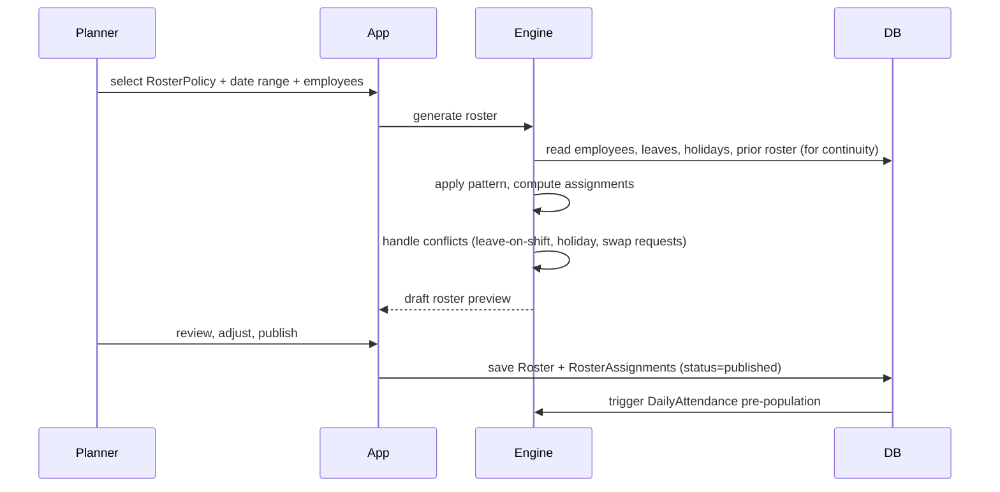

# 02 — Shifts & Rosters

## Purpose

A **shift** defines a window of expected work (start time, end time, breaks, grace, OT thresholds). A **roster** is the assignment of shifts to employees over a time period.

White-collar employees often have a single default shift (9–6 with 1 hour lunch). Blue-collar workers in continuous-process plants rotate through three shifts every week, with weekly offs that shift accordingly. The roster engine must handle both cleanly.

## Shift schema

```typescript
interface Shift extends BaseDocument {
  _id: ObjectId;
  tenantId: ObjectId;
  entityId: ObjectId;
  
  // identity
  shiftCode: string;                       // 'S1', 'S2', 'NIGHT', 'GENERAL'
  name: string;                            // 'First Shift Morning'
  description?: string;
  
  // timing (local time)
  startTime: string;                       // 'HH:mm' in 24h format, e.g., '06:00'
  endTime: string;                         // 'HH:mm', e.g., '14:00'
  crossesMidnight: boolean;                // true if endTime <= startTime
  totalMinutes: number;                    // computed: minutes between start and end
  
  // breaks
  breaks: ShiftBreak[];
  totalBreakMinutes: number;
  netWorkingMinutes: number;               // total - breaks
  
  // grace
  graceMinutesIn: number;                  // late arrival tolerance
  graceMinutesOut: number;                 // early departure tolerance
  
  // late / early policies
  lateArrivalPolicy: {
    afterGraceCountAs: 'late' | 'half-day' | 'absent';
    multipleLatesPolicy?: {
      lateCountThreshold: number;          // e.g., 3 lates in a month
      consequence: 'half-day' | 'lop' | 'warning';
    };
  };
  earlyDeparturePolicy: {
    beforeMinHoursCountAs: 'early-mark' | 'half-day' | 'absent';
    minimumWorkMinutesForFullDay: number;  // e.g., 480 for 8-hour minimum
    minimumWorkMinutesForHalfDay: number;  // e.g., 240
  };
  
  // OT
  otApplicableAfterMinutes: number;        // OT starts after this much work; usually netWorkingMinutes
  maxOtMinutesPerDay: number;              // statutory cap; 120 in most states under Factories Act
  otRate: 'normal' | 'double' | 'tenant-config';
  
  // shift type
  shiftType: 'fixed' | 'flexible' | 'split' | 'continuous';
  isNightShift: boolean;                   // night-shift allowance applies
  
  // applicable to
  applicableTo?: {
    employmentTypes?: string[];
    locationIds?: ObjectId[];
    departments?: ObjectId[];
  };
  
  // metadata
  isActive: boolean;
  effectiveFrom: Date;
  effectiveTo?: Date;                      // for shift policy versioning
  
  createdAt: Date;
  updatedAt: Date;
  createdBy: ObjectId;
  isDeleted: boolean;
}

interface ShiftBreak {
  _id: ObjectId;
  name: string;                            // 'Lunch', 'Tea Break 1'
  startTime: string;                       // 'HH:mm' relative to shift, e.g., '12:30'
  endTime: string;                         // 'HH:mm'
  durationMinutes: number;
  isPaid: boolean;                         // is this break paid time
  isMandatory: boolean;                    // statutory or hard rule
  trackPunch: boolean;                     // are employees expected to punch out/in for break
}
```

### Common shift examples

```typescript
// White-collar general shift
{
  shiftCode: 'GEN',
  name: 'General Shift',
  startTime: '09:00', endTime: '18:00',
  breaks: [{ name: 'Lunch', startTime: '13:00', endTime: '14:00', durationMinutes: 60, isPaid: false, isMandatory: false, trackPunch: false }],
  totalMinutes: 540, totalBreakMinutes: 60, netWorkingMinutes: 480,
  graceMinutesIn: 15, graceMinutesOut: 15,
  shiftType: 'fixed', isNightShift: false,
  otApplicableAfterMinutes: 540,           // OT starts after 9 hours
}

// Factory first shift
{
  shiftCode: 'S1',
  name: 'First Shift',
  startTime: '06:00', endTime: '14:00',
  breaks: [{ name: 'Tea', startTime: '08:30', endTime: '08:45', durationMinutes: 15, isPaid: true, isMandatory: true, trackPunch: false },
           { name: 'Lunch', startTime: '11:00', endTime: '11:30', durationMinutes: 30, isPaid: false, isMandatory: true, trackPunch: true }],
  totalMinutes: 480, totalBreakMinutes: 45, netWorkingMinutes: 435,
  graceMinutesIn: 5, graceMinutesOut: 0,
  shiftType: 'fixed', isNightShift: false,
  otApplicableAfterMinutes: 480, maxOtMinutesPerDay: 120,
}

// Factory night shift
{
  shiftCode: 'S3', name: 'Night Shift',
  startTime: '22:00', endTime: '06:00', crossesMidnight: true,
  totalMinutes: 480, isNightShift: true,
  // ...
}

// Split shift (retail)
{
  shiftCode: 'SPLIT',
  name: 'Lunch + Dinner Split',
  startTime: '11:00', endTime: '22:00',
  breaks: [{ name: 'Afternoon Break', startTime: '15:00', endTime: '18:00', durationMinutes: 180, isPaid: false, isMandatory: true, trackPunch: true }],
  totalMinutes: 660, totalBreakMinutes: 180, netWorkingMinutes: 480,
  shiftType: 'split',
}
```

## Cross-midnight shifts

A shift starting at 22:00 and ending at 06:00 spans two calendar dates. Convention:

- The shift "belongs" to the calendar date on which it **starts**
- A punch-in at 22:00 on April 29 and punch-out at 06:00 on April 30 produces a single DailyAttendance for April 29

This convention matters for:
- Statutory registers (Form A wage register reports per calendar day)
- Salary calculation (which day is paid)
- Leave overlaps (if employee takes leave on April 30, is the night shift covered?)

`[ASSUMPTION]` Night shift "belongs" to start date. Tenant config can override.

## Shift assignment

Three levels of assignment:

1. **Default shift** on `EmploymentRecord.defaultShiftId` — applies if nothing else
2. **Roster assignment** — explicit per-day shift assignment (overrides default)
3. **Manual override** — HR or supervisor sets shift for a specific date

### Roster schema

```typescript
interface Roster extends BaseDocument {
  _id: ObjectId;
  tenantId: ObjectId;
  entityId: ObjectId;
  
  // scope
  name: string;                            // 'Production Floor April 2026'
  rosterPolicyId?: ObjectId;               // ref RosterPolicy if generated from policy
  
  startDate: string;                       // YYYY-MM-DD
  endDate: string;
  
  // status
  status: 'draft' | 'published' | 'archived';
  publishedAt?: Date;
  publishedBy?: ObjectId;
  
  // assignments
  // Stored normalized in RosterAssignment collection
  
  metadata: {
    totalEmployees: number;
    totalDays: number;
    totalShiftSlots: number;
  };
  
  createdAt: Date;
  updatedAt: Date;
  createdBy: ObjectId;
  isDeleted: boolean;
}

interface RosterAssignment extends BaseDocument {
  _id: ObjectId;
  tenantId: ObjectId;
  entityId: ObjectId;
  rosterId: ObjectId;
  employeeId: ObjectId;
  date: string;                            // YYYY-MM-DD
  
  shiftId?: ObjectId;                      // null means weekly off / leave / holiday
  isWeeklyOff: boolean;
  isHoliday: boolean;
  
  // override fields
  isManuallyOverridden: boolean;
  manualOverrideReason?: string;
  overriddenBy?: ObjectId;
  overriddenAt?: Date;
  
  // swap tracking
  isSwapped: boolean;
  swappedWithEmployeeId?: ObjectId;
  swapApprovalId?: ObjectId;
  
  createdAt: Date;
  updatedAt: Date;
  isDeleted: boolean;
}
```

### Indexes

```typescript
{ tenantId: 1, entityId: 1, employeeId: 1, date: 1 }, unique
{ tenantId: 1, rosterId: 1, date: 1 }
{ tenantId: 1, entityId: 1, date: 1, shiftId: 1 }   // for shift-wise headcount
```

## Roster policies (templates)

Common patterns used in factories and 24/7 operations:

### Pattern 1: Single fixed shift

White-collar default. Same shift every working day. Weekly off Saturday + Sunday or just Sunday.

### Pattern 2: 3-shift rotation (weekly)

Three shifts (S1: 06-14, S2: 14-22, S3: 22-06). Workers rotate weekly:
- Week 1: S1
- Week 2: S2
- Week 3: S3
- Repeat

```typescript
interface RosterPolicy extends BaseDocument {
  _id: ObjectId;
  tenantId: ObjectId;
  entityId: ObjectId;
  
  name: string;
  patternType: 'fixed' | 'rotating' | 'panama' | 'dupont' | 'custom';
  
  shifts: ObjectId[];                      // ordered list of shifts in rotation
  cycleDays: number;                       // total days in the rotation cycle
  
  pattern: RosterPatternDay[];
  
  // for rotating
  rotationDirection: 'forward' | 'backward';
  rotationFrequency: 'weekly' | 'monthly' | 'fortnightly' | 'cycle-end';
  
  // weekly off rule
  weeklyOffPattern: {
    type: 'fixed-day' | 'rotating' | 'after-shifts-worked';
    fixedDayOfWeek?: number;               // 0=Sunday
    afterShiftsWorked?: number;            // e.g., off after 6 consecutive shifts
  };
  
  // applicable to
  applicableTo?: {
    departments?: ObjectId[];
    locations?: ObjectId[];
    employeeIds?: ObjectId[];
  };
  
  isActive: boolean;
  
  createdAt: Date;
  updatedAt: Date;
  createdBy: ObjectId;
  isDeleted: boolean;
}

interface RosterPatternDay {
  dayIndex: number;                        // 0 to cycleDays-1
  shiftId?: ObjectId;
  isWeeklyOff: boolean;
}
```

### Pattern 3: Panama / 2-2-3

Common in continuous operations:
- Day 1-2: work
- Day 3-4: off
- Day 5-7: work
- Day 8-9: off
- Day 10-12: work
- Day 13-14: off
- 14-day cycle, alternating day/night each cycle

### Pattern 4: DuPont

12-hour shifts:
- 4 days on day shift, 3 days off
- 3 days on night shift, 1 day off
- 3 days on day shift, 3 days off
- 4 days on night shift, 7 days off
- 28-day cycle

`[VERIFY]` Various sources differ slightly on DuPont. Tenant configures actual pattern.

### Pattern 5: Continental

3-3-3 rotation common in European-influenced plants.

## Roster generation



### Generation logic

```typescript
function generateRoster(policy: RosterPolicy, startDate: string, endDate: string,
                       employeeIds: ObjectId[]): Roster {
  const assignments: RosterAssignment[] = [];
  for (const employeeId of employeeIds) {
    const employee = await Employee.findById(employeeId);
    const previousAssignment = await getMostRecentAssignment(employeeId, startDate);
    let cycleOffset = computeOffset(previousAssignment, startDate, policy);
    
    for (let date = startDate; date <= endDate; date = nextDay(date)) {
      const dayInCycle = (cycleOffset + daysBetween(startDate, date)) % policy.cycleDays;
      const patternDay = policy.pattern.find(p => p.dayIndex === dayInCycle);
      
      // Check holiday
      const isHoliday = await isHolidayForEmployee(employeeId, date);
      
      // Check pre-approved leave
      const onLeave = await isOnApprovedLeave(employeeId, date);
      
      assignments.push({
        rosterId, employeeId, date,
        shiftId: onLeave || isHoliday ? null : patternDay.shiftId,
        isWeeklyOff: patternDay.isWeeklyOff,
        isHoliday,
      });
    }
  }
  return { rosterId, assignments };
}
```

### Conflict handling

| Conflict | Default resolution |
|---|---|
| Holiday falls on assigned shift day | Mark `isHoliday=true`; shift expectation cleared |
| Pre-approved leave on assigned shift day | shiftId stays (for register), but DailyAttendance reflects leave |
| Employee resigned mid-roster period | Assignments after lastWorkingDay marked inactive |
| Manager swap request approved post-publish | Update both assignments with `isSwapped` flag |
| Employee transferred mid-roster | Source-entity assignments end at transfer date |

## Shift swap

Employees may request to swap shifts with another employee:

```typescript
interface ShiftSwapRequest extends BaseDocument {
  _id: ObjectId;
  tenantId: ObjectId;
  entityId: ObjectId;
  
  requesterEmployeeId: ObjectId;
  requesterDate: string;
  requesterShiftId: ObjectId;
  
  swapWithEmployeeId: ObjectId;
  swapWithDate: string;                    // can differ — A wants Mon's shift to go to B; B's Tue shift to A
  swapWithShiftId: ObjectId;
  
  reason: string;
  status: 'pending-counterparty' | 'pending-supervisor' | 'pending-hr' | 'approved' | 'rejected' | 'cancelled';
  
  counterpartyConsentedAt?: Date;
  supervisorApprovalId?: ObjectId;
  hrApprovalId?: ObjectId;
  
  // execution
  executedAt?: Date;
  rosterAssignmentChangesApplied: boolean;
  
  createdAt: Date;
  updatedAt: Date;
  isDeleted: boolean;
}
```

Swap rules:
1. Both employees must consent
2. Both must be qualified for the other's shift (skill match — relevant in factory)
3. Swap must not violate working-hour limits (e.g., back-to-back night shifts)
4. Swap must not create weekly-off violations
5. Statutory caps apply post-swap

## Weekly off rules

Per Factories Act § 52: every adult worker shall have one day off per week. The day shall be Sunday or substituted if Sunday is required to be worked.

Per Shops & Establishments Acts (state-specific): typically 1 day per week off, often Sunday.

The HRMS supports:

- Fixed day (Sunday by default, configurable per state)
- Rotating weekly off (different employees off different days — common in retail / 24/7 ops)
- Compensatory off when employee works on weekly off (must be granted within statutory window)

```typescript
interface WeeklyOffPolicy {
  type: 'fixed' | 'rotating' | 'consecutive-shifts';
  fixedDayOfWeek?: number;                 // 0=Sun
  
  // for rotating
  rotationGroups?: { groupId: string; offDayOfWeek: number; employeeIds: ObjectId[] }[];
  
  // for consecutive-shifts (e.g., Panama: off after 4 work days)
  workDaysBeforeOff?: number;
  consecutiveOffDays?: number;
  
  // policy when worked on weekly off
  workOnWeeklyOff: {
    isAllowed: boolean;
    requiresApproval: boolean;
    grantsCompOff: boolean;
    compOffMustBeAvailedWithinDays: number;  // statutory: typically 30 [VERIFY]
    payAtOtRate: boolean;                  // alternative to comp-off
  };
}
```

## Holiday calendars

Two levels:

- **System level:** national holidays (Republic Day Jan 26, Independence Day Aug 15, Gandhi Jayanti Oct 2) plus per-state gazetted holidays (state-specific)
- **Tenant level:** tenant-defined holidays (e.g., founder's day, optional festival), and overrides of state holidays

```typescript
interface Holiday extends BaseDocument {
  _id: ObjectId;
  tenantId?: ObjectId;                     // null = system-level
  entityId?: ObjectId;
  
  date: string;                            // YYYY-MM-DD
  name: string;                            // 'Diwali', 'Republic Day'
  type: 'national' | 'gazetted-state' | 'optional' | 'restricted' | 'tenant-defined';
  
  applicableTo?: {
    states?: StateCode[];                  // for state holidays
    locationIds?: ObjectId[];
    departments?: ObjectId[];
    religions?: string[];                  // for restricted holidays
  };
  
  // optional holiday: employees can choose
  isOptional: boolean;
  optionalSelectionRequired: boolean;
  optionalGroupId?: string;                // group of optionals; e.g., choose 2 out of 5
  
  isActive: boolean;
  
  createdAt: Date;
  updatedAt: Date;
  createdBy: ObjectId;
  isDeleted: boolean;
}
```

`[BLUE-COLLAR]` Factory holidays often include Independence Day, Republic Day, Gandhi Jayanti as paid holidays plus state festival list. Working on these = OT at higher rate.

`[WHITE-COLLAR]` Office holidays similar but optional festivals more common.

## Outputs from this module

The shift + roster + holiday context feeds:

- DailyAttendance pre-population
- Statutory wage register (Form A) — needs per-day expected work
- Muster roll (Form B) — needs per-day expected presence
- Headcount-by-shift dashboards
- Manager team views
- Mobile app shift schedule for employees

## Open questions

`[OPEN]` Should we support **flexible shifts** in v1 — employee chooses start time within a window? Many tech companies use this. Recommended: yes, simple form (window 8–10am start, fixed 9 hours).

`[OPEN]` Auto-publish roster vs require manual publish? Recommended: draft → manual publish. Auto-publish risks accidentally pushing wrong rosters.

`[OPEN]` How long ahead can rosters be published? Some plants publish 6 months ahead; some 2 weeks. Tenant config: 30 days default, max 180.

`[OPEN]` Roster locking during published period — can supervisor still edit? Recommended: yes with audit trail. After 7 days post-event, edits require HR approval.

`[OPEN]` Do we support roster import from external systems (e.g., Kronos, Quinyx)? Yes via CSV in v1; API in v2.

`[OPEN]` Multi-shift in one day (e.g., split shift with morning + evening)? Schema supports `shiftType=split`. Roster engine needs to handle correctly.

## Cross-references

- [01-attendance-capture.md](./01-attendance-capture.md) — events evaluated against shift
- [05-overtime-engine.md](./05-overtime-engine.md) — OT computed against shift's netWorkingMinutes
- [09-blue-collar-shift-patterns.md](./09-blue-collar-shift-patterns.md) — detailed Panama/DuPont
- [/01-employee/02-employment-record.md](../01-employee/02-employment-record.md) — `defaultShiftId` and `rosterPolicyId`
