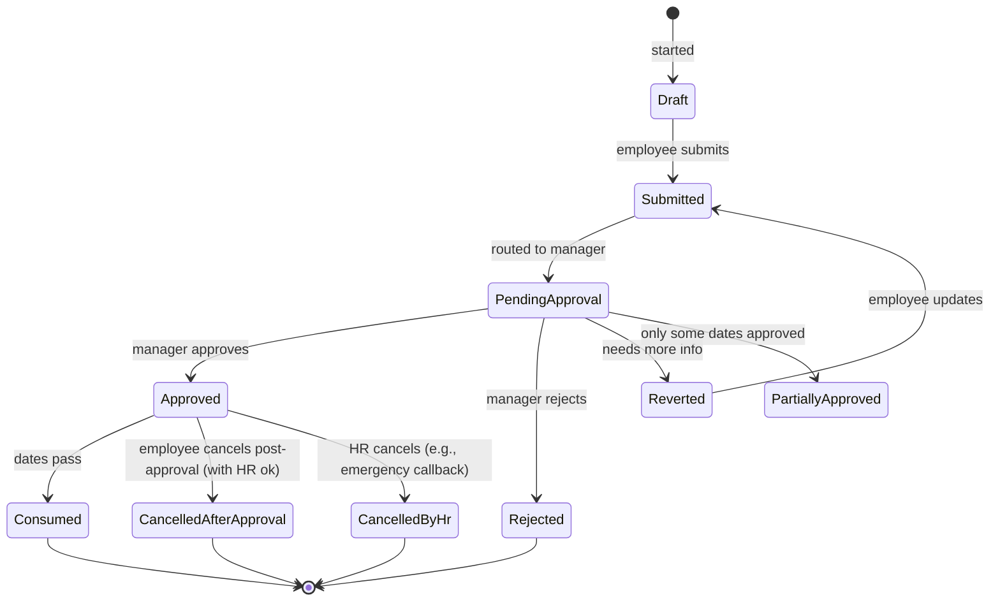

# 03 — Leave Types & Policies

## Purpose

Defines the catalog of leave types, how a tenant configures policies around them, and how policies map to employees based on entity, location, employment type, and gender.

This is one of the trickier modules because India has both statutory leave (mandated by law per state and category) and customary leave (offered by employer).

## Leave types — the canonical catalog

The system ships with a fixed set of leave **types**. Tenants enable, configure, and rename them; they cannot create new type primitives.

| Type code | Display name | Category | Statutory basis |
|---|---|---|---|
| `EL` | Earned Leave / Privilege Leave | accrued | Shops Act per state, Factories Act § 79 |
| `CL` | Casual Leave | accrued | Shops Act per state |
| `SL` | Sick Leave | accrued | Shops Act per state, Factories Rules |
| `ML` | Maternity Leave | event | Maternity Benefit Act 1961 (amended 2017) — 26 weeks |
| `PL_PATERNITY` | Paternity Leave | event | No central statute; some states + companies offer |
| `BL` | Bereavement Leave | event | Tenant-defined |
| `MARRIAGE` | Marriage Leave | event | Tenant-defined |
| `COMP_OFF` | Compensatory Off | balance | Granted for working on holidays / weekly off |
| `LWP` / `LOP` | Leave Without Pay | unpaid | Used when paid leave exhausted |
| `SABBATICAL` | Sabbatical | unpaid | Tenant-defined |
| `STUDY_LEAVE` | Study Leave | varies | Tenant-defined |
| `MISCARRIAGE_LEAVE` | Miscarriage Leave | event | Maternity Benefit Act § 9 — 6 weeks |
| `ADOPTION_LEAVE` | Adoption Leave | event | Maternity Benefit Act 2017 — 12 weeks for legally adopted child < 3 months |
| `COMMISSIONING_LEAVE` | Commissioning Leave (surrogacy) | event | Maternity Benefit Act 2017 — 12 weeks |
| `TUBECTOMY` | Tubectomy Leave | event | Maternity Benefit Act § 9A — 2 weeks |
| `MENSTRUAL_LEAVE` | Menstrual Leave | accrued | No central statute; some states + companies offer |
| `WORK_FROM_HOME` | Work From Home | not-leave | Tenant-defined; some treat as leave-equivalent |
| `ON_DUTY` | On Duty (working but offsite) | not-leave | Standard category |
| `QUARANTINE_LEAVE` | Quarantine Leave | event | Tenant-defined; was relevant during COVID |
| `CHILD_CARE` | Child Care Leave | accrued | Tenant-defined; some PSUs / large companies offer |
| `RESTRICTED_HOLIDAY` | Restricted Holiday | event | Tenant-defined optional holidays |

A tenant can:
- Disable types they don't offer (e.g., no menstrual leave)
- Rename for display ("EL" → "Annual Leave")
- Configure accrual / accumulation / encashment per type

A tenant cannot:
- Add new leave **types** (the type codes are platform-level for cross-tenant analytics + statutory mapping)
- Override statutory minimum entitlements

`[OPEN]` Should we allow custom tenant-defined leave types beyond this catalog? Risk: hard to map to statutory registers. Recommendation: allow with `customLeaveType` flag, but display in registers as "Other" with notes.

## Leave policy schema

Each tenant configures a `LeavePolicy` per leave type per scope:

```typescript
interface LeavePolicy extends BaseDocument {
  _id: ObjectId;
  tenantId: ObjectId;
  entityId?: ObjectId;                     // null = tenant-wide
  
  leaveTypeCode: string;                   // 'EL', 'CL', etc.
  policyName: string;                      // 'Standard EL Policy 2026'
  
  // applicability scope
  applicableTo: {
    employeeCategories?: ('white-collar' | 'blue-collar')[];
    employmentTypes?: string[];
    departments?: ObjectId[];
    locations?: ObjectId[];
    designationLevels?: string[];
    states?: StateCode[];                  // for state-specific (Shops Act)
    genders?: ('male' | 'female' | 'other')[];     // for ML, PL
    minServiceMonths?: number;             // e.g., ML requires 80 days qualifying service
  };
  
  // entitlement
  entitlement: {
    method: 'annual-fixed' | 'monthly-accrued' | 'per-worked-days' | 'event-based' | 'unlimited';
    
    // for annual-fixed (e.g., 21 days EL/year)
    annualDays?: number;
    
    // for monthly-accrued (1.75 days/month → 21/year)
    monthlyAccrualDays?: number;
    accrualBasis?: 'calendar-month' | 'completed-month' | 'on-payroll-process';
    
    // for per-worked-days (Factories Act: 1 day per 20 worked)
    workedDaysPerLeaveDay?: number;
    
    // for event-based (ML: 26 weeks per event)
    daysPerEvent?: number;
    maxEventsPerLifetime?: number;
    maxEventsPerYear?: number;
    eligibilityRules?: {
      minWorkingDaysPriorToEvent?: number; // ML: 80 days in last 12 months
      ageRange?: { min?: number; max?: number };
    };
    
    // pro-ration on join / leave
    proRationOnJoin: 'per-day' | 'per-month' | 'none';
    proRationOnExit: 'per-day' | 'per-month' | 'none';
  };
  
  // accumulation rules
  accumulation: {
    canCarryForward: boolean;
    carryForwardCap?: number;              // max balance after year-end
    carryForwardExpiry?: 'never' | 'after-months' | 'fy-end';
    carryForwardExpiryMonths?: number;
    maxCumulativeBalance?: number;         // hard cap; e.g., 60 days EL accumulation
    leftoverPolicy?: 'lapse' | 'encash' | 'forfeit';
  };
  
  // encashment
  encashment: {
    allowed: boolean;
    onlyOn?: ('exit' | 'fy-end' | 'on-request')[];
    minBalanceBeforeEncashment?: number;   // can only encash above this
    maxDaysPerEncashment?: number;
    encashmentRate: 'basic+da' | 'basic-only' | 'gross' | 'tenant-config';
    eligibilityServiceMonths?: number;     // e.g., must have 12+ months service
  };
  
  // application rules
  applicationRules: {
    minDaysAdvance?: number;               // must apply N days before
    maxDaysAdvance?: number;               // cannot apply >N days ahead
    minLeaveDuration?: number;             // e.g., min 0.5 day
    maxLeaveDurationPerApplication?: number;
    canApplyHalfDay: boolean;
    canApplyHourlyLeave: boolean;          // [v2 mostly] hourly leave
    canBackdate: boolean;
    backdateMaxDays?: number;
    requiresMedicalCert?: boolean;         // SL > 3 days typical [VERIFY]
    medicalCertRequiredAfterDays?: number;
    requiresHrApproval: boolean;           // beyond manager
    requiresGrandparentApproval?: boolean; // skip-level (matrix)
    consecutiveBlockingPolicy?: {          // can't apply same type again right away
      mustHaveDaysBetween?: number;
    };
  };
  
  // overlapping rules
  overlapPolicy: {
    canOverlapWeeklyOff: boolean;          // counts weekly off in middle as leave?
    canOverlapHoliday: boolean;
    sandwichRule?: 'count-bridging-days' | 'do-not-count';
    // sandwich: if EL Mon + Wed but Tue is holiday, do we count Tue as EL too (sandwich rule)?
  };
  
  // pay rules
  payRules: {
    isPaid: boolean;
    payPercentage: number;                 // 1.0 = 100%; some policies pay reduced
    paymentTiming: 'with-payroll' | 'separate' | 'on-availment';
    affectsPfWages: boolean;
    affectsEsiWages: boolean;
    countsForGratuityService: boolean;     // typically yes for paid leave
    countsForBonusEligibility: boolean;
  };
  
  // statutory tagging
  statutoryRefs: {
    actName?: string;
    section?: string;
    minimumEntitlementDays?: number;       // statute floor
  };
  
  // status
  isActive: boolean;
  effectiveFrom: Date;
  effectiveTo?: Date;
  
  createdAt: Date;
  updatedAt: Date;
  createdBy: ObjectId;
  isDeleted: boolean;
}
```

Indexes:

```typescript
{ tenantId: 1, leaveTypeCode: 1, isActive: 1 }
{ tenantId: 1, entityId: 1, leaveTypeCode: 1, isActive: 1 }
{ tenantId: 1, effectiveFrom: 1, effectiveTo: 1 }
```

## Policy resolution

When determining "what's the EL policy for employee X on date D?":

1. Find all `LeavePolicy` records where:
   - `tenantId` matches
   - `entityId` matches OR is null
   - `leaveTypeCode = 'EL'`
   - `effectiveFrom <= D <= (effectiveTo OR now)`
   - `isActive = true`
2. Filter by employee attributes (category, employmentType, department, location, state, gender, service)
3. If multiple match (entity-specific + tenant-wide), prefer most specific (entity > tenant; specific filters > broad)
4. Return resolved policy

The resolution result is cached per (employee, leaveType, date) for performance. Cache invalidates on policy change or employee scope change.

## Common policy examples

### Standard EL — white-collar IT services

```yaml
leaveTypeCode: EL
applicableTo: { employeeCategories: [white-collar], states: [KA, MH, TN, ...] }
entitlement:
  method: monthly-accrued
  monthlyAccrualDays: 1.75
  accrualBasis: completed-month
  proRationOnJoin: per-day
  proRationOnExit: per-day
accumulation:
  canCarryForward: true
  carryForwardCap: 45
  carryForwardExpiry: never
  maxCumulativeBalance: 60
  leftoverPolicy: encash
encashment:
  allowed: true
  onlyOn: [exit, fy-end]
  encashmentRate: basic-only
applicationRules:
  minDaysAdvance: 5
  canApplyHalfDay: true
  canBackdate: true
  backdateMaxDays: 7
overlapPolicy:
  canOverlapWeeklyOff: false
  canOverlapHoliday: false
  sandwichRule: do-not-count
payRules:
  isPaid: true
  payPercentage: 1.0
  countsForGratuityService: true
```

### Casual Leave (CL)

```yaml
leaveTypeCode: CL
entitlement:
  method: annual-fixed
  annualDays: 7                            # state-dependent
  proRationOnJoin: per-day
accumulation:
  canCarryForward: false
  leftoverPolicy: lapse
applicationRules:
  minDaysAdvance: 1
  maxLeaveDurationPerApplication: 3        # CL typically short
overlapPolicy:
  canOverlapWeeklyOff: false
  sandwichRule: do-not-count
payRules:
  isPaid: true
```

### Sick Leave (SL)

```yaml
leaveTypeCode: SL
entitlement:
  method: annual-fixed
  annualDays: 7
applicationRules:
  canBackdate: true                        # often applied retrospectively
  backdateMaxDays: 5
  requiresMedicalCert: true
  medicalCertRequiredAfterDays: 2          # cert needed if SL > 2 days [CA-REVIEW state-specific]
payRules:
  isPaid: true
```

### Maternity Leave (ML)

```yaml
leaveTypeCode: ML
applicableTo:
  genders: [female]
  minServiceMonths: 0                      # eligibility is qualifying days, not service
entitlement:
  method: event-based
  daysPerEvent: 182                        # 26 weeks
  maxEventsPerLifetime: 2                  # Maternity Benefit Act § 5(3)
  eligibilityRules:
    minWorkingDaysPriorToEvent: 80         # § 5(2)
applicationRules:
  minDaysAdvance: 30                       # can be more flexible per company
  canBackdate: true                        # for unforeseen events
  backdateMaxDays: 30
payRules:
  isPaid: true
  payPercentage: 1.0                       # full average daily wage
  affectsPfWages: true
  affectsEsiWages: true                    # if applicable
  countsForGratuityService: true
statutoryRefs:
  actName: Maternity Benefit Act 1961 (amended 2017)
  section: '5'
  minimumEntitlementDays: 182
```

`[CA-REVIEW]` Maternity Benefit Act details:
- 26 weeks for first 2 children; 12 weeks from 3rd onwards
- Adoption: 12 weeks (child < 3 months at handover)
- Commissioning mother (surrogacy): 12 weeks
- Tubectomy: 2 weeks
- Miscarriage: 6 weeks immediately after
- Pregnancy-related illness: 1 month additional

### Compensatory Off (Comp-Off)

```yaml
leaveTypeCode: COMP_OFF
entitlement:
  method: per-worked-days
  workedDaysPerLeaveDay: 1                 # 1 day worked on weekly off → 1 comp-off
accumulation:
  canCarryForward: false
  carryForwardExpiry: after-months
  carryForwardExpiryMonths: 1              # must be availed within 30 days [VERIFY statute]
applicationRules:
  minDaysAdvance: 1
overlapPolicy:
  canOverlapWeeklyOff: false
payRules:
  isPaid: true
```

## Leave applications

A leave application is a request for time off. It produces a balance hold pending approval.

```typescript
interface LeaveApplication extends BaseDocument {
  _id: ObjectId;
  tenantId: ObjectId;
  entityId: ObjectId;
  employeeId: ObjectId;
  
  leaveCode: string;                       // 'LV-2026-04-001234'
  leaveTypeCode: string;                   // 'EL'
  
  fromDate: string;                        // YYYY-MM-DD
  toDate: string;
  fromPortion: 'full' | 'first-half' | 'second-half';
  toPortion: 'full' | 'first-half' | 'second-half';
  totalLeaveDays: number;                  // computed; respects half-days, sandwiches
  
  reason: string;
  contactDuringLeave?: string;
  emergencyContact?: { name: string; phone: string };
  
  // location during leave (informational)
  travelingTo?: string;
  
  // attachments
  attachments?: ObjectId[];                // e.g., medical certificate
  
  // application metadata
  appliedAt: Date;
  appliedVia: 'web' | 'mobile' | 'email-import' | 'whatsapp' | 'csv-import' | 'manual';
  
  // status workflow
  status: LeaveStatus;
  
  // approvals
  approvalChain: Array<{
    sequence: number;
    approverRole: 'manager' | 'skip-manager' | 'hr-bp' | 'hr-manager' | 'tenant-admin';
    approverId?: ObjectId;
    decisionType?: 'approved' | 'rejected' | 'reverted';
    decidedAt?: Date;
    notes?: string;
  }>;
  currentApprovalStep: number;
  
  // overlaps
  overlappingLeaveApplicationIds?: ObjectId[];
  
  // outcomes
  approvedAt?: Date;
  rejectedAt?: Date;
  rejectionReason?: string;
  cancelledAt?: Date;
  cancellationReason?: string;
  
  // balance impact
  balanceHoldAmount: number;               // days held in balance pending approval
  balanceConsumedAmount: number;           // days actually deducted on approval
  
  // delegation
  delegateEmployeeId?: ObjectId;           // who covers during leave
  
  // policy compliance
  policyVersionId: ObjectId;               // ref the LeavePolicy that was applied
  meetsApplicationRules: boolean;
  ruleViolations?: string[];               // ['less-than-min-advance', 'medical-cert-missing']
  ruleViolationOverriddenBy?: ObjectId;    // HR override
  
  createdAt: Date;
  updatedAt: Date;
  createdBy: ObjectId;
  isDeleted: boolean;
}

type LeaveStatus =
  | 'draft'
  | 'submitted'
  | 'pending-counterparty-coverage'        // when delegation is required
  | 'pending-approval'
  | 'partially-approved'                   // multi-day leave: some approved, some not
  | 'approved'
  | 'rejected'
  | 'cancelled-by-employee'
  | 'cancelled-by-hr'
  | 'consumed'                             // leave dates passed; balance deducted
  | 'cancelled-after-approval';            // post-approval withdrawal
```

Indexes:

```typescript
{ tenantId: 1, employeeId: 1, fromDate: 1 }
{ tenantId: 1, employeeId: 1, status: 1 }
{ tenantId: 1, status: 1, fromDate: 1 }    // for HR queue
{ tenantId: 1, leaveCode: 1 }, unique
```

## Leave application flow



### Approval routing

Default: single-level manager approval. Configurable per tenant / per leave type:

- ML, sabbatical, study leave: typically manager + HR
- LWP > N days: manager + HR + tenant admin
- Comp-off: manager only

Manager-on-leave handling:
- If manager is on leave when application arrives, route to skip-level OR delegate (manager nominated when applying for own leave)
- Time-bound auto-escalation: pending > N days → escalate to skip-level

## Half-day and partial-day leaves

Spec supports:

- **Half-day**: morning half (`first-half`) or afternoon half (`second-half`)
- **Hourly** [v2]: e.g., 2 hours leave from 14:00 to 16:00

Half-day rules:
- Only allowed if `policy.applicationRules.canApplyHalfDay = true`
- Some types are full-day only by nature (ML, sabbatical)
- DailyAttendance reflects half-day status

## Sandwich rule

Worked Mon, Tue is holiday, applied EL Wed, worked Thu. Some companies count Tue as EL (sandwich); others don't.

Configurable per policy via `overlapPolicy.sandwichRule`.

```typescript
function computeLeaveDays(fromDate, toDate, policy, holidays, weeklyOffs): number {
  // Walk each day
  let leaveDays = 0;
  for (let d = fromDate; d <= toDate; d++) {
    const isHoliday = holidays.has(d);
    const isWeeklyOff = weeklyOffs.has(d);
    
    if (isHoliday) {
      if (policy.overlapPolicy.sandwichRule === 'count-bridging-days') {
        // count if it's between two leave days
        if (priorDayIsLeave && nextDayIsLeave) leaveDays += 1;
      }
    } else if (isWeeklyOff) {
      // similar logic
    } else {
      leaveDays += 1;
    }
  }
  return leaveDays;
}
```

## Leave balance schema

```typescript
interface LeaveBalance extends BaseDocument {
  _id: ObjectId;
  tenantId: ObjectId;
  entityId: ObjectId;
  employeeId: ObjectId;
  leaveTypeCode: string;
  
  fyCode: string;                          // 'FY-2026-27'
  
  // balances
  openingBalance: number;                  // carried forward from prior FY
  accruedSoFar: number;                    // accrued in this FY
  consumed: number;                        // approved & taken
  held: number;                            // pending approval (not yet consumed)
  encashed: number;
  forfeited: number;
  
  closingBalance: number;                  // computed: opening + accrued - consumed - encashed - forfeited
  availableBalance: number;                // closingBalance - held
  
  // accrual ledger (movement history)
  // stored in LeaveBalanceMovement collection
  
  lastAccrualAt: Date;
  lastUpdatedAt: Date;
  
  createdAt: Date;
  updatedAt: Date;
  isDeleted: boolean;
}

interface LeaveBalanceMovement extends BaseDocument {
  _id: ObjectId;
  tenantId: ObjectId;
  entityId: ObjectId;
  employeeId: ObjectId;
  leaveTypeCode: string;
  fyCode: string;
  
  movementType: 'opening' | 'accrual' | 'consumed' | 'cancelled-refund' | 'encashment' | 'forfeiture' | 'manual-adjustment';
  amount: number;                          // signed (positive = credit, negative = debit)
  
  effectiveDate: string;                   // when the movement is effective
  occurredAt: Date;                        // when it actually happened
  
  // links
  leaveApplicationId?: ObjectId;
  payrollRunId?: ObjectId;
  manualAdjustmentReason?: string;
  manualAdjustmentBy?: ObjectId;
  
  // resulting balance after movement
  balanceAfter: number;
  
  createdAt: Date;
}
```

`[DECISION]` Movement-based ledger (Pattern B from data conventions). LeaveBalance is a derived snapshot for fast read. Movements are the source of truth.

## State-specific defaults (Shops Act minimums)

A reference table for default policies per state:

| State | EL min/year | CL min/year | SL min/year | Source |
|---|---|---|---|---|
| MH | 21 | varies | varies | Maharashtra Shops & Estab Act |
| KA | 18 | varies | varies | Karnataka S&E Act |
| TN | 12 | varies | varies | Tamil Nadu S&E Act |
| DL | 15 | varies | varies | Delhi S&E Act |
| KL | varies | varies | varies | Kerala S&E Act |

`[VERIFY]` These are illustrative; verify each state's current Shops & Establishments Act + amendments. Fill complete table when implementing.

The HRMS provides a "starter pack" of policies per state derived from these statutes. Tenant can adopt or customize.

## Open questions

`[OPEN]` Unlimited leave for senior roles? Some companies offer. Schema supports via `entitlement.method = 'unlimited'`. Display, accounting differs. Recommend: yes, with HR-required approval guardrails.

`[OPEN]` Time off in lieu (TOIL) — alternative to comp-off. Some EU influences. Recommend: same as comp-off; rename for tenant.

`[OPEN]` Leave approval delegation calendar (manager nominates delegate periods in advance). Recommend: yes in v1, simple form; complex calendar in v2.

`[OPEN]` Leave during notice period — restricted? Many companies disallow large leave applications during notice. Configurable: `restrictLeaveDuringNoticePeriod = true | false; maxLeaveDaysDuringNotice`.

`[OPEN]` Religion-specific holidays (Bakrid for Muslims, Diwali for Hindus). Restricted holidays handle this. Tenant configures.

`[OPEN]` Leave for transgender employees not fitting binary gender ML rules. Default: gender-neutral parental leave possible. Tenant config.

## Cross-references

- [04-leave-accrual-engine.md](./04-leave-accrual-engine.md) — accrual calculation
- [/00-foundations/06-statutory-rules-engine.md](../00-foundations/06-statutory-rules-engine.md) — leave-statutory rules
- [/01-employee/02-employment-record.md](../01-employee/02-employment-record.md) — service period for eligibility
- [/03-payroll/](../03-payroll/) (Phase 3) — leave-pay computation, encashment
- [/04-compliance/](../04-compliance/) (Phase 3) — statutory leave compliance reports
