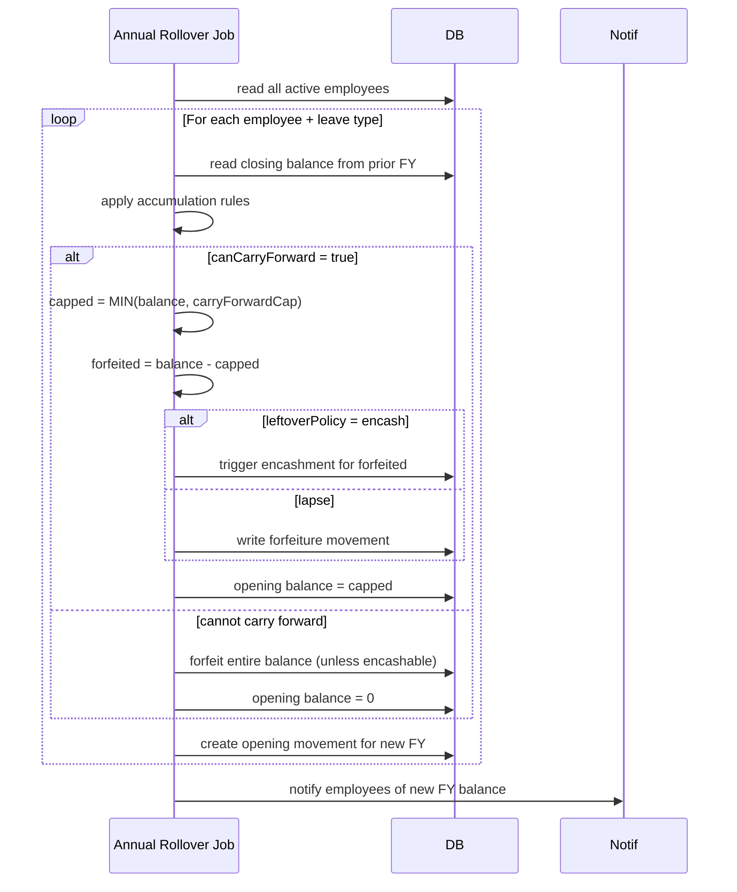

# 04 — Leave Accrual Engine

## Purpose

Computes how leave balances grow over time per the policy. Runs on multiple cadences:

- **Real-time**: on join, on transfer, on policy change
- **Periodic**: monthly accrual job (1st of every month for `accrualBasis: completed-month`)
- **Annual**: FY rollover (Apr 1 in India), opening balance computation, lapse handling
- **On-demand**: when an employee or HR queries "what's my balance right now"

The engine is the most arithmetic-heavy part of the attendance module. Bugs here cause real money problems (encashment) and statutory issues (Factories Act undercount).

## Accrual methods

### Method 1: `annual-fixed`

Employee gets X days at the start of the FY (or pro-rated from join date in that FY). Used for CL, SL, restricted holidays.

```
balance = annualDays                       (full FY)
balance = annualDays × (daysWorkedInFY / daysInFY)   (pro-rated mid-year join)
```

`[DECISION]` Pro-ration on join: by **calendar days from join to FY end / calendar days in FY**. Some companies use months. Tenant config: `proRationOnJoin = 'per-day' | 'per-month' | 'none'`.

### Method 2: `monthly-accrued`

Most common for EL. Employee accrues N days per month. After 12 months = annual entitlement.

```
balance = monthsCompleted × monthlyAccrualDays
```

#### Sub-decisions

**When does a month count as "completed"?**

`accrualBasis`:
- `'calendar-month'`: end of every calendar month, all employees on rolls get accrual (regardless of joined date in that month)
- `'completed-month'`: accrual on the date that completes a full month from join. Pankaj joined April 15 → first accrual on May 15
- `'on-payroll-process'`: accrual on payroll lock date

**Mid-month joiner pro-ration:**

If using `calendar-month`:
- Pankaj joins April 15 → April accrual = 1.75 × (16/30) = 0.93 days `[ASSUMPTION]` round to 0.93
- Or: full month if joined before 15th, half if after `[ASSUMPTION]`
- Tenant config

If using `completed-month`:
- No pro-ration; accrual applies on monthly anniversary

`[DECISION]` Default `calendar-month` with calendar-day pro-ration. Tenant can override.

### Method 3: `per-worked-days`

Factories Act § 79 mandate: 1 day annual leave per 20 worked days for adult workers (1 per 15 for child workers). 

```
accrual = floor(workedDays / workedDaysPerLeaveDay)
```

Worked days = days where `DailyAttendance.contributesToWorkedDays = true` (present, on-duty, paid leave; excludes LOP and weekly offs typically).

`[CA-REVIEW]` Definition of "worked day" varies. Factories Act uses "worked or treated as worked" — includes paid leave. State Shops Acts may differ.

This method is used primarily for blue-collar EL. Computed at end of calendar year (or FY).

### Method 4: `event-based`

Leave granted per event (per pregnancy for ML, per bereavement, per marriage). No accrual; balance is "available" or "not available" based on eligibility.

For ML:
- Eligibility: 80 days worked in previous 12 months (Maternity Benefit Act § 5(2))
- Entitlement: 26 weeks paid (first 2 children); 12 weeks (3rd onwards)
- Once availed for an event, the event is consumed; future events allowed up to lifetime cap

```typescript
interface EventBasedLeaveStatus {
  leaveTypeCode: 'ML';
  eventsTakenLifetime: number;             // 0, 1, 2
  isCurrentlyEligible: boolean;
  eligibilityReason: string;               // 'qualifying-days-met', 'lifetime-cap-reached', etc.
  daysAvailable: number;                   // 182 if first event, 84 if 3rd
}
```

### Method 5: `unlimited`

Some companies offer unlimited PTO. Schema represents balance as "no balance tracking; track usage and any guardrails":

```typescript
{
  method: 'unlimited',
  guardrails: {
    maxConsecutiveDays: 30,
    maxAnnualDays: 60,                     // soft cap; HR review beyond
    requireHrApprovalIfDaysExceed: 14,
  }
}
```

## Pro-ration scenarios

### Joined mid-FY

```
Pankaj joins July 1 (FY started April 1).
Annual EL entitlement: 21 days.
Pro-rated:
  Days in FY: 365
  Days from join to FY end (Mar 31): 274
  Pro-rated annual: 21 × (274/365) ≈ 15.77 days
```

For monthly-accrued (1.75/month):
```
Months from July 1 to Mar 31: 9 months (Jul, Aug, ..., Mar)
Accrual: 9 × 1.75 = 15.75 days
```

Both methods produce ~the same result. Slight differences due to rounding.

### Inter-entity transfer mid-year

Pankaj at Entity A from April–June. Transfers to Entity B July 1. Both same tenant.

Two sub-cases:

**(a) Tenant policy: leave balance transfers**
- Entity A's accrual through June (3 months × 1.75 = 5.25) carries over
- Entity B continues from there
- Single balance ledger

**(b) Tenant policy: leave balance reset on transfer**
- Entity A pays out unused balance as encashment (if encashable) or forfeits
- Entity B starts fresh accrual

`[DECISION]` Tenant configures `interEntityLeaveBalancePolicy`: `'transfer' | 'encash-and-restart' | 'forfeit-and-restart'`. Default: transfer for permanent + same-tenant.

### Probation and confirmation

Some companies grant fewer leaves during probation:
- Prob: 0 EL, 4 CL, 4 SL
- Confirmed: 21 EL, 7 CL, 7 SL

Two ways to implement:

**(a)** Different policies for probation vs confirmed. Resolve based on `EmploymentRecord.employmentStatus`.

**(b)** Single policy with conditional accrual: accrual rate reduced during probation.

`[DECISION]` Use approach (a). Cleaner. Tenant defines two policies; system resolves.

### Long unpaid leave

If employee on LWP, do they accrue? Generally no for the LWP days.

Spec: `accrualBasis` includes a `excludeUnpaidLeaveDays: boolean` flag. If true, accrual is reduced proportionally for LWP days in the period.

Example:
- 31-day month, 10 days LWP
- Pro-rated accrual: 1.75 × (21/31) = 1.18 days

### Long paid leave (ML, sabbatical)

Statutory: ML days count for service continuity, gratuity, PF (paid leave). Leave accrual on ML days?

`[CA-REVIEW]` Generally yes for EL accrual since ML is paid leave equivalent to working. Some interpretations differ.

Default: ML/SL counted as worked for accrual purposes.

## FY rollover

April 1 every year. Engine runs:



Key rules:

- Rollover effective Apr 1 (00:00 IST)
- All in-flight leave applications affecting prior FY honored
- Carry-forward beyond cap → either encashed or forfeited per policy
- Encashment triggers payroll line in next payroll
- Audit log entry per employee per leave type

## Encashment

Encashment = converting unused leave to cash.

### When allowed

Per policy `encashment.onlyOn`:
- `'exit'`: F&F encashment (most common)
- `'fy-end'`: annual encashment of leftover after carry-forward cap
- `'on-request'`: employee requests encashment voluntarily (rare)

### How calculated

`encashment.encashmentRate`:
- `'basic+da'`: most common, statutory minimum for some leaves
- `'basic-only'`
- `'gross'`: includes all components
- `'tenant-config'`: custom formula

Formula:
```
encashmentAmount = balanceToEncash × dailyWageRate
where dailyWageRate = monthlyRate / 26 (or /30, configurable)
```

`[CA-REVIEW]` Section 10(10AA) of Income Tax Act exempts portion of leave encashment from tax under certain conditions:
- Government employees: fully exempt
- Non-government: lesser of (₹25 lakh, last 10 months' salary, balance × salary rate)
- Limit increased from ₹3 lakh to ₹25 lakh in 2023

The HRMS computes both gross encashment and taxable portion.

### Worked example

Pankaj resigns. EL balance: 30 days. Last drawn Basic + DA: ₹50,000/month.

```
dailyWageRate = 50000 / 26 = ₹1923.08
grossEncashment = 30 × 1923.08 = ₹57,692.31
taxExempt (assume non-government, leaves of 30 days):
  Avg of last 10 months' salary = 50000 × 10 = 500000
  ₹25 lakh ceiling
  30/30 × 50000 = 50000   [Note: balance × salary rate; check formula]
  Lesser = 50000
taxableAmount = 57692.31 - 50000 = 7692.31
TDS on taxable portion at applicable slab
```

`[VERIFY]` Encashment exemption formula has multiple variants. Current authority is Section 10(10AA) post-2023 amendment. Verify with CA before coding.

## Forfeiture

Days that lapse (cannot be carried forward, no encashment available, or beyond max accumulation cap).

```typescript
{
  movementType: 'forfeiture',
  amount: -balanceForfeited,
  effectiveDate: 'YYYY-04-01',
  occurredAt: now,
}
```

Notification to employee.

## Negative balance handling

Sometimes employee takes leave they don't have:

- Default: not allowed; system rejects
- Configurable: allow up to N days negative
- If negative balance allowed and employee resigns, F&F deducts from final dues

```typescript
applicationRules: {
  // ...
  allowNegativeBalance?: boolean;
  maxNegativeDays?: number;                // e.g., 5 days against future accrual
}
```

## Leave granted as advance

Sometimes HR explicitly grants advance leave (medical emergency, etc.):

```typescript
interface ManualLeaveAdjustment {
  movementType: 'manual-adjustment';
  amount: +5,                              // grant 5 days
  reason: 'Medical emergency advance',
  approvedBy: hrUserId,
  approvedAt: Date,
}
```

Audit logged.

## Accrual ledger reporting

Employee can see:
- Opening balance (FY start)
- Accruals month-by-month
- Consumption (with leave application IDs)
- Holds (pending approvals)
- Forfeited
- Encashed
- Current balance

```typescript
interface LeaveBalanceReport {
  employeeId: ObjectId;
  leaveTypeCode: string;
  fyCode: string;
  
  movements: {
    date: string;
    type: 'opening' | 'accrual' | 'consumed' | 'held' | 'forfeited' | 'encashed' | 'adjusted';
    amount: number;
    runningBalance: number;
    note?: string;
    sourceRef?: string;                    // leave code, payroll run code, etc.
  }[];
  
  summary: {
    opening: number;
    totalAccrued: number;
    totalConsumed: number;
    totalHeld: number;
    totalForfeited: number;
    totalEncashed: number;
    closingBalance: number;
    availableBalance: number;
  };
}
```

## Performance: precomputation strategy

Computing balance from scratch (sum of movements) is fine for one employee but expensive for "show me balances of 5,000 employees".

Strategy:
- `LeaveBalance` collection stores latest snapshot
- Updated transactionally on every movement
- Snapshots are denormalized; if drift detected, recomputed from movements
- Daily reconciliation job verifies snapshot vs movements

## Open questions

`[OPEN]` Decimal precision for balance days. Floating-point can drift over many movements. Recommend: store as fixed-point (integer × 100, treated as hundredths of a day). Display rounds to 2 decimals.

`[OPEN]` Accrual on probation extension period — same as confirmed? Recommend: configurable; default same.

`[OPEN]` Leave prediction tool — show employee "if I apply for 10 days next month, what'll my balance be after?" Useful UX. Recommend: compute on the fly using accrual schedule.

`[OPEN]` Daily attendance affects balance how immediately? If marked LOP today, accrual reduces? Recommend: monthly accrual job recomputes worked days, applies retroactively to that month's accrual; not in real-time.

`[OPEN]` Backdated leave approval after accrual already happened. E.g., approve leave for Feb 5 in March — does Feb's accrual recompute? Recommend: yes, idempotent recompute.

## Cross-references

- [03-leave-types-and-policies.md](./03-leave-types-and-policies.md) — policy structure
- [/03-payroll/04-pre-payroll-inputs.md](../03-payroll/04-pre-payroll-inputs.md) (Phase 3) — leave consumption affects payroll
- [/03-payroll/09-fnf-settlement.md](../03-payroll/09-fnf-settlement.md) (Phase 3) — encashment computation
- [/00-foundations/06-statutory-rules-engine.md](../00-foundations/06-statutory-rules-engine.md) — leave-statutory rules
