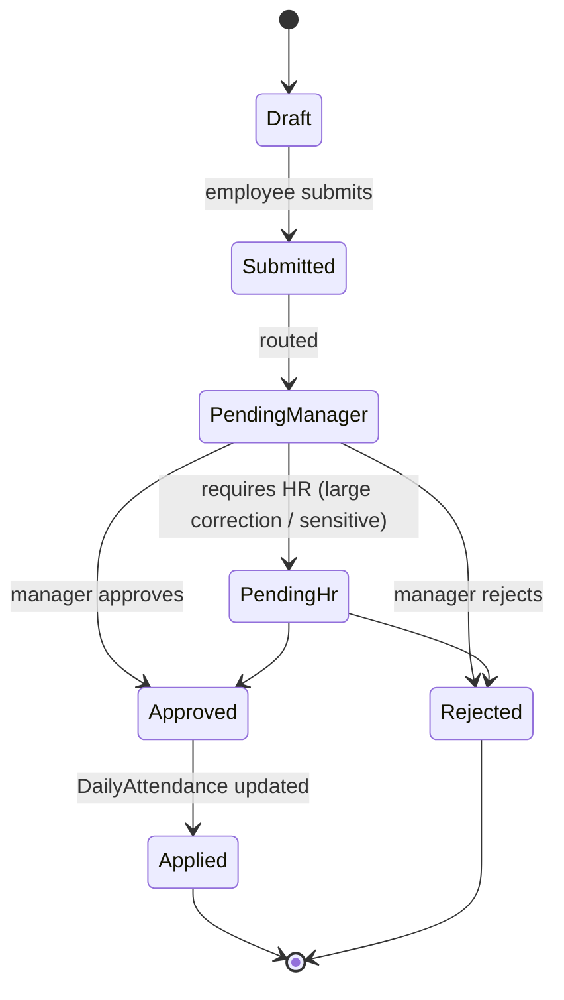

# 06 — Regularization Workflow

## Purpose

Regularization is the process of correcting attendance after the fact — when raw events don't reflect what actually happened.

Common scenarios:

- Employee forgot to punch in (or biometric failed)
- Employee was on official duty offsite (client visit) — no punch but should be marked present
- Employee took unplanned half-day; paperwork comes later
- Punch device offline; employee was present but no record
- Comp-off claim for working on weekly off
- Late arrival because of medical / personal reason employee wants noted

Without regularization, employees lose pay or get marked absent unfairly. Without controls, regularization becomes a backdoor to fake attendance. The workflow balances both.

## Regularization request schema

```typescript
interface RegularizationRequest extends BaseDocument {
  _id: ObjectId;
  tenantId: ObjectId;
  entityId: ObjectId;
  employeeId: ObjectId;
  
  regularizationCode: string;              // 'REG-2026-04-001234'
  
  // affected day
  date: string;                            // YYYY-MM-DD
  shiftId?: ObjectId;
  
  // current status (before correction)
  currentAttendanceStatus: AttendanceStatus;
  currentPunchPairs?: PunchPair[];
  currentTotalWorkedMinutes?: number;
  
  // requested correction
  requestedAttendanceStatus: AttendanceStatus;
  requestedInTime?: string;                // 'HH:mm'
  requestedOutTime?: string;
  requestedPunchPairs?: PunchPair[];
  
  // type of regularization
  regularizationType: RegularizationType;
  reason: string;                          // free-text employee explanation
  attachments?: ObjectId[];                // medical cert, customer email, etc.
  
  // approval
  status: 'draft' | 'submitted' | 'pending-manager' | 'pending-hr' | 'approved' | 'rejected' | 'cancelled';
  approvalChain: Array<{
    sequence: number;
    approverRole: string;
    approverId?: ObjectId;
    decision?: 'approved' | 'rejected' | 'reverted';
    decidedAt?: Date;
    notes?: string;
  }>;
  currentApprovalStep: number;
  
  // post-approval impact
  approvedAt?: Date;
  rejectedAt?: Date;
  rejectionReason?: string;
  appliedToDailyAttendance: boolean;
  dailyAttendanceVersionAtApply?: number;
  
  // audit
  createdAt: Date;
  appliedAt?: Date;
  cancelledAt?: Date;
  
  createdBy: ObjectId;
  updatedBy: ObjectId;
  isDeleted: boolean;
}

type RegularizationType =
  | 'missed-punch'                         // forgot to punch
  | 'wrong-punch'                          // punched in/out but the time is wrong
  | 'on-duty-mark'                         // was on official outside duty
  | 'wfh-mark'                             // was working from home
  | 'half-day-mark'                        // took half day
  | 'comp-off-claim'                       // claim comp-off for weekly off / holiday work
  | 'late-arrival-condonation'             // late but no LOP / half-day mark
  | 'early-departure-condonation'
  | 'biometric-failure'                    // device wasn't working
  | 'system-down'                          // HRMS / network issue
  | 'gate-pass-correction'                 // left office on official errand, didn't punch
  | 'shift-mismatch';                      // attendance shows wrong shift
```

Indexes:

```typescript
{ tenantId: 1, employeeId: 1, date: 1 }
{ tenantId: 1, status: 1, date: 1 }
{ tenantId: 1, regularizationCode: 1 }, unique
```

## Application flow



## Validation rules

| Rule | Description |
|---|---|
| Date range | Cannot regularize future dates; cannot regularize > 30 days in past `[ASSUMPTION]`; HR can override |
| Active employment | Cannot regularize after lastWorkingDay |
| Payroll lock | Cannot regularize a date if payroll for that period is locked (must use retro mechanism) |
| Self-regularization | Manager cannot self-regularize; goes to skip-level |
| Conflict with leave | If approved leave exists for the same date, regularization cannot mark "present" without first cancelling leave |
| Frequency cap | Max regularizations per employee per month (e.g., 3) `[ASSUMPTION]`; beyond → HR approval |
| Comp-off claim | Must reference a specific date worked; that date must show actual presence on weekly off / holiday |
| On-duty mark | Requires manager confirmation employee was on official duty |

## Post-approval behavior

When approved, the system:

1. Creates a synthetic AttendanceEvent (or updates existing) with `source = 'manual-regularization'`, `createdBy = approverId`
2. Recomputes DailyAttendance for the affected date
3. Updates downstream:
   - Leave balance (if half-day mark consumes 0.5 day from balance)
   - Comp-off balance (if comp-off claim approved)
   - LOP days for payroll input
   - OT hours (if applicable)
4. Audit log: regularization applied
5. Notification to employee

If payroll has already run for the period:

- Cannot directly modify locked PayrollLine
- Generates a retro entry in next payroll run

## Late-arrival condonation

Pankaj arrives 30 minutes late on April 15. Per shift rules, this should mark half-day. Pankaj submits regularization with reason "metro train delayed; have screenshot of news article".

Flow:
- Manager reviews
- Approves "condone late arrival" — late minutes set to 0, half-day flag cleared
- DailyAttendance recomputed: status = `present`, `lateMinutes = 0`, `graceUsed = true`
- Audit: condonation applied, manager noted

`[OPEN]` Should we cap "lates condoned per month"? Excessive condonation defeats the purpose. Recommend: 2/month default cap; HR can override.

## Comp-off claim

Pankaj worked 8 hours on Sunday April 12 (his weekly off). Claims comp-off.

Flow:
1. April 12 has actual punches (must be present in events)
2. Pankaj submits comp-off claim, references April 12
3. Manager verifies actual work happened
4. Approves: 1 day comp-off credited to balance
5. Comp-off balance ledger: +1 day
6. Original April 12 attendance: status = `weekly-off-worked`, comp-off granted

When Pankaj later applies leave using comp-off type, balance is debited.

```typescript
interface CompOffLedger extends BaseDocument {
  _id: ObjectId;
  tenantId: ObjectId;
  employeeId: ObjectId;
  
  movementType: 'earned' | 'consumed' | 'expired' | 'manual-adjustment';
  amount: number;                          // signed
  
  earnedDate?: string;                     // for 'earned'
  consumedDate?: string;                   // for 'consumed'
  expiryDate?: string;                     // earned comp-off must expire if not used
  
  sourceRegularizationId?: ObjectId;
  sourceLeaveApplicationId?: ObjectId;
  
  balanceAfter: number;
  
  createdAt: Date;
  isDeleted: boolean;
}
```

`[CA-REVIEW]` Comp-off must be granted within statutory window (typically 30 days of work, or within same month). Forfeits if not used.

## Bulk regularization

For supervisor-reported manual attendance (no biometric, signed muster):

- Supervisor uploads daily muster CSV: `employeeCode, date, status, inTime, outTime, otMinutes`
- System creates regularization requests per row
- Manager bulk-approves (single approval covers all rows)
- Audit log: bulk approval reference

## Manager / HR override

HR can directly mark attendance status without going through regularization workflow:

- Use case: payroll discovers gap, fixes it
- Audit log: direct override (not regularization)
- Higher trust level required than employee-initiated regularization

This is technically NOT a regularization request; it's a `ManualAttendanceOverride`:

```typescript
interface ManualAttendanceOverride extends BaseDocument {
  _id: ObjectId;
  tenantId: ObjectId;
  entityId: ObjectId;
  employeeId: ObjectId;
  date: string;
  
  beforeState: any;                        // snapshot
  afterState: any;
  reason: string;
  authorityRole: 'hr-manager' | 'tenant-admin' | 'payroll-admin';
  
  createdAt: Date;
  createdBy: ObjectId;
  isDeleted: boolean;
}
```

## Frequency monitoring

System tracks regularization frequency per employee:

- Monthly count
- Pattern detection (always Mondays — late?)
- Reasons category (medical / traffic / forgot)
- Manager dashboard surfaces patterns

Alerts:
- Employee with > 5 regularizations in a month
- Employee with > 50% regularization rate (most days needs correction)
- Department with high regularization rate

## Audit trail

Every regularization is heavily audited:

- Original event/state preserved
- Request submitted (who, when)
- Each approval/rejection step (who, when, why)
- Applied to DailyAttendance (timestamp, version)

Can show: "this attendance was originally absent; regularized on April 18 by Pankaj, approved by Anil, applied to DailyAttendance v3 at 17:32 IST".

## Open questions

`[OPEN]` Should employees see manager's rejection reason verbatim? Sensitive. Recommend: yes, with HR redaction option for sensitive cases.

`[OPEN]` Auto-regularization for biometric-known-failure days (entire device offline)? Recommend: yes — system flags affected employees, HR confirms, bulk auto-regularize.

`[OPEN]` Regularization for past-FY data when FY books closed? Generally no; requires special override.

`[OPEN]` Should regularization for OT hours be a separate flow? Currently combined; recommend: keep combined but UI surfaces OT-related regularizations distinctly to managers.

## Cross-references

- [01-attendance-capture.md](./01-attendance-capture.md) — events being corrected
- [03-leave-types-and-policies.md](./03-leave-types-and-policies.md) — leave conflicts
- [05-overtime-engine.md](./05-overtime-engine.md) — OT regularization
- [/00-foundations/04-audit-and-compliance-hooks.md](../00-foundations/04-audit-and-compliance-hooks.md) — heavy audit
