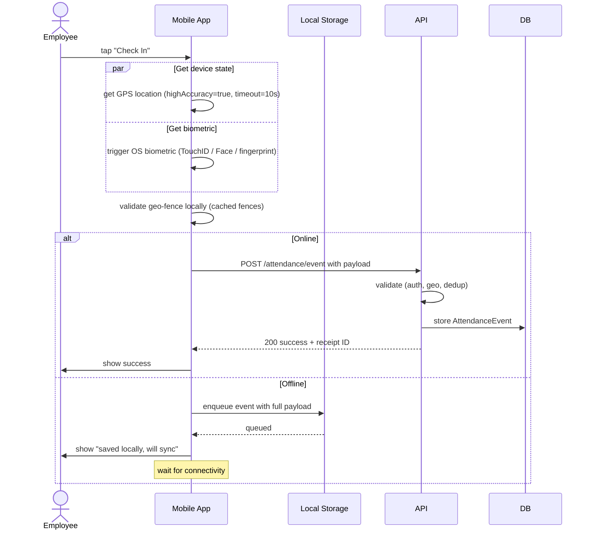
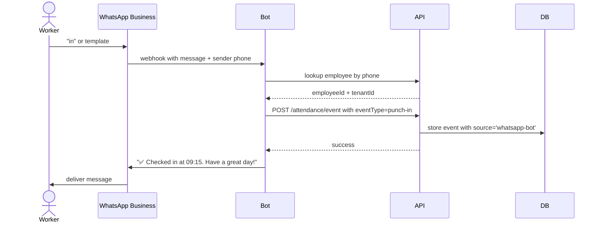

# 10 — Mobile & Offline Attendance

## Purpose

Mobile-first capture is essential because:

- Field staff (delivery, sales, technicians) work outside any office
- Construction, project sites have intermittent connectivity
- Many blue-collar workers don't have desktop access
- Distributed / remote / hybrid workforce is increasingly normal

This file defines: mobile app attendance capture, geo-fencing on mobile, biometric on mobile, offline buffering, sync mechanisms, and alternate channels (WhatsApp, SMS, IVR, kiosk).

Reading order: [01-attendance-capture.md](./01-attendance-capture.md) introduces the AttendanceEvent schema; this file deepens the mobile + offline aspects.

## Mobile app capture flow



## Mobile event payload

The mobile app sends a fully-formed AttendanceEvent via REST/GraphQL:

```typescript
interface MobileAttendanceEventPayload {
  // identity
  tenantId: string;                        // from JWT, validated server-side
  employeeId: string;                      // from JWT, validated
  
  // event
  eventType: AttendanceEventType;
  occurredAt: string;                      // ISO 8601 with timezone
  timezone: string;                        // 'Asia/Kolkata'
  
  // device
  deviceId: string;                        // unique device fingerprint (persisted in app)
  deviceModel: string;
  osVersion: string;
  appVersion: string;
  
  // location
  geo: {
    lat: number;
    lng: number;
    accuracy: number;                      // meters
    altitude?: number;
    speed?: number;                        // m/s
    heading?: number;
    capturedAt: string;                    // ISO 8601 — when GPS was read
  };
  
  // optional captures
  selfiePhotoBase64?: string;              // small (compressed) selfie at punch
  biometricVerified?: boolean;             // OS biometric used
  
  // metadata
  isOfflineEvent: boolean;                 // true if buffered then synced
  offlineCapturedAt?: string;              // when actually punched if offline
  offlineSyncedAt?: string;                // when synced to server
  
  // anti-tampering
  signature: string;                       // HMAC of payload + secret
  nonce: string;                           // anti-replay
}
```

Server validates:
- JWT matches employeeId in payload
- `occurredAt` is within ±5 minutes of server time (online events) — flag if not
- For offline events: `offlineCapturedAt` < `offlineSyncedAt` ≤ server-now
- Geo within applicable fence (or flagged)
- Signature valid
- Nonce not seen before (anti-replay)

## Offline buffering

The hard problem. Field worker in remote area, may go hours/days without connectivity.

### Local queue

Events queued in encrypted local SQLite or device-secure storage:

```typescript
interface LocalQueuedEvent {
  localId: string;                         // UUID
  payload: MobileAttendanceEventPayload;
  createdAt: Date;                         // local time
  syncAttempts: number;
  lastSyncAttemptAt?: Date;
  lastSyncError?: string;
  isSynced: boolean;
  serverEventId?: string;                  // received after sync
}
```

Storage:
- Encrypted at rest with device key (Android Keystore, iOS Keychain)
- Persists across app restarts
- Capacity: 1000 events `[ASSUMPTION]` — typical worker generates 4 events/day; 250 days storage
- Eviction: oldest synced events purged when capacity reached

### Sync triggers

App attempts sync when:
- Connectivity detected (network state change listener)
- App opened
- User-initiated "sync now"
- Background sync (iOS/Android background tasks; battery-aware)
- When user manually toggles to online

### Sync flow

```mermaid
sequenceDiagram
    participant App
    participant Local as Local Queue
    participant API
    
    Note over App: connectivity detected
    App->>Local: read pending events (oldest first)
    
    loop for each batch (max 50)
        App->>API: POST /attendance/event-batch
        alt Server accepts all
            API-->>App: 200 success per event
            App->>Local: mark each as synced
        else Some rejected (e.g., dedup)
            API-->>App: 207 multi-status
            App->>Local: mark accepted as synced; mark rejected with reason
        else Network error
            App->>App: backoff and retry
        end
    end
    
    App->>App: clear synced events from queue periodically
```

### Conflict resolution

Server is authoritative. If a buffered event conflicts with an event already on the server (same employee, same eventType, within dedup window):
- Server marks the second one as duplicate
- Client gets the duplicate verdict
- Client retains the local record but marked "synced as duplicate"

## Geo-fencing on mobile

### Fence configuration sync

Mobile app downloads the geo-fences applicable to the employee on login + periodically:

```typescript
interface MobileGeoFenceCache {
  fences: GeoFence[];
  lastSyncedAt: Date;
  ttlSeconds: number;                      // refresh after expiry
}
```

App stores fence centers + radius for circle, polygon coords for polygon.

### Local validation

When user taps Check In:
1. Capture GPS
2. Check against cached fences
3. If outside all applicable fences:
   - Tenant policy is `block`: don't even submit; show error
   - Policy is `allow-with-flag`: submit anyway with flag
   - Policy is `allow`: submit silently

Local validation is for UX (instant feedback). Server re-validates as source of truth.

### GPS accuracy handling

Indoor / urban GPS can have 50–100m error. Spec:

- Tolerance buffer added to fence radius (default 50m, configurable per fence)
- If `accuracy > 200m` (very poor): show warning, ask user to retry from clearer area
- If `accuracy > 500m`: reject (likely fake / spoofed)

`[v2]` WiFi-based location enhancement: scan for known WiFi BSSIDs (office routers) as additional location signal.

### Mock location detection

GPS spoofing apps exist. Detection:

- Check `Location.isFromMockProvider()` (Android) / similar iOS APIs
- Check for "developer mode" + suspicious app signatures
- Compare GPS over time — instantaneous teleportation is suspicious
- Speed inference (5000 km/h is impossible)

Spoofed locations:
- Block in production
- Flag in development / staging
- Audit log entry; HR alert

`[v3]` ML-based anomaly detection on movement patterns.

## Biometric on mobile

### Operating system biometric

Use platform APIs:
- iOS: Face ID, Touch ID via LocalAuthentication framework
- Android: BiometricPrompt API

These verify the user is the device's enrolled person — not the same as Aadhaar biometric, but high-trust.

```typescript
async function authenticateForCheckIn(): Promise<{ verified: boolean; method: string }> {
  const result = await BiometricPrompt.authenticate({
    title: 'Verify Identity',
    subtitle: 'Use Face ID / fingerprint to check in',
    fallbackLabel: 'Use PIN',
  });
  return { verified: result.success, method: result.method };
}
```

If biometric fails / unavailable: fall back to app PIN (4-6 digit, set on first login).

### Selfie capture (optional)

Some tenants require selfie at punch:

- Front-camera photo
- Face detection check (is there actually a face?)
- Compare with enrolled face (server-side, async) `[v2]`
- Photo stored in S3 as Document, referenced from AttendanceEvent

```typescript
interface SelfieAtPunch {
  photoDocumentId: ObjectId;
  faceDetected: boolean;
  faceMatchScore?: number;                 // 0-1 vs enrolled face [v2]
  enrolledFaceId?: ObjectId;
}
```

`[BLUE-COLLAR]` Useful for field staff. Photo is evidence employee was actually present, not someone using their phone.

## Battery and data optimization

Mobile attendance shouldn't drain battery or burn data. Strategies:

- GPS sampling: only when user initiates check-in (not continuous)
- Compressed payloads: gzip on HTTP
- Event batching: group multiple events when possible
- Photo compression: max 200KB per selfie
- Background sync: opportunistic, not aggressive
- Offline-first: don't waste energy retrying when offline

App size: keep under 30 MB including dependencies.

## WhatsApp bot integration

For workers without smartphones or who prefer WhatsApp:



Limitations:
- No GPS (unless worker shares location explicitly)
- No biometric
- Trust level lower
- Audit log notes source
- Tenant config: WhatsApp punches require photo confirmation OR are restricted to specific employee groups

Templates / commands:
- "in" → punch-in
- "out" → punch-out
- "balance" → leave balance
- "leave 2 days" → start leave application flow
- "payslip" → last payslip (sent as PDF)

`[v2]` More sophisticated bot using Claude / similar LLM for natural language.

## SMS / IVR

For phone-only workers (basic feature phones):

### SMS

Worker SMS-es a code to a short-code:
- "I" → in
- "O" → out
- "L" → leave query

System maps phone → employee, records event with source='sms', no geo.

Lowest trust; tenant must accept the limitation.

### IVR

Worker calls a number, navigates menu:
- Press 1 to check in
- Press 2 to check out
- Press 3 to query balance
- Press 4 to apply leave

Caller ID identifies employee (must be registered phone). Voice records can be retained for evidence.

## Kiosk

Touchscreen kiosk on shop floor where workers don't have personal devices:

- Worker enters employee code or scans card
- Authenticates with PIN (4-digit) or fingerprint sensor
- Selects In / Out / Break / On-duty
- Confirmation displayed
- Audio in regional language (Hindi, Tamil, etc.)

Schema: same AttendanceEvent, source='kiosk', sourceDeviceId = kiosk identifier.

## Multi-channel coordination

A tenant may use 4+ capture channels in same plant:
- Biometric at gate (primary)
- Mobile for field workers (secondary)
- Kiosk inside production (tertiary)
- Manual muster for small contractor crew

Spec:
- All sources produce AttendanceEvent
- Deduplication catches double-punching across channels (within 30s window)
- Per-employee preferred channel can be set (`Employee.preferredAttendanceChannel`)
- Channel availability matrix per shift / location

## Sync state UX

App shows visible sync state:

- Green: all events synced
- Yellow: events pending sync (count visible)
- Red: sync errors (with retry / refresh)
- Tappable to see details

User can manually trigger sync, view sync history, retry failed events.

## Anti-fraud measures

| Threat | Mitigation |
|---|---|
| Account sharing | Phone number unique per employee; OS biometric required for unlock |
| GPS spoofing | Mock location detection; speed analysis; WiFi corroboration |
| Selfie of selfie (photo of friend's photo) | Liveness detection (blink prompt) `[v2]` |
| Buddy punching | Biometric required at punch; selfie + face match |
| Off-site punching | Geo-fence + accuracy validation |
| Replay attack (resending old event) | Nonce + server-side replay prevention |
| Time manipulation on device | Server time used; device time only as evidence |

## Storage on device

Sensitive data on mobile must be protected:

- JWT tokens: secure storage (Keychain / Keystore)
- PIN: hashed (argon2id), stored locally
- Biometric: stored in OS-secure enclave (not accessible to app)
- Cached employee data: encrypted SQLite
- Cached geo-fences: encrypted
- Event queue: encrypted

On logout / device unenroll:
- All local data wiped
- Tokens revoked server-side

## Performance targets

| Action | Target |
|---|---|
| App cold start to ready | < 3 sec |
| Check-in tap to confirmation | < 5 sec online; instant offline |
| Battery impact | < 1% per day with normal use |
| Data usage | < 5 MB/day with normal use |
| Offline queue persistence | 100% across app restarts |
| Sync after reconnect | < 30 sec for 100 buffered events |

## Edge cases

### Phone changed

Worker buys new phone. Re-installs app. Logs in.

- Old device events synced before app uninstall: ok
- Old device events buffered but not synced: lost (server doesn't know)
- New device biometric / PIN must be re-enrolled
- Suspicious flag: device fingerprint changed → notify HR for verification

### Phone lost / stolen

- Worker reports to HR
- HR triggers remote logout (revokes JWT)
- App on lost device cannot create new events
- Already-buffered events: depends on whether thief can unlock device
- Buffered events tied to device biometric — should require biometric to sync, not just login

### Time zone change

Worker travels from Mumbai to Bangalore (same timezone). No issue.
Worker travels Mumbai → Singapore (different TZ). All shift times still in IST per their record.

For genuinely international work: out of v1 scope.

### Backend down

App can't reach API. Queue locally. Show "syncing later". Don't block worker from punching.

### App killed by OS

Android OS may kill background app to save battery. Sync attempts may be missed. Use WorkManager (Android) / BackgroundTasks (iOS) for reliable scheduling.

### Wrong employee selected on shared device

Some plants have shared devices. Worker selects own ID, enters PIN. If wrong selection: punch goes to wrong employee.

Mitigation: per-device max users; visible recent users; PIN required.

`[BLUE-COLLAR]` Shared devices common in factories. Acknowledge tradeoff: convenience vs identity assurance.

## Open questions

`[OPEN]` Should app force biometric on every punch, or just at app open? Force every punch increases friction; app-open only is faster but less secure. Recommend: tenant config; default biometric only at app open + every 4 hours.

`[OPEN]` Selfie at every punch vs random sampling? Random sampling reduces friction; full coverage improves trust. Recommend: tenant config; field staff = every punch by default.

`[OPEN]` In-app leave application + payslip + helpdesk vs separate apps? Recommend: unified app with role-based feature access. ESS module covered in `/07-ess-mobile/` (Phase 4).

`[OPEN]` WhatsApp Business pricing — message volume costs scale. Recommend: tenant pays for high-volume; low-volume free.

`[OPEN]` SMS gateway choice (Twilio, MSG91, Gupshup). Recommend: pluggable provider; tenant selects.

## Cross-references

- [01-attendance-capture.md](./01-attendance-capture.md) — base capture
- [/07-ess-mobile/](../07-ess-mobile/) (Phase 4) — full ESS in mobile
- [/00-foundations/03-identity-and-rbac.md](../00-foundations/03-identity-and-rbac.md) — JWT + auth
- [/00-foundations/04-audit-and-compliance-hooks.md](../00-foundations/04-audit-and-compliance-hooks.md) — audit
