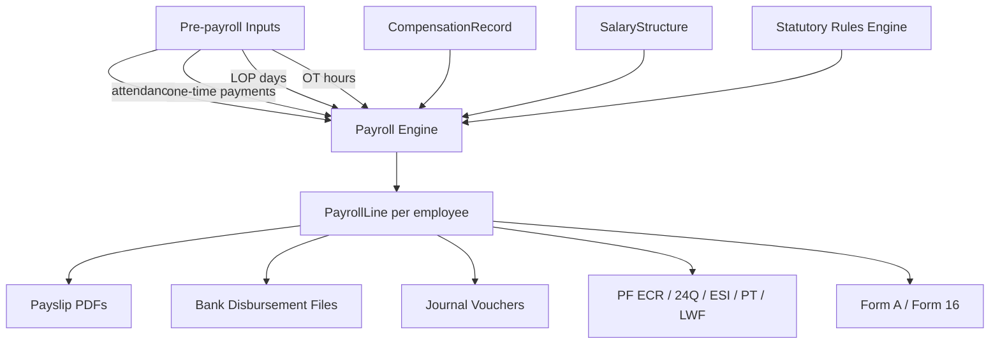

# 00 — Payroll Module Overview

## Purpose

Payroll is the most operationally critical module in the HRMS. Wrong by ₹100 = employee complaint. Wrong by ₹10,000 = blowback to founder. Wrong on PF deposit = inspector show-cause. Late = trust loss across the entire organization.

This module computes monthly (or weekly / fortnightly) wages, applies statutory deductions, generates payslips, produces bank disbursement files, posts journal vouchers to accounting systems, and feeds compliance filings. It must be deterministic, auditable, replayable, and provably correct.

## Scope of this folder

`/03-payroll/` covers payroll input collection, run mechanics, salary structure, statutory and tenant-defined components, retros, F&F, bonus/gratuity, payslip and bank file generation.

**In scope:**

- Salary structure builder (template + per-employee customization)
- Component library (statutory + tenant-defined)
- Payroll period and cycle management (monthly default; weekly / fortnightly for blue-collar)
- Pre-payroll inputs collection (attendance, OT, leave, one-time payments, deductions)
- Payroll engine (deterministic, idempotent, replayable)
- Arrears and retros (back-dated revisions, late approvals)
- Bonus calculation (statutory + performance)
- Gratuity calculation
- F&F (Full and Final) settlement
- Payslip format + delivery
- Bank file formats (HDFC, SBI, ICICI, Axis, Kotak, etc.)
- Journal vouchers for Tally / Zoho / SAP

**Out of scope (handled elsewhere):**

- Statutory rules and slabs → `/00-foundations/06-statutory-rules-engine.md` and `/04-compliance/`
- Statutory filings (PF ECR, TDS Form 24Q, ESI Challan) → `/04-compliance/`
- Statutory registers (Form A, Form 16) → `/04-compliance/13-statutory-files-and-formats.md`
- Attendance / leave inputs → `/02-attendance/`
- Recruitment-stage compensation negotiation → `/05-recruitment/`
- Performance bonus calibration → `/06-performance/`

## Files in this folder

1. [01-salary-structure-builder.md](./01-salary-structure-builder.md) — Salary structures, templates, formulas, applicability
2. [02-component-library.md](./02-component-library.md) — All earning, deduction, employer-cost components catalogued
3. [03-payroll-period-and-cycle.md](./03-payroll-period-and-cycle.md) — Periods, calendars, run statuses
4. [04-pre-payroll-inputs.md](./04-pre-payroll-inputs.md) — Attendance, LOP, OT, one-time inputs collection
5. [05-payroll-engine.md](./05-payroll-engine.md) — Run sequence, calculation order, idempotency, locking
6. [06-arrears-and-retros.md](./06-arrears-and-retros.md) — Backdated revisions, missed inputs, retro pay
7. [07-bonus-calculation.md](./07-bonus-calculation.md) — Statutory bonus (Bonus Act), performance bonus
8. [08-gratuity-calculation.md](./08-gratuity-calculation.md) — Gratuity formula, eligibility, payout
9. [09-fnf-settlement.md](./09-fnf-settlement.md) — F&F flow, recoveries, encashment, 2-day SLA
10. [10-payslip-format.md](./10-payslip-format.md) — Payslip layout, channels, password protection
11. [11-bank-file-formats.md](./11-bank-file-formats.md) — HDFC NEFT, SBI CMP, ICICI CIB, generic NEFT/RTGS/IMPS
12. [12-journal-voucher-and-accounting.md](./12-journal-voucher-and-accounting.md) — Tally XML, Zoho CSV, SAP, custom
13. [13-edge-cases.md](./13-edge-cases.md) — 30+ payroll edge cases worked

## Architectural position

## Determinism and replayability

The payroll engine is **deterministic**: given the same inputs and the same rules, it produces the same outputs byte-for-byte.

- Inputs (attendance, leave, one-time payments) are snapshotted at run time
- Rules version (PF rate, TDS slab) is pinned at run time via `effectiveOn` date
- All math uses fixed-point arithmetic
- Random salt, current timestamps, etc. are excluded from calculation core

Why determinism matters:

- **Replay**: re-run March 2024 in 2027 to defend an inspector audit
- **Verification**: two independent runs of the same period produce identical outputs (assertion in QA pipeline)
- **Trust**: customer can verify the math; nothing hidden

## Idempotency

Re-running the same payroll for the same period without changing inputs produces no change. The system detects "no-op re-run" and returns the existing result.

If inputs changed: re-run produces new outputs, marks previous outputs as superseded, retains historical snapshot.

## Run lifecycle

```mermaid
stateDiagram-v2
    [*] --> Initialized: payroll period scheduled
    Initialized --> InputsCollecting: pre-payroll opens
    InputsCollecting --> InputsLocked: input cutoff
    InputsLocked --> Computing: run triggered
    Computing --> Review: computation complete
    Review --> Computing: input correction triggered
    Review --> Approved: HR approves output
    Approved --> Disbursed: bank file generated, money sent
    Disbursed --> Locked: payroll closed
    Locked --> [*]: month closed; statutory filings begin
    
    Locked --> Reopened: rare; with senior approval
    Reopened --> Computing: rerun
```

## Money correctness

Reiterating from foundations: **all monetary values are Decimal128 or integer paise**, never `number`. Floating-point math is not used in payroll calculations.

Internal precision:
- Storage: integer paise (₹15,000.50 = 1500050)
- Computation: Decimal128 with 4 decimal places
- Display: rounded to 2 decimal places (or as configured)

Rounding rules per component are explicit (banker's rounding, half-up, etc.) — see [05-payroll-engine.md](./05-payroll-engine.md).

## Audit trail

Every payroll run produces:

- **Snapshot of inputs**: attendance days, LOP, OT, one-time entries — all immutable
- **Snapshot of CompensationRecord**: which version was used (effectiveFrom)
- **Snapshot of rules**: which PF/ESI/TDS/PT versions were applied (effectiveFrom of each rule)
- **PayrollLine records**: line-item math per component per employee
- **Output files**: payslips, bank file, JV, statutory files
- **Hashes**: SHA-256 of every output file
- **User actions**: who triggered, who approved, who locked

Full reconstruction is possible from the audit trail alone.

## Performance considerations

A 1,000-employee tenant with monthly payroll:

- Pre-input collection: 3-5 minutes
- Engine computation: 30-60 seconds
- Payslip PDF generation: 2-3 minutes (parallelized)
- Bank file generation: < 5 seconds
- JV generation: < 5 seconds
- Statutory file generation: 10-30 seconds (per file)

For 10,000-employee tenant: roughly 10× linearly, with parallelism limits.

Strategies:
- Per-employee computation parallelizable (no cross-employee dependencies in core math)
- BullMQ queue with worker pool
- Batch DB writes (bulk insert PayrollLine; bulk upload to S3)
- Pre-compute caching (rules engine LRU cache)

## Cross-references

- [/00-foundations/06-statutory-rules-engine.md](../00-foundations/06-statutory-rules-engine.md) — rules engine consumed
- [/01-employee/03-compensation-record.md](../01-employee/03-compensation-record.md) — compensation versioning
- [/02-attendance/](../02-attendance/) — attendance inputs feeding payroll
- [/04-compliance/](../04-compliance/) — statutory filings consuming payroll output
