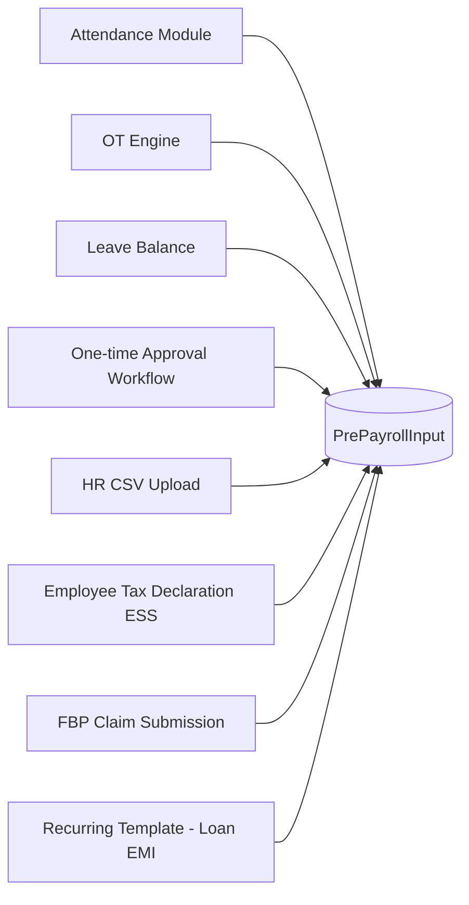
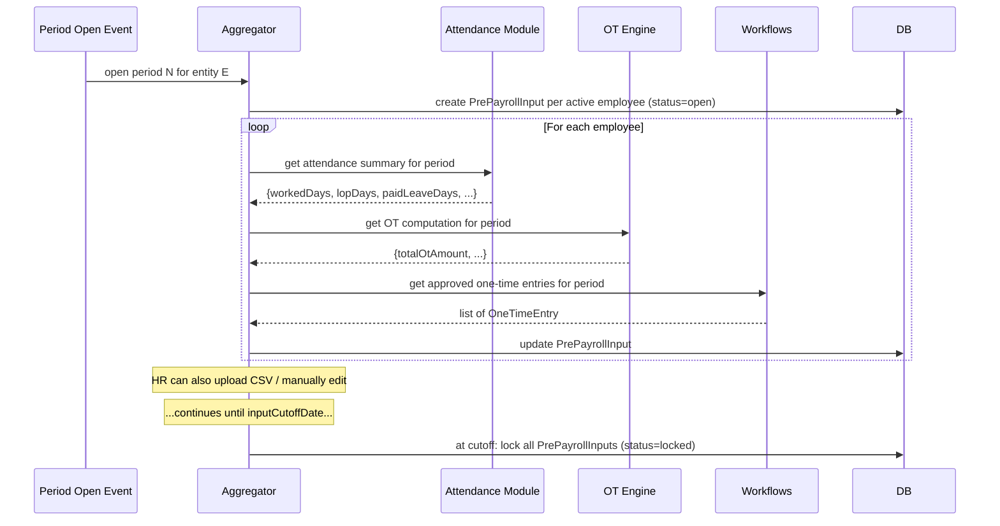
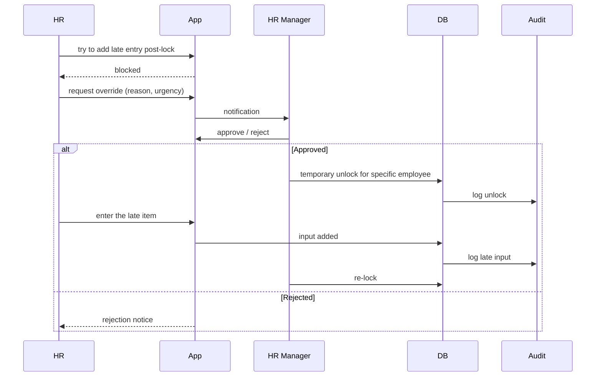

# 04 — Pre-Payroll Inputs

## Purpose

Pre-payroll inputs are the **variable** data per employee per period that affects pay: attendance days, LOP, OT hours, leave consumption, one-time payments (sign-on bonus, performance bonus), one-time deductions (loan EMI, advance recovery), tax declarations, FBP claims.

Without these inputs, the engine cannot compute. They flow in from multiple sources (attendance module, manager submissions, HR uploads, employee declarations) and must be aggregated, validated, and locked before computation.

## Schema

```typescript
interface PrePayrollInput extends BaseDocument {
  _id: ObjectId;
  tenantId: ObjectId;
  entityId: ObjectId;
  payrollPeriodId: ObjectId;
  employeeId: ObjectId;
  
  // attendance derivatives (sourced from /02-attendance/)
  attendance: {
    workedDays: number;                    // days flagged contributesToWorkedDays
    lopDays: number;
    paidLeaveDays: number;
    unpaidLeaveDays: number;               // typically same as lopDays for LOP-style; sometimes separate
    onDutyDays: number;
    wfhDays: number;
    holidayDays: number;
    weeklyOffDays: number;
    
    // leave breakdown
    leaveByType?: { typeCode: string; days: number }[];
    
    // dates
    halfDayCount: number;
    
    sourceVersion: number;                 // DailyAttendance version at snapshot time
    snapshotAt: Date;
  };
  
  // overtime
  overtime: {
    regularOtMinutes: number;
    weeklyOffOtMinutes: number;
    holidayOtMinutes: number;
    nightOtMinutes: number;
    totalOtAmount: Decimal128;
    
    sourceComputationId?: ObjectId;        // ref OtComputation
  };
  
  // one-time additions (positive impact on pay)
  oneTimeAdditions: OneTimeEntry[];
  
  // one-time deductions (negative impact)
  oneTimeDeductions: OneTimeEntry[];
  
  // tax declarations
  taxDeclarationsAtRun?: {
    regime: 'old' | 'new';
    investments: Decimal128;
    rentMonthly?: Decimal128;
    homeLoanInterestAnnual?: Decimal128;
    homeLoanPrincipalAnnual?: Decimal128;
    section80CTotal?: Decimal128;
    section80DTotal?: Decimal128;
    // ... full set of declarations
    submittedAt: Date;
    proofsSubmitted: boolean;
    proofsApprovedBy?: ObjectId;
  };
  
  // FBP claims for this period
  fbpClaims?: {
    componentCode: string;
    amountClaimed: Decimal128;
    billsAttached: boolean;
    documentIds?: ObjectId[];
  }[];
  
  // status
  status: 'open' | 'submitted' | 'locked' | 'used-in-run';
  lockedAt?: Date;
  lockedBy?: ObjectId;
  
  createdAt: Date;
  updatedAt: Date;
  isDeleted: boolean;
}

interface OneTimeEntry {
  _id: ObjectId;
  entryCode: string;                       // e.g., 'OT-2026-04-001234'
  componentCode: string;                   // 'PERFORMANCE_BONUS', 'SALARY_ADVANCE', etc.
  amount: Decimal128;
  description: string;
  
  // tagging for tax / statutory
  isTaxable: boolean;
  countsForPf: boolean;
  countsForEsi: boolean;
  
  // evidence
  approvalRefId?: ObjectId;                // workflow approval
  documentId?: ObjectId;                   // letter, voucher
  
  // source
  source: 'manual-hr' | 'csv-import' | 'workflow' | 'recurring-template';
  recurringTemplateId?: ObjectId;          // for EMI etc.
  
  // dates
  effectiveDate: string;
  
  createdAt: Date;
  createdBy: ObjectId;
  isDeleted: boolean;
}
```

## Indexes

```typescript
{ tenantId: 1, entityId: 1, payrollPeriodId: 1, employeeId: 1 }, unique
{ tenantId: 1, payrollPeriodId: 1, status: 1 }
```

## Sources of inputs



## Aggregation flow

For each (period, employee), the system aggregates from sources:



## One-time entries

These are the most variable and error-prone inputs. Examples:

- **Performance bonus** for individual employees (different amounts each)
- **Salary advance** repayment
- **Loan EMI** (recurring; typically scheduled)
- **Joining bonus** payable in current period
- **Asset recovery** for damaged laptop
- **Notice recovery** for short notice
- **Bonus statutory** payment (annual)
- **Reimbursement claims** approved this period
- **One-time allowance** (relocation, marriage gift)

### Recurring templates

Loan EMIs and similar repayments don't need fresh entry each month. A `RecurringTemplate` schedules them:

```typescript
interface RecurringTemplate extends BaseDocument {
  _id: ObjectId;
  tenantId: ObjectId;
  entityId: ObjectId;
  employeeId: ObjectId;
  
  componentCode: string;                   // 'LOAN_REPAYMENT'
  description: string;                     // 'Education Loan EMI'
  
  monthlyAmount: Decimal128;
  totalAmount: Decimal128;
  
  totalInstallments: number;
  installmentsPaid: number;
  remainingBalance: Decimal128;
  
  startPeriodCode: string;                 // YYYY-MM
  endPeriodCode?: string;
  
  isActive: boolean;
  
  // pause / suspend
  isPaused: boolean;
  pausedFrom?: string;
  pauseReason?: string;
  
  // documents
  loanAgreementDocumentId?: ObjectId;
  
  createdAt: Date;
  updatedAt: Date;
  createdBy: ObjectId;
  isDeleted: boolean;
}
```

When period opens, RecurringTemplates auto-generate `OneTimeEntry` records for the period.

## CSV upload format

HR can bulk-upload one-time entries:

```csv
employeeCode,componentCode,amount,description,effectiveDate
EMP00042,PERFORMANCE_BONUS,50000.00,Q4 2025 performance bonus,2026-04-15
EMP00042,RETENTION_BONUS,25000.00,Q1 retention milestone,2026-04-15
EMP00100,LOAN_REPAYMENT,5000.00,Education loan EMI April,2026-04-15
```

System validates per row:
- Employee exists, active in entity, in this period
- Component code valid
- Amount > 0 (or signed for refund/recovery)
- Effective date in period

Rejected rows shown to HR for correction. Accepted rows create OneTimeEntry records (status=approved if HR has authority; pending if requires further approval).

## Validation rules

| Rule | Description |
|---|---|
| LOP days | LOP days ≤ calendar days in period |
| Worked days | Worked days ≤ working days in period |
| Sum check | workedDays + lopDays + paidLeaveDays + holidays + weeklyOffs = total days in period |
| Negative entries | Some components allow negative (refunds, corrections) |
| One-time entry types | Must reference existing component code |
| Tax declaration | Cannot exceed legal caps (e.g., 80C ≤ ₹1.5L) |
| FBP claims | Sum ≤ FBP pool annual; bills attached if required |

## Tax declaration handling

Two declarations matter:

1. **Investment declaration (start of FY or on hire)** — projection of expected investments. Used for monthly TDS computation.
2. **Investment proofs (Q4)** — actuals. TDS recomputed for last month based on actuals.

Schema:

```typescript
interface TaxDeclaration extends BaseDocument {
  _id: ObjectId;
  tenantId: ObjectId;
  entityId: ObjectId;
  employeeId: ObjectId;
  
  fyCode: string;
  
  declarationType: 'projection' | 'actual-with-proofs' | 'mid-year-update';
  
  regime: 'old' | 'new';
  regimeChangeAllowed: boolean;
  
  // Section 80 deductions (mostly for old regime)
  section80C: Decimal128;                  // capped at ₹1.5L
  section80CCD1B: Decimal128;              // NPS additional ₹50K
  section80D_self: Decimal128;             // health insurance self+family
  section80D_parents: Decimal128;          // parents
  section80E_education: Decimal128;        // education loan interest, no cap
  section80G_donations: Decimal128;        // 50% / 100% per institution
  section80GG_rent: Decimal128;            // rent without HRA
  section80TTA_savings: Decimal128;        // savings interest, ₹10K cap
  section80TTB_seniors: Decimal128;        // senior interest, ₹50K cap
  section80U_self_disability: Decimal128;  // ₹75K (40-79%) / ₹1.25L (80%+)
  section80DD_dependent_disability: Decimal128;
  section80DDB_specified_disease: Decimal128;
  
  // HRA exemption (old regime)
  rentMonthly: Decimal128;
  rentRecipientPan?: EncryptedString;      // mandatory if rent > ₹1L/yr
  livesInMetro: boolean;                   // 50% basis vs 40%
  
  // Section 24 (home loan interest)
  homeLoanInterestAnnual: Decimal128;      // capped ₹2L for self-occupied
  homeLoanPrincipalAnnual: Decimal128;     // forms part of 80C
  
  // Other
  professionalTaxOpted: boolean;
  
  // metadata
  declaredAt: Date;
  declarationLockedAt?: Date;
  proofsSubmittedAt?: Date;
  proofsApprovedAt?: Date;
  proofsApprovedBy?: ObjectId;
  
  // attachments
  proofDocumentIds?: ObjectId[];
  
  isCurrent: boolean;
  
  createdAt: Date;
  updatedAt: Date;
  isDeleted: boolean;
}
```

`[VERIFY]` Caps for FY 2026-27. IT Act 2025 may have modified some. Section 80C remained ₹1.5L last I checked; new regime mostly eliminates these.

## Validation against employee state

Pre-payroll input validation includes:

- Employee active during the period (checked vs EmploymentRecord)
- Employee's bank account on file (else cannot disburse)
- Employee's PAN on file (else higher TDS at 20% per § 206AA)
- Employee's UAN linked (PF deposit may be held back per EPFO rules `[VERIFY]`)
- Employee's KYC status (some statutory operations require KYC)

Failures: warning + flag in pre-payroll review screen.

## Locking inputs

At `inputCutoffDate`, system locks all PrePayrollInputs:

- Status: `submitted` → `locked`
- HR can no longer edit
- Recurring templates have generated their entries
- One-time entries pending approval: timeout → not included

Post-lock changes require `Reopened` status with HR Manager approval.

## Lock override



Lock override is heavily audited.

## Pre-payroll review dashboard

Before triggering computation, HR sees:

- Total active employees
- Inputs received per employee (green / yellow / red)
- Anomalies:
  - Employee with > 10 LOP days
  - Employee with > 0 LOP and prior LOP last month (chronic absent)
  - Employee with no tax declaration (default = projected zero, conservative TDS)
  - Employee with bank account not verified
  - Employee with KYC missing
  - Employee with manual override needed
- Total expected gross / net / employer cost
- Variance from previous period

Rich UX prevents surprise outputs after computation.

## Multi-source reconciliation

Sometimes attendance and OT come from different systems:

- HRMS attendance: 22 worked days
- External OT system: 4 OT hours

Reconciliation logic:
- Per employee per period, single source of truth per category
- Attendance from HRMS attendance module (authoritative)
- OT from OT engine (authoritative)
- One-time inputs from workflow approvals

If conflict (e.g., attendance shows 0 OT but OT engine shows 4 hours), flag for HR.

## Audit trail per input

Every PrePayrollInput is audit-logged:
- When created (period open)
- Each source aggregation (attendance fetched, OT fetched)
- Each manual edit
- Lock event
- Used in run

Reconstruction: "What was Pankaj's input for April 2026?" → snapshot answer.

## Open questions

`[OPEN]` Auto-lock at cutoff or HR-triggered? Recommend: auto-lock at cutoff time; HR can extend cutoff with notification.

`[OPEN]` Pre-payroll review: do we surface predicted net pay per employee for review? Helps HR catch issues. Recommend: yes; show estimate before run.

`[OPEN]` What if HR forgot to enter an approved bonus? It comes via workflow integration. If workflow not used / process broken: HR must add manually before lock. Reconciliation: pending approvals queue.

`[OPEN]` Investment declaration mid-year update — common when employee's situation changes (got married, bought house). Allow N changes per year? Recommend: 2 changes per FY default; tenant config.

`[OPEN]` Should we support pre-defined CSV templates per tenant for one-time uploads? Recommend: yes; downloadable templates with current employee list.

## Cross-references

- [03-payroll-period-and-cycle.md](./03-payroll-period-and-cycle.md) — period structure
- [05-payroll-engine.md](./05-payroll-engine.md) — engine consuming inputs
- [/02-attendance/](../02-attendance/) — attendance source
- [/02-attendance/05-overtime-engine.md](../02-attendance/05-overtime-engine.md) — OT source
- [/04-compliance/03-tds-and-income-tax.md](../04-compliance/03-tds-and-income-tax.md) — tax declaration consumption
