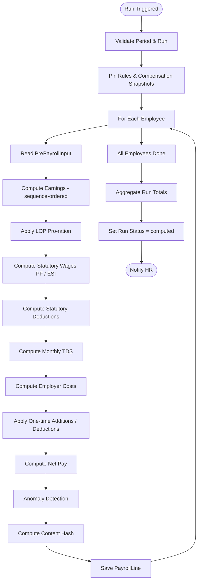

# 05 — Payroll Engine

## Purpose

The engine takes pinned inputs (pre-payroll inputs + CompensationRecord + statutory rules at effective date), executes a deterministic computation pipeline, and produces PayrollLine records — one per employee per period per run.

This is the heart of the system. Bugs here are payday-blocking. Specification is precise about ordering, rounding, currency handling, and audit.

## PayrollLine schema

```typescript
interface PayrollLine extends BaseDocument {
  _id: ObjectId;
  tenantId: ObjectId;
  entityId: ObjectId;
  payrollPeriodId: ObjectId;
  payrollRunId: ObjectId;
  employeeId: ObjectId;
  
  // identity
  lineCode: string;                        // 'PAY-2026-04-EMP00042'
  
  // pinned context
  compensationRecordId: ObjectId;
  compensationRecordVersion: number;
  salaryStructureId: ObjectId;
  salaryStructureVersion: number;
  rulesSnapshot: {
    pfRuleId?: ObjectId;
    esiRuleId?: ObjectId;
    tdsRuleId?: ObjectId;
    ptRuleId?: ObjectId;
    lwfRuleId?: ObjectId;
    overtimeRuleId?: ObjectId;
  };
  
  // inputs snapshot
  inputs: {
    workedDays: number;
    lopDays: number;
    paidLeaveDays: number;
    otAmount: Decimal128;
    oneTimeAdditionsTotal: Decimal128;
    oneTimeDeductionsTotal: Decimal128;
    taxRegime: 'old' | 'new';
  };
  
  // computed earnings (per-component)
  earnings: ComponentLine[];
  earningsGross: Decimal128;
  earningsLopAdjusted: Decimal128;
  
  // computed deductions (per-component)
  deductions: ComponentLine[];
  deductionsTotal: Decimal128;
  
  // employer costs (per-component)
  employerCosts: ComponentLine[];
  employerCostsTotal: Decimal128;
  
  // totals
  netPay: Decimal128;                      // earningsLopAdjusted - deductionsTotal
  ctcMonthly: Decimal128;                  // earningsLopAdjusted + employerCostsTotal
  
  // statutory wages
  pfWages: Decimal128;                     // wages applicable for PF
  esiWages: Decimal128;
  ptApplicable: boolean;
  ptStateCode?: StateCode;
  ptAmount: Decimal128;
  lwfApplicable: boolean;
  lwfAmount: Decimal128;
  
  // tax
  tdsThisMonth: Decimal128;
  tdsCumulativeYtdProjected: Decimal128;
  tdsAlreadyDeductedYtd: Decimal128;
  tdsBalanceForRestOfFy: Decimal128;
  
  // bank disbursement
  bankAccountId?: ObjectId;
  bankAccountLast4: string;                // for display
  splitDisbursements?: { accountId: ObjectId; amount: Decimal128 }[];
  
  // status
  status: 'draft' | 'computed' | 'reviewed' | 'approved' | 'disbursed' | 'failed' | 'superseded';
  supersededByLineId?: ObjectId;           // if a re-run replaced this
  
  // computation metadata
  computedAt: Date;
  computedBy: 'engine';
  computationVersionId: string;            // engine git commit / version tag
  
  // anomalies
  anomalies?: {
    code: string;                          // 'NEGATIVE-NET-PAY', 'PF-CEILING-EXCEEDED', etc.
    severity: 'info' | 'warning' | 'error';
    message: string;
  }[];
  
  // hash (for tamper detection)
  contentHash: string;
  
  // metadata
  createdAt: Date;
  updatedAt: Date;
  isDeleted: boolean;
}

interface ComponentLine {
  componentCode: string;
  componentName: string;
  
  // before LOP
  fullAmount: Decimal128;                  // amount as if full month worked
  
  // after LOP
  proRatedAmount: Decimal128;              // adjusted for LOP days
  
  // displayed
  payslipAmount: Decimal128;               // typically same as proRatedAmount
  
  // tagging
  countsForPf: boolean;
  countsForEsi: boolean;
  countsForGratuity: boolean;
  countsForBonus: boolean;
  isTaxable: boolean;
  isExempt: boolean;
  exemptAmount?: Decimal128;
  taxableAmount?: Decimal128;
  
  // sequence (for payslip ordering)
  sequence: number;
  
  // formula trace (for audit)
  formulaUsed?: string;
  inputs?: Record<string, any>;
}
```

## Indexes

```typescript
{ tenantId: 1, payrollRunId: 1, employeeId: 1 }, unique
{ tenantId: 1, payrollPeriodId: 1, employeeId: 1, status: 1 }
{ tenantId: 1, employeeId: 1, payrollPeriodId: 1 }
{ tenantId: 1, status: 1, anomalies: 1 }
```

## Engine execution sequence



## Detailed step specifications

### Step 1: Validate

Pre-conditions before computing:
- Period status = `inputs-locked` or `computing`
- All active employees have PrePayrollInput records
- All inputs locked
- No employee has missing CompensationRecord
- Salary structures are valid (sum check passes)
- Statutory rules exist for period date

Failure: abort with descriptive error, no PayrollLines created.

### Step 2: Pin snapshots

Before compute, freeze the context for reproducibility:

```typescript
const runContext = {
  asOf: period.endDate,                    // for rule lookup
  pfRule: await rulesEngine.lookup('pf:central:default', period.endDate),
  esiRule: await rulesEngine.lookup('esi:central:default', period.endDate),
  tdsRule: await rulesEngine.lookup('tds:central', period.endDate),
  ptRules: new Map<StateCode, StatutoryRule>(),
  // ...
};
```

Store rule IDs in the PayrollRun for replay.

### Step 3: For each employee — compute earnings

Iterate components in `sequence` order. Each component computed independently:

```typescript
const earnings: ComponentLine[] = [];
let runningContext = { ...employeeBase };

for (const component of structure.components.sort((a, b) => a.sequence - b.sequence)) {
  if (!isApplicableForEmployee(component, employee)) continue;
  
  let fullAmount = Decimal128.from(0);
  
  switch (component.computationMethod) {
    case 'fixed':
      fullAmount = component.fixedAmount;
      break;
    case 'percentage-of-basic':
      fullAmount = runningContext.basic.times(component.percentageValue);
      break;
    case 'formula':
      fullAmount = evalFormula(component.formulaExpression, runningContext);
      break;
    case 'rule-engine':
      fullAmount = await callRuleStrategy(component, employee, runningContext, runContext);
      break;
    case 'balance':
      fullAmount = ctcMonthly.minus(sumPriorComponents(earnings));
      break;
    // ...
  }
  
  if (component.cappedAt) fullAmount = min(fullAmount, component.cappedAt);
  if (component.flooredAt) fullAmount = max(fullAmount, component.flooredAt);
  
  earnings.push({
    componentCode: component.componentCode,
    fullAmount,
    // proRatedAmount computed in Step 4
    countsForPf: component.countsForPf,
    // ...
  });
  
  runningContext[component.componentCode] = fullAmount;
}
```

`runningContext` lets later components reference earlier ones (`hra` references `basic`).

### Step 4: Apply LOP pro-ration

LOP reduces eligible pay. Different components handle differently:

- `proRateOnLop=true`: amount × (workedDays / totalApplicableDays)
- `proRateOnLop=false`: amount unchanged

Pro-ration basis (per `salaryStructure.workdaysBasis`):

```typescript
function computeProRationFactor(
  workedDays: number, lopDays: number, totalDays: number, basis: WorkdaysBasis
): number {
  switch (basis) {
    case 'calendar-days':
      return (totalDays - lopDays) / totalDays;
    case 'working-days':
      const workingDaysInPeriod = totalDays - holidays - weeklyOffs;
      return workedDays / workingDaysInPeriod;
    case 'fixed-26':
      return (26 - lopDays) / 26;
    case 'fixed-30':
      return (30 - lopDays) / 30;
  }
}
```

`[ASSUMPTION]` `working-days` is the most accurate; `fixed-30` is most lenient (favors employee in long months); `fixed-26` is factory standard.

```typescript
const proRationFactor = computeProRationFactor(...);

for (const line of earnings) {
  if (line.proRateOnLop) {
    line.proRatedAmount = line.fullAmount.times(proRationFactor);
  } else {
    line.proRatedAmount = line.fullAmount;
  }
}
```

### Step 5: Statutory wages

```typescript
const pfWages = sum of earnings where component.countsForPf=true (after pro-rate)
            // PLUS Wage Code §2(y) 50% rule adjustment if applicable
const esiWages = sum of earnings where component.countsForEsi=true
```

`[CA-REVIEW]` Wage Code 50% rule complex; engine implementation must follow legal interpretation.

### Step 6: Statutory deductions

#### Employee PF

```typescript
function computeEmployeePf(pfWages: Decimal128, pfRule: StatutoryRule, basisChoice: PfBasis): Decimal128 {
  const ceiling = Decimal128.fromString(pfRule.rulePayload.wageCeiling);
  const applicableWage = basisChoice === 'ceiling' ? min(pfWages, ceiling) : pfWages;
  return applicableWage.times(pfRule.rulePayload.employeeShare);  // 12%
}
```

VPF (voluntary PF) added if employee has opted:
```
employeeVpf = pfWages × (vpfRate ?? 0)
```

Rounding: typically rounded to nearest paisa, or rounded down (depends on EPFO ECR specs).

#### Employee ESI

ESI is simpler — applies if `esiWages ≤ 21000` (current ceiling, in the rule):

```typescript
function computeEmployeeEsi(esiWages: Decimal128, esiRule: StatutoryRule): Decimal128 {
  const ceiling = Decimal128.fromString(esiRule.rulePayload.wageCeiling);
  if (esiWages.gt(ceiling)) return Decimal128.from(0);  // not applicable
  return esiWages.times(esiRule.rulePayload.employeeShare);  // 0.75%
}
```

`[VERIFY]` Once an employee enters a contribution period (Apr-Sep or Oct-Mar) below ceiling, they remain contributory for the full period even if wages rise above ceiling. The engine looks up "ESI eligibility status" from cached employee state, not just current month's wages.

#### Professional Tax

Per state. Rule lookup by state:

```typescript
function computePt(grossEarnings: Decimal128, stateCode: StateCode, ptRule: StatutoryRule): Decimal128 {
  const slabs = ptRule.rulePayload.slabs;
  for (const slab of slabs) {
    if (grossEarnings.gte(slab.salaryRangeFrom) && (slab.salaryRangeTo === 'infinity' || grossEarnings.lte(slab.salaryRangeTo))) {
      return Decimal128.fromString(slab.ptAmount);
    }
  }
  return Decimal128.from(0);
}
```

State-specific quirks (March extra, half-yearly):
```typescript
if (ptRule.rulePayload.marchAdjustment && period.month === 3) {
  ptAmount = ptAmount.plus(ptRule.rulePayload.marchAdjustment.extraDeduction);
}
```

#### LWF

Similar pattern; per state; usually flat amounts.

### Step 7: TDS

The most complex computation. Detailed in [/04-compliance/03-tds-and-income-tax.md](../04-compliance/03-tds-and-income-tax.md). Summary:

```typescript
function computeMonthlyTds(employee, payrollLine, taxDeclarations, tdsRule, runContext): Decimal128 {
  // 1. Project annual income
  const projectedAnnualGross = payrollLine.earningsGross.times(12);
  // Adjust for known one-time payments earlier or expected later in FY
  // Adjust for actual paid YTD if mid-FY
  
  // 2. Apply exemptions / deductions per regime
  let taxableIncome = projectedAnnualGross;
  if (taxDeclarations.regime === 'old') {
    taxableIncome = applyOldRegimeDeductions(taxableIncome, taxDeclarations);
  } else {
    taxableIncome = projectedAnnualGross.minus(75000);  // standard deduction FY26-27 [VERIFY]
    // No 80C, 10(13A), etc. in new regime
  }
  
  // 3. Apply slabs
  const annualTax = applyTdsSlabs(taxableIncome, tdsRule, employee.age);
  
  // 4. Add cess (4% Health & Education Cess)
  const annualTaxWithCess = annualTax.times(1.04);
  
  // 5. Subtract already-deducted TDS YTD
  const tdsRemaining = annualTaxWithCess.minus(tdsAlreadyDeductedYtd);
  
  // 6. Divide by remaining months in FY
  const monthsRemaining = monthsLeftInFy(period.endDate);
  return tdsRemaining.div(monthsRemaining);
}
```

`[VERIFY]` IT Act 2025 effective April 1, 2026: new regime is default; standard deduction may be ₹75K. CA review essential.

If employee's PAN is missing or inoperative: TDS at 20% per § 206AA (overrides above).

### Step 8: Employer costs

```typescript
const employerCosts = [];

// Employer PF (12%, with 8.33% to EPS, 3.67% to EPF)
const employerPfWage = min(pfWages, ceiling);
const employerEps = employerPfWage.times(pfRule.employerEpsShare);
const employerEpf = employerPfWage.times(pfRule.employerEpfShare);
employerCosts.push({ componentCode: 'EMPLOYER_PF', amount: employerEps.plus(employerEpf) });
employerCosts.push({ componentCode: 'EMPLOYER_PF_ADMIN', amount: employerPfWage.times(pfRule.adminCharges) });
employerCosts.push({ componentCode: 'EMPLOYER_EDLI', amount: employerPfWage.times(pfRule.edliCharges) });

// Employer ESI (3.25%)
if (esiWages.lte(esiCeiling)) {
  employerCosts.push({ componentCode: 'EMPLOYER_ESI', amount: esiWages.times(esiRule.employerShare) });
}

// Gratuity provision (4.81% of basic; actuarial)
employerCosts.push({ componentCode: 'EMPLOYER_GRATUITY', amount: basic.times(0.0481) });

// Group insurance (fixed)
employerCosts.push({ componentCode: 'GROUP_HEALTH', amount: groupHealthMonthly });
// ... etc
```

### Step 9: Apply one-time entries

```typescript
for (const oneTimeAddition of inputs.oneTimeAdditions) {
  earnings.push({
    componentCode: oneTimeAddition.componentCode,
    fullAmount: oneTimeAddition.amount,
    proRatedAmount: oneTimeAddition.amount,  // typically not pro-rated
    // statutory tagging from oneTimeAddition flags
  });
}

for (const oneTimeDeduction of inputs.oneTimeDeductions) {
  deductions.push({
    componentCode: oneTimeDeduction.componentCode,
    amount: oneTimeDeduction.amount,
  });
}
```

### Step 10: Net pay

```typescript
const earningsLopAdjusted = sum(earnings.proRatedAmount);
const deductionsTotal = sum(deductions.amount);
const netPay = earningsLopAdjusted.minus(deductionsTotal);

if (netPay.lt(0)) {
  anomalies.push({ code: 'NEGATIVE-NET-PAY', severity: 'error', ... });
  // Negative pay typically means deductions > earnings (LOP + recoveries)
  // Tenant policy: max recovery limit, or carry-forward to next month
}
```

### Step 11: Anomaly detection

| Anomaly | Severity | Trigger |
|---|---|---|
| `NEGATIVE-NET-PAY` | error | netPay < 0 |
| `ZERO-NET-PAY` | warning | netPay = 0 (full-month LOP?) |
| `LOW-NET-PAY` | warning | netPay < min wage applicable |
| `LARGE-VARIANCE-FROM-PRIOR` | warning | Diff > 30% from prior month |
| `PF-CEILING-EXCEEDED` | info | PF wages > ceiling but employer config says contribute on actuals |
| `MISSING-BANK-ACCOUNT` | error | No bank account → cannot disburse |
| `MISSING-PAN` | warning | TDS at 20% applied |
| `INOPERATIVE-PAN` | warning | TDS at 20% applied |
| `KYC-INCOMPLETE` | warning | UAN KYC missing |

Errors block disbursement; warnings shown to HR for review.

### Step 12: Hash

```typescript
const hashable = {
  employeeId, payrollPeriodId, payrollRunId,
  earnings: earnings.map(e => ({ code: e.componentCode, amount: e.proRatedAmount.toString() })),
  deductions: deductions.map(d => ({ code: d.componentCode, amount: d.amount.toString() })),
  netPay: netPay.toString(),
  // ... canonical representation
};
const contentHash = sha256(JSON.stringify(hashable));
```

Hash is used to detect tampering and for re-run idempotency.

### Step 13: Save

PayrollLine inserted in DB. Bulk insert for performance.

## Re-run idempotency

If engine re-runs with identical inputs:
- Lookup existing PayrollLine for (period, employee)
- Compute new hash
- If matches: skip (no-op)
- If differs: mark old as `superseded`, insert new with reference

```typescript
const existing = await PayrollLine.findOne({ payrollPeriodId, employeeId, status: { $ne: 'superseded' } });
if (existing && existing.contentHash === newHash) return existing;  // no-op

if (existing) {
  await PayrollLine.updateOne({ _id: existing._id }, { status: 'superseded', supersededByLineId: newLine._id });
}
await PayrollLine.create(newLine);
```

## Worked example — Pankaj's April 2026 payroll

Continuing from [03-compensation-record.md](../01-employee/03-compensation-record.md):

CTC ₹15L, Bangalore, structure STRUCT-ENG-FY26.

**Inputs:**
- Worked days: 22 of 22 working days
- LOP days: 0
- Paid leave: 0
- OT: 0
- Bank: HDFC verified
- Tax regime: new (default)

**Earnings (full month):**
| Component | Amount |
|---|---|
| BASIC | ₹50,000 |
| HRA | ₹25,000 |
| LTA | ₹3,333 |
| TRANSPORT | ₹200 |
| SPECIAL | ₹41,262 |
| **Earnings Gross** | **₹119,795** |

(LOP factor = 1.0 since no LOP, so proRatedAmount = fullAmount for all)

**Statutory wages:**
- PF wages = BASIC = ₹50,000 (capped at ₹15,000 for PF computation)
- ESI wages = doesn't apply (gross > ₹21,000 ceiling)

**Deductions:**
| Component | Amount |
|---|---|
| Employee PF (12% × ₹15,000) | ₹1,800 |
| ESI | ₹0 (not applicable) |
| PT (Karnataka, > ₹15,000 gross) | ₹200 [VERIFY KA slabs] |
| LWF | nominal (₹20-50/yr in KA) |
| TDS (new regime, FY26-27, projected annual ₹14.4L) | computed below |

**TDS computation (new regime):**
```
projectedAnnualGross = 119795 × 12 = 14,37,540
- Standard deduction (new regime) = 75,000
= taxableIncome = 13,62,540

Slab calculation (FY 26-27 new regime — [VERIFY actual slabs under IT Act 2025]):
  0 - 4L:           0% =      0
  4L - 8L:          5% = 4L × 5% = 20,000
  8L - 12L:        10% = 4L × 10% = 40,000
  12L - 16L:       15% = (13.6L - 12L) × 15% = 24,381

  Total tax = 84,381
  + 4% cess = 84,381 × 1.04 = 87,756.24
  
  No regime rebate (87A doesn't apply at this level)
  
TDS for April = 87,756 / 12 = 7,313 (rounded)
```

`[VERIFY]` New regime slabs under IT Act 2025 may differ from this illustrative scheme. Refer to current Finance Act notification.

**Net pay:**
```
netPay = 119795 - 1800 - 200 - 7313 = 110,482 (approx)
```

**Employer costs:**
| Component | Amount |
|---|---|
| Employer PF (₹15K × 12%) | ₹1,800 (8.33% EPS + 3.67% EPF on ceiling) |
| EPF Admin (0.5% × ₹15K) | ₹75 |
| EDLI (0.5% × ₹15K) | ₹75 |
| Gratuity provision (₹50K × 4.81%) | ₹2,405 |
| Group Health | ₹1,000 |
| **Employer Total** | **₹5,355** |

**CTC monthly:**
```
ctcMonthly = earningsGross + employerCosts
           = 119,795 + 5,355
           = 125,150
≈ 125,000 (annual CTC ₹15L / 12)
```

**PayrollLine summary:**
- earningsGross: ₹119,795
- deductionsTotal: ₹9,313
- netPay: ₹110,482
- employerCostsTotal: ₹5,355
- ctcMonthly: ₹125,150

## Performance optimization

- Per-employee computation parallelizable (no dependencies between employees)
- BullMQ worker pool: each worker handles 50-100 employees per batch
- Bulk DB writes for PayrollLines
- Rule engine LRU cache hit rate near 100% (same rules used for all employees in run)
- Salary structure cached (one read per structure regardless of employee count)

For a 1,000-employee tenant: ~30-60 seconds typical end-to-end.

## Round and precision rules

| Step | Rounding |
|---|---|
| Component amounts | 2 decimal places (paise precision) |
| PF / ESI deductions | Round to nearest rupee (per EPFO ECR / ESIC convention) `[VERIFY]` |
| TDS | Round to nearest rupee |
| PT | Per state slab (typically integer) |
| Net pay | 2 decimal places |
| Bank disbursement | 2 decimal places (paise) |
| Statutory deposits | Round per statute (PF/ESI integer; TDS integer) |

`[VERIFY]` PF rounding under EPFO ECR specs. Some implementations round to nearest rupee at deposit; some keep paise. Critical for ECR upload.

## Compute version tracking

The `computationVersionId` field captures engine version (git commit / release tag). When engine logic changes (bug fix or regulatory update), re-running an old period uses the old version's logic via:

- Code-level version pinning (rare; more for forensic replay)
- Or: rule version pinning (more common; logic stays current but rules change)

`[DECISION]` Engine code is forward-only; we don't run "April 2024 engine version" today. Instead, rules engine versioning ensures math matches what was correct in April 2024.

## Audit hooks

Every PayrollLine creation:
- Audit log entry: `payroll.line.computed`
- Statutory timeline: stat. deductions added per employee
- Document generated (payslip) → another audit entry

Run-level:
- `payroll.run.computed` (with totals)
- `payroll.run.approved` 
- `payroll.run.locked`
- `payroll.run.disbursed`

## Open questions

`[OPEN]` Rounding inconsistencies in deductions. PF EPFO sometimes shows ₹1 difference vs computed. Recommend: match EPFO ECR rounding exactly (nearest rupee, banker's rounding `[VERIFY]`).

`[OPEN]` Negative PayrollLine handling. Recovery > earnings: do we cap at 0 (carry-forward to next month) or allow negative (employee owes employer)? Recommend: tenant config; default cap at 0 + carry-forward.

`[OPEN]` Engine retry on transient failure (DB blip mid-computation). Should be idempotent. Recommend: yes; replay with same hash detection.

`[OPEN]` Performance benchmarks for >10,000 employees. Need to architect for sharding by entity. Recommend: separate worker pool per entity.

`[OPEN]` Specific anomaly thresholds. Variance > 30% — adjustable per tenant? Recommend: yes; default 30% with override.

## Cross-references

- [04-pre-payroll-inputs.md](./04-pre-payroll-inputs.md) — engine inputs
- [06-arrears-and-retros.md](./06-arrears-and-retros.md) — retro mechanism
- [10-payslip-format.md](./10-payslip-format.md) — payslip generated from PayrollLine
- [11-bank-file-formats.md](./11-bank-file-formats.md) — bank file generated from PayrollLine
- [/04-compliance/01-pf-act-and-formulas.md](../04-compliance/01-pf-act-and-formulas.md) — PF computation
- [/04-compliance/03-tds-and-income-tax.md](../04-compliance/03-tds-and-income-tax.md) — TDS slabs
