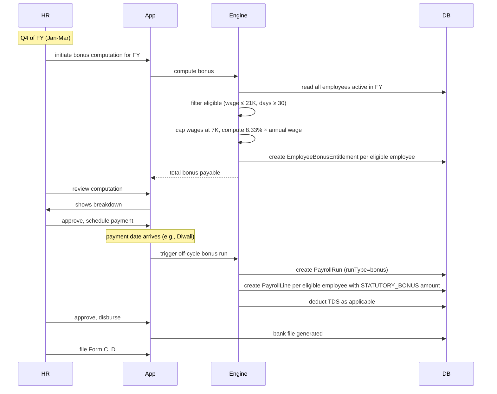

# 07 — Bonus Calculation

## Purpose

Bonuses fall into two distinct categories:

- **Statutory bonus** under the Payment of Bonus Act 1965 — mandatory for eligible employees, computed by formula
- **Performance bonus** — discretionary, tenant-defined, based on performance / business outcomes

Both are payroll components but governed by very different rules. This file specifies both.

## Statutory bonus — Payment of Bonus Act, 1965

### Applicability

The Act applies to every factory and every other establishment in which 20+ persons are employed on any day during an accounting year.

`[VERIFY]` Code on Wages 2019 § 26 retains broadly similar applicability; threshold may have changed.

### Eligibility

An employee is eligible if:

1. Drew salary or wage not exceeding ₹21,000 per month `[VERIFY current threshold; was ₹21K post-2015 amendment]`
2. Worked at least 30 days in that accounting year (FY)

For computation, salary is capped at ₹7,000 per month (or applicable minimum wage if higher) — the "calculation salary cap" `[VERIFY]`. So an employee earning ₹15,000/month gets bonus computed on ₹7,000 base.

### Computation

```
Min Bonus  = 8.33% of (eligible months' wages capped at calculation cap)
           = 8.33% × MIN(monthlyWage, 7000) × 12 (or pro-rated by months worked)

Max Bonus  = 20% of eligible wages

Allocable surplus / available surplus determines actual % between 8.33%-20%.
```

The Bonus Act's "available surplus" computation involves:

- Gross profit from balance sheet
- Less: depreciation, development rebate, direct tax provision
- Less: reserves
- = Available surplus

If available surplus > total minimum bonus liability, employer pays more (up to 20%). Otherwise, 8.33%.

`[CA-REVIEW]` Most SME tenants pay flat 8.33% as minimum without computing surplus. Larger / public companies compute surplus.

### Schema

```typescript
interface StatutoryBonusComputation extends BaseDocument {
  _id: ObjectId;
  tenantId: ObjectId;
  entityId: ObjectId;
  fyCode: string;
  
  // applicability check
  totalEmployeesInPriorYear: number;
  isApplicable: boolean;                   // 20+ persons
  
  // available surplus (if computed)
  grossProfit?: Decimal128;
  allocableSurplus?: Decimal128;           // 60-67% of available surplus
  setOnFromPriorYears?: Decimal128;
  setOffFromPriorYears?: Decimal128;
  
  // bonus rate
  computedBonusPercentage: number;         // between 0.0833 and 0.20
  bonusPercentageReason: string;           // 'minimum', 'maximum', 'computed-from-surplus'
  
  // employee-level bonus
  eligibleEmployees: number;
  totalBonusPayable: Decimal128;
  
  // payment
  paymentDeadline: string;                 // 8 months from FY end (Bonus Act § 19)
  paymentDate?: string;
  paymentPayrollRunId?: ObjectId;
  
  // statutory filings
  formAGenerated: boolean;
  formBGenerated: boolean;
  formCGenerated: boolean;
  formDFiledAt?: Date;
  
  // status
  status: 'draft' | 'computed' | 'approved' | 'paid' | 'filed';
  
  createdAt: Date;
  updatedAt: Date;
  createdBy: ObjectId;
  isDeleted: boolean;
}

interface EmployeeBonusEntitlement extends BaseDocument {
  _id: ObjectId;
  tenantId: ObjectId;
  entityId: ObjectId;
  employeeId: ObjectId;
  fyCode: string;
  bonusComputationId: ObjectId;            // ref StatutoryBonusComputation
  
  // eligibility
  isEligible: boolean;
  ineligibilityReason?: string;            // 'wage-above-threshold', 'days-worked-below-30', etc.
  
  // worked period
  daysWorkedInFy: number;
  monthsEligible: number;                  // months where wage was within threshold
  
  // wage basis
  averageMonthlyWage: Decimal128;          // basic + DA per month
  cappedMonthlyWage: Decimal128;           // min(averageMonthlyWage, 7000)
  
  // bonus
  bonusPercentage: number;
  bonusAmount: Decimal128;
  
  // payment
  paidInPayrollLineId?: ObjectId;
  paidOn?: string;
  
  createdAt: Date;
  updatedAt: Date;
  isDeleted: boolean;
}
```

### Worked example

Acme Industries Pvt Ltd, FY 2025-26 (April 2025–March 2026).

- 80 employees in FY (varies month to month; max was 80 in October)
- Bonus Act applicable (20+ employees threshold met)

#### Employee categorization

Out of 80 employees:
- 25 with wages > ₹21,000/month (salaried managers / engineers): NOT eligible
- 55 with wages ≤ ₹21,000/month: ELIGIBLE

For eligible employees:
- All worked > 30 days in FY: yes → all eligible

#### Calculation cap

For each eligible employee, calculation salary = min(actual wage, ₹7,000)

#### Bonus rate

Tenant decides: flat 8.33% (minimum), no surplus computation (default for many SMEs).

#### Per-employee bonus

```
Worker A: ₹15,000/month, worked 12 months in FY
  Monthly wage capped: 7000
  Annual eligible wage: 7000 × 12 = 84,000
  Bonus @ 8.33%: 84,000 × 0.0833 = ₹6,997 ≈ ₹7,000

Worker B: ₹10,000/month, worked 8 months (joined Aug)
  Monthly wage capped: 7000
  Annual eligible wage: 7000 × 8 = 56,000
  Bonus @ 8.33%: 56,000 × 0.0833 = ₹4,665

Worker C: ₹6,000/month, worked 12 months
  Monthly wage capped: 6000 (lower than ceiling)
  Annual eligible wage: 6000 × 12 = 72,000
  Bonus @ 8.33%: 72,000 × 0.0833 = ₹5,998 ≈ ₹6,000
```

Total payable for 55 employees: ~₹3.5L (varies)

#### Payment

Bonus must be paid within 8 months of FY end:
- FY 2025-26 ends March 31, 2026
- Bonus deadline: November 30, 2026

Tenant typically pays:
- Diwali bonus (Oct/Nov) — common practice
- Pongal bonus (Tamil Nadu, January)
- Cycle-end bonus (ad-hoc)

The HRMS schedules bonus payment as an off-cycle payroll run (`runType: 'bonus'`).

#### Statutory filings

- **Form A** — Computation of allocable surplus (if surplus method used; not required if flat)
- **Form B** — Set-on / Set-off
- **Form C** — Bonus paid to each employee
- **Form D** — Annual return to inspector (within 30 days of bonus payment) `[VERIFY]`

The HRMS auto-generates these from `EmployeeBonusEntitlement` records.

### Bonus computation flow



### Tax treatment

Statutory bonus is **fully taxable**. Treated as salary in the year of receipt. TDS applies when paid.

- If bonus paid in Q3 (Oct-Nov), TDS computed as part of that quarter's TDS
- Form 16 reflects bonus in "Salary as per § 17(1)"

### ESI on bonus

`[CA-REVIEW]` ESI Act includes bonus in wages definition for employees within ESI threshold, but with carve-outs. Statutory bonus is generally INCLUDED in ESI wage. Performance / discretionary bonus depends on context.

The HRMS `countsForEsi` flag per bonus type handles this.

## Performance bonus

Discretionary, tenant-defined. Common patterns:

### Pattern A: Annual performance bonus

- Target % of CTC, e.g., 10-15% of CTC
- Paid in next FY's first quarter (e.g., May-June for prior FY)
- Linked to performance rating

### Pattern B: Quarterly bonus

- Linked to quarterly business / individual targets
- Paid in following month

### Pattern C: Sales commission

- % of sales achieved, slab-based
- Paid monthly or quarterly
- May have caps

### Pattern D: Production incentive `[BLUE-COLLAR]`

- Linked to units produced above target
- Per unit incentive
- Paid monthly with regular pay

### Schema

```typescript
interface PerformanceBonusEntitlement extends BaseDocument {
  _id: ObjectId;
  tenantId: ObjectId;
  entityId: ObjectId;
  employeeId: ObjectId;
  
  // identity
  bonusCode: string;                       // 'PB-2026-04-001234'
  bonusType: 'annual-performance' | 'quarterly' | 'sales-commission' | 'production-incentive' | 'spot-award' | 'other';
  
  // period and basis
  performancePeriodFrom: string;
  performancePeriodTo: string;
  performanceRating?: string;              // 'Exceeds' | 'Meets' | 'Below' (or numeric)
  performanceReviewId?: ObjectId;          // ref Performance module
  
  // amount
  targetAmount: Decimal128;
  achievedAmount: Decimal128;
  finalAmount: Decimal128;                 // after capping, cliff, etc.
  multiplier?: number;                     // e.g., 0.85 for 85% achievement
  
  // approval
  approvedBy: ObjectId;
  approvedAt: Date;
  approvalLetterDocumentId?: ObjectId;
  
  // payment
  scheduledPayoutPeriodId?: ObjectId;
  paidInPayrollLineId?: ObjectId;
  paidOn?: string;
  
  // tax / statutory
  isTaxable: boolean;                      // typically true
  countsForPf: boolean;                    // varies by tenant policy
  countsForEsi: boolean;
  
  status: 'draft' | 'pending-approval' | 'approved' | 'scheduled' | 'paid' | 'cancelled';
  
  createdAt: Date;
  updatedAt: Date;
  createdBy: ObjectId;
  isDeleted: boolean;
}
```

### Approval workflow

```mermaid
sequenceDiagram
    actor Manager
    participant App
    participant HR
    participant Finance
    participant DB
    
    Manager->>App: enter bonus recommendation per reportee
    App->>DB: create PerformanceBonusEntitlement (status=draft)
    
    Manager->>App: submit batch for approval
    App->>HR: HRBP review for fairness, calibration
    HR->>App: approve / adjust
    App->>Finance: budget check
    Finance->>App: approve
    
    App->>DB: status=approved, scheduledPayoutPeriodId set
    Note over App: payout period arrives
    App->>DB: status=scheduled; auto-add to PrePayrollInput
```

### Sales commission computation

Often the most complex performance bonus type. Schema:

```typescript
interface SalesCommissionRule {
  ruleCode: string;
  applicableEmployees: ObjectId[];
  
  basis: 'gross-sales' | 'net-sales' | 'gross-profit' | 'units-sold';
  
  slabs: Array<{
    fromAchievement: number;               // % of target
    toAchievement: number | 'infinity';
    commissionRate: number;                // % of sales
    bonusMultiplier?: number;
    capAmount?: Decimal128;
  }>;
  
  payoutFrequency: 'monthly' | 'quarterly' | 'half-yearly' | 'annual';
  
  clawbackTermsMonths?: number;            // if customer cancels, recover commission
}
```

### Performance bonus tax

Same as statutory bonus: fully taxable in year of payment. TDS adjusted in payment month's monthly TDS.

`[CA-REVIEW]` Performance bonus typically counts for ESI if employee is in ESI scheme. PF less commonly.

## Bonus integration with payroll

When bonus is scheduled for payout:

1. PerformanceBonusEntitlement OR EmployeeBonusEntitlement (statutory) marked `scheduled`
2. PrePayrollInput for the period gets one-time addition with relevant component code
3. Engine processes as regular component (with appropriate statutory tagging)
4. PayrollLine includes bonus
5. Bank file disburses
6. Audit trail completes

## Reports

- **Bonus Provision Report**: total accrued bonus liability per FY
- **Bonus Disbursement Report**: actual paid per period
- **Eligibility Audit**: who's eligible / not, and why
- **Statutory Compliance**: Bonus Form C, D, deadline tracker
- **Performance Bonus Variance**: target vs achieved per employee, manager, dept

## Open questions

`[OPEN]` Calculation cap (₹7,000) under Bonus Act vs Code on Wages — has Code on Wages changed it? `[VERIFY]` if Code on Wages 2019 § 31 changes the cap.

`[OPEN]` Should HRMS support Bonus Act surplus computation (Form A)? Most SMEs don't bother; pay flat 8.33%. Recommend: provide as optional feature in v2.

`[OPEN]` Bonus paid pre-FY-end as advance (e.g., Diwali bonus in Oct for FY ending March)? Treated as advance; final settlement at FY end. Recommend: support advance + true-up.

`[OPEN]` ESI on bonus: should HRMS automatically include or treat per tenant config? Recommend: tenant config; default include for statutory, exclude for performance pending CA opinion.

`[OPEN]` Performance bonus integration with `/06-performance/` (Phase 4). Direct linkage to performance review. Recommend: yes; performance rating drives multiplier.

`[OPEN]` Bonus accrual on books (financial accounting): provide running provision report? Yes, in `/12-journal-voucher-and-accounting.md`.

## Cross-references

- [05-payroll-engine.md](./05-payroll-engine.md) — bonus as one-time addition
- [02-component-library.md](./02-component-library.md) — STATUTORY_BONUS, PERFORMANCE_BONUS components
- [03-payroll-period-and-cycle.md](./03-payroll-period-and-cycle.md) — off-cycle bonus runs
- [/06-performance/](../06-performance/) (Phase 4) — performance ratings driving bonus
- [/04-compliance/06-bonus-act.md](../04-compliance/06-bonus-act.md) — full Bonus Act details + Form A/B/C/D
