# 09 — Full & Final Settlement (F&F)

## Purpose

Full & Final settlement is the final payroll computation when an employee separates. It includes:

- Pending salary up to last working day
- Leave encashment
- Gratuity (if eligible)
- Bonus (statutory pro-rated; performance if applicable)
- Notice period buy-out (employer pays in lieu of notice; or recovery if employee short-serves)
- Recoveries (asset, loan, advance, excess pay)
- Final tax calculation (revised TDS for FY)
- Statutory contributions on F&F earnings

F&F failures cause the most legal escalations after wage disputes. Slow F&F → industrial tribunal cases. Wrong F&F → Section 7Q interest + reputational damage. The platform's commitment: **F&F within 2 working days of last working day** (industry standard is 30-45 days; many companies miss this).

## Scope

This file covers the F&F flow, schema, computations specific to F&F, recoveries, and exit clearance. Gratuity formula is in [08-gratuity-calculation.md](./08-gratuity-calculation.md); leave encashment in [/02-attendance/04-leave-accrual-engine.md](../02-attendance/04-leave-accrual-engine.md).

## F&F lifecycle

```mermaid
stateDiagram-v2
    [*] --> Initiated: separation request approved
    Initiated --> ClearanceInProgress: exit checklist routed to dept owners
    ClearanceInProgress --> ClearanceComplete: all owners signed off
    ClearanceComplete --> Computed: F&F engine run
    Computed --> Reviewed: HR + Finance review
    Reviewed --> Computed: input correction
    Reviewed --> Approved: approver signs off
    Approved --> Disbursed: bank transfer + statutory deposits
    Disbursed --> Documented: Form 16, gratuity Form L, relieving letter, experience letter
    Documented --> Closed: all done
    
    Closed --> Reopened: rare; supplementary F&F
    Reopened --> Computed
```



## Schema

```typescript
interface FnfSettlement extends BaseDocument {
  _id: ObjectId;
  tenantId: ObjectId;
  entityId: ObjectId;
  employeeId: ObjectId;
  
  // identity
  fnfCode: string;                         // 'FNF-2026-04-001234'
  
  // separation context
  separationType: 'resignation' | 'termination' | 'retirement' | 'death' | 'disablement' | 'contract-end' | 'absconding-confirmed';
  separationDate: string;                  // YYYY-MM-DD (last working day)
  separationApprovalRefId?: ObjectId;
  noticePeriodDaysRequired: number;
  noticePeriodDaysServed: number;
  noticePeriodDaysShort: number;           // > 0 means short-served
  noticeShortFallReason?: string;          // 'employer-waived' | 'employee-buyout' | 'recovery'
  
  // earning components
  pendingSalaryDays: number;               // days from period start to LWD
  pendingSalaryAmount: Decimal128;
  
  leaveEncashment: {
    eligibleDays: number;                  // by leave type
    breakdown: Array<{
      leaveTypeCode: string;
      days: number;
      ratePerDay: Decimal128;
      amount: Decimal128;
    }>;
    totalAmount: Decimal128;
    taxExemptAmount: Decimal128;           // per § 10(10AA)
    taxableAmount: Decimal128;
  };
  
  gratuity: {
    isEligible: boolean;
    yearsCompleted: number;
    formulaUsed: string;
    grossAmount: Decimal128;
    exemptionAmount: Decimal128;           // per § 10(10)
    taxableAmount: Decimal128;
    gratuityComputationId?: ObjectId;
  };
  
  bonusOwed: {
    statutoryBonusProrated: Decimal128;    // pro-rated for service in current FY
    performanceBonusOwed: Decimal128;      // any approved but unpaid
    breakdown: Array<{
      bonusType: string;
      amount: Decimal128;
    }>;
  };
  
  // one-time additions (notice buy-out, ex-gratia, severance)
  oneTimeAdditions: Array<{
    componentCode: string;
    amount: Decimal128;
    description: string;
    isTaxable: boolean;
    countsForPf: boolean;
  }>;
  
  // recoveries (deductions)
  recoveries: {
    noticePeriodRecovery: Decimal128;      // if employer recovers from employee
    assetRecovery: Array<{
      assetId: ObjectId;
      assetType: string;                   // 'laptop' | 'mobile' | 'id-card' | 'access-card' | 'company-vehicle'
      conditionOnReturn: 'returned-good' | 'returned-damaged' | 'not-returned';
      recoveryAmount: Decimal128;
    }>;
    loanOutstanding: Decimal128;
    advanceOutstanding: Decimal128;
    excessPayRecovery: Decimal128;
    customRecoveries: Array<{ description: string; amount: Decimal128 }>;
    totalRecoveries: Decimal128;
  };
  
  // statutory deductions on F&F
  statutoryDeductions: {
    pfOnFnf: Decimal128;                   // PF on pending salary + arrears
    esiOnFnf: Decimal128;
    ptOnFnf: Decimal128;
    lwfOnFnf: Decimal128;
  };
  
  // final TDS
  finalTds: {
    totalIncomeForFy: Decimal128;          // including FNF earnings
    totalTaxLiability: Decimal128;
    tdsAlreadyDeductedYtd: Decimal128;
    finalTdsToDeductAtFnf: Decimal128;     // residual; can be negative (refund)
    refundDue: Decimal128;                 // if YTD over-deducted
  };
  
  // totals
  totalEarnings: Decimal128;
  totalDeductions: Decimal128;
  finalNetAmount: Decimal128;              // earnings - deductions
  finalEmployerCost: Decimal128;
  
  // payout
  payoutMethod: 'bank-transfer' | 'cheque' | 'cash';
  bankAccountId?: ObjectId;
  scheduledPayoutDate: string;
  actualPayoutDate?: string;
  payoutReferenceNumber?: string;          // bank UTR
  
  // exit clearance
  clearanceStatus: 'pending' | 'in-progress' | 'completed';
  clearanceItems: Array<{
    deptCode: 'IT' | 'ADMIN' | 'FINANCE' | 'MANAGER' | 'SECURITY' | 'LEGAL';
    requiredItems: string[];               // ['laptop', 'access-card', ...]
    status: 'pending' | 'completed' | 'pending-with-issue';
    approverId?: ObjectId;
    approvedAt?: Date;
    notes?: string;
  }>;
  
  // documents to issue
  documentsToIssue: {
    relievingLetter: { generated: boolean; documentId?: ObjectId };
    experienceLetter: { generated: boolean; documentId?: ObjectId };
    salaryCertificate: { generated: boolean; documentId?: ObjectId };
    form16: { eligibleForFy: boolean; generated: boolean; documentId?: ObjectId };
    formL_gratuity: { applicable: boolean; generated: boolean; documentId?: ObjectId };
    pfWithdrawalForm: { applicable: boolean; routedToEmployee: boolean };
  };
  
  // payroll run reference
  fnfPayrollRunId?: ObjectId;
  fnfPayrollLineId?: ObjectId;
  
  // sla tracking
  initiatedAt: Date;
  computedAt?: Date;
  approvedAt?: Date;
  disbursedAt?: Date;
  documentedAt?: Date;
  closedAt?: Date;
  
  slaBreached: boolean;
  slaBreachReason?: string;
  
  // status
  status: 'initiated' | 'clearance-in-progress' | 'clearance-complete' | 'computed' | 'reviewed' | 'approved' | 'disbursed' | 'documented' | 'closed' | 'reopened';
  
  // exception handling
  isHeldUp: boolean;
  heldUpReason?: string;
  legalHold?: boolean;
  
  createdAt: Date;
  updatedAt: Date;
  createdBy: ObjectId;
  isDeleted: boolean;
}
```

## Indexes

```typescript
{ tenantId: 1, entityId: 1, employeeId: 1 }, unique
{ tenantId: 1, fnfCode: 1 }, unique
{ tenantId: 1, status: 1, separationDate: 1 }
{ tenantId: 1, slaBreached: 1, status: 1 }
```

## Initiation

F&F is auto-initiated when:

- Employee's `EmploymentRecord` transitions to `Separated` (resignation acceptance, termination, retirement, etc.)
- HR can also manually initiate (for backdated cases)

```typescript
async function initiateFnf(employmentRecord: EmploymentRecord): Promise<FnfSettlement> {
  // Idempotency: if FnfSettlement already exists for this separation, return it
  const existing = await FnfSettlement.findOne({ employeeId, status: { $ne: 'closed' } });
  if (existing) return existing;
  
  const fnf = await FnfSettlement.create({
    tenantId, entityId, employeeId,
    fnfCode: generateCode(),
    separationType: employmentRecord.separationReason,
    separationDate: employmentRecord.lastWorkingDay,
    noticePeriodDaysRequired: employmentRecord.noticePeriodDays,
    noticePeriodDaysServed: computeNoticeServed(employmentRecord),
    initiatedAt: now(),
    status: 'initiated',
    clearanceItems: buildClearanceChecklist(employee, entity),
  });
  
  // Trigger clearance workflow
  await triggerClearanceWorkflow(fnf);
  
  return fnf;
}
```

## Exit clearance workflow

Each clearance item routed to relevant dept owner:

```mermaid
sequenceDiagram
    participant FNF as FnfSettlement
    participant IT
    participant Admin
    participant Manager
    participant Finance
    participant Security
    
    FNF->>IT: return laptop, mobile, software access
    FNF->>Admin: return ID card, parking, locker
    FNF->>Manager: knowledge transfer, project handover
    FNF->>Finance: settle expense claims, advance recovery
    FNF->>Security: return access card, biometric removal
    
    IT->>FNF: signed off (item: laptop returned good condition)
    Admin->>FNF: signed off
    Manager->>FNF: signed off (KT complete)
    Finance->>FNF: signed off (recovery: ₹5K advance + ₹2K expenses)
    Security->>FNF: signed off
    
    FNF->>FNF: clearanceStatus=completed; trigger F&F computation
```

If any clearance item is `pending-with-issue` (e.g., laptop damaged), it surfaces to FNF computation:
- Asset recovery added to deductions
- Or marked as held-up if dispute (e.g., employee disputes the damage)

`[BLUE-COLLAR]` Factory clearance includes uniform return, tool kit, gate pass surrender. Each plant has standard checklist.

## F&F engine computation

When clearance complete, F&F engine runs:

```typescript
async function computeFnf(fnf: FnfSettlement): Promise<void> {
  // 1. Pending salary up to LWD
  const lastPayrollPeriod = await getLastClosedPeriod(fnf.employeeId);
  const daysFromPeriodStartToLwd = computeDaysSinceLastPay(fnf);
  fnf.pendingSalaryDays = daysFromPeriodStartToLwd;
  fnf.pendingSalaryAmount = computeProRatedSalary(daysFromPeriodStartToLwd, ...);
  
  // 2. Leave encashment
  fnf.leaveEncashment = await computeLeaveEncashment(fnf.employeeId, fnf.separationDate);
  // Detail in /02-attendance/04-leave-accrual-engine.md
  
  // 3. Gratuity
  fnf.gratuity = await computeGratuity(fnf.employeeId, fnf.separationDate);
  // Detail in 08-gratuity-calculation.md
  
  // 4. Statutory bonus prorated for current FY
  fnf.bonusOwed.statutoryBonusProrated = computeStatutoryBonusProrated(fnf);
  
  // 5. Performance bonus owed (approved but not yet paid)
  const pendingPerfBonuses = await PerformanceBonusEntitlement.find({
    employeeId: fnf.employeeId, status: 'approved', paidInPayrollLineId: null,
  });
  fnf.bonusOwed.performanceBonusOwed = sum(pendingPerfBonuses.map(b => b.finalAmount));
  
  // 6. Notice period
  if (fnf.noticePeriodDaysShort > 0) {
    if (fnf.noticeShortFallReason === 'employee-buyout' || isRecoveryRequired(fnf)) {
      fnf.recoveries.noticePeriodRecovery = computeNoticeRecovery(fnf);
    } else if (fnf.noticeShortFallReason === 'employer-waived') {
      // No recovery
    }
  } else if (fnf.separationType === 'termination' && employerOwesNoticeBuyout(fnf)) {
    fnf.oneTimeAdditions.push({
      componentCode: 'NOTICE_BUYOUT',
      amount: computeNoticeBuyoutAmount(fnf),
      description: 'Notice period buyout in lieu of notice',
      isTaxable: true,
      countsForPf: false,
    });
  }
  
  // 7. Recoveries (asset, loan, advance)
  await collectRecoveries(fnf);
  
  // 8. Statutory deductions on F&F earnings
  fnf.statutoryDeductions.pfOnFnf = computePfOnFnf(fnf);
  // ... etc
  
  // 9. Final TDS (recompute for full FY)
  fnf.finalTds = computeFinalTds(fnf);
  
  // 10. Totals
  fnf.totalEarnings = sumAll(...);
  fnf.totalDeductions = sumAll(...);
  fnf.finalNetAmount = fnf.totalEarnings.minus(fnf.totalDeductions);
  
  // 11. Save and create FNF PayrollRun + PayrollLine
  await createFnfPayrollRun(fnf);
  
  fnf.status = 'computed';
  fnf.computedAt = now();
  await fnf.save();
}
```

## Notice period rules

### Notice buy-out (employer-paid)

When employer terminates without notice:
- Pay equivalent of notice period in lieu
- Per Industrial Disputes Act § 25F (for "workman") and Standing Orders for others
- Buyout = (Last drawn monthly gross / 30) × notice days

### Notice recovery (employee-paid)

When employee resigns and short-serves:
- Recovery = (Notional monthly gross / 30) × short days
- Subject to maximum of net F&F amount (cannot create negative net)
- Tenant policy may waive in specific cases

`[CA-REVIEW]` Notice recovery legality: many courts have held that long notice periods (90+ days) are unreasonable. Recovery should be commensurate with actual loss. Tenant should review policy.

## Recoveries

### Asset recovery

```typescript
const assetRecovery = await Promise.all(
  employee.assignedAssets.map(async asset => {
    const returnRecord = await AssetReturn.findOne({ assetId: asset._id, fnfId: fnf._id });
    if (!returnRecord) {
      // Asset not yet returned at clearance time
      return { ...asset, conditionOnReturn: 'not-returned', recoveryAmount: asset.replacementValue };
    }
    if (returnRecord.condition === 'damaged') {
      return { ...asset, recoveryAmount: returnRecord.assessedDamageAmount };
    }
    return { ...asset, recoveryAmount: 0 };
  })
);
```

### Loan and advance

Outstanding balance at separation date is recovered. If exceeds F&F amount:
- Tenant policy: waive, send to collection, settle for less, or extend repayment plan
- Default: cap at F&F amount; remainder pursued separately

### Excess pay recovery

If audit reveals over-payment in past months:
- Recovery added to F&F deductions
- Subject to legal review (some jurisdictions limit retroactive recovery)

## Final TDS calculation

The most nuanced part of F&F. Steps:

```typescript
function computeFinalTds(fnf: FnfSettlement): FinalTdsResult {
  // 1. Aggregate FY income up to F&F
  const ytdEarnings = sumYtdPayrollLineGross(fnf.employeeId, fnf.fyCode);
  const fnfEarnings = fnf.totalEarnings;  // including encashment, gratuity, etc.
  const totalFyIncome = ytdEarnings.plus(fnfEarnings);
  
  // 2. Apply exemptions
  // - Gratuity exemption: lesser of (₹20L cap, formula amount, actual)
  // - Leave encashment exemption: per § 10(10AA)
  // - Other taxable items: notice buyout, performance bonus owed, etc.
  
  const taxableIncome = totalFyIncome
    .minus(fnf.gratuity.exemptionAmount)
    .minus(fnf.leaveEncashment.taxExemptAmount);
  
  // 3. Apply regime-specific deductions
  let netTaxable = taxableIncome;
  if (regime === 'old') {
    netTaxable = applyOldRegimeDeductions(taxableIncome, taxDeclarations);
  } else {
    netTaxable = taxableIncome.minus(75000);  // standard deduction (FY26-27 [VERIFY])
  }
  
  // 4. Compute total tax
  const totalTaxLiability = applyTdsSlabs(netTaxable, regime, employee.age).times(1.04);  // 4% cess
  
  // 5. Already deducted
  const tdsYtdDeducted = sumYtdTds(fnf.employeeId, fnf.fyCode);
  
  // 6. Residual
  const residual = totalTaxLiability.minus(tdsYtdDeducted);
  
  if (residual.gt(0)) {
    return { finalTdsToDeductAtFnf: residual, refundDue: 0 };
  } else {
    // Over-deducted in YTD; employee gets refund (via ITR, not via F&F)
    return { finalTdsToDeductAtFnf: 0, refundDue: residual.abs() };
  }
}
```

`[CA-REVIEW]` F&F TDS over-deduction: the platform DOES NOT refund excess TDS via F&F (that's not how it works). Employee claims refund via ITR. The platform clearly notes the over-deduction in F&F sheet so employee knows.

## 2-day F&F SLA

Industry baseline is 30-45 days for F&F. Many companies miss even that. The platform's commitment:

> F&F settlement disbursed within **2 working days** of last working day, provided clearance is complete.

How to achieve this:

- Clearance starts 7-14 days BEFORE LWD (not after)
- Pre-computed F&F estimate available 3 days before LWD
- Auto-routing of clearance items as soon as resignation accepted
- Manager KT completion gate
- Final tax recomputed at LWD-1; ready to disburse at LWD+1

```mermaid
gantt
    title F&F SLA Timeline (LWD = Day 0)
    dateFormat X
    axisFormat %d
    
    section Pre-LWD
    Resignation accepted             :a1, -30, 1d
    Clearance routed                  :a2, after a1, 7d
    Asset return scheduled            :a3, -7, 5d
    KT completion                     :a4, -3, 3d
    Pre-computed F&F draft           :a5, -2, 1d
    
    section LWD
    Last Working Day                  :crit, milestone, b1, 0, 0d
    
    section Post-LWD
    Final F&F computation             :c1, after b1, 1d
    HR + Finance approval             :c2, after c1, 0.5d
    Disbursement                      :crit, c3, after c2, 0.5d
    Documents issued                  :c4, after c3, 1d
```



## SLA tracking

Each FnfSettlement tracks SLA:

```typescript
slaBreached: boolean
slaBreachReason: string  // 'clearance-delayed' | 'dispute' | 'manual-hold' | 'finance-budget' | ...
```

SLA-breached F&Fs surface on tenant admin dashboard. Tenant audit logs SLA performance metrics.

## Documents issued at F&F

### Relieving letter

Standard letter on tenant letterhead:
- Confirms employee's last working day
- States no dues
- Wishes well

```typescript
interface RelievingLetterTemplate {
  body: string;                            // Liquid template with {{placeholders}}
  signatoryRole: string;
  signatoryUserId?: ObjectId;
}
```

### Experience letter

Detailed:
- Dates of employment (joining to LWD)
- Designation(s) held
- Departments / responsibilities (high level)
- Performance acknowledgment (positive only; specific issues omitted unless legally required)

`[OPEN]` Mandatory positive experience letter or factual? Some companies always issue positive; others factual. Default: factual.

### Salary certificate

For employee's records, banks, etc. Shows last drawn salary breakdown.

### Form 16 (FY-end)

If F&F is in current FY: Form 16 issued after FY end (regular cycle).
If F&F is at FY end (March): Form 16 with the F&F period included.

`[CA-REVIEW]` Form 16 for separated employees follows same Form 24Q-Q4 cycle. Issued by June 15 of following year.

### Form L (gratuity)

Auto-generated if gratuity paid.

### PF withdrawal/transfer form (Form 19, 10C, 13)

- **Form 19**: PF withdrawal (employees' share + interest)
- **Form 10C**: Pension scheme withdrawal/scheme certificate
- **Form 13**: Transfer to next employer
- **Composite Claim Form**: simpler, post-2017 for KYC-compliant employees

The HRMS:
- Generates pre-filled forms via UAN integration
- Routes to employee for signature
- Tracks submission status

`[CA-REVIEW]` PF withdrawal taxability: § 10(11) exempt if employee has 5+ years continuous service. Less than 5 years and not transferred → taxable in year of withdrawal.

## Disputed F&F

If employee disputes F&F amount:
- Dispute logged
- F&F status = 'reopened' or held
- HR + employee (sometimes legal) review
- Resolution: revised F&F or no change with reasoning
- Employee acknowledges (signed) or escalates

Industrial dispute escalation: tribunal cases typically reference F&F documentation. Hence importance of accurate, timely, well-documented F&F.

## Death cases

Special handling:

- F&F to nominees per Form F (gratuity) and family declared in employee master
- Documents to legal heirs
- TDS on amounts paid to nominees: per § 192 employer obligation
- Bank account: nominees' accounts (may need indemnity bonds in some cases)
- ESI death benefits triggered separately
- EDLI (Employees' Deposit Linked Insurance) claim under PF if applicable

`[BLUE-COLLAR]` Factories Act § 88 mandates accident reporting; if death occurs at workplace, separate workmen's compensation considerations.

## Reopening F&F

Rare, but happens:

- Late-arriving expense reimbursement
- Late performance bonus approval
- Audit finding (under or over payment)
- Legal directive

Reopening:
- Senior approval required
- Original F&F status: 'reopened'
- Supplementary F&F created
- Bank transfer (additional or recovery)
- Documents reissued if material change

## Reports

- **F&F SLA Report**: % within 2 days, breach reasons
- **F&F Cost Analysis**: encashment + gratuity + buyout per cohort
- **Recovery Report**: assets / advances recovered
- **Pending Clearances**: items aging
- **Employee Exit Insights**: separation reasons, exit interview themes (with `/05-recruitment/` integration)

## Open questions

`[OPEN]` Auto-generated relieving letter wording: positive vs factual? Some tenants want HR to sign every letter manually. Recommend: tenant config; default factual + auto-generate.

`[OPEN]` Recovery limit when net F&F insufficient. Default: cap at F&F net; remainder via separate recovery process. Tenant config.

`[OPEN]` Notice recovery for very long notices (90+ days). Some courts hold this unreasonable. Recommend: legal review per tenant policy.

`[OPEN]` PF withdrawal automation: post-2024 EPFO online claim system mature. Recommend: integrate API in v2.

`[OPEN]` Disputed F&F: should disbursement be held or partial-paid? Recommend: undisputed portion paid; disputed portion held with audit log.

`[OPEN]` Multi-state employees in F&F: PT recovery for last state? Yes (PT is monthly; whatever was due by LWD).

`[OPEN]` Form 16 for mid-FY separation: issue immediately or wait for FY end? Per § 192 + Rule 31, regular cycle (within 15 June after FY). But platform can offer "interim" salary certificate immediately for employee's needs.

## Cross-references

- [05-payroll-engine.md](./05-payroll-engine.md) — F&F is a special PayrollRun
- [08-gratuity-calculation.md](./08-gratuity-calculation.md) — gratuity in F&F
- [/02-attendance/04-leave-accrual-engine.md](../02-attendance/04-leave-accrual-engine.md) — leave encashment
- [/01-employee/06-lifecycle-state-machine.md](../01-employee/06-lifecycle-state-machine.md) — separation transition
- [/04-compliance/03-tds-and-income-tax.md](../04-compliance/03-tds-and-income-tax.md) — final TDS, Form 16
- [/04-compliance/07-gratuity-act.md](../04-compliance/07-gratuity-act.md) — Gratuity Act + Form L
