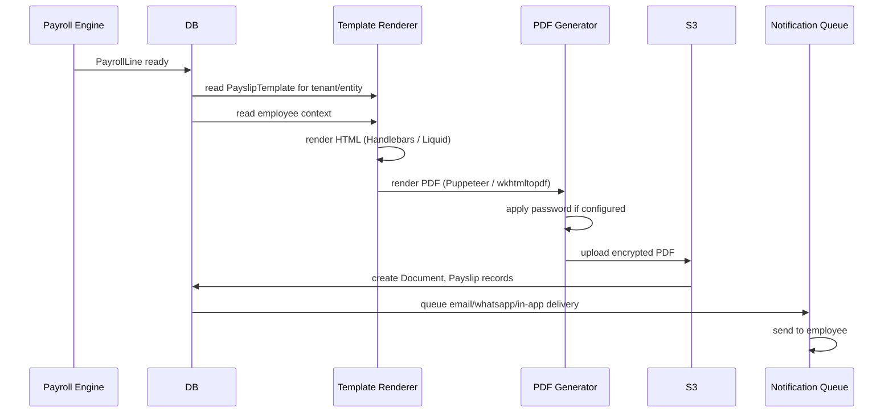

# 10 — Payslip Format

## Purpose

Payslip = the most-touched HR artifact for employees. It's the document they reference for visa applications, loans, rentals, taxes, and disputes. A bad payslip is a constant friction point; a good one is invisible.

This file specifies layout, contents, generation, delivery channels, and password protection.

## What a payslip must contain

### Statutory minimum (Code on Wages 2019 + state Shops Acts)

> Every employer shall issue a wage slip to the employee in the prescribed manner, containing such particulars as may be prescribed `[VERIFY current notification]`.

Required:
- Employee identity (name, code)
- Period (month / week / fortnight)
- Days worked / present
- Days absent / LOP
- Gross wages
- Detailed earnings breakdown (Basic, DA, HRA, allowances)
- Statutory deductions (PF, ESI, PT, TDS, LWF)
- Other deductions (loan, advance, etc.)
- Net wages paid
- Mode of payment + date
- Employer name, address, registration

### Tenant-typical additions

- Employer logo
- Company / entity name + address
- Signature of HR or systemic stamp
- "This is a system-generated payslip" notation
- YTD totals (gross, deductions, tax)
- Leave balance summary
- Contact for queries

## Schema

```typescript
interface Payslip extends BaseDocument {
  _id: ObjectId;
  tenantId: ObjectId;
  entityId: ObjectId;
  employeeId: ObjectId;
  payrollLineId: ObjectId;                 // canonical reference
  payrollPeriodId: ObjectId;
  payrollRunId: ObjectId;
  
  // identity
  payslipCode: string;                     // 'PS-2026-04-EMP00042'
  
  // template used
  templateId: ObjectId;                    // ref PayslipTemplate
  templateVersion: number;
  
  // generation
  generatedAt: Date;
  generatedBy: ObjectId | 'system';
  
  // content
  documentId: ObjectId;                    // PDF in S3
  fileName: string;                        // 'Payslip_April_2026_Pankaj_Sharma.pdf'
  fileSizeBytes: number;
  contentHash: string;                     // SHA-256
  
  // password protection
  isPasswordProtected: boolean;
  passwordHint?: string;                   // 'Your DOB DDMMYYYY'
  passwordSchemeCode: string;              // ref to scheme used (DOB, PAN last 4, custom)
  
  // delivery
  deliveryChannels: Array<{
    channel: 'email' | 'in-app' | 'whatsapp' | 'sms-link';
    deliveredAt?: Date;
    deliveryStatus: 'pending' | 'sent' | 'delivered' | 'opened' | 'failed' | 'bounced';
    failureReason?: string;
    deliveryMessageId?: string;            // SMTP message-id, etc.
  }>;
  
  // tracking
  firstViewedAt?: Date;
  viewCount: number;
  lastViewedAt?: Date;
  
  // status
  status: 'generated' | 'delivered' | 'viewed' | 'superseded';
  supersededByPayslipId?: ObjectId;        // if regenerated due to retro etc.
  
  createdAt: Date;
  updatedAt: Date;
  isDeleted: boolean;
}

interface PayslipTemplate extends BaseDocument {
  _id: ObjectId;
  tenantId: ObjectId;
  entityId?: ObjectId;
  
  templateCode: string;                    // 'STD-V1'
  name: string;
  
  // layout
  layout: 'classic' | 'modern' | 'minimal' | 'detailed' | 'custom';
  pageSize: 'A4' | 'Letter';
  orientation: 'portrait' | 'landscape';
  
  // branding
  logoDocumentId?: ObjectId;
  logoPositioning: 'top-left' | 'top-center' | 'top-right';
  primaryColor: string;                    // hex
  
  // sections
  showSections: {
    earnings: boolean;
    deductions: boolean;
    employerCosts: boolean;                // typically not shown to employee
    ytdTotals: boolean;
    leaveBalance: boolean;
    statutoryIds: boolean;                 // PF UAN, ESI IP, PAN
    bankDetails: boolean;
    taxComputation: boolean;
    contactInfo: boolean;
  };
  
  // statutory IDs visibility
  showStatutoryIds: {
    uan: boolean;
    pfMemberId: boolean;
    esiInsuranceNumber: boolean;
    pan: boolean;
    aadhaarLast4: boolean;
  };
  
  // custom sections
  customSectionsHtml?: string;
  
  // password scheme
  passwordScheme: 'employee-dob' | 'pan-last-4' | 'custom-hash' | 'none';
  passwordSchemeConfig?: any;
  
  // signatures
  systemGeneratedNotice: boolean;
  systemGeneratedNoticeText: string;       // 'This is a system-generated document...'
  
  // language
  language: string;                        // 'en' default; 'hi' Hindi; 'ta' Tamil
  
  isActive: boolean;
  effectiveFrom: Date;
  effectiveTo?: Date;
  
  createdAt: Date;
  updatedAt: Date;
  createdBy: ObjectId;
  isDeleted: boolean;
}
```

## Standard layout (classic, A4, portrait)

```
┌─────────────────────────────────────────────────────────────────┐
│  [Logo]                                                          │
│  Acme Industries Pvt Ltd                                         │
│  123 MG Road, Bangalore - 560001                                 │
│  CIN: U72200KA2010PTC123456 | PAN: AAACA1234F                   │
├─────────────────────────────────────────────────────────────────┤
│           PAYSLIP FOR THE MONTH OF APRIL 2026                    │
├─────────────────────────────────────────────────────────────────┤
│  Employee Code: EMP00042       Name: Pankaj Sharma               │
│  Designation: Senior Engineer  Department: Engineering           │
│  DOJ: 01-Apr-2024              Location: Bangalore                │
│  PAN: ABCDE1234F               UAN: 100123456789                  │
│  Bank A/C: HDFC ****1234       Pay Date: 30-Apr-2026             │
├─────────────────────────────────────────────────────────────────┤
│  Days Payable: 30   Worked Days: 22   LOP Days: 0   Leave: 0     │
├─────────────────────────────────────────────────────────────────┤
│  EARNINGS                          Amount  │  DEDUCTIONS         │
│  ────────────────────────────────────────  │  ──────────────────  │
│  Basic                            50,000   │  PF (Employee)        1,800 │
│  HRA                              25,000   │  Professional Tax       200 │
│  LTA (monthly accrual)             3,333   │  TDS                 7,313 │
│  Transport Allowance                 200   │                              │
│  Special Allowance                41,262   │                              │
│  ────────────────────────────────────────  │  ──────────────────  │
│  Gross Earnings                  119,795   │  Total Deductions    9,313 │
├─────────────────────────────────────────────────────────────────┤
│  NET PAY: ₹ 110,482                                              │
│  In Words: One Lakh Ten Thousand Four Hundred Eighty-Two Only    │
├─────────────────────────────────────────────────────────────────┤
│  YTD TOTALS (Apr-2026 to Apr-2026)                              │
│  Gross: 119,795 | Deductions: 9,313 | Tax: 7,313 | Net: 110,482 │
├─────────────────────────────────────────────────────────────────┤
│  LEAVE BALANCE                                                   │
│  EL: 1.75 days | CL: 7 days | SL: 7 days                        │
├─────────────────────────────────────────────────────────────────┤
│  This is a system-generated payslip and does not require        │
│  signature. For queries: hr@acme-industries.com                  │
└─────────────────────────────────────────────────────────────────┘
```

## Generation pipeline



### Tech choice

`[DECISION]` Use HTML → PDF via Puppeteer (Chromium headless). Reasons:

- HTML/CSS templating is familiar
- Pixel-perfect rendering
- Easy to preview / iterate
- Supports complex layouts

Alternatives considered:
- LaTeX: too rigid, complex
- React-PDF: limited styling flexibility
- wkhtmltopdf: legacy, sometimes inconsistent

For 10K-employee tenant, ~3-5 minutes of Puppeteer rendering at parallelism 4. Acceptable.

## Password protection

Default-on for all payslips. Schemes:

### Scheme 1: Employee DOB (DDMMYYYY)

Most common. Employee enters DOB to open.
- Hint shown in email: "Password is your date of birth in DDMMYYYY format"
- Example: 15041990

### Scheme 2: PAN last 4 + DOB

- Hint: "Last 4 of PAN + DOB DDMM"
- Example: 1234 + 1504 = 12341504

### Scheme 3: Custom hash

- HMAC of (employee_id, run_id, secret)
- Sent to employee via SMS (separate channel)
- More secure but more friction

### Scheme 4: No password

For internal/tenant-controlled distribution channels (in-app only, intranet).

```typescript
function applyPassword(pdfBuffer: Buffer, scheme: PasswordScheme, employee: Employee): Buffer {
  const password = computePassword(scheme, employee);
  return encryptPdf(pdfBuffer, password);  // QPDF or similar
}
```

`[CA-REVIEW]` PDF encryption: AES-256 (PDF 2.0 spec). RC4 (older) is no longer secure. Ensure PDF library uses AES.

## Delivery channels

### Email

Default channel. SMTP delivery. Email body has friendly message + attached payslip.

### In-app

Always available. Employee logs in to ESS, downloads.

### WhatsApp

Optional. Sends document via WhatsApp Business API. Limit: 16 MB; payslip well within.

### SMS link

For employees without email/smartphone. SMS contains:
- "Your April payslip is ready"
- Short link to login + view (single-use, expires 7 days)

## Idempotency

Same period + run + employee + content hash → don't regenerate. Reuse existing Payslip record.

If retro / correction → new PayrollLine + new Payslip; previous Payslip marked `superseded`.

## Re-issuance scenarios

- Employee lost PDF → re-download from ESS
- Employee changed bank → revised payslip with new bank reflected (if Pay date hasn't passed)
- Retro applied → new payslip with arrears line
- Tenant template updated → optional regeneration

## Multi-language

`[v2]` Payslips in English by default. Hindi, Tamil, Telugu, Bengali for blue-collar tenants.

Translation strategy:
- Static labels in language pack
- Numerical values stay in Indian numerals (or per locale)
- Names in original script (English; some support for Devanagari, Tamil)

## Self-service download from ESS

Employee can:
- View current month
- Download PDF
- Browse history (per FY)
- Bulk download (annual = 12 PDFs in zip)
- Generate annual statement (custom report aggregating all months)

## Audit and security

- Every payslip generation logged
- Every download logged (employee viewed at HH:MM:SS)
- HR / managers viewing employee payslips logged
- Bulk export by HR Manager: extra audit, requires reason

## Compliance

- Password protection: protects against accidental email forwarding
- Retention: 7 years per Income Tax Act § 230
- Hash: tamper detection
- Encryption at rest in S3
- TLS for delivery channels

## Edge cases

| Case | Handling |
|---|---|
| Employee has no email | Use in-app + WhatsApp + SMS link |
| Employee on long leave | Payslip generated normally; delivered via in-app |
| Separated employee | Final payslip with F&F; mailed to personal email (set in employee master) |
| Employee disputes payslip | Original retained; regeneration only after resolution |
| Tenant changes template mid-FY | Old payslips not regenerated; new ones use new template |
| Decimal display | "₹ 110,482.00" Indian numbering format (commas at thousands, then crores) |

## Open questions

`[OPEN]` Should employer costs be shown on payslip (CTC view)? Some companies show; tradition is gross/deductions/net. Recommend: tenant config; default no.

`[OPEN]` Auto-translate to employee's preferred language? Translation accuracy concerns for legal docs. Recommend: English default; explicit tenant config for additional languages with disclaimer.

`[OPEN]` Payslip for ESOP value (notional)? Tenant config. Some companies include "ESOP value vested this period: ₹X" as non-cash entry. Recommend: optional row in earnings breakdown.

`[OPEN]` Salary certificate vs payslip — different documents? Salary certificate is a separate doc for external use (banks, visas). Recommend: generate on-demand from ESS.

`[OPEN]` Print payslips physically for blue-collar? Yes, optional. Print-friendly format; tenant prints in batch.

## Cross-references

- [05-payroll-engine.md](./05-payroll-engine.md) — PayrollLine drives content
- [/01-employee/05-documents-and-kyc.md](../01-employee/05-documents-and-kyc.md) — Document storage
- [/07-ess-mobile/](../07-ess-mobile/) (Phase 4) — ESS payslip access
- [/00-foundations/04-audit-and-compliance-hooks.md](../00-foundations/04-audit-and-compliance-hooks.md) — audit log
