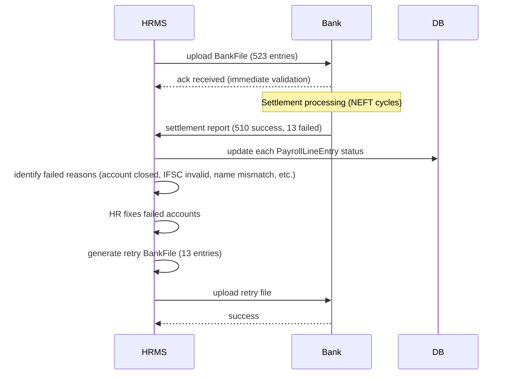

# 11 — Bank File Formats

## Purpose

After payroll computes net pay per employee, the disbursement happens via bulk bank files uploaded to the corporate banking portal (or via API). Each major Indian bank has its own file format. This file specifies all supported formats, validation rules, and the abstraction layer.

## Supported banks

| Bank | Format | Mode | Notes |
|---|---|---|---|
| HDFC | NetBanking salary upload (TXT / Excel) | NEFT / IMPS / RTGS | Most common in tech / corporate |
| SBI | CMP (Cash Management Product) - structured TXT | NEFT / Internal | Public sector standard |
| ICICI | CIB (Corporate Internet Banking) - Excel / TXT | NEFT / IMPS | Common in mid-sized corp |
| Axis | Corporate Internet Banking - structured TXT | NEFT / IMPS / RTGS | |
| Kotak | KCMS Bulk - structured TXT | NEFT / IMPS | |
| Yes Bank | Yes Connect - structured TXT | NEFT / IMPS | |
| IndusInd | Corporate Internet - Excel | NEFT / IMPS | |
| Standard Chartered | Straight2Bank - XML | NEFT / Wire | International capable |
| Citibank | CitiDirect - XML | NEFT / Wire | |
| Generic NEFT | Standard format | NEFT | For any RBI-compliant bank |
| Generic RTGS | Standard format | RTGS | High-value (₹2L+) |
| Generic IMPS | Standard format | IMPS | Real-time, 24/7 |
| ACH / NACH | NPCI ACH-Credit format | NACH | Bulk recurring |

`[VERIFY]` Format specifications change periodically. Tenants should test current format with their bank before production.

## Generic structure

Every bank file requires per-employee:
- Beneficiary name
- Beneficiary account number
- Beneficiary IFSC code
- Beneficiary bank name (optional in IFSC era)
- Amount
- Reference / description (e.g., "Salary April 2026")

Plus header:
- Corporate account
- Total count
- Total amount
- Value date (when employees should receive)
- Mode

## Schema

```typescript
interface BankFile extends BaseDocument {
  _id: ObjectId;
  tenantId: ObjectId;
  entityId: ObjectId;
  payrollRunId: ObjectId;
  
  // identity
  bankFileCode: string;                    // 'BF-2026-04-PRI-001'
  
  // bank
  bankCode: BankCode;
  bankAccountId: ObjectId;                 // ref CorporateBankAccount
  
  // file
  fileName: string;                        // 'HDFC_SAL_APR2026_30042026.txt'
  fileFormat: 'txt' | 'excel' | 'csv' | 'xml' | 'json';
  documentId: ObjectId;                    // S3 reference
  fileSizeBytes: number;
  contentHash: string;
  
  // content summary
  totalEmployees: number;
  totalAmount: Decimal128;
  paymentMode: 'NEFT' | 'IMPS' | 'RTGS' | 'NACH' | 'INTERNAL';
  valueDate: string;                       // YYYY-MM-DD when funds settle
  
  // mode-specific
  rtgsMinAmountThreshold?: Decimal128;     // entries above use RTGS, below NEFT
  
  // status
  status: 'draft' | 'generated' | 'uploaded' | 'processed' | 'partial-success' | 'failed' | 'reconciled';
  
  // upload tracking
  uploadedAt?: Date;
  uploadedBy?: ObjectId;
  bankAcknowledgmentReference?: string;    // bank's batch ID
  
  // settlement
  settlementStartedAt?: Date;
  settlementCompletedAt?: Date;
  
  // results per employee
  payrollLineEntries: Array<{
    payrollLineId: ObjectId;
    employeeId: ObjectId;
    bankAccountLast4: string;
    amount: Decimal128;
    referenceField: string;
    
    // outcome
    bankResponseCode?: string;             // bank's status code
    bankUtrNumber?: string;                // RBI Unique Transaction Reference
    settlementStatus: 'pending' | 'success' | 'failed' | 'returned';
    failureReason?: string;
    settledAt?: Date;
  }>;
  
  // summary
  successfulCount: number;
  failedCount: number;
  failedAmount: Decimal128;
  
  // re-attempts
  retryCount: number;
  parentFileId?: ObjectId;                 // if this is a retry
  
  createdAt: Date;
  updatedAt: Date;
  generatedBy: ObjectId;
  isDeleted: boolean;
}
```

## HDFC NetBanking salary upload (most common)

### Format: TXT, pipe-delimited

```
PAYMENT_TYPE|DEBIT_AC|BENEFICIARY_NAME|BENEFICIARY_AC|BENEFICIARY_IFSC|AMOUNT|REMARKS|VALUE_DATE
SAL|50100012345678|PANKAJ KUMAR SHARMA|HDFC0000123|50100087654321|110482.00|SAL-APR-2026|30042026
SAL|50100012345678|ANJALI RAM|HDFC0000456|50100098765432|95234.00|SAL-APR-2026|30042026
...
```

Header row required. Date format: DDMMYYYY. Amount: 2 decimal places.

### Validation

- Beneficiary name: max 50 chars, alphanumeric + spaces
- IFSC: 11 chars, validated against RBI list (matches regex `^[A-Z]{4}0[A-Z0-9]{6}$`)
- Account: 9-18 digits typically
- Amount: > 0, ≤ ₹10 lakh per entry (NEFT cap; use RTGS for above)

### Mode-routing logic

```typescript
function routeMode(amount: Decimal128): PaymentMode {
  if (amount.gte(200000)) return 'RTGS';   // ₹2L+ via RTGS
  if (employee.bankMatchesEmployer) return 'INTERNAL';  // intra-bank free
  return 'NEFT';                           // default
}
```

`[VERIFY]` RTGS minimum was ₹2 lakh; check current RBI threshold.

## SBI CMP format

### Format: Fixed-width TXT

```
HDR|BATCH001|10042026|BSI|...
DTL|01|EMP00042|PANKAJ KUMAR SHARMA|HDFC0000123|50100087654321|       110482.00|SAL APRIL 2026
DTL|02|EMP00100|ANJALI RAM|HDFC0000456|50100098765432|        95234.00|SAL APRIL 2026
...
TRL|TOTAL|2|205716.00
```

Header (HDR), detail rows (DTL), trailer (TRL). Fixed-width amounts (right-justified).

## ICICI CIB format

### Format: Excel template

Standard template with headers in fixed columns:

| Sl No | Beneficiary Name | A/c No | IFSC | Amount | Mode | Remarks |
|---|---|---|---|---|---|---|
| 1 | PANKAJ KUMAR SHARMA | 50100087654321 | HDFC0000123 | 110482.00 | NEFT | SAL APR 2026 |

Saved as XLSX, uploaded via CIB portal.

### TXT fallback

ICICI also accepts comma-separated TXT with similar columns.

## Generic NEFT format (RBI-compliant)

For tenants whose bank isn't directly supported:

### Format: Tab-delimited TXT

```
SrNo	BeneficiaryName	AccountNumber	IFSC	BankName	Amount	Mode	Reference
1	PANKAJ KUMAR SHARMA	50100087654321	HDFC0000123	HDFC Bank	110482.00	NEFT	SAL-APR-2026-EMP00042
```

Most banks accept some variation of this.

## XML formats (StanChart, Citi)

### Format: XML

```xml
<?xml version="1.0" encoding="UTF-8"?>
<PaymentBatch>
  <Header>
    <BatchId>BATCH001</BatchId>
    <ValueDate>2026-04-30</ValueDate>
    <DebitAccount>50100012345678</DebitAccount>
    <Currency>INR</Currency>
  </Header>
  <Payments>
    <Payment>
      <BeneficiaryName>PANKAJ KUMAR SHARMA</BeneficiaryName>
      <BeneficiaryAccount>50100087654321</BeneficiaryAccount>
      <BeneficiaryIFSC>HDFC0000123</BeneficiaryIFSC>
      <Amount>110482.00</Amount>
      <Mode>NEFT</Mode>
      <Reference>SAL-APR-2026-EMP00042</Reference>
    </Payment>
    ...
  </Payments>
  <Trailer>
    <TotalCount>523</TotalCount>
    <TotalAmount>54231923.00</TotalAmount>
    <Hash>...</Hash>
  </Trailer>
</PaymentBatch>
```

## NACH-Credit format (recurring auto-debit style)

For ACH/NACH disbursement (less common for salary, more for vendor payments):

NPCI's ACH-Credit format. Fixed-width TXT with specific positions.

`[v2]` NACH support — most tenants don't use for salary.

## Adapter abstraction

Internal: a single canonical `PaymentBatch` representation, then adapters generate per-bank formats:

```typescript
interface CanonicalPaymentBatch {
  payments: Array<{
    beneficiaryName: string;
    beneficiaryAccount: string;
    beneficiaryIFSC: string;
    beneficiaryBankName: string;
    amount: Decimal128;
    mode: 'NEFT' | 'IMPS' | 'RTGS' | 'INTERNAL';
    reference: string;
    employeeId: ObjectId;
    payrollLineId: ObjectId;
  }>;
  
  header: {
    debitAccount: string;
    valueDate: string;
    currency: 'INR';
    totalCount: number;
    totalAmount: Decimal128;
  };
}

interface BankFileAdapter {
  bankCode: BankCode;
  formatName: string;
  
  generate(batch: CanonicalPaymentBatch): Buffer;
  validate(file: Buffer): ValidationResult;
  parseAcknowledgment(ack: Buffer): AcknowledgmentResult;
}
```

Adapters per bank: `HdfcSalaryAdapter`, `SbiCmpAdapter`, `IciciCibAdapter`, etc.

## Validation pre-upload

Before generating file:

| Check | Severity |
|---|---|
| All employees have bank account on file | error |
| Bank accounts have valid IFSC (regex + RBI list lookup) | error |
| Account number length matches bank's standard | warning |
| Beneficiary name matches bank account (per name verification API where available) | warning |
| Amount > 0 | error |
| Amount > 0.01 (no zero-pay) | warning |
| Amount within bank's per-transaction limit | error (if violated) |
| Total amount within tenant's daily cap | error |
| Sum of detail amounts = trailer total | error |

`[v2]` Penny test integration: send ₹1 to verify account before first salary disbursement.

## Account verification

### Pre-payroll account verification

Tenants should verify employee bank accounts before first salary:

- **Penny verification**: Send ₹1; bank returns success/failure with name match
- **Bank account verification API**: NPCI's IFSC + Account API (some banks support directly)
- **Cheque image**: employee uploads cancelled cheque

The HRMS:
- Penny verification automatic on first compensation record creation `[v2]`
- Manual verification fallback: HR uploads cancelled cheque
- "Verified" status on bank account before first salary

## Re-runs and retries

When some payments fail:



Failure reason codes (mapped from bank-specific to canonical):

| Canonical reason | Description |
|---|---|
| `account-closed` | Account no longer active |
| `account-frozen` | Frozen by court / bank |
| `invalid-account` | Account number wrong |
| `invalid-ifsc` | IFSC wrong or branch closed |
| `name-mismatch` | Beneficiary name doesn't match account |
| `insufficient-funds` | Corporate account out of funds (rare) |
| `daily-limit-exceeded` | Bank's daily limit hit |
| `held-up-by-bank` | Bank fraud check held |
| `unknown` | Other |

## Audit and reconciliation

Every step:
- File generated → audit log
- File uploaded → audit log + bank acknowledgment stored
- Settlement received → per-line status update
- Failed payments → exception queue + retry
- Reconciliation report → end of day

Settlement report integration `[v2]`: API integration where bank pushes status updates.

## Splits and multi-bank disbursement

Some employees split salary across multiple accounts:

```typescript
interface BankAccount {
  // ... in employee master
  isPrimary: boolean;
  splitConfig?: {
    type: 'fixed-amount' | 'percentage';
    amount?: Decimal128;
    percentage?: number;
  };
}
```

Engine generates multiple PaymentBatch entries for that employee — one per account. Total still equals net pay.

## Cash payment

Some `[BLUE-COLLAR]` workers paid in cash (legally required to be banking but reality differs):

- Per Section 6 of Payment of Wages Act 1936 (and Wage Code 2019), wages above ₹1,000 must be paid by bank/cheque/electronic mode unless exempted by State Government
- Tenant should migrate to bank payment ASAP
- HRMS supports cash payment as `paymentMode='cash'`; produces cash voucher signed by employee
- Cash payment register maintained for compliance

`[VERIFY]` Wage Code 2019 § 15(1) prefers electronic payment. Cash exemption requires state notification.

## Disbursement timing

Pay date = day employees expect to receive money. NEFT settlement times:

| Mode | Cutoff | Settlement |
|---|---|---|
| NEFT | Half-hourly batches, 24/7 (post-2019 RBI mandate) | 30-60 min typical |
| IMPS | Real-time | < 30 sec |
| RTGS | 24/7 (post-2020 RBI mandate) | Real-time |
| Internal (same bank) | 24/7 | Instant |

Recommendation: Generate bank file day before pay date; upload to bank early morning of pay date.

`[VERIFY]` RBI rules on NEFT/RTGS may have evolved; check current cutoffs.

## Open questions

`[OPEN]` Bank API integration vs file upload. Some banks offer host-to-host APIs (UPI 2.0, instant, programmatic). Recommend: support file upload as default in v1; APIs in v2 per partnership.

`[OPEN]` Should tenant approve bank file before generation, or generate then approve? Recommend: generate then approve; file is preview-able as PDF summary.

`[OPEN]` Multi-currency in v3 for international hires. Currently INR only.

`[OPEN]` Hybrid disbursement (some via Razorpay/Cashfree payouts API for instant transfer; some via bank file). Recommend: support multi-channel; tenant configures.

`[OPEN]` Failure recovery: auto-retry vs HR-triggered? Recommend: HR-triggered after fixing root cause (e.g., updated account); auto-retry for transient failures only.

## Cross-references

- [05-payroll-engine.md](./05-payroll-engine.md) — PayrollLine drives bank entries
- [09-fnf-settlement.md](./09-fnf-settlement.md) — F&F separate disbursement
- [/01-employee/01-employee-master-schema.md](../01-employee/01-employee-master-schema.md) — bank account schema
- [/00-foundations/04-audit-and-compliance-hooks.md](../00-foundations/04-audit-and-compliance-hooks.md) — audit
