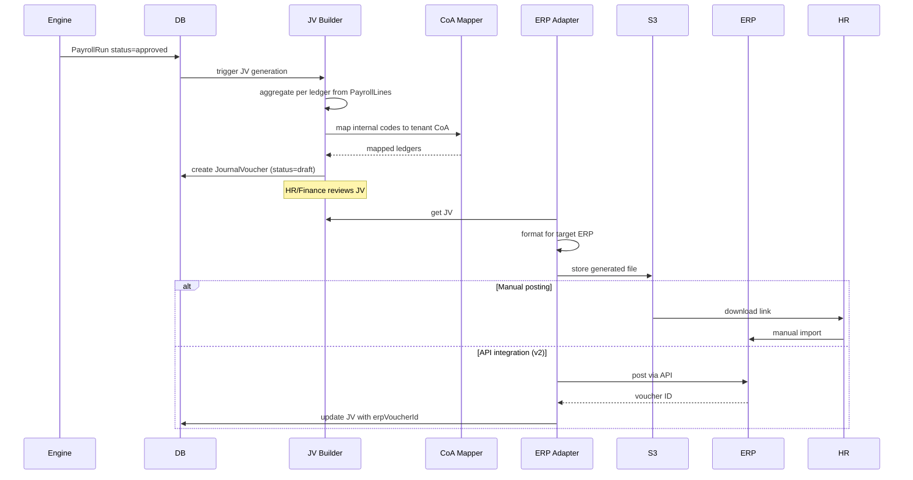

# 12 — Journal Voucher & Accounting Integration

## Purpose

After payroll computes, accounting must record it: salary expense, employer cost expense, statutory liability accruals, bank disbursement entry. Indian SMEs use Tally (overwhelmingly), Zoho Books, or SAP. Larger enterprises use SAP, Oracle, NetSuite. Many tenants do manual entry or copy-paste.

This file specifies the canonical journal voucher (JV) structure, target ERP formats (Tally XML, Zoho CSV, SAP iDoc, generic), and the chart-of-accounts (CoA) mapping.

## What payroll posts to accounting

Per payroll period, the following ledger entries must be created:

### Standard JV structure

```
Debit (Expense)                                     Credit
────────────────────────────────                    ─────────────────────────
Salaries & Wages (Earnings Gross)                   Salary Payable
Employer PF Contribution                            Statutory Liability - PF
Employer ESI Contribution                           Statutory Liability - ESI
Gratuity Provision                                  Provision for Gratuity
Group Health Insurance Premium                      Insurance Payable
EDLI / PF Admin Charges                             Statutory Liability - PF Admin
                                                    TDS Payable
                                                    PF (Employee Share)
                                                    ESI (Employee Share)
                                                    PT Payable
                                                    LWF Payable
                                                    Loan Recovery (asset)
Total Debits = Total Credits
```

When salary is disbursed:

```
Debit                                               Credit
────────────────                                    ──────────────────
Salary Payable                                      Bank Account
```

When statutory deposits made:

```
Debit                                               Credit
────────────────                                    ──────────────────
Statutory Liability - PF                            Bank Account
Statutory Liability - ESI                           Bank Account
TDS Payable                                         Bank Account
PT Payable                                          Bank Account
LWF Payable                                         Bank Account
```

## Schema

```typescript
interface JournalVoucher extends BaseDocument {
  _id: ObjectId;
  tenantId: ObjectId;
  entityId: ObjectId;
  payrollRunId: ObjectId;
  
  // identity
  jvCode: string;                          // 'JV-2026-04-PAY-001'
  jvType: 'payroll-accrual' | 'payroll-disbursement' | 'statutory-deposit' | 'fnf' | 'bonus' | 'gratuity-payout';
  
  // dates
  jvDate: string;                          // YYYY-MM-DD ledger date
  effectiveDate: string;                   // when entries posted
  
  // entries (debit + credit; sum to zero)
  entries: JvEntry[];
  
  // summary
  totalDebits: Decimal128;
  totalCredits: Decimal128;
  isBalanced: boolean;                     // debits == credits
  
  // narration
  narration: string;                       // 'Salary expense for April 2026'
  
  // accounting integration
  postedToErp: boolean;
  erpType?: 'tally' | 'zoho' | 'sap' | 'oracle' | 'netsuite' | 'busy' | 'manual';
  erpVoucherId?: string;                   // returned by ERP
  postedAt?: Date;
  postedBy?: ObjectId;
  
  // export files
  exportedFiles?: Array<{
    erpType: string;
    format: string;
    documentId: ObjectId;                  // file in S3
    generatedAt: Date;
  }>;
  
  // status
  status: 'draft' | 'reviewed' | 'approved' | 'posted' | 'reversed';
  
  // reversal
  reversalOfJvId?: ObjectId;               // if this is a reversal
  reversedAt?: Date;
  reversedBy?: ObjectId;
  reversalReason?: string;
  
  createdAt: Date;
  updatedAt: Date;
  createdBy: ObjectId;
  isDeleted: boolean;
}

interface JvEntry {
  sequence: number;
  
  // ledger
  ledgerCode: string;                      // tenant's CoA code; e.g., '5001-Salaries'
  ledgerName: string;                      // 'Salaries & Wages'
  
  // amount
  debitAmount: Decimal128;                 // 0 if credit entry
  creditAmount: Decimal128;                // 0 if debit entry
  
  // analytical dimensions (for cost center / departmental reporting)
  costCenterCode?: string;
  departmentCode?: string;
  locationCode?: string;
  projectCode?: string;
  employeeCode?: string;                   // for some detailed accounts
  
  // narration per entry
  narration?: string;
  
  // reference
  referenceType?: string;                  // 'payroll-line', 'pf-deposit', etc.
  referenceId?: ObjectId;
}
```

## Chart of Accounts mapping

Tenants have their own CoA. The HRMS maintains a mapping per tenant:

```typescript
interface CoaMapping extends BaseDocument {
  _id: ObjectId;
  tenantId: ObjectId;
  entityId?: ObjectId;
  
  // from HRMS internal account
  internalAccountCode: InternalAccountCode;
  
  // to tenant's CoA
  tenantLedgerCode: string;
  tenantLedgerName: string;
  
  // hierarchy (for reporting)
  group?: string;                          // 'Indirect Expenses'
  subGroup?: string;                       // 'Personnel Costs'
  
  isActive: boolean;
  effectiveFrom: Date;
  effectiveTo?: Date;
  
  createdAt: Date;
  updatedAt: Date;
  createdBy: ObjectId;
  isDeleted: boolean;
}

type InternalAccountCode =
  // expense
  | 'EXP-SALARIES'
  | 'EXP-WAGES'
  | 'EXP-OVERTIME'
  | 'EXP-BONUS-STATUTORY'
  | 'EXP-BONUS-PERFORMANCE'
  | 'EXP-EMPLOYER-PF'
  | 'EXP-EMPLOYER-ESI'
  | 'EXP-EMPLOYER-PF-ADMIN'
  | 'EXP-EDLI'
  | 'EXP-GRATUITY-PROVISION'
  | 'EXP-GROUP-HEALTH'
  | 'EXP-GROUP-LIFE'
  | 'EXP-WORKMEN-COMP'
  | 'EXP-LEAVE-ENCASHMENT'
  
  // liability (credit-side)
  | 'LIAB-SALARY-PAYABLE'
  | 'LIAB-PF-EMPLOYEE'
  | 'LIAB-PF-EMPLOYER'
  | 'LIAB-EPS-EMPLOYER'
  | 'LIAB-PF-ADMIN'
  | 'LIAB-EDLI'
  | 'LIAB-ESI-EMPLOYEE'
  | 'LIAB-ESI-EMPLOYER'
  | 'LIAB-TDS-PAYABLE'
  | 'LIAB-PT-PAYABLE'
  | 'LIAB-LWF-PAYABLE'
  | 'LIAB-PROVISION-GRATUITY'
  | 'LIAB-PROVISION-LEAVE'
  | 'LIAB-INSURANCE-PAYABLE'
  | 'LIAB-LOAN-RECOVERY-CONTRA'
  | 'LIAB-ADVANCE-RECOVERY-CONTRA'
  
  // bank
  | 'BANK-CORPORATE-PRIMARY'
  | 'BANK-CORPORATE-SALARY';
```

Tenants configure mappings; defaults provided per common ERP.

## Tally XML format

Tally is the most popular accounting in Indian SMEs. Imports XML files via "XML Import" feature.

### Format

```xml
<ENVELOPE>
  <HEADER>
    <TALLYREQUEST>Import Data</TALLYREQUEST>
  </HEADER>
  <BODY>
    <IMPORTDATA>
      <REQUESTDESC>
        <REPORTNAME>Vouchers</REPORTNAME>
        <STATICVARIABLES>
          <SVCURRENTCOMPANY>Acme Industries Pvt Ltd</SVCURRENTCOMPANY>
        </STATICVARIABLES>
      </REQUESTDESC>
      <REQUESTDATA>
        <TALLYMESSAGE>
          <VOUCHER VCHTYPE="Journal" ACTION="Create">
            <DATE>20260430</DATE>
            <NARRATION>Salary expense for April 2026</NARRATION>
            <VOUCHERTYPENAME>Journal</VOUCHERTYPENAME>
            <VOUCHERNUMBER>JV-2026-04-PAY-001</VOUCHERNUMBER>
            <REFERENCE>JV-2026-04-PAY-001</REFERENCE>
            
            <ALLLEDGERENTRIES.LIST>
              <LEDGERNAME>Salaries &amp; Wages</LEDGERNAME>
              <ISDEEMEDPOSITIVE>Yes</ISDEEMEDPOSITIVE>
              <AMOUNT>-5423192.00</AMOUNT>
            </ALLLEDGERENTRIES.LIST>
            
            <ALLLEDGERENTRIES.LIST>
              <LEDGERNAME>Employer PF Contribution</LEDGERNAME>
              <ISDEEMEDPOSITIVE>Yes</ISDEEMEDPOSITIVE>
              <AMOUNT>-456000.00</AMOUNT>
            </ALLLEDGERENTRIES.LIST>
            
            <ALLLEDGERENTRIES.LIST>
              <LEDGERNAME>Salary Payable</LEDGERNAME>
              <ISDEEMEDPOSITIVE>No</ISDEEMEDPOSITIVE>
              <AMOUNT>4567892.00</AMOUNT>
            </ALLLEDGERENTRIES.LIST>
            
            <!-- ... more entries -->
          </VOUCHER>
        </TALLYMESSAGE>
      </REQUESTDATA>
    </IMPORTDATA>
  </BODY>
</ENVELOPE>
```

Tally conventions:
- `ISDEEMEDPOSITIVE=Yes` and negative amount = debit (it's flipped — confusing but standard)
- Amounts in paise or rupees per Tally's setting; stick to rupees with 2 decimals

`[VERIFY]` Tally Prime (latest) accepts same XML structure. Older Tally ERP 9 has slight format differences.

### Cost center & dimensions

For cost-centric reporting:

```xml
<ALLLEDGERENTRIES.LIST>
  <LEDGERNAME>Salaries &amp; Wages</LEDGERNAME>
  <ISDEEMEDPOSITIVE>Yes</ISDEEMEDPOSITIVE>
  <AMOUNT>-1500000.00</AMOUNT>
  <CATEGORYALLOCATIONS.LIST>
    <CATEGORY>Department</CATEGORY>
    <COSTCENTREALLOCATIONS.LIST>
      <NAME>Engineering</NAME>
      <AMOUNT>-1500000.00</AMOUNT>
    </COSTCENTREALLOCATIONS.LIST>
  </CATEGORYALLOCATIONS.LIST>
</ALLLEDGERENTRIES.LIST>
```

## Zoho Books CSV format

### Format

```csv
Journal#,Date,Account,Description,Reference#,Notes,Debit,Credit
JV-2026-04-001,2026-04-30,"Salaries & Wages",Salary Apr 2026,JV-2026-04-001,,5423192.00,
JV-2026-04-001,2026-04-30,"Employer PF Contribution",PF April,JV-2026-04-001,,456000.00,
JV-2026-04-001,2026-04-30,"Salary Payable",Salary payable,JV-2026-04-001,,,4567892.00
JV-2026-04-001,2026-04-30,"PF Payable",PF deposit pending,JV-2026-04-001,,,648000.00
...
```

Zoho conventions:
- One row per ledger entry
- All entries of same JV share Journal#
- Debit and Credit in separate columns
- Tags, contacts can be added for analytics

`[v2]` Zoho Books has a REST API — direct posting (vs CSV) is cleaner.

## SAP iDoc format `[v2]`

Larger tenants on SAP. iDoc structure:

```
EDI_DC40 (Control record)
E1FIKPF (Document header)
E1FISEG (Line items, repeated)
```

Complex; skipped in v1. Specifically a v2 enterprise feature.

## Generic JE Excel template

For tenants with custom / niche ERP:

| Date | Voucher No | Account Code | Account Name | Debit | Credit | Cost Center | Reference |
|---|---|---|---|---|---|---|---|
| 30-04-2026 | JV-2026-04-001 | 5001 | Salaries & Wages | 5423192.00 | | ENG | Apr Salary |
| 30-04-2026 | JV-2026-04-001 | 5002 | Employer PF | 456000.00 | | ENG | Apr Salary |
| 30-04-2026 | JV-2026-04-001 | 2001 | Salary Payable | | 4567892.00 | | Apr Salary |

Tenants import this into their ERP.

## JV generation pipeline



## Provisioning (accrual basis)

For tenants on accrual accounting:

- **Bonus provision**: monthly accrual of pro-rated statutory + performance bonus
  - Debit: Bonus Expense
  - Credit: Provision for Bonus
- **Gratuity provision**: monthly accrual at 4.81% of basic
  - Debit: Gratuity Expense
  - Credit: Provision for Gratuity (long-term liability)
- **Leave provision**: monthly accrual of EL accrual × wage rate
  - Debit: Leave Expense
  - Credit: Provision for Leave Encashment

`[CA-REVIEW]` Ind AS 19 / AS 15 Employee Benefits requires actuarial valuation for gratuity; flat 4.81% is approximation. Larger tenants engage actuaries; HRMS supports actuarial input override.

## Reversals

When payroll is re-run with material changes:

- Original JV: status='reversed', `reversedAt`, `reversedBy`
- Reversal JV: opposite signs (debits become credits, vice versa)
- New JV: with corrected amounts
- All three JVs reference each other for audit trail

## Multi-entity consolidation

For tenants with multiple entities:

- Each entity has its own JVs (own CoA, own books)
- Cross-entity reporting: HRMS aggregates JVs for executive dashboard
- ERP-level consolidation: ERP-specific (Tally has consolidation; SAP has CO-PA)

## Cost center / dimension allocation

```typescript
function allocateToDepts(payrollLines: PayrollLine[]): JvEntry[] {
  const grouped = groupBy(payrollLines, l => l.employee.departmentId);
  return Object.entries(grouped).map(([deptId, lines]) => ({
    ledgerCode: 'EXP-SALARIES',
    debitAmount: sum(lines.map(l => l.earningsLopAdjusted)),
    creditAmount: 0,
    departmentCode: getDeptCode(deptId),
    narration: `Salary - ${getDeptName(deptId)} - April 2026`,
  }));
}
```

Per-employee detail: typically NOT in JV (high volume). Allocation by dept / cost center / location is standard.

`[OPEN]` Some tenants want per-employee detail (employee code as analytical tag). HRMS supports via `employeeCode` field on JvEntry; tenant config.

## Posting frequency

| JV type | Frequency |
|---|---|
| Payroll accrual | Monthly (at run approval) |
| Salary disbursement | Monthly (at bank file upload) |
| PF deposit | Monthly (at challan payment) |
| ESI deposit | Monthly (at challan payment) |
| TDS deposit | Monthly (at TDS payment, 7th of next month) |
| PT deposit | Per state cycle |
| Bonus payment | At payment (off-cycle) |
| Gratuity provision | Monthly (with payroll accrual) |
| Gratuity payout | At F&F or retirement |

## Audit and tracking

- Every JV creation logged
- ERP posting (manual or API) logged with reference
- Reconciliation reports: HRMS JV total vs ERP posted total
- Discrepancies flagged

## Reports for finance team

- **Payroll Cost by Department**: monthly P&L slice
- **Statutory Liability Aging**: when each liability cleared
- **Provisioning Movement**: bonus, gratuity, leave provisions over time
- **Payroll vs Budget**: variance analysis
- **CoA Movement**: ledger-level period summary

## Open questions

`[OPEN]` Real-time ERP integration (Tally Prime API, Zoho API, SAP API)? v2. Many tenants prefer file-based for control.

`[OPEN]` Department vs cost center vs project: which dimension to support? Recommend: all three; per-tenant config of which to use.

`[OPEN]` Currency: forward compat to multi-currency? v3.

`[OPEN]` IFRS / Ind AS reporting: separate disclosures (employee benefit obligations, retirement benefit obligations). Recommend: actuarial integration in v2.

`[OPEN]` Employee-level GL detail. High volume but useful for some tenants. Recommend: tenant config; default aggregated by dept.

## Cross-references

- [05-payroll-engine.md](./05-payroll-engine.md) — PayrollLine drives JV
- [11-bank-file-formats.md](./11-bank-file-formats.md) — disbursement JV
- [/04-compliance/](../04-compliance/) — statutory deposit JVs
- [/00-foundations/04-audit-and-compliance-hooks.md](../00-foundations/04-audit-and-compliance-hooks.md) — audit
