# 00 — Compliance Module Overview

## Purpose

The compliance module is the wedge that distinguishes this HRMS from foreign-built / generic SaaS. India's payroll-adjacent statutory landscape includes:

- 4 central labour codes (notified Nov 2025; implementation in transition through 2026)
- 40+ pre-existing labour acts being subsumed
- Income Tax Act 2025 (effective April 1, 2026 for FY 2026-27)
- 28 states + 8 UTs each with Shops & Establishments Acts, Professional Tax slabs, Labour Welfare Fund slabs
- Industry-specific: Factories Act, Mines Act, Plantation Labour Act, Motor Transport Workers Act, etc.
- EPFO, ESIC, NSDL/CPC-TDS, state labour departments, GST

A foreign HRMS hits walls at PT (28 different slabs!), Form 24Q quarters, EPFO ECR formats, ESI half-year cycles, Bonus Act surplus rules. We make these the foundation.

## Scope of this folder

`/04-compliance/` covers the statutory acts, formulas, filing formats, registers, deadlines, and the codes transition.

**In scope:**

- PF Act + EPFO ECR + Form 5/10/3A/6A
- ESI Act + ESIC challan + Half-yearly returns
- Income Tax Act + Section 192 TDS + Form 24Q + Form 16 + Form 12BA
- Professional Tax (per-state slabs and forms)
- Labour Welfare Fund (per-state)
- Bonus Act + Forms A/B/C/D
- Gratuity Act + Forms F/I/J/K/L/M/N/O
- Maternity Benefit Act + Forms
- Contract Labour (Regulation & Abolition) Act + per-state Rules
- Factories Act + per-state Rules + Form D + Form 25/26
- State Shops & Establishments Acts (28 + 8 UTs)
- Statutory registers index
- Statutory file formats (FVU, ECR, NPCI ACH formats)
- 2026 Labour Codes transition
- Statutory deadlines calendar

**Out of scope (handled elsewhere):**

- Computation logic embedded in payroll → `/03-payroll/05-payroll-engine.md`
- Statutory rules engine architecture → `/00-foundations/06-statutory-rules-engine.md`
- Attendance registers → `/02-attendance/07-statutory-attendance-registers.md`
- Audit hooks → `/00-foundations/04-audit-and-compliance-hooks.md`

## Files in this folder

1. [01-pf-act-and-formulas.md](./01-pf-act-and-formulas.md) — EPF & MP Act 1952, contribution rules, ECR format, Form 5/10
2. [02-esi-act-and-formulas.md](./02-esi-act-and-formulas.md) — ESI Act 1948, contribution periods, contribution
3. [03-tds-and-income-tax.md](./03-tds-and-income-tax.md) — Section 192, Form 24Q, Form 16, IT Act 2025 vs old
4. [04-professional-tax-state-wise.md](./04-professional-tax-state-wise.md) — State-by-state PT slabs and forms
5. [05-lwf-state-wise.md](./05-lwf-state-wise.md) — State-by-state LWF
6. [06-bonus-act.md](./06-bonus-act.md) — Bonus Act 1965, Form A/B/C/D
7. [07-gratuity-act.md](./07-gratuity-act.md) — Gratuity Act 1972, all forms
8. [08-maternity-benefit-act.md](./08-maternity-benefit-act.md) — MBA 1961 amended 2017
9. [09-clra-contract-labour.md](./09-clra-contract-labour.md) — CLRA 1970 + state Rules
10. [10-factories-act.md](./10-factories-act.md) — Factories Act 1948, Form D
11. [11-shops-and-establishments.md](./11-shops-and-establishments.md) — State Shops Acts overview
12. [12-statutory-registers.md](./12-statutory-registers.md) — Master index of all registers
13. [13-statutory-files-and-formats.md](./13-statutory-files-and-formats.md) — File formats (FVU, ECR, ACH)
14. [14-2026-labour-codes.md](./14-2026-labour-codes.md) — Code on Wages, IR, SS, OSH transition
15. [15-statutory-deadlines-calendar.md](./15-statutory-deadlines-calendar.md) — Annual calendar

## Architectural position

```mermaid
graph TD
    Engine[Payroll Engine] -->|computed lines| Compliance[Compliance Module]
    Attendance[Attendance Module] -->|attendance data| Compliance
    Employee[Employee Module] -->|employee master| Compliance
    
    Compliance --> ECR[PF ECR Files]
    Compliance --> ESIChallan[ESI Challan]
    Compliance --> Form24Q[Form 24Q]
    Compliance --> Form16[Form 16]
    Compliance --> PTReturns[PT Returns]
    Compliance --> LWFReturns[LWF Returns]
    Compliance --> BonusForms[Bonus Forms A/B/C/D]
    Compliance --> GratuityForms[Gratuity Forms]
    Compliance --> MBForms[MB Forms]
    Compliance --> CLRAReturns[CLRA Forms]
    Compliance --> FactoriesActReturns[Factories Act Returns]
    Compliance --> StateSAReturns[State S&E Returns]
    
    Compliance --> Inspector[Inspector Mode]
    Compliance --> InspectionPack[Inspection Pack Generator]
    Compliance --> Calendar[Statutory Deadlines Calendar]
    Compliance --> Tracker[Filing Status Tracker]
```



## Compliance principles

### 1. Don't fail silent

If a tenant misses a deadline, the system must SHOUT. Not log and forget. Multi-channel reminders escalating up the chain.

### 2. Generate everything

Every challan, every form, every register: auto-generated. HR uploads / files. They never "create" a statutory document; they review the system's draft.

### 3. Inspector-friendly

The platform's success metric in this module: Pankaj (or his customer) survives a labour inspector visit. Inspector logs in (read-only), sees everything in seconds, downloads inspection pack, leaves satisfied.

### 4. Versioned everything

When a statute changes (rate, slab, form format), old data uses old version, new data uses new version. Forensic replay always possible.

### 5. State-aware

PT, LWF, S&E Acts are state-specific. Engine resolves applicable state per employee + location + month. Multi-state tenants supported by design.

## Indian labour law landscape (briefly)

### The 4 Codes (2019–2020)

| Code | Replaces | Status |
|---|---|---|
| Code on Wages 2019 | Payment of Wages Act, Minimum Wages Act, Payment of Bonus Act, Equal Remuneration Act | Notified Nov 2025 |
| Industrial Relations Code 2020 | Trade Unions Act, Industrial Employment (SO) Act, Industrial Disputes Act | Notified Nov 2025 |
| Code on Social Security 2020 | EPF Act, ESI Act, Maternity Benefit Act, Gratuity Act, Workmen's Compensation Act, Building & Other Construction Workers Welfare Cess Act, Unorganised Workers' Social Security Act, Cine Workers Welfare Fund Act | Notified Nov 2025 |
| Occupational Safety, Health & Working Conditions Code 2020 | Factories Act, Mines Act, Dock Workers Act, BOCW Act, Plantation Labour Act, Contract Labour Act, Inter-State Migrant Workers Act, Working Journalists Act, Sales Promotion Employees Act, Cine Workers Act, Beedi & Cigar Workers Act, Motor Transport Workers Act | Notified Nov 2025 |

`[VERIFY]` State-level rules under each Code being notified through 2026. Implementation timeline staggered.

### Income Tax Act 2025

`[VERIFY]` IT Act 2025 effective April 1, 2026. Replaces IT Act 1961 (after 64 years). Key changes:
- New regime is default
- Standard deduction raised
- Most exemptions consolidated
- Simplified slab structure
- Faceless assessment

Critical: HRMS must implement IT Act 2025 by April 1, 2026. CA review essential.

## Approach to changing law

The HRMS's challenge: laws change, sometimes mid-year, sometimes retrospectively.

Strategy:
1. **Statutory rules engine** ([/00-foundations/06](../00-foundations/06-statutory-rules-engine.md)) stores rules-as-data with versioning
2. **Centralized rule updates**: Anthropic-equivalent ops team monitors notifications, updates rules
3. **Tenant override**: rare, but tenant can override for industry-specific notifications
4. **Audit trail of rule version used in each PayrollLine** — replay any historical period correctly

## Filing tracker

Every statutory filing is tracked:

```typescript
interface StatutoryFilingTask extends BaseDocument {
  _id: ObjectId;
  tenantId: ObjectId;
  entityId: ObjectId;
  
  // identity
  taskCode: string;                        // 'TASK-PF-2026-04'
  filingType: StatutoryFilingType;
  
  // period
  filingForPeriod: string;                 // '2026-04', 'FY-2025-26', 'Q4-FY26'
  
  // deadlines
  statutoryDeadline: Date;
  internalTargetDate: Date;                // typically 3-5 days before statutory
  
  // status
  status: 'pending' | 'in-progress' | 'submitted' | 'acknowledged' | 'failed' | 'late';
  
  // submission
  submittedAt?: Date;
  submittedBy?: ObjectId;
  acknowledgmentReference?: string;        // from authority
  acknowledgmentDocumentId?: ObjectId;
  
  // late filing
  isLate: boolean;
  daysLate?: number;
  lateFee?: Decimal128;
  interest?: Decimal128;
  
  // outputs
  generatedFileDocumentIds?: ObjectId[];   // ECR, FVU, etc.
  challanReferenceNumber?: string;
  challanAmount?: Decimal128;
  
  // notes
  notes?: string;
  
  createdAt: Date;
  updatedAt: Date;
  createdBy: ObjectId;
  isDeleted: boolean;
}

type StatutoryFilingType =
  | 'pf-ecr-deposit'
  | 'pf-form-5-form-10'
  | 'pf-form-3a-6a-annual'
  | 'esi-challan-deposit'
  | 'esi-half-yearly-return'
  | 'tds-payment'
  | 'tds-form-24q-quarterly'
  | 'tds-form-16-annual'
  | 'tds-form-12ba-annual'
  | 'pt-deposit-monthly'
  | 'pt-return-monthly'
  | 'pt-return-annual'
  | 'lwf-half-yearly'
  | 'lwf-annual'
  | 'bonus-form-d-annual'
  | 'gratuity-form-l-on-payment'
  | 'maternity-benefit-form'
  | 'clra-form-xii-half-yearly'
  | 'clra-form-xxv-annual'
  | 'factories-act-form-d-annual'
  | 'shops-act-form-iii-annual'
  | 'state-shops-renewal'
  | 'gst-payroll-related'                  // rare, e.g., reverse charge on professional services
  | 'pf-pension-form-19c-10c';
```

## Statutory dashboard

A wedge UI feature: tenant's Compliance Dashboard.

- All filings due in next 30 days (top)
- Recent filings with status
- Rate of compliance (% on-time over last 12 months)
- Late fees / interest paid
- Filing trends per type

## Inspector mode

A tenant can grant time-bound, read-only access to a labour inspector / IT department officer / EPFO inspector:

- Inspector logs in via secure link (not regular login)
- Sees all relevant data for date range / scope
- Downloads inspection pack
- Cannot modify anything
- Every interaction audit-logged with inspector identity, IP, timestamp

This dramatically improves outcomes. Inspector who finds everything organized, signed, downloadable = inspector who closes case quickly.

## Inspection pack generator

One-click generate everything an inspector typically asks for:

- Per-period wage registers
- All payslips signed
- All challan PDFs (PF, ESI, TDS, PT, LWF)
- All filing acknowledgments
- Employee master export
- Statutory audit log slice
- Cover page with index, signed by HR head + occupier

Outputs: ZIP with signed URL, 7-day expiry, watermarked.

## Open questions (compliance overall)

`[OPEN]` Code transition — many states haven't notified state rules under codes. Recommend: support old + new both; tenant config which to use; default per state notification status.

`[OPEN]` Multi-employer / contracted-out scenarios under SS Code (gig workers, platform workers, fixed-term contract). Recommend: full implementation in v2 as clarity emerges.

`[OPEN]` GST on payroll services. Where applicable (e.g., recovery from employees of GST-paid items, reimbursements). Recommend: out of HRMS scope; handled in accounting.

`[OPEN]` Compliance for international remote employees of Indian employers. Recommend: out of v1 scope; v3.

`[OPEN]` Tenant-specific compliance overrides (PSU, regulated entity). Recommend: rule engine supports overrides; document well.

## Cross-references

- [/00-foundations/06-statutory-rules-engine.md](../00-foundations/06-statutory-rules-engine.md) — rules engine
- [/03-payroll/](../03-payroll/) — payroll computations
- [/02-attendance/](../02-attendance/) — attendance compliance
- [/01-employee/](../01-employee/) — employee master compliance fields
