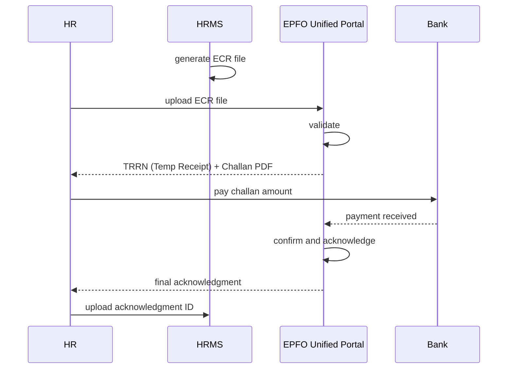

# 01 — Provident Fund Act & Formulas

## Purpose

Detailed specification for Employees' Provident Funds & Miscellaneous Provisions Act, 1952 — contributions, formulas, ECR file generation, member registration, returns, withdrawal/transfer, and integration with Code on Social Security 2020.

## Applicability

EPF Act applies to:

- Every establishment in scheduled industries (per Schedule I) employing 20+ persons
- Other establishments notified by Central Government with 20+ persons
- Establishments that have employed 20+ at any time even if currently lower (continuing applicability)

`[VERIFY]` Code on Social Security 2020 § 1 retains 20+ threshold; specific scheduled industries broadened. Some sources mention voluntary coverage at lower thresholds.

## Contribution rates (current as of FY 2026-27)

`[VERIFY]` Rates current; check EPFO notification.

### Standard contribution

| Component | Employer share | Employee share |
|---|---|---|
| Provident Fund (EPF) | 3.67% | 12% |
| Pension Scheme (EPS) | 8.33% (capped at ₹15,000 wage) | 0% |
| Insurance (EDLI) | 0.5% (capped at ₹15,000 wage) | 0% |
| Admin charges (EPF) | 0.5% (min ₹500/month per establishment) | 0% |
| **Employer total** | **12.5% + EDLI/Admin** | **12%** |

So 12% from employee + 12% from employer where:
- 8.33% to EPS (subject to ₹15K ceiling = ₹1,250 max per month)
- 3.67% to EPF (or balance after EPS)
- Plus employer pays 0.5% admin + 0.5% EDLI on capped wage

### Lower contribution (3.67% / 10%) — special establishments

For specific establishments (jute, brick, beedi, coir, gum etc.):

| Component | Employer | Employee |
|---|---|---|
| EPF | 3.67% | 10% |
| EPS | 8.33% (within 10% effective) | 0% |
| EDLI/Admin | similar | 0% |

`[VERIFY]` Lower-rate industries; EPFO notification.

### Wage ceiling

- Statutory ceiling: ₹15,000 per month for mandatory PF contribution (post-2014; before that was ₹6,500)
- Employee earning > ₹15,000: employer can contribute on actual wages (voluntary higher contribution), or limit to ceiling
- Employee can opt for VPF (voluntary contribution beyond 12%, up to 88% of basic)

### "Wages" for PF (most consequential definition)

Per § 2(b) of EPF Act:
> Basic wages, dearness allowance, retaining allowance, cash value of any food concession.

Excluded historically:
- HRA, OT, bonus, commission, presents made by employer

Post 2019 SC ruling (Surya Roshni Ltd, Vivekananda Vidya Mandir, etc.):
> Special allowance paid universally and ordinarily forms part of basic wages for PF computation.

Code on Wages § 2(y) updates definition to:
- Wages = Basic + DA + Retaining Allowance
- Excludes: bonus, HRA, conveyance, OT, commission on sales, gratuity, etc.
- **50% rule**: if excluded items > 50% of total remuneration, excess is included in wages

The HRMS supports both interpretations:
- `pfWageBasis: 'basic-da-only'` — pre-2019 / conservative
- `pfWageBasis: 'wage-code-broad'` — Wage Code 2019 (50% rule)
- `pfWageBasis: 'tenant-config'` — custom per tenant

## Establishment registration

### Form 5 (returning new employees)

Submitted monthly along with ECR. Lists employees who joined that month.

### Form 10 (returning employees who left)

Submitted monthly. Lists employees who left.

### Form 3A (annual return per employee)

Per-employee annual statement. Submitted by April 30 following FY end (for FY ending March).

### Form 6A (annual consolidated)

Establishment-level annual consolidation. Same deadline.

### Schema for tracking

```typescript
interface PfFiling extends BaseDocument {
  _id: ObjectId;
  tenantId: ObjectId;
  entityId: ObjectId;
  pfEstablishmentCode: string;             // EPFO establishment code, e.g., 'KN/BG/12345/000'
  
  filingType: 'ecr-monthly' | 'form-5-monthly' | 'form-10-monthly' | 'form-3a-annual' | 'form-6a-annual' | 'lin-merge';
  
  filingForPeriod: string;                 // '2026-04' or 'FY-2025-26'
  filingDeadline: Date;
  
  // file
  fileFormat: 'ecr-2.0' | 'pdf' | 'json';
  fileDocumentId: ObjectId;
  fileSizeBytes: number;
  contentHash: string;
  
  // submission
  submittedAt?: Date;
  submittedBy?: ObjectId;
  trrnNumber?: string;                     // EPFO Temp Receipt Reference Number
  challanAmount?: Decimal128;
  paidAt?: Date;
  
  // status
  status: 'draft' | 'submitted' | 'paid' | 'late' | 'failed';
  
  isLate: boolean;
  daysLate?: number;
  
  // late fees and interest
  lateFee14B?: Decimal128;                 // damages under § 14B
  interest7Q?: Decimal128;                 // simple interest under § 7Q
  
  createdAt: Date;
  updatedAt: Date;
  createdBy: ObjectId;
  isDeleted: boolean;
}
```

## ECR (Electronic Challan-cum-Return) format

EPFO's Electronic Challan-cum-Return — the primary monthly filing.

### Structure

A pipe-delimited TXT file with header + detail lines. Current version: ECR 2.0 (post-2020).

### Header fields

```
Establishment ID|Wage Month|Wage Year|TRRN|...
```

### Detail row (per employee)

| Field | Description | Example |
|---|---|---|
| Member ID | EPFO member ID | KN/BG/12345/000/0000123 |
| UAN | Universal Account Number | 100123456789 |
| Member Name | Full name | PANKAJ KUMAR SHARMA |
| Gross Wages | Total wages | 119795 |
| EPF Wages | PF-applicable wages | 50000 |
| EPS Wages | EPS-applicable wages (capped at ₹15K) | 15000 |
| EDLI Wages | EDLI wages (capped at ₹15K) | 15000 |
| EPF Contribution (member) | 12% of EPF wages | 6000 |
| EPS Contribution (employer) | 8.33% of EPS wages | 1250 |
| EPF Contribution (employer) | 3.67% of EPF wages | 1835 |
| EDLI Contribution (employer) | 0.5% of EDLI wages | 75 |
| EPF Admin (employer) | 0.5% of EPF wages | 75 |
| NCP Days | Non-contributory days (LOP) | 0 |
| Refund of Advances | If employee took advance | 0 |
| Arrears wages | If retro paid | 0 |
| Arrears EPF | | 0 |

`[VERIFY]` ECR 2.0 format spec; field order, exact column names. Refer to EPFO Unified Portal.

### Validation

EPFO portal validates on upload:
- UAN format (12 digits)
- Wages ≤ employer's declared total
- Contribution arithmetic
- NCP days ≤ days in month

Errors block challan generation.

## TRRN, ECR file, and Challan



`[v2]` Direct EPFO API integration. EPFO has been opening APIs for large employers; not yet broad availability.

## Worked example — April 2026 ECR

Acme Industries Pvt Ltd, 80 employees in PF scope. Acme PF est code: KN/BG/12345/000.

### Per-employee summary

For Pankaj (EMP00042, UAN 100123456789):
```
Gross Wages: 119795
EPF Wages: 50000 (basic; tenant uses basic-da-only basis)
EPS Wages: 15000 (capped at ceiling)
EDLI Wages: 15000

Employee Contribution: 50000 × 12% = 6000
Employer EPS: 15000 × 8.33% = 1250
Employer EPF: (50000 × 12%) - 1250 = 6000 - 1250 = 4750  (rest goes to EPF after EPS)
   Note: Some employers compute differently — 50000 × 3.67% = 1835. Difference: 4750 vs 1835.
   Employer total = 6000 (12% of EPF wage); split between EPS (1250) and EPF (rest).
   When EPF wage > EPS ceiling: employer EPF gets the larger share.
```

`[VERIFY]` Allocation logic when EPF wages > ₹15,000:
- Method 1: 8.33% × ₹15,000 = ₹1,250 to EPS; rest of 12% × actual EPF wage to EPF
- Method 2: 8.33% × actual EPF wage (uncapped) to EPS — wrong per current rules

Pankaj's case (Method 1):
- EPF wage = 50000
- Employer total = 50000 × 12% = 6000
- EPS = 15000 × 8.33% = 1250
- EPF (employer) = 6000 - 1250 = 4750

### Aggregate

For 80 employees, total:
- EPF Wages aggregate: e.g., ₹2,50,00,000 (varies)
- Employee Total: ~₹30,00,000 (12%)
- Employer Total: ~₹30,00,000 (12%)
- Admin (0.5% of EPF wage): ~₹1,25,000
- EDLI (0.5%): ~₹1,25,000
- **Total Challan: ~₹62,50,000**

ECR file generated, uploaded to EPFO portal, TRRN obtained, challan paid via bank by 15th of May 2026.

## Late deposit penalties

### Damages under § 14B (Penal interest)

Per delay duration:
- Up to 2 months: 5% per annum
- 2-4 months: 10% per annum
- 4-6 months: 15% per annum
- > 6 months: 25% per annum

`[VERIFY]` Slabs and rates change occasionally.

### Interest under § 7Q

Simple interest at 12% per annum on the amount delayed. From day 16 of next month till payment.

### Combined impact

For ₹62.5 lakh challan delayed by 1 month:
```
Interest (12% per annum × 1/12) = 62500 × 1 = approx 62,500
Damages (5% per annum × 1/12) = 26,000
Total penalty: ~88,500
```

Significant. The HRMS must alert proactively.

## NCP (Non-Contributory Period) days

Days when employee was on LOP / unpaid leave / not in scope. Reduces contribution proportionally.

```
EPF Wages = MonthlyEpfBasis × (paidDays / totalCalendarDays)
```

NCP days are reported on ECR. EPFO scrutinizes for genuineness.

`[BLUE-COLLAR]` Blue-collar workers with frequent absence: NCP days carefully tracked.

## Member registration (UAN)

### Universal Account Number

12-digit number per employee. Issued once; portable across employers.

When new employee joins:
- HRMS checks if UAN exists (employee's prior employer)
- If yes: use existing UAN; new member ID under it
- If no: HR submits Form 11 to EPFO; UAN generated

### Form 11

Self-declaration by employee. Includes:
- Name, DOB, father's/spouse's name
- Aadhaar (mandatory post-2018)
- Bank details
- Prior employer + PF details
- Date of joining

### KYC seeding

Employee's UAN must be seeded with:
- Aadhaar (mandatory; without this, contributions can be held back)
- PAN
- Bank account

The HRMS:
- Collects KYC at onboarding
- Submits to EPFO
- Tracks seeding status
- Alerts if KYC not seeded after 30 days (compliance risk)

## Aadhaar-PF linkage

Per EPFO directive (2018+):
- All members must have Aadhaar seeded
- Without seeding: PF deposits accepted but employer's contribution may be withheld for certain claims `[VERIFY]`
- Universal Aadhaar linkage drive ongoing

`[CA-REVIEW]` Aadhaar's role: Supreme Court rulings (Puttaswamy 2018) limit Aadhaar mandate but EPFO has insisted. Current state: required in practice.

## Withdrawal and transfer

### Form 19 (Final settlement / withdrawal)

Employee withdraws PF after separation (5+ years gap recommended for tax exemption).

### Form 10C (Pension withdrawal / Scheme certificate)

For EPS-related withdrawal or scheme certificate (if member doesn't withdraw, gets scheme certificate for transfer).

### Form 13 (Transfer)

Employee transfers PF from prior to current employer. Mostly automated post-UAN.

### Composite Claim Form

Post-2017 simplified form for KYC-compliant employees.

The HRMS:
- Pre-fills these forms via UAN
- Routes to employee for digital signature
- Tracks submission and settlement
- Integrates with EPFO online claim system `[v2]`

## Tax treatment of PF

### Employee PF contribution

- Up to ₹1.5L / year: deductible under § 80C (old regime; new regime ignores)

### Employer PF contribution

- Up to 12% of salary: exempt
- Above 12%: taxable as perquisite

### PF interest

- Tax-free up to certain employer contribution amount
- Post-Budget 2021: interest on employee's contribution > ₹2.5L/year is taxable
  - For govt employees (no employer contrib above limit): ₹5L threshold
- Excess interest taxed in receipt year

### Withdrawal taxation

- Withdrawal after 5+ years continuous service: fully exempt
- Withdrawal before 5 years (no transfer): taxable in withdrawal year as salary
- TDS at 10% deducted by EPFO if amount > ₹50,000

`[CA-REVIEW]` Withdrawal taxability rules complex; CA review needed for specific scenarios.

## Special provisions

### Pension-only members

Employees > ₹15,000 wage at first employment in covered establishment: contribute only to EPF, not EPS (per Pension Scheme Rules amendment 2014). 

`[VERIFY]` This was challenged in SC; recent ruling (Nov 2022) has allowed certain members to opt for higher pension within deadlines.

### Higher pension option

Per SC ruling 2022, eligible members could opt for pension on actual wages (not capped at ₹15K). Deadline for option was extended multiple times; check current EPFO notifications.

`[CA-REVIEW]` Opt-in for higher pension: if any tenant employee opts, complex computation. CA + actuarial input.

### Voluntary PF (VPF)

Employee can contribute beyond 12% (up to 88% of basic) voluntarily.

```typescript
interface VpfElection {
  employeeId: ObjectId;
  effectiveFrom: string;
  vpfRate: number;                         // 0.0 to 0.88
  durationMonths?: number;                 // optional fixed-term
}
```

Tax: VPF contribution counts toward 80C (old regime ₹1.5L cap).

## EPFO ECR upload audit

```typescript
interface EcrUploadAudit {
  pfFilingId: ObjectId;
  totalEmployees: number;
  totalEmployerContribution: Decimal128;
  totalEmployeeContribution: Decimal128;
  
  // pre-upload validation
  preUploadIssues: Array<{ field: string; message: string }>;
  
  // EPFO response
  epfoTrrn: string;
  epfoChallanAmount: Decimal128;
  epfoMessages: string[];
  
  // hash for tamper detection
  fileHash: string;
}
```

## Ten-year EPS withdrawal restriction

Members with 10+ years contributory service cannot withdraw EPS at separation; only pension after age 58.

`[VERIFY]` Pension scheme details; consult EPFO.

## Open questions

`[OPEN]` Wage Code 2019 50% rule: precise implementation. State-by-state notification status. Recommend: implement default per Code; tenant config to override.

`[OPEN]` Aadhaar-only KYC: should HRMS hard-block onboarding without Aadhaar? Recommend: warn at onboarding; block PF contribution until seeded with grace period.

`[OPEN]` Direct EPFO API integration. EPFO has piloted with large employers. Recommend: monitor; integrate when generally available.

`[OPEN]` Higher pension option for existing employees: HRMS supports computing? Recommend: out of scope for v1; provide reference to EPFO calculator.

`[OPEN]` Establishment with multiple PF codes (e.g., factory + corporate office). Each code separate ECR. Recommend: HRMS supports multiple PF codes per entity.

## Cross-references

- [/03-payroll/05-payroll-engine.md](../03-payroll/05-payroll-engine.md) — PF computation
- [/03-payroll/02-component-library.md](../03-payroll/02-component-library.md) — PF-related components
- [/00-foundations/06-statutory-rules-engine.md](../00-foundations/06-statutory-rules-engine.md) — PF rules
- [/01-employee/04-statutory-ids.md](../01-employee/04-statutory-ids.md) — UAN/PF member ID
- [13-statutory-files-and-formats.md](./13-statutory-files-and-formats.md) — ECR format
- [15-statutory-deadlines-calendar.md](./15-statutory-deadlines-calendar.md) — PF deadline tracking
