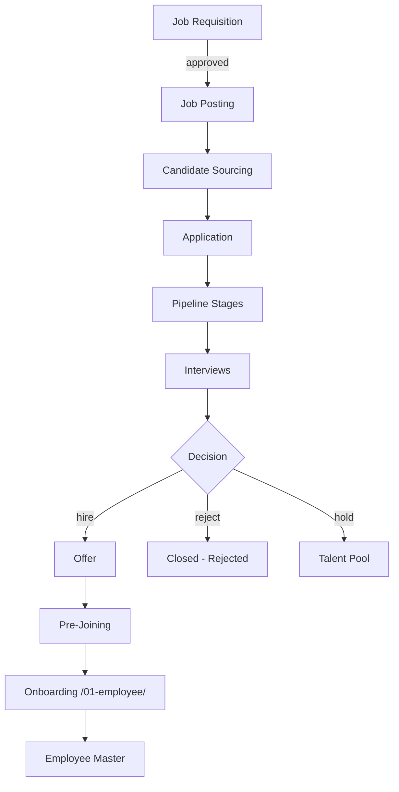

# 00 — Recruitment Module Overview

## Purpose

Recruitment is the funnel before employee onboarding: open positions → sourcing → shortlist → interviews → offer → joining. Most Indian SMEs run recruitment outside their HRMS (using Naukri / LinkedIn / WhatsApp / Excel). This creates handoff gaps when the candidate joins and HR has to re-enter everything for onboarding.

The HRMS recruitment module aims for **lightweight ATS** — not a competitor to Lever / Greenhouse, but enough to handle the typical SME flow with seamless handoff to onboarding.

## Scope of this folder

`/05-recruitment/` covers requisitions, candidate database, application tracking, interviews, offers, and pre-joining handoff.

**In scope:**

- Job requisition workflow (with budget/headcount approval)
- Job posting (internal + external integration)
- Candidate sourcing and database
- Application tracking with stages
- Interview scheduling with calendar integration
- Feedback collection
- Offer generation, approval, rollout
- Pre-joining (between offer accept and Day 1)
- Handoff to onboarding (`/01-employee/06-lifecycle-state-machine.md`)
- Recruitment analytics

**Out of scope:**

- Background verification deep workflows → light integration only
- Posting to job boards (LinkedIn, Naukri) → API integration in `[v2]`; CSV / link-based in v1
- Resume parsing → basic in v1; ML-based in `[v2]`
- Multi-vendor agency management → light in v1
- Recruitment marketing / employer brand → out of scope
- Onboarding (Day 1+) → covered in `/01-employee/`

## Files in this folder

1. [01-job-requisition.md](./01-job-requisition.md) — Requisition workflow, budget, headcount approval, posting
2. [02-candidate-and-application.md](./02-candidate-and-application.md) — Candidate database, applications, sourcing channels
3. [03-pipeline-and-stages.md](./03-pipeline-and-stages.md) — Application stages, kanban, automation rules
4. [04-interviews-and-feedback.md](./04-interviews-and-feedback.md) — Interview scheduling, panels, calendar, feedback templates
5. [05-offer-management.md](./05-offer-management.md) — Offer letter generation, approval, rollout, negotiation, expiry
6. [06-pre-joining.md](./06-pre-joining.md) — Document collection, BGV, joining bonus, asset requisition
7. [07-recruitment-analytics.md](./07-recruitment-analytics.md) — Funnel, source effectiveness, time-to-hire, cost per hire
8. [08-edge-cases.md](./08-edge-cases.md) — 20+ recruitment edge cases

## Architectural position



## Design philosophy: handoff over depth

The wedge here is NOT an ATS rivaling Greenhouse. It's:

1. **Indian-first**: handles HR's actual workflows (Naukri-Excel-WhatsApp-Phone), not import from Lever
2. **Compliance handoff**: candidate's documents collected pre-joining flow directly into employee KYC
3. **Background verification**: integrated with Indian BGV vendors (NetSepio, AuthBridge, Onfido India, IDfy)
4. **Offer-to-Employee Master**: zero re-entry of data; offer fields become employee fields

## Lightweight by design

For a tenant of 100 employees with 20 hires/year:
- v1: simple kanban, Excel-import friendly, email-based
- v2: structured pipeline, scheduled interviews, automated reminders
- v3: full ATS-like features (sourcing, marketing, automation)

Don't over-build. Many SMEs will continue using external tools and just import candidates into HRMS for offer + handoff.

## Key entities

```typescript
// High-level entity overview (detailed schemas in respective files)

interface Requisition extends BaseDocument {
  requisitionCode: string;
  position: string;
  department: ObjectId;
  numberOfPositions: number;
  status: 'draft' | 'pending-approval' | 'approved' | 'open' | 'on-hold' | 'closed' | 'cancelled';
  budgetCtc: { min: Decimal128; max: Decimal128 };
  // ... more in 01-job-requisition.md
}

interface Candidate extends BaseDocument {
  candidateCode: string;
  fullName: string;
  email: string;
  phone: string;
  // single record across all applications
  // ... more in 02-candidate-and-application.md
}

interface Application extends BaseDocument {
  applicationCode: string;
  candidateId: ObjectId;
  requisitionId: ObjectId;
  currentStage: string;
  status: 'active' | 'rejected' | 'withdrawn' | 'offered' | 'hired' | 'on-hold';
  // ... more in 02 and 03
}

interface Interview extends BaseDocument {
  interviewCode: string;
  applicationId: ObjectId;
  scheduledAt: Date;
  panel: ObjectId[];
  // ... more in 04-interviews-and-feedback.md
}

interface Offer extends BaseDocument {
  offerCode: string;
  applicationId: ObjectId;
  ctc: Decimal128;
  joiningDate: string;
  status: 'draft' | 'pending-approval' | 'sent' | 'accepted' | 'declined' | 'withdrawn' | 'expired';
  // ... more in 05-offer-management.md
}
```

## Integration points

| Module | Direction | Purpose |
|---|---|---|
| `/01-employee/` | Out | Hired candidate becomes Employee on Day 1 |
| `/03-payroll/` | Out | Joining bonus, salary structure assignment |
| `/06-performance/` | Out | Probation review setup |
| `/00-foundations/03-identity-and-rbac.md` | In | Recruiter / Hiring Manager roles |
| External: Job boards | Out | Post listings (manual + API in v2) |
| External: BGV vendors | Out | Background verification |
| External: Calendar (Google / Outlook) | In/Out | Interview scheduling |
| External: Email | Out | Communication |
| External: Resume DBs (Naukri, LinkedIn) | In | Candidate import |

## Open questions (overall)

`[OPEN]` Should recruitment be a separate licensed module (paid add-on) or included? Many SMEs won't use it. Recommend: include in base; lightweight v1.

`[OPEN]` AI/ML features: resume parsing, candidate matching, interview transcription. Recommend: defer to v2 / v3; v1 manual but solid.

`[OPEN]` Recruiter agency integration: tracking applications submitted by external agencies for fee tracking. Recommend: light in v1 (just attribution); full in v2.

`[OPEN]` Internal job postings: separate flow for internal employees applying. Recommend: yes in v1; same flow with `applicantType=internal`.

`[OPEN]` Diversity tracking (gender, caste, region) for compliance. India doesn't mandate but best practice. Recommend: optional fields; clear consent.

## Cross-references

- [/01-employee/06-lifecycle-state-machine.md](../01-employee/06-lifecycle-state-machine.md) — Pre-joining → Onboarding handoff
- [/01-employee/05-documents-and-kyc.md](../01-employee/05-documents-and-kyc.md) — Document handoff
- [/03-payroll/01-salary-structure-builder.md](../03-payroll/01-salary-structure-builder.md) — Salary assignment at offer
- [/06-performance/](../06-performance/) — Probation → confirmation linkage
