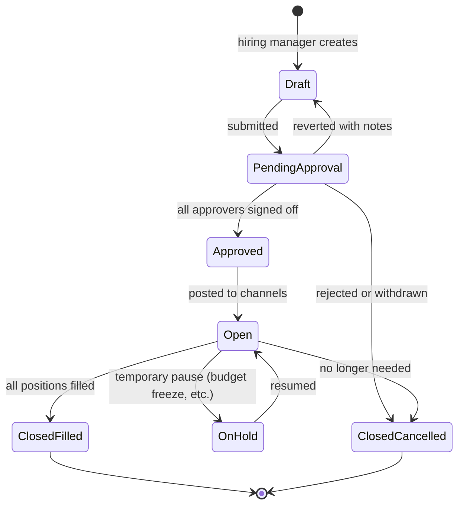

# 01 — Job Requisition

## Purpose

A **Requisition** is the entity that authorizes recruitment for a position. It captures budget, headcount approval, role description, and posting details. Without an approved requisition, recruitment cannot proceed.

This file specifies requisition schema, approval workflow, posting integration, and lifecycle.

## Schema

```typescript
interface JobRequisition extends BaseDocument {
  _id: ObjectId;
  tenantId: ObjectId;
  entityId: ObjectId;
  
  // identity
  requisitionCode: string;                 // 'REQ-2026-04-00123'
  
  // role
  positionTitle: string;                   // 'Senior Backend Engineer'
  designation: string;                     // matches employee designation
  designationLevel: string;                // 'L4' | 'Senior'
  jobFamily?: string;                      // 'Engineering' | 'Sales' | 'Operations'
  
  departmentId: ObjectId;
  reportingManagerEmployeeId: ObjectId;
  
  locationId?: ObjectId;
  workMode: 'office' | 'hybrid' | 'remote' | 'field';
  
  // headcount
  numberOfPositions: number;
  positionsFilled: number;                 // tracking
  positionsRemaining: number;              // computed
  isReplacement: boolean;
  replacingEmployeeId?: ObjectId;          // if replacement of separated employee
  reasonForOpening: 'new-position' | 'replacement' | 'expansion' | 'promotion-backfill' | 'budget-increase';
  
  // budget
  budgetCtcMin: Decimal128;
  budgetCtcMax: Decimal128;
  proposedSalaryStructureId?: ObjectId;    // ref SalaryStructure
  budgetApprovalRefId?: ObjectId;          // ref budget workflow
  fiscalYearBudget: string;                // 'FY-2026-27'
  
  // role details
  jobDescription: string;                  // long text, markdown supported
  responsibilities: string[];
  requiredSkills: string[];
  preferredSkills?: string[];
  yearsOfExperience: { min: number; max?: number };
  educationRequired?: string[];            // degree types
  
  // employment terms
  employmentType: EmploymentType;          // 'permanent' | 'contract' | 'fixed-term' | 'apprentice'
  isExemptFromOvertime: boolean;
  shiftRequirement?: 'general' | 'rotational' | 'night' | 'flexible';
  travelRequirement?: 'none' | 'occasional' | 'frequent' | 'extensive';
  
  // urgency
  urgency: 'normal' | 'high' | 'critical';
  expectedJoiningDate?: string;            // YYYY-MM-DD target
  hardDeadlineDate?: string;               // when position must be filled
  
  // approval
  approvalChain: Array<{
    sequence: number;
    approverRole: string;                  // 'reporting-manager' | 'hr-manager' | 'finance-head' | 'tenant-admin'
    approverEmployeeId?: ObjectId;
    decision?: 'approved' | 'rejected' | 'reverted';
    decidedAt?: Date;
    notes?: string;
  }>;
  
  // posting
  postingChannels: Array<{
    channel: 'internal' | 'naukri' | 'linkedin' | 'indeed' | 'company-careers' | 'agency' | 'referral' | 'other';
    postedAt?: Date;
    postingUrl?: string;
    postingId?: string;                    // platform's reference
    postingExpiresAt?: Date;
    cost?: Decimal128;                     // if paid posting
  }>;
  
  // recruiter assignment
  primaryRecruiterId: ObjectId;
  recruiterTeam: ObjectId[];
  
  // status
  status: 'draft' | 'pending-approval' | 'approved' | 'open' | 'on-hold' | 'closed-filled' | 'closed-cancelled' | 'closed-no-budget';
  
  // dates
  raisedOn: Date;
  approvedOn?: Date;
  postedOn?: Date;
  filledOn?: Date;
  closedOn?: Date;
  
  // metadata
  createdAt: Date;
  updatedAt: Date;
  createdBy: ObjectId;
  isDeleted: boolean;
}
```

## Indexes

```typescript
{ tenantId: 1, entityId: 1, requisitionCode: 1 }, unique
{ tenantId: 1, entityId: 1, status: 1 }
{ tenantId: 1, entityId: 1, departmentId: 1, status: 1 }
{ tenantId: 1, primaryRecruiterId: 1, status: 1 }
```

## Lifecycle



## Approval workflow

Default chain (configurable):

1. Reporting manager → HR manager → Finance head (if CTC > threshold) → Tenant admin (if very senior)

Triggers requiring extra approval:
- Senior role (CTC > ₹50L): tenant admin approval
- Critical urgency: HR head approval
- Replacement of recently exited (< 30 days): exit review
- New position not in annual plan: budget approval

Approval workflows are part of `/08-workflow/` (Phase 5); requisition just references workflow approval IDs.

## Posting flow

```mermaid
sequenceDiagram
    participant Recruiter
    participant App
    participant Naukri
    participant LinkedIn
    participant Internal
    participant Email
    
    Recruiter->>App: requisition approved; configure posting
    Recruiter->>App: select channels (Naukri, LinkedIn, Internal, Career Page)
    
    App->>Naukri: post (manual link in v1; API v2)
    Naukri-->>Recruiter: posting URL
    Recruiter->>App: paste URL
    
    App->>LinkedIn: similar
    
    App->>Internal: publish to internal job board (intranet view)
    Internal->>Email: notify employees who opted-in
    
    App->>App: track posting status, expiry
```

`[v1]` Manual posting: recruiter posts on each platform; pastes URL into HRMS for tracking.
`[v2]` API integration with major platforms (Naukri RMS, LinkedIn Talent Hub).

## Internal job postings

Existing employees can apply for open positions:

```typescript
interface InternalApplication {
  requisitionId: ObjectId;
  applicantEmployeeId: ObjectId;
  appliedOn: Date;
  
  // approval gates
  currentManagerNotified: boolean;
  currentManagerApprovalStatus?: 'pending' | 'approved' | 'objection';
  // some companies require current manager's no-objection
  
  resumeAtTimeOfApplication?: ObjectId;    // employee's profile snapshot
  
  status: 'submitted' | 'in-review' | 'shortlisted' | 'interviewing' | 'offered' | 'rejected' | 'withdrawn';
}
```

Internal applicants flow through same pipeline but:
- Skip BGV (already employed; KYC done)
- Compensation discussion handles internal transfer rules
- May have priority interview slots
- Manager-on-current-team may need to release them

`[OPEN]` Default: internal applicants visible to recruiter immediately. Some companies hide identity until shortlist (to avoid manager bias). Recommend: tenant config.

## Budget integration

```typescript
interface RequisitionBudget {
  fyCode: string;
  approvedHeadcount: number;               // for the FY
  filledHeadcount: number;
  vacant: number;
  
  approvedBudgetCtc: Decimal128;           // total annual CTC budget
  utilizedBudgetCtc: Decimal128;
  remainingBudgetCtc: Decimal128;
  
  perDepartment: Record<string, {
    headcount: number;
    budget: Decimal128;
  }>;
}
```

When requisition raised:
- System checks against approved headcount per dept
- Budget within range checked
- Excess: requires additional approval (HR head + Finance)

## Replacement handling

When `isReplacement=true`:
- Reference to separated employee
- System auto-suggests budget = previous incumbent's CTC
- May reuse JD with updates
- Continuity tracked: time between separation and refill

Replacement vs new position dashboard for HR.

## Holds and reactivation

A requisition may go on hold:
- Budget freeze (org-wide)
- Position no longer urgent
- Specific candidate found via referral; pause active recruitment

Hold preserves all candidate data; reactivation resumes pipeline.

## Closing requisitions

| Closure reason | When | Action |
|---|---|---|
| `closed-filled` | All positions filled | Linked to applications/offers/hires |
| `closed-cancelled` | No longer needed | All active applications closed; candidates notified |
| `closed-no-budget` | Budget pulled | All active applications notified |
| `closed-postponed` | FY change | Roll over to next FY (new requisition created) |

## Reports

- **Open Requisitions**: by department, urgency, days open
- **Time to Fill**: from raised to filled per role
- **Approval SLA**: time to approve requisition
- **Budget Utilization**: per dept per FY
- **Replacement Rate**: % of requisitions replacing exits

## Posting compliance (CSR / EEO)

Some Indian regulations / industry norms:
- Equal opportunity statement on JDs (best practice, not mandatory)
- No discriminatory language (gender, age, religion, caste)
- Minimum wage / fair pay (Wage Code mandatory)
- PWD-friendly options (if 100+ employees, RPwD Act obligations)

The HRMS:
- JD review prompts for non-discriminatory language `[v2]` AI-assisted
- Min wage check on budget vs state minimum
- PWD-friendly flags

## Open questions

`[OPEN]` Multi-location requisition (1 role, hire across 3 cities). Recommend: 1 requisition with multiple locations field; or 3 separate requisitions linked.

`[OPEN]` Cloning requisition for repetitive hiring (e.g., 50 production workers / year). Recommend: clone feature; HR adjusts.

`[OPEN]` Headcount approval at FY level vs requisition-by-requisition. Recommend: tenant config; default annual headcount approved + per-requisition lighter approval.

`[OPEN]` Replacement-only mode (no net headcount change). Auto-approve if within budget? Recommend: yes for replacement = same level + budget.

## Cross-references

- [02-candidate-and-application.md](./02-candidate-and-application.md) — applications against requisition
- [05-offer-management.md](./05-offer-management.md) — offer tied to requisition
- [/08-workflow/](../08-workflow/) (Phase 5) — approval workflow
- [/01-employee/02-employment-record.md](../01-employee/02-employment-record.md) — employee position
- [/03-payroll/01-salary-structure-builder.md](../03-payroll/01-salary-structure-builder.md) — salary structure
