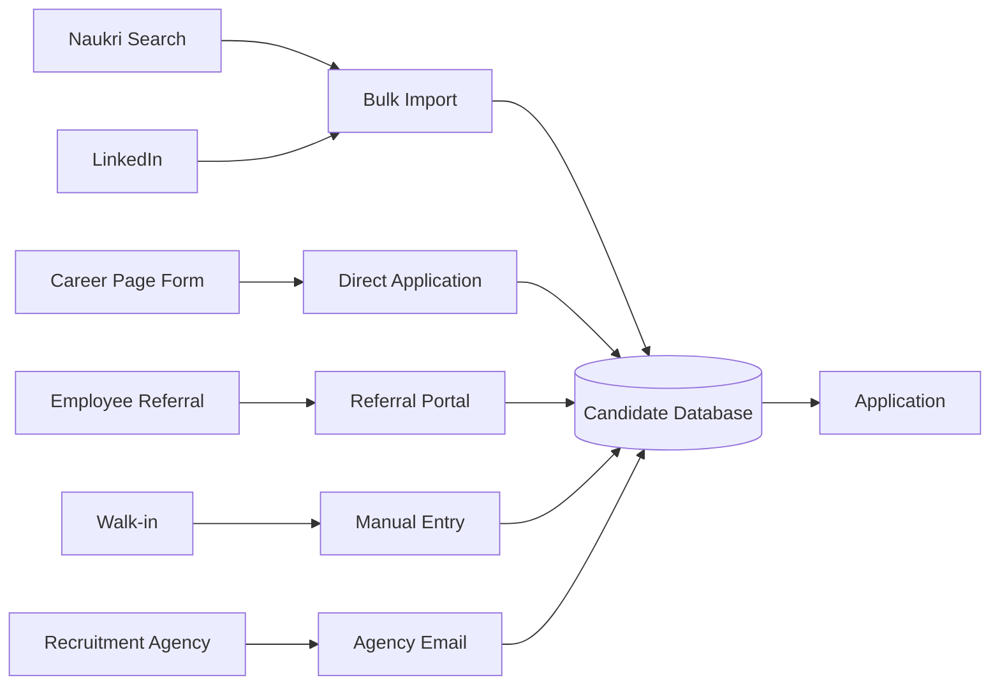

# 02 — Candidate & Application

## Purpose

A **Candidate** is a person who has been considered for any position at the tenant. A single Candidate record persists across multiple Applications (different positions, different times). An **Application** is the link between a Candidate and a Requisition.

Distinguishing the two is critical: a candidate may apply for 3 different roles, get rejected for 2, hired for 1. We track the candidate's journey holistically.

## Candidate schema

```typescript
interface Candidate extends BaseDocument {
  _id: ObjectId;
  tenantId: ObjectId;
  
  // identity
  candidateCode: string;                   // 'CAND-2026-0012345'
  
  // basic info
  fullName: string;
  email: EncryptedString;                  // unique within tenant
  emailHash: string;                       // for deduplication
  phone: EncryptedString;
  phoneHash: string;
  altPhone?: EncryptedString;
  
  // address (optional at sourcing; collected before joining)
  currentAddress?: {
    line1?: string;
    city?: string;
    state?: StateCode;
    pincode?: string;
    country: 'IN';
  };
  
  // demographics (optional; for diversity reporting)
  gender?: 'male' | 'female' | 'other' | 'prefer-not-to-say';
  dateOfBirth?: string;
  
  // current employment
  currentEmployer?: string;
  currentDesignation?: string;
  currentCtc?: Decimal128;
  currentLocation?: string;
  totalYearsExperience?: number;
  noticePeriodDays?: number;
  
  // skills and education
  primarySkills: string[];
  secondarySkills?: string[];
  highestEducation?: string;
  educationDetails?: Array<{
    degree: string;
    field: string;
    institution: string;
    yearCompleted: number;
  }>;
  certifications?: Array<{ name: string; issuer: string; year: number }>;
  
  // documents
  resumeDocumentId?: ObjectId;
  resumeParsedFields?: any;                // structured extraction; v2
  portfolioLinks?: { type: 'github' | 'linkedin' | 'website' | 'behance' | 'other'; url: string }[];
  
  // sourcing
  primarySource: SourceChannel;
  primarySourceDetail?: string;            // 'referred-by-EMP00100' | 'naukri-search' etc.
  referredByEmployeeId?: ObjectId;
  
  // tags
  tags?: string[];                         // 'high-potential', 'silver-medal', 'second-shortlist'
  notes?: string;
  
  // talent pool flag
  inTalentPool: boolean;                   // kept for future opportunities
  talentPoolCategory?: string;             // 'engineering-l4', 'sales-leader'
  
  // statuses
  isBlacklisted: boolean;                  // do-not-hire
  blacklistReason?: string;                // 'no-show-after-offer', 'integrity-concern', etc.
  blacklistedBy?: ObjectId;
  blacklistedAt?: Date;
  
  // duplicate detection
  potentialDuplicateOfCandidateId?: ObjectId;
  isMergedFrom: ObjectId[];                // IDs of merged candidate records
  
  // history
  applicationCount: number;                // total applications by this candidate
  lastApplicationAt?: Date;
  hiredAt?: Date;                          // if ever hired
  hiredAsEmployeeId?: ObjectId;            // ref Employee if joined
  
  // consent (for data privacy)
  consentForDataRetention: boolean;
  consentExpiresAt?: Date;
  
  createdAt: Date;
  updatedAt: Date;
  createdBy: ObjectId;
  isDeleted: boolean;
}

type SourceChannel =
  | 'referral'
  | 'naukri'
  | 'linkedin'
  | 'indeed'
  | 'company-careers-site'
  | 'walkin'
  | 'campus'
  | 'agency'                               // recruitment agency
  | 'inbound-email'
  | 'rehire'                               // returning ex-employee
  | 'internal-transfer'
  | 'cold-outreach'
  | 'event-conference'
  | 'other';
```

## Application schema

```typescript
interface Application extends BaseDocument {
  _id: ObjectId;
  tenantId: ObjectId;
  entityId: ObjectId;
  
  // identity
  applicationCode: string;                 // 'APP-2026-04-001234'
  
  // links
  candidateId: ObjectId;
  requisitionId: ObjectId;
  
  // for internal applicants
  isInternalApplicant: boolean;
  internalApplicantEmployeeId?: ObjectId;  // for internal applications
  
  // sourcing
  sourceChannel: SourceChannel;
  sourceDetail?: string;
  agencyId?: ObjectId;                     // if from agency
  referrerEmployeeId?: ObjectId;
  
  // stage (current)
  currentStage: string;                    // pipeline stage code
  stageHistory: Array<{
    stage: string;
    enteredAt: Date;
    exitedAt?: Date;
    movedBy: ObjectId;
    note?: string;
  }>;
  
  // status
  status: 'active' | 'on-hold' | 'rejected' | 'withdrawn-by-candidate' | 'offered' | 'hired' | 'no-show' | 'declined';
  rejectionReason?: string;                // 'qualifications' | 'compensation-mismatch' | 'not-shortlisted' etc.
  rejectedBy?: ObjectId;
  rejectedAt?: Date;
  rejectionEmailSent: boolean;
  
  // assignments
  primaryRecruiterId: ObjectId;
  hiringManagerId: ObjectId;
  
  // application details
  appliedAt: Date;
  appliedVia: 'web-form' | 'email' | 'referral-portal' | 'naukri-import' | 'linkedin' | 'manual-entry' | 'walkin';
  
  // form responses (if web form / structured application)
  applicationResponses?: Record<string, any>;
  
  // expected compensation
  expectedCtc?: Decimal128;
  noticePeriodInformedDays?: number;
  earliestJoiningDate?: string;
  
  // attached documents
  resumeAtApplication: ObjectId;           // resume snapshot at this point
  coverLetterDocumentId?: ObjectId;
  otherDocumentIds?: ObjectId[];
  
  // ratings (overall)
  averageInterviewRating?: number;         // 1-5; computed from interviews
  finalRecommendation?: 'strong-hire' | 'hire' | 'no-hire' | 'strong-no-hire';
  
  // metadata
  createdAt: Date;
  updatedAt: Date;
  createdBy: ObjectId;
  isDeleted: boolean;
}
```

## Indexes

```typescript
// Candidate
{ tenantId: 1, candidateCode: 1 }, unique
{ tenantId: 1, emailHash: 1 }
{ tenantId: 1, phoneHash: 1 }
{ tenantId: 1, primarySkills: 1 }
{ tenantId: 1, inTalentPool: 1, talentPoolCategory: 1 }
{ tenantId: 1, isBlacklisted: 1 }

// Application
{ tenantId: 1, applicationCode: 1 }, unique
{ tenantId: 1, candidateId: 1 }
{ tenantId: 1, requisitionId: 1, status: 1 }
{ tenantId: 1, currentStage: 1, status: 1 }
{ tenantId: 1, primaryRecruiterId: 1, status: 1 }
{ tenantId: 1, status: 1, appliedAt: -1 }
```

## Deduplication (candidate)

When a new candidate applies:

```typescript
async function findOrCreateCandidate(input: CandidateInput): Promise<Candidate> {
  // Look up by emailHash and phoneHash
  const existing = await Candidate.findOne({
    tenantId,
    $or: [
      { emailHash: hashEmail(input.email) },
      { phoneHash: hashPhone(input.phone) },
    ],
  });
  
  if (existing) {
    // Update fields if new info available
    return mergeUpdates(existing, input);
  }
  
  return Candidate.create({...input, candidateCode: generateCode()});
}
```

If multiple existing candidates match (different email but same phone, etc.):
- Flag as potential duplicate
- Recruiter manually merges or differentiates
- Audit trail preserved

## Sourcing flow



### Bulk import from Naukri / LinkedIn

Recruiter exports search results as Excel; HRMS provides import wizard:
1. Upload Excel
2. Map columns to fields (candidateName, email, phone, etc.)
3. Preview deduplication results
4. Confirm bulk import
5. Optionally: bulk apply to a requisition

### Direct application via career page

Embeddable form on tenant's website:
- Public URL: `https://careers.tenant.com/<requisition-code>`
- Or custom domain
- Form collects: name, email, phone, resume, linkedin, etc.
- Submission → creates Candidate + Application
- Confirmation email + auto-acknowledgment

```typescript
interface CareerPageForm {
  formCode: string;
  fields: Array<{
    fieldId: string;
    label: string;
    type: 'text' | 'email' | 'phone' | 'date' | 'file' | 'select' | 'multiselect' | 'textarea';
    required: boolean;
    options?: string[];
  }>;
  consentText: string;
  privacyPolicyLink: string;
}
```

### Employee referral portal

Internal employees refer candidates:
1. Employee logs into ESS
2. Sees open requisitions
3. Submits referral: candidate name, contact, why they fit
4. Resume can be attached or candidate fills directly
5. Referral tracked: source = 'referral', referrer = employeeId
6. If candidate hired: referral bonus computed

```typescript
interface ReferralBonusPolicy {
  positionLevel: string;
  bonusAmount: Decimal128;
  payoutSchedule: 'on-joining' | 'after-3-months' | 'split-3-6-months';
  conditions: {
    candidateMustNotBeKnownAlready: boolean;
    candidateMustNotBeBlacklisted: boolean;
    minStayDays?: number;                  // bonus paid only if employee stays N days
  };
}
```

### Agency-sourced candidates

Recruitment agencies email resumes:
- HRMS supports email forwarding inbox
- Resumes auto-imported (basic; v2 with parser)
- Source: agency
- Agency fee tracked if hired

```typescript
interface RecruitmentAgency {
  _id: ObjectId;
  tenantId: ObjectId;
  
  agencyName: string;
  contactPerson: string;
  email: string;
  phone: string;
  
  feeStructure: {
    type: 'percentage' | 'fixed';
    percentage?: number;                   // % of CTC; e.g., 8.33%
    fixedAmount?: Decimal128;
    payable: 'on-joining' | 'after-3-months' | 'after-6-months';
    refundable: boolean;
    refundConditions?: string;
  };
  
  contractStartDate: Date;
  contractEndDate?: Date;
  
  isActive: boolean;
  
  performance: {
    candidatesSubmitted: number;
    candidatesHired: number;
    averageQualityRating?: number;
  };
}
```

## Talent pool

Rejected candidates of high quality saved for future:
- Candidate set with `inTalentPool=true`
- Categorized by skill / level
- Recruiters can search talent pool when new requisition opens
- Periodic re-engagement (with consent)

```typescript
interface TalentPoolEntry {
  candidateId: ObjectId;
  category: string;                        // 'engineering-l4', 'sales-leader', etc.
  addedToPoolAt: Date;
  addedToPoolBy: ObjectId;
  reason: string;                          // why kept in pool
  recommendedRoles: string[];
  
  // engagement
  lastEngagementAt?: Date;
  engagementHistory: Array<{
    type: 'email' | 'call' | 'role-mention';
    sentAt: Date;
    response?: string;
  }>;
  
  // consent
  consentForFutureContact: boolean;
  consentExpiresAt?: Date;
}
```

## Blacklist

Some candidates are flagged DO NOT HIRE:
- No-show after offer accepted
- Integrity concerns (fake credentials)
- Misconduct in prior interview
- Repeated rejection (still applies despite multiple no-fit signals)

Blacklist visible only to recruiter / HR; not in candidate-facing channels.

```typescript
interface BlacklistEntry {
  candidateId: ObjectId;
  reason: string;
  evidenceDocumentIds?: ObjectId[];
  blacklistedBy: ObjectId;
  blacklistedAt: Date;
  reviewBy?: Date;                         // some blacklists are time-bound
  isActive: boolean;
}
```

## Consent and data retention (DPDPA 2023)

Candidates' personal data subject to DPDPA:
- Explicit consent at application
- Purpose specified (recruitment for this role + future opportunities)
- Retention period: e.g., 18 months (after which auto-purged unless renewed)
- Right to deletion (candidate can request via privacy email)

```typescript
interface CandidateConsent {
  candidateId: ObjectId;
  consentVersion: string;                  // policy version
  consentText: string;                     // snapshot of policy at consent
  consentedAt: Date;
  expiresAt: Date;
  scope: 'this-role-only' | 'future-roles' | 'forever';
  
  withdrawalRequestedAt?: Date;
  dataDeleted: boolean;
  dataDeletedAt?: Date;
}
```

`[CA-REVIEW]` DPDPA implementation evolving. Consent-based + purpose-limited approach.

## Multi-application same candidate

Pankaj applies for SDE role in March 2025; rejected. Re-applies for Senior SDE role in October 2026.

- Single Candidate record
- Two Applications
- History visible to recruiter
- Previous rejection reason informs current consideration

## Reports

- **Sourcing Funnel**: applications by source
- **Source Quality**: hire rate by source
- **Time to Apply**: from posting to first application
- **Candidate Database Size**: by skill, experience level
- **Talent Pool Activity**: engagement frequency

## Open questions

`[OPEN]` Cross-tenant candidate visibility (anonymized industry-wide pool)? Tempting marketplace feature. Recommend: not in v1; privacy concerns dominate.

`[OPEN]` Auto-tag / classify candidates by ML on resume content. Recommend: v2.

`[OPEN]` Candidate self-service portal: candidates log in, see their applications across roles, update info. Recommend: v2; v1 email-based notifications.

`[OPEN]` Anti-discrimination filtering: enforce no decisions based on protected attributes. Recommend: audit log of decisions; v2 ML-based bias detection.

## Cross-references

- [01-job-requisition.md](./01-job-requisition.md) — application against requisition
- [03-pipeline-and-stages.md](./03-pipeline-and-stages.md) — pipeline stages
- [07-recruitment-analytics.md](./07-recruitment-analytics.md) — funnel reports
- [/00-foundations/04-audit-and-compliance-hooks.md](../00-foundations/04-audit-and-compliance-hooks.md) — DPDPA consent
- [/01-employee/01-employee-master-schema.md](../01-employee/01-employee-master-schema.md) — handoff to employee
