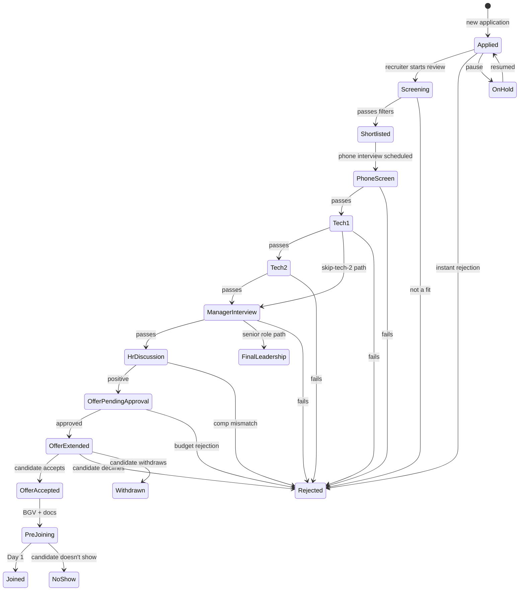

# 03 — Pipeline & Stages

## Purpose

The pipeline is the configurable journey applications travel from "applied" to "hired" or "rejected". Stages are the columns of the kanban board. This file specifies stage configuration, automation, transition rules, and SLAs.

## Default stage set

Standard stages shipped with the platform:

| Stage code | Display name | Type | SLA (default) | Auto-progress |
|---|---|---|---|---|
| `applied` | Applied | inbox | n/a | manual |
| `screening` | Screening / Resume Review | active | 2 days | manual |
| `shortlisted` | Shortlisted | active | n/a | manual |
| `phone-screen` | Phone Screen / Recruiter Call | interview-1 | 5 days | scheduled |
| `tech-1` | Technical Round 1 | interview | 7 days | scheduled |
| `tech-2` | Technical Round 2 | interview | 7 days | scheduled |
| `manager-interview` | Hiring Manager | interview | 5 days | scheduled |
| `hr-discussion` | HR Discussion | interview | 3 days | scheduled |
| `final-leadership` | Final Round / Leadership | interview | 7 days | scheduled |
| `bgv` | Background Verification | background | 14 days | external |
| `offer-pending-approval` | Offer (Pending Approval) | offer | 3 days | manual |
| `offer-extended` | Offer Extended | offer | 7 days | candidate-action |
| `offer-accepted` | Offer Accepted | offer | n/a | candidate-action |
| `pre-joining` | Pre-Joining | onboarding | n/a | scheduled |
| `joined` | Joined / Hired | terminal | n/a | system |
| `rejected` | Rejected | terminal | n/a | manual |
| `withdrawn` | Withdrawn by Candidate | terminal | n/a | candidate-action |
| `on-hold` | On Hold | hold | n/a | manual |

Stages can be customized per requisition / role family.

## Stage configuration schema

```typescript
interface PipelineStage {
  _id: ObjectId;
  tenantId: ObjectId;
  
  stageCode: string;                       // 'screening', 'tech-1' etc.
  displayName: string;
  category: 'inbox' | 'active' | 'interview' | 'background' | 'offer' | 'onboarding' | 'terminal' | 'hold';
  
  // sequence (for default ordering on kanban)
  defaultSequence: number;
  
  // SLA
  slaInDays?: number;
  slaWarningInDays?: number;               // warn at this point
  
  // movement
  allowedNextStages: string[];             // which stages can be moved to from here
  isTerminal: boolean;
  
  // automations
  autoMoveToNext?: {
    trigger: 'on-feedback-submitted' | 'on-document-received' | 'on-time-elapsed';
    targetStage: string;
    delayDays?: number;
  };
  
  // notifications
  notifyOnEntry?: { 
    candidate?: string;                    // email template code
    recruiter?: string; 
    manager?: string;
  };
  
  // requirements to enter
  entryRequirements?: {
    documentsRequired?: string[];
    formsRequired?: string[];
    minPriorStageRating?: number;
  };
  
  // entry actions (auto)
  entryActions?: Array<{
    actionType: 'send-email' | 'create-interview' | 'request-document' | 'trigger-bgv';
    actionConfig: any;
  }>;
  
  isActive: boolean;
}

interface RequisitionPipeline {
  requisitionId: ObjectId;
  
  // pipeline definition for this specific requisition
  stages: Array<{
    stageCode: string;
    sequence: number;
    isOptional: boolean;                   // can applications skip this?
    isMandatory: boolean;                  // applications MUST pass through
  }>;
  
  // default vs custom
  isUsingDefaultPipeline: boolean;
  basePipelineTemplateId?: ObjectId;
  customizations?: any;
  
  createdAt: Date;
  isDeleted: boolean;
}
```

## Stage movement (state transitions)



Custom pipelines can:
- Skip stages (optional ones)
- Add custom stages (e.g., "case study" between tech-1 and tech-2)
- Reorder stages
- Set role-specific SLAs

## Kanban board UX

Default view: columns per stage. Cards: applications.

Card shows:
- Candidate name + photo
- Designation / role
- Days in current stage
- Source channel
- Last action / next action
- Priority indicator (urgency)

Recruiter can:
- Drag-drop card between stages (validates allowed transitions)
- Quick actions: schedule interview, send email, reject, hold
- Filters: by recruiter, role, source, days-in-stage
- Search

## Stage transitions

```typescript
async function moveApplication(
  applicationId: ObjectId,
  toStage: string,
  movedBy: ObjectId,
  notes?: string
): Promise<void> {
  const app = await Application.findById(applicationId);
  const fromStage = app.currentStage;
  
  // Validate transition
  const fromStageDef = await PipelineStage.findOne({ stageCode: fromStage });
  if (!fromStageDef.allowedNextStages.includes(toStage)) {
    throw new Error(`Cannot move from ${fromStage} to ${toStage}`);
  }
  
  // Check entry requirements
  const toStageDef = await PipelineStage.findOne({ stageCode: toStage });
  if (toStageDef.entryRequirements) {
    await validateEntryRequirements(app, toStageDef.entryRequirements);
  }
  
  // Update application
  await Application.updateOne({ _id: applicationId }, {
    $set: { currentStage: toStage },
    $push: {
      stageHistory: {
        stage: fromStage,
        exitedAt: new Date(),
      },
      stageHistory: {
        stage: toStage,
        enteredAt: new Date(),
        movedBy,
        note: notes,
      },
    },
  });
  
  // Trigger entry actions
  if (toStageDef.entryActions) {
    for (const action of toStageDef.entryActions) {
      await executeAction(action, app);
    }
  }
  
  // Notifications
  if (toStageDef.notifyOnEntry) {
    await sendNotifications(toStageDef.notifyOnEntry, app);
  }
}
```

## SLA tracking

Each stage has SLA. Days an application sits in a stage tracked.

| Days in stage | Status | UI signal |
|---|---|---|
| < SLA | green | normal |
| = SLA | yellow warning | days-in-stage badge |
| > SLA | red overdue | escalation flag |

SLA breach:
- Alerts to primary recruiter
- After 1.5× SLA: alerts to recruiter manager
- Continued breach: hiring manager + HR head

## Bulk actions

Recruiter handles many applications:
- Bulk reject (with template reason)
- Bulk move to stage
- Bulk send email (mass screening rejection)

Bulk actions audited individually per application.

## Auto-rejection

When requisition closes (`closed-cancelled`):
- All active applications auto-moved to rejected
- Rejection reason: `requisition-cancelled`
- Bulk email sent

When requisition fills (`closed-filled`):
- Active applications notified of position fill
- Optional: shortlisted candidates added to talent pool
- Status: `rejected` with reason `position-filled`

## Re-opening rejected applications

Rare but useful — candidate becomes a fit later:
- Recruiter can re-activate rejected application
- New pipeline entry (back to current relevant stage)
- Audit trail

## Holds

Application can be put on hold:
- Manager away
- Candidate on vacation / busy
- Pipeline review

```typescript
interface HoldRecord {
  applicationId: ObjectId;
  holdReason: string;
  holdStartedAt: Date;
  holdExpiresAt?: Date;
  resumedAt?: Date;
  heldBy: ObjectId;
}
```

Hold pauses SLA. Resumed → SLA continues.

## Template stages per role family

```typescript
interface PipelineTemplate {
  _id: ObjectId;
  tenantId: ObjectId;
  
  templateName: string;                    // 'Engineering Standard'
  applicableTo: { jobFamily?: string; designationLevels?: string[]; };
  
  stages: Array<{
    stageCode: string;
    sequence: number;
    isOptional: boolean;
    customSlaInDays?: number;
  }>;
  
  isDefault: boolean;
  isActive: boolean;
}
```

Standard templates shipped:
- `template-engineering-junior`: applied → screening → tech-1 → tech-2 → manager → offer
- `template-engineering-senior`: + final-leadership stage
- `template-sales`: applied → screening → recruiter-screen → hiring-manager → leadership → offer
- `template-leadership`: extended pipeline with multiple leadership rounds
- `template-blue-collar`: applied → screening → walk-in-interview → offer-onthe-spot

## Reports

- **Stage Conversion**: % moving stage to stage
- **Avg Time per Stage**: bottlenecks
- **SLA Breach Rate**: per stage
- **Drop-off Analysis**: where most candidates leave
- **Recruiter Productivity**: applications managed, time per stage

## Open questions

`[OPEN]` Should rejection require a reason from a fixed list? Pros: analytics. Cons: friction. Recommend: tenant config; suggested but optional.

`[OPEN]` Multi-track pipelines (e.g., remote vs onsite separate pipelines for same role). Recommend: separate requisitions; same template.

`[OPEN]` AI-suggested next action ("This candidate hasn't responded for 5 days; suggest follow-up email"). Recommend: v2.

`[OPEN]` Candidate-visible pipeline (employer transparency about where they are in the process). Recommend: v2; some employers love, some hate.

## Cross-references

- [02-candidate-and-application.md](./02-candidate-and-application.md) — application schema
- [04-interviews-and-feedback.md](./04-interviews-and-feedback.md) — interview stages
- [05-offer-management.md](./05-offer-management.md) — offer stages
- [07-recruitment-analytics.md](./07-recruitment-analytics.md) — funnel
