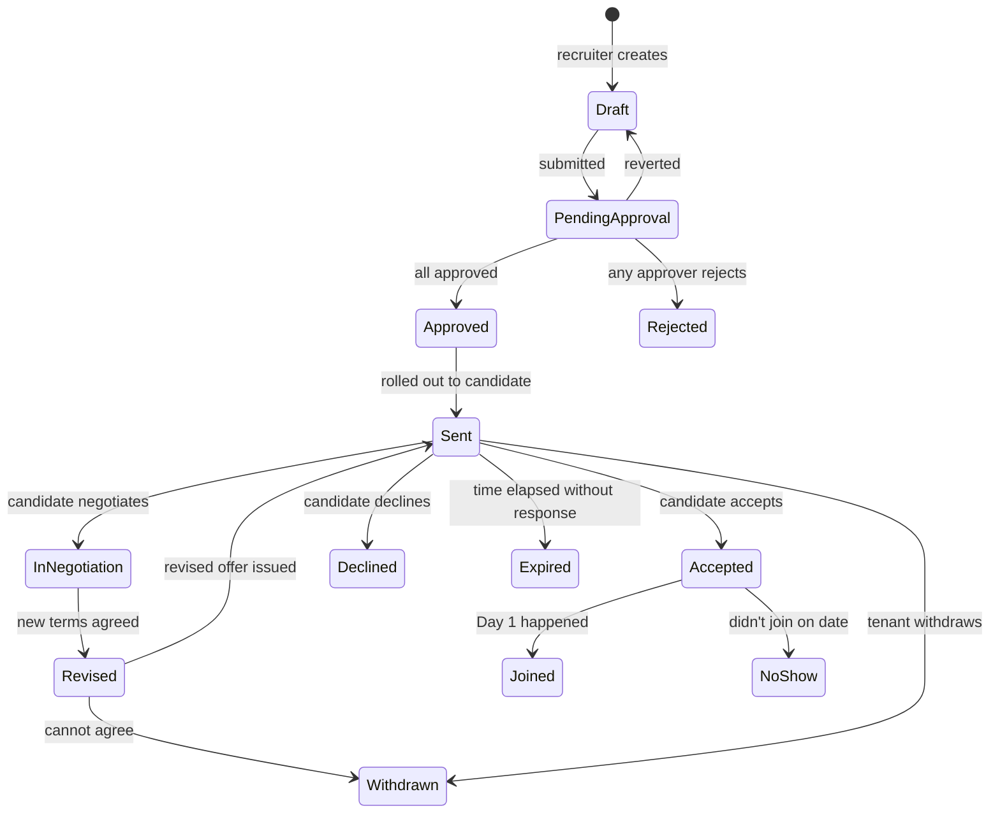

# 05 — Offer Management

## Purpose

Offer management is the most legally and financially sensitive recruitment activity. It involves:

- Compensation negotiation
- Offer letter generation
- Multi-level approval (especially for senior roles)
- Candidate acceptance / decline
- Withdrawal scenarios
- Pre-joining preparation

This file specifies offer schema, approval workflow, generation/rollout, and integration into employee master.

## Offer schema

```typescript
interface Offer extends BaseDocument {
  _id: ObjectId;
  tenantId: ObjectId;
  entityId: ObjectId;
  
  // identity
  offerCode: string;                       // 'OFFER-2026-04-001234'
  
  // links
  candidateId: ObjectId;
  applicationId: ObjectId;
  requisitionId: ObjectId;
  
  // role
  proposedDesignation: string;
  proposedDesignationLevel: string;
  proposedDepartmentId: ObjectId;
  proposedReportingManagerId: ObjectId;
  proposedLocationId: ObjectId;
  proposedWorkMode: 'office' | 'hybrid' | 'remote' | 'field';
  proposedEmploymentType: EmploymentType;
  
  // compensation
  proposedCtcAnnual: Decimal128;
  proposedSalaryStructureId: ObjectId;
  
  // breakdown (computed from structure + CTC)
  compensationBreakdown: {
    fixed: {
      basic: Decimal128;
      hra: Decimal128;
      allowances: Decimal128;
      employerStatutory: Decimal128;       // Employer PF, Gratuity, Insurance
      total: Decimal128;
    };
    variable?: {
      annualBonus?: Decimal128;
      retentionBonus?: Decimal128;
      stockOptions?: { units: number; vestingSchedule: string };
    };
    oneTime?: {
      signingBonus?: Decimal128;
      relocation?: Decimal128;
      joiningGifts?: Decimal128;
    };
  };
  
  // joining terms
  proposedJoiningDate: string;
  noticeServingTimeline?: string;          // 'will serve full notice', 'buy-out 30 days', etc.
  expectedNoticeBuyoutAmount?: Decimal128;
  
  // perks
  perks: {
    leaves: { el: number; cl: number; sl: number };
    healthInsurance: 'self-family' | 'self-only';
    healthInsuranceCoverAmount?: Decimal128;
    accidentalCover?: Decimal128;
    lifeCover?: Decimal128;
    workEquipment?: 'laptop-mobile' | 'laptop' | 'company-issue' | 'byod';
    vehicleAllowance?: { amount: Decimal128; frequency: string };
    other?: string[];
  };
  
  // contractual terms
  probationPeriodMonths: number;
  noticePeriodDuringProbation: number;     // typically 1 month
  noticePeriodPostConfirmation: number;    // 60-90 days typical
  nonCompete?: { years: number; geography: string };
  ipAssignmentClause: boolean;
  confidentialityClause: boolean;
  
  // approvals
  approvalChain: Array<{
    sequence: number;
    approverRole: string;
    approverEmployeeId?: ObjectId;
    decision?: 'approved' | 'rejected' | 'reverted' | 'request-changes';
    decidedAt?: Date;
    notes?: string;
  }>;
  currentApprovalStep: number;
  
  // candidate communication
  offerSentAt?: Date;
  offerSentVia: 'email' | 'in-person' | 'portal';
  offerLetterDocumentId?: ObjectId;
  
  // candidate response
  candidateResponse?: 'accepted' | 'declined' | 'requested-changes' | 'pending';
  candidateRespondedAt?: Date;
  candidateNotes?: string;
  
  // negotiation history
  negotiationRounds: Array<{
    roundNumber: number;
    candidateRequest: string;
    proposedRevision?: any;
    outcome: 'agreed' | 'rejected' | 'compromise';
    finalAmount?: Decimal128;
    notedBy: ObjectId;
    notedAt: Date;
  }>;
  
  // expiry
  offerExpiresOn: string;                  // typically 7-14 days from issue
  isExpired: boolean;
  
  // withdrawal
  isWithdrawn: boolean;
  withdrawnAt?: Date;
  withdrawalReason?: string;
  withdrawnBy?: ObjectId;
  
  // post-acceptance
  acceptanceLetterDocumentId?: ObjectId;
  candidateSignatureCaptured: boolean;
  
  // status
  status: OfferStatus;
  
  // version (in case of revisions)
  versionNumber: number;
  supersededByOfferId?: ObjectId;
  supersedesOfferId?: ObjectId;
  
  createdAt: Date;
  updatedAt: Date;
  createdBy: ObjectId;
  isDeleted: boolean;
}

type OfferStatus =
  | 'draft'
  | 'pending-approval'
  | 'approved'
  | 'sent'
  | 'in-negotiation'
  | 'revised'
  | 'accepted'
  | 'declined'
  | 'withdrawn'
  | 'expired'
  | 'joined';                              // post-Day-1
```

## Indexes

```typescript
{ tenantId: 1, offerCode: 1 }, unique
{ tenantId: 1, applicationId: 1 }
{ tenantId: 1, candidateId: 1, status: 1 }
{ tenantId: 1, status: 1, offerSentAt: -1 }
{ tenantId: 1, isExpired: 1, status: 1 }
```

## Lifecycle



## Approval workflow

Default chain:

| Approver | Trigger |
|---|---|
| Hiring Manager | Always |
| HR Manager | Always |
| Department Head | If CTC > department avg + 25% |
| Finance Head | If CTC > ₹30L |
| Tenant Admin | If CTC > ₹75L OR critical role |

Configurable per tenant. Approval workflow uses `/08-workflow/`.

## Offer letter generation

Templates per tenant + per role family. Markdown / HTML with placeholders.

```typescript
interface OfferLetterTemplate {
  _id: ObjectId;
  tenantId: ObjectId;
  
  templateName: string;
  applicableTo: {
    employmentType?: EmploymentType[];
    designationLevels?: string[];
    jobFamilies?: string[];
  };
  
  // letter content
  bodyTemplate: string;                    // Liquid template with placeholders
  
  // sections
  sections: Array<{
    sectionCode: string;
    title: string;
    isRequired: boolean;
    placeholderText: string;
  }>;
  
  // legal clauses (per Indian employment law)
  includedClauses: {
    confidentiality: boolean;
    ipAssignment: boolean;
    nonCompete: boolean;
    nonSolicitation: boolean;
    indemnity: boolean;
    arbitration: boolean;
  };
  
  // signatories
  signatoryRoles: ('employer' | 'authorized-rep' | 'candidate')[];
  
  // language
  language: 'en' | 'hi' | 'ta' | 'te' | 'mr' | 'kn' | 'ml' | 'bn' | 'gu' | 'pa';
  
  // status
  isActive: boolean;
  effectiveFrom: Date;
  
  createdAt: Date;
  updatedAt: Date;
  createdBy: ObjectId;
  isDeleted: boolean;
}
```

### Generated PDF

Standard offer PDF includes:
1. Header (company logo, registered address, CIN, PAN)
2. Date + Reference number
3. Candidate name + address
4. Subject: Offer of Employment
5. Body:
   - Position offered
   - Designation, level
   - Reporting manager
   - Joining date
   - Location, work mode
6. Compensation section:
   - Annual CTC
   - Detailed breakdown (Annexure A)
   - Variable / bonus components
   - One-time payments
7. Terms & Conditions:
   - Probation
   - Notice periods
   - Working hours
   - Leaves
   - Confidentiality
   - IP assignment
   - Non-compete (if applicable)
8. Validity / acceptance instructions
9. Signature block

`[CA-REVIEW]` Standard offer letter clauses must be reviewed by tenant's legal counsel. The HRMS provides templates; tenant customizes.

## E-sign and delivery

`[v1]` PDF emailed; candidate prints, signs, scans, sends back.
`[v2]` E-signature integration:
- DocuSign
- Adobe Sign
- HelloSign
- Indian: SignDesk, Leegality, CryptoMail

E-signed offers stored in S3 with audit trail.

## Negotiation handling

```mermaid
sequenceDiagram
    participant Candidate
    participant Recruiter
    participant App
    participant HiringMgr
    
    Candidate->>Recruiter: requests CTC increase to 18L from 15L
    Recruiter->>App: log negotiation request
    Recruiter->>HiringMgr: discuss
    HiringMgr->>App: approves ₹17L
    App->>App: create revised Offer (v2; supersedes v1)
    App->>Candidate: send revised offer
    Candidate->>App: accept v2
```

Multiple negotiation rounds tracked. Each new offer is a new version.

## Withdrawal scenarios

### Tenant withdraws

- Budget freeze
- Position no longer available
- BGV revealed concerns
- Better candidate selected

```typescript
interface OfferWithdrawal {
  offerId: ObjectId;
  withdrawalReason: 'budget-freeze' | 'position-cancelled' | 'bgv-failure' | 'better-candidate' | 'role-change' | 'other';
  withdrawalNotes: string;
  notifiedCandidateAt: Date;
  withdrawalDocumentId?: ObjectId;         // formal withdrawal letter
  
  // legal exposure
  potentialLegalRisk: 'low' | 'medium' | 'high';
  // High if: candidate already resigned current job
}
```

`[CA-REVIEW]` Withdrawing accepted offer can lead to legal action (especially if candidate resigned current job). Legal review for withdrawal cases.

### Candidate declines

After acceptance: rare but happens. Treated as no-show or pre-joining-decline.

### Candidate withdraws

Sometimes after BGV, candidate withdraws (e.g., counter-offer from current employer).

```typescript
interface OfferDeclineReason {
  category: 'higher-comp-elsewhere' | 'role-mismatch' | 'location' | 'company-reputation' | 'counter-offer' | 'family-reasons' | 'health' | 'other';
  details?: string;
  competitorName?: string;
  competitorOfferCtc?: Decimal128;
}
```

This data is gold for HR to refine future offers.

## Expiry

Default offer validity: 7-14 days. After:
- Status → expired
- Candidate notified
- Recruiter alerted to follow up
- Tenant decides: extend, re-issue, withdraw

## Compensation calculator

In-app calculator for hiring manager / recruiter:
- Input: target CTC ₹15L, structure: STRUCT-ENG-FY26
- Output: monthly breakdown, take-home estimate (with default tax projection)
- "What-if" scenarios: CTC at ₹18L? Adjust HRA % for non-metro?

This is the same engine as payroll (deterministic).

`[v2]` Take-home calculator visible to candidate post-acceptance.

## Comparison with current employer

Optional: candidate enters current CTC; HRMS shows uplift %.

## Probation terms in offer

Per `/01-employee/02-employment-record.md`:
- Probation duration
- Probation review milestones
- Confirmation criteria
- During-probation notice (typically 1 month)

Standard contract:
- 3-6 month probation (white-collar)
- 1-3 month probation (blue-collar; some industries 0)
- Confirmation triggers post-review

## Pre-Day-1 handoff

Offer accepted → triggers:
- Pre-joining workflow (`/05-recruitment/06-pre-joining.md`)
- Document collection
- BGV initiation
- Asset / desk allocation request to IT, Admin
- Welcome communication
- HR onboarding planning

## Reports

- **Offer Conversion Rate**: offers extended → accepted
- **Time to Offer**: from interview-final to offer-sent
- **Compensation Trends**: avg / median / max CTC by role
- **Negotiation Win Rate**: % of negotiations resulting in higher CTC
- **Decline Reasons**: top reasons over time
- **Offer Withdrawal**: rate + reasons

## Open questions

`[OPEN]` Multiple offers from same tenant (different roles): how to track? Recommend: separate Offer records per requisition; candidate dashboard shows all.

`[OPEN]` Late acceptance after expiry: re-validate or auto-extend? Recommend: manual recruiter review + new offer if approved.

`[OPEN]` Counter-offer support (if candidate produces competing offer, system suggests max range to match). Recommend: v2; uses comp data and headroom.

`[OPEN]` Candidate-visible offer dashboard. Recommend: yes in v1 (light); negotiation, status, FAQ.

`[OPEN]` Pre-letter offer ("verbal offer" formality). Some tenants do verbal first; system tracks. Recommend: explicit phase before draft.

## Cross-references

- [04-interviews-and-feedback.md](./04-interviews-and-feedback.md) — interviews leading to offer
- [06-pre-joining.md](./06-pre-joining.md) — post-acceptance flow
- [/01-employee/03-compensation-record.md](../01-employee/03-compensation-record.md) — offer becomes comp record
- [/01-employee/02-employment-record.md](../01-employee/02-employment-record.md) — offer becomes employment record
- [/03-payroll/01-salary-structure-builder.md](../03-payroll/01-salary-structure-builder.md) — structure for CTC
- [/08-workflow/](../08-workflow/) (Phase 5) — approval workflow
