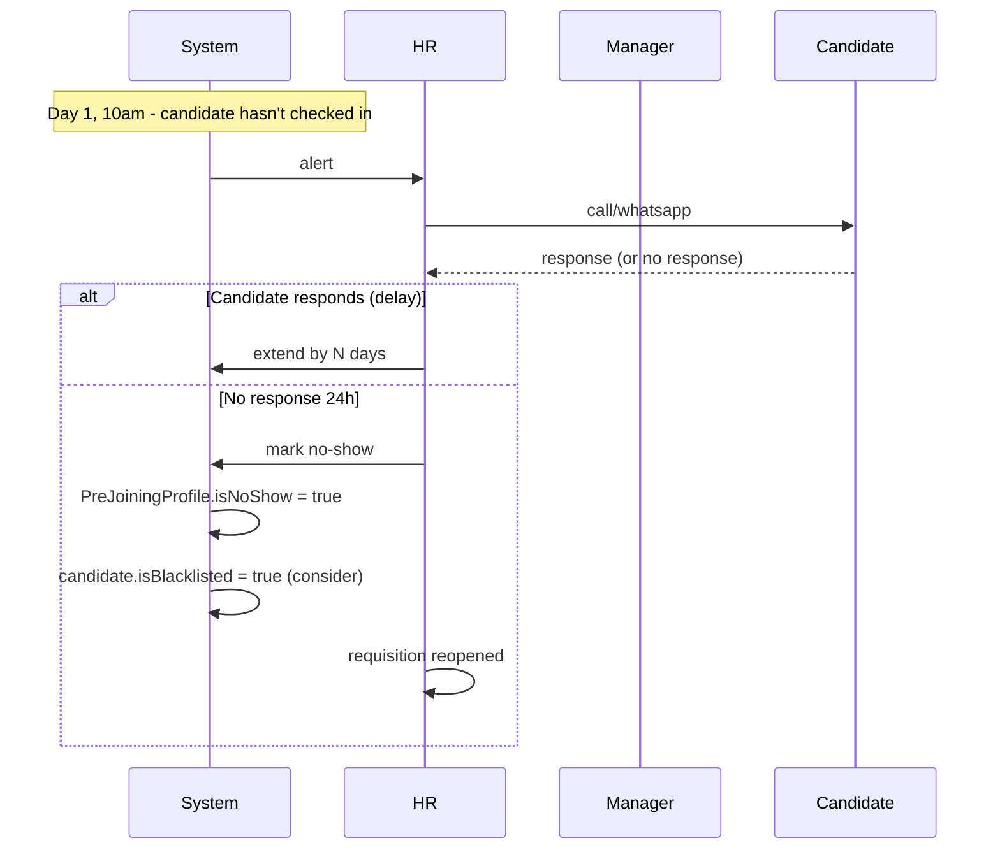

# 06 — Pre-Joining

## Purpose

Period between offer acceptance and Day 1 (typically 30-90 days). During this time:

- Candidate serves notice at current employer
- BGV (Background Verification) runs
- Documents collected (the most painful HR task)
- Asset requisition to IT, Admin
- Welcome / engagement communication
- Day 1 logistics

This is where candidates can "drop off" — joining counter-offers, no-shows, etc. The HRMS minimizes drop-off through structured engagement.

## Pre-joining schema

```typescript
interface PreJoiningProfile extends BaseDocument {
  _id: ObjectId;
  tenantId: ObjectId;
  entityId: ObjectId;
  
  // identity
  preJoiningCode: string;                  // 'PJ-2026-04-001234'
  
  // links
  candidateId: ObjectId;
  applicationId: ObjectId;
  offerId: ObjectId;
  
  // timeline
  offerAcceptedOn: Date;
  proposedJoiningDate: string;             // YYYY-MM-DD
  actualJoiningDate?: string;              // updated if changed
  
  // joining checklist
  checklist: {
    documentsRequested: PreJoiningDocument[];
    documentsReceived: PreJoiningDocument[];
    bgvInitiated: boolean;
    bgvStatus?: 'in-progress' | 'completed-clear' | 'completed-issues' | 'incomplete';
    bgvReportId?: ObjectId;
    
    assetsRequisitioned: boolean;
    assetsReady: boolean;
    
    workspaceReady: boolean;               // desk / cubicle / locker
    accessProvisioned: boolean;            // ID card / biometric / system access
    
    welcomeKitDispatched: boolean;
    welcomeKitContent?: string[];          // 't-shirt' | 'mug' | 'notebook' | 'badge'
    
    induction: {
      scheduled: boolean;
      scheduledDate?: string;
      durationDays: number;
      itinerary?: string;
    };
  };
  
  // engagement
  engagementActions: Array<{
    actionType: 'welcome-email' | 'pre-joining-call' | 'manager-intro' | 'team-intro' | 'check-in' | 'offer-anniversary' | 'industry-newsletter';
    scheduledFor: Date;
    completedAt?: Date;
    response?: string;
  }>;
  
  // candidate communication state
  candidateEngagementScore: number;        // 0-1, computed from response patterns
  
  // notice serving status
  noticeServingStatus: 'not-started' | 'in-progress' | 'completed' | 'short-served' | 'unknown';
  expectedNoticeEndDate?: string;
  noticeBuyoutCommunicated: boolean;
  
  // risk indicators
  riskFlags: Array<{
    flag: 'no-response-7-days' | 'asked-for-extension' | 'mentioned-counter-offer' | 'bgv-issue' | 'document-delay' | 'communication-tone-cold' | 'other';
    flaggedAt: Date;
    severity: 'low' | 'medium' | 'high';
    notes?: string;
    actionTaken?: string;
  }>;
  riskScore: 'low' | 'medium' | 'high';
  
  // outcomes
  status: PreJoiningStatus;
  
  // deviation
  joiningDateChanges: Array<{
    fromDate: string;
    toDate: string;
    reason: string;
    requestedBy: 'candidate' | 'employer';
    approvedBy?: ObjectId;
    requestedAt: Date;
  }>;
  
  // no-show
  isNoShow: boolean;
  noShowReason?: string;
  noShowRecordedAt?: Date;
  
  // post-joining
  joinedAt?: Date;
  employeeId?: ObjectId;                   // ref Employee created
  
  createdAt: Date;
  updatedAt: Date;
  createdBy: ObjectId;
  isDeleted: boolean;
}

type PreJoiningStatus =
  | 'newly-accepted'
  | 'documents-pending'
  | 'documents-received'
  | 'bgv-in-progress'
  | 'bgv-cleared'
  | 'bgv-issues'
  | 'on-track'
  | 'delayed'
  | 'at-risk'
  | 'joining-postponed'
  | 'joining-confirmed'
  | 'joined'
  | 'no-show'
  | 'cancelled-by-candidate'
  | 'cancelled-by-employer';

interface PreJoiningDocument {
  documentType: string;                    // 'pan' | 'aadhaar' | 'bank-passbook' | 'highest-edu-cert' | etc.
  documentName: string;
  isMandatory: boolean;
  
  status: 'requested' | 'submitted' | 'verified' | 'rejected' | 'na';
  
  requestedAt: Date;
  submittedAt?: Date;
  documentId?: ObjectId;                   // ref Document
  verifiedAt?: Date;
  verifiedBy?: ObjectId;
  rejectionReason?: string;
  
  reminderCount: number;
  lastReminderAt?: Date;
}
```

## Document checklist

Standard documents requested pre-joining:

| Category | Documents |
|---|---|
| Identity | PAN card, Aadhaar, Passport (if foreign or for visa) |
| Address | Aadhaar / Voter ID / Passport / utility bill |
| Education | 10th, 12th, Graduation, PG marksheets + certificates |
| Experience | Prior employer relieving letters + experience letters + payslips (last 3 months) |
| Bank | Cancelled cheque / bank passbook front page |
| Photos | Passport-size photos |
| Statutory | UAN (if existing), PAN (mandatory) |
| Health | Medical fitness certificate (some industries) |
| Reference | Reference contacts (3 typical) |
| Misc | Caste certificate (if reservation applicable), disability certificate (if applicable) |

`[BLUE-COLLAR]` Many blue-collar workers don't have all documents. Tenant must support graceful collection (Aadhaar suffices for most; help workers obtain PAN if missing).

## BGV (Background Verification)

Most tenants engage third-party BGV vendors:

| Vendor | Coverage |
|---|---|
| AuthBridge | Comprehensive India coverage; popular |
| NetSepio | Tech / IT focus |
| IDfy | Real-time verification, identity-focused |
| Onfido | Identity + address |
| First Advantage | Global; senior hires |
| HireRight | Global |
| Verifitech | Affordable; SME focus |

### BGV scope

| Check | Description | Time |
|---|---|---|
| Identity | Aadhaar / PAN match | Instant via API |
| Address | Current + permanent | 7-15 days (physical) |
| Education | Degree verification with university | 7-21 days |
| Employment | Last 2-3 employers; HR confirmation | 7-30 days |
| Reference | Calls to provided references | 3-7 days |
| Criminal | Court records check | 7-14 days |
| Drug test | If industry-relevant | 1-7 days |
| Credit check | For finance/senior roles | 3-7 days |
| Social media | OSINT review | Manual |

```typescript
interface BgvOrder extends BaseDocument {
  _id: ObjectId;
  tenantId: ObjectId;
  preJoiningProfileId: ObjectId;
  candidateId: ObjectId;
  
  vendorName: string;
  vendorOrderId?: string;
  vendorContactRef?: string;
  
  packageType: 'basic' | 'standard' | 'comprehensive' | 'custom';
  checksRequested: string[];
  
  initiatedAt: Date;
  expectedCompletionDate: Date;
  
  status: 'initiated' | 'in-progress' | 'completed' | 'partial' | 'failed' | 'cancelled';
  
  results?: Array<{
    checkType: string;
    outcome: 'clear' | 'discrepancy' | 'major-discrepancy' | 'unable-to-verify';
    findings?: string;
    rawReportDocumentId?: ObjectId;
  }>;
  
  overallOutcome?: 'clear' | 'minor-issues' | 'major-issues' | 'incomplete';
  
  reportDocumentId?: ObjectId;
  
  // cost tracking
  cost: Decimal128;
  paidBy: 'employer' | 'candidate' | 'split';
  
  createdAt: Date;
  isDeleted: boolean;
}
```

### BGV outcome handling

| Outcome | Default action |
|---|---|
| Clear | Proceed normally |
| Minor discrepancy (date mismatch, etc.) | HR review; usually proceed |
| Major discrepancy (fake degree, prior misconduct) | Withdraw offer; legal review |
| Unable to verify | Try alternative; proceed with caveat |

## Engagement during notice period

Pre-joining is a vulnerable period. Counter-offers from current employer, second thoughts, etc. Engagement reduces drop-off.

Sample engagement plan (90-day notice candidate):

| Day | Action | Channel |
|---|---|---|
| D+0 (offer accepted) | Welcome email + WhatsApp | Email + WhatsApp |
| D+3 | Document checklist sent | Email |
| D+7 | Manager intro call | Phone / video |
| D+14 | First check-in | Email |
| D+30 | Team introduction | Email + Slack invite |
| D+45 | Second check-in | Email |
| D+60 | Pre-joining logistics | Email |
| D+75 | Day 1 itinerary | Email |
| D-7 from joining | Final reminder + Day 1 details | Email + WhatsApp |
| D-1 | Welcome message | WhatsApp |
| D+0 (joining) | Welcome ceremony | In-person / virtual |

Personalized for senior roles; standardized for high-volume hiring.

## Counter-offer mitigation

Common: current employer offers raise to retain. The HRMS:
- Risk flag if candidate hesitant to confirm joining
- Manager outreach
- Joining bonus structures (paid in tranches: 50% on joining, 50% after 6 months)
- Honest conversation about role / growth

`[OPEN]` Should HRMS proactively detect counter-offer risk via engagement patterns? ML feature for v2.

## Joining date changes

Reasons:
- Candidate's current employer extends notice
- Candidate medical / family emergency
- Tenant pre-joining preparation delay

```typescript
interface JoiningDateChange {
  reason: 'notice-extension' | 'medical' | 'family' | 'visa' | 'employer-side-delay' | 'other';
  newDate: string;
  approvedBy: ObjectId;
  approvedAt: Date;
  daysExtended: number;
  
  // impact tracking
  costImplications?: Decimal128;           // delayed start = lost productivity
}
```

Limit: e.g., max 30 days extension before tenant reviews / withdraws.

## Asset and access provisioning

Triggered on offer acceptance:

```typescript
interface PreJoiningProvisioning {
  preJoiningProfileId: ObjectId;
  
  itProvisioning: {
    laptopAssigned?: boolean;
    laptopModel?: string;
    laptopSerial?: string;
    emailAccountCreated?: boolean;
    emailAddress?: string;
    accessProvisioned?: ObjectId[];        // refs to systems / tools provisioned
  };
  
  adminProvisioning: {
    deskAssigned?: boolean;
    deskNumber?: string;
    accessCardIssued?: boolean;
    accessCardNumber?: string;
    parkingAssigned?: boolean;
  };
  
  hrProvisioning: {
    welcomeKitDispatched?: boolean;
    bookingConfirmed?: boolean;            // e.g., transport, accommodation
    inductionScheduled?: boolean;
  };
  
  readinessScore: number;                  // 0-1; for HR dashboard
}
```

Cross-functional workflow (`/08-workflow/`).

## Day 1 readiness

7 days before joining:
- Final document review
- BGV report review
- Asset readiness confirmed
- Manager calendar block for orientation
- Team welcome message prep
- Compensation final check
- Salary structure assigned in HRMS

## Joining day

Triggers:
- PreJoiningProfile.status → 'joined'
- Employee record created (`/01-employee/01-employee-master-schema.md`)
- EmploymentRecord with `joinedOn` date
- CompensationRecord effective from joining date
- Offer offerCode linked
- All pre-joining docs migrated to employee documents
- BGV report attached
- HR sends Day 1 welcome
- Photo capture + ID card activated
- Biometric enrollment
- Email signature standardization

## No-show handling

If candidate doesn't show on Day 1:



No-show consequences:
- Candidate flagged in HRMS
- Joining bonus / advance recovered (if any)
- Requisition reopened
- HR analyzes pattern for prevention

## Cost tracking

Each candidate has cost-to-hire:
- Recruiter time
- Agency fees (if applicable)
- BGV cost
- Sourcing cost (job posting fees)
- Internal interview time

```typescript
interface CostToHire {
  candidateId: ObjectId;
  applicationId: ObjectId;
  
  costs: {
    sourcingCost: Decimal128;              // job posting, agency fee, etc.
    recruiterTimeCost: Decimal128;         // estimated hours × hourly rate
    interviewerTimeCost: Decimal128;
    bgvCost: Decimal128;
    travelReimbursementCost?: Decimal128;
    referralBonusCost?: Decimal128;
    total: Decimal128;
  };
}
```

Reports:
- Avg cost per hire (overall, by role, by source)
- Cost per source channel (referral cheapest typically)
- ROI of recruitment activities

## Reports

- **Pre-Joining Pipeline**: candidates by status
- **No-Show Rate**: % candidates not joining
- **Document Completion**: time from offer to all-docs-in
- **BGV Turnaround**: vendor performance
- **Joining Date Variance**: actual vs proposed
- **Engagement Effectiveness**: response rate to engagement actions

## Open questions

`[OPEN]` Pre-joining mobile app for candidates? Some companies have apps for new hires (welcome content, learning, intro to team). Recommend: web portal in v1; mobile in v2.

`[OPEN]` Joining bonus tax handling: paid in pre-joining month or post-joining? Pre-joining = no employer-employee relationship; post-joining = taxable salary. Recommend: paid in first month's payroll.

`[OPEN]` Visa support for foreign hires: out of v1 scope. International candidates rare in Indian SME context.

`[OPEN]` Notice period buyout integration: if tenant pays candidate's prior employer for buyout, tracked here? Yes; in `oneTime` payments at offer + paid via accounts.

`[OPEN]` Ghosting prevention via constant engagement: realistic? Recommend: structured but not aggressive; calibrate per role criticality.

## Cross-references

- [05-offer-management.md](./05-offer-management.md) — offer acceptance triggers
- [/01-employee/01-employee-master-schema.md](../01-employee/01-employee-master-schema.md) — Day 1 handoff
- [/01-employee/05-documents-and-kyc.md](../01-employee/05-documents-and-kyc.md) — KYC handoff
- [/01-employee/06-lifecycle-state-machine.md](../01-employee/06-lifecycle-state-machine.md) — pre-joining → onboarded
- [/03-payroll/04-pre-payroll-inputs.md](../03-payroll/04-pre-payroll-inputs.md) — joining bonus
