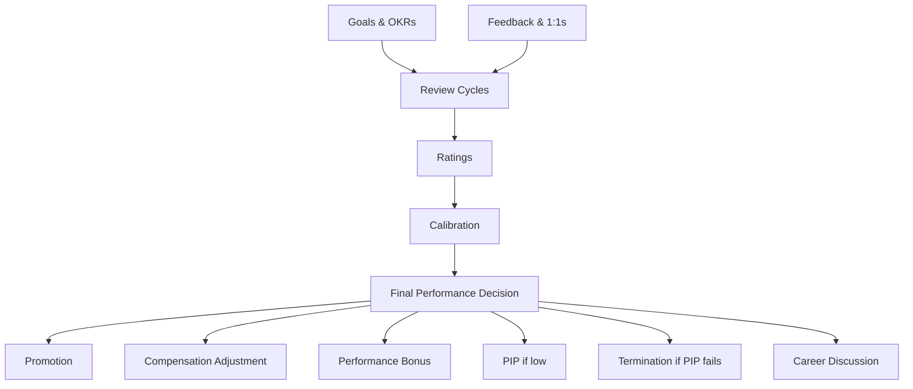

# 00 — Performance Module Overview

## Purpose

Performance management is how organizations evaluate, develop, and reward employee contribution. The HRMS provides a structured but flexible system supporting:

- Goal setting (annual / quarterly)
- Continuous feedback (1:1s, peer feedback)
- Formal reviews (annual, mid-year, probation)
- Calibration across managers
- Performance improvement plans (PIP)
- Rating to compensation linkage
- Promotion / progression

## Scope of this folder

`/06-performance/` covers the performance management cycle.

**In scope:**

- Goals (objectives, key results, KPIs)
- Continuous feedback (1:1s, micro-feedback)
- Self-assessment
- Manager assessment
- 360° feedback (peer + skip-level + reportee)
- Calibration sessions
- Final ratings
- Performance Improvement Plans (PIP)
- Probation reviews
- Promotion process
- Performance-bonus linkage
- Performance analytics

**Out of scope:**

- Learning & Development (training, courses) → out of v1; v2 module
- Career path / succession planning → light in v1; full in v2
- Skills management & competency framework → light in v1
- 9-box / talent grid → v2

## Files in this folder

1. [01-goals-and-okrs.md](./01-goals-and-okrs.md) — Goal schema, OKR, KPI, cascading
2. [02-feedback-and-1on1s.md](./02-feedback-and-1on1s.md) — Continuous feedback, 1:1 meetings
3. [03-review-cycles.md](./03-review-cycles.md) — Annual / mid-year cycles, timeline, participants
4. [04-rating-and-calibration.md](./04-rating-and-calibration.md) — Rating scales, distributions, calibration
5. [05-pip-and-improvement.md](./05-pip-and-improvement.md) — Performance Improvement Plans
6. [06-promotion-progression.md](./06-promotion-progression.md) — Promotion criteria, levels, process
7. [07-edge-cases.md](./07-edge-cases.md) — 20+ edge cases

## Architectural position



## Design philosophy

### Indian context

- Large companies (1000+) have sophisticated PMSs
- SMEs often use Excel, simple ratings
- Annual cycle dominant; some adopt continuous
- Bell curve / forced ranking common but contested
- Calibration sessions important for fairness perception

### Lightweight v1

- Goal-setting form
- Annual review cycle (configurable timing)
- Self + manager assessment
- 5-point rating scale (default; configurable)
- Calibration grid
- Bonus linkage (configurable %)

### v2 enhancements

- 360° feedback workflow
- Continuous feedback (Lattice-like micro-feedback)
- 9-box grid for talent placement
- AI-suggested feedback prompts
- Nudges for managers ("3 of your reportees haven't received feedback in 60 days")

## Key entities (overview)

```typescript
// Schemas detailed in respective files

interface Goal extends BaseDocument {
  goalCode: string;
  employeeId: ObjectId;
  type: 'objective' | 'key-result' | 'kpi' | 'task';
  description: string;
  weight: number;                          // % of total goals
  status: 'draft' | 'active' | 'on-track' | 'at-risk' | 'completed' | 'cancelled' | 'achieved' | 'missed';
  // ... more in 01-goals-and-okrs.md
}

interface FeedbackEntry extends BaseDocument {
  feedbackCode: string;
  feedbackType: 'manager-1on1' | 'peer' | 'reportee' | 'self' | 'spot';
  fromEmployeeId: ObjectId;
  toEmployeeId: ObjectId;
  // ... more in 02
}

interface PerformanceReview extends BaseDocument {
  reviewCode: string;
  cycleId: ObjectId;
  employeeId: ObjectId;
  reviewType: 'annual' | 'mid-year' | 'probation' | 'project' | 'pip';
  // ... more in 03
}

interface RatingRecord extends BaseDocument {
  reviewId: ObjectId;
  rating: number | string;                 // configurable scale
  ratingNarrative: string;
  // ... more in 04
}
```

## Linkage with other modules

| Module | Direction | Purpose |
|---|---|---|
| `/01-employee/` | In | Reportee structure, manager hierarchy |
| `/03-payroll/` | Out | Performance bonus computation |
| `/05-recruitment/` | In/Out | Probation review for new hires; quality of hire |
| `/02-attendance/` | In | Attendance / chronic absence as input to performance |
| `/08-workflow/` | In | Approval flows for review submissions |

## Open questions (overall)

`[OPEN]` Annual vs continuous: which to default? Recommend: hybrid — formal annual + lightweight quarterly check-ins.

`[OPEN]` Forced distribution / bell curve: love it or hate it? Tenant config; default: not enforced; calibration suggested.

`[OPEN]` Open vs anonymous 360 feedback. Recommend: anonymous for peer; manager named.

`[OPEN]` Rating scale: 5-point standard, but some prefer 3 or 4 (avoid mediocre middle). Recommend: tenant config.

`[OPEN]` PMS for blue-collar: simpler? Or skip? Recommend: simplified; may use only attendance + supervisor assessment.

## Cross-references

- [/01-employee/02-employment-record.md](../01-employee/02-employment-record.md) — manager / reportee structure
- [/03-payroll/07-bonus-calculation.md](../03-payroll/07-bonus-calculation.md) — performance bonus
- [/01-employee/06-lifecycle-state-machine.md](../01-employee/06-lifecycle-state-machine.md) — probation, confirmation
- [/05-recruitment/](../05-recruitment/) — quality of hire feedback
