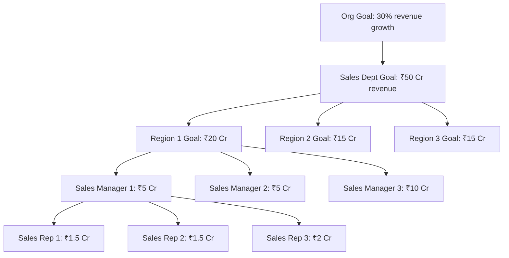

# 01 — Goals & OKRs

## Purpose

Goals are what employees commit to achieve in a period. The HRMS supports multiple goal frameworks:

- **Objectives & Key Results (OKR)** — Google / Intel-style; objectives + measurable KRs
- **KPIs** — quantitative metrics
- **Task-based goals** — for blue-collar / production roles
- **Hybrid** — mix of above

Goals cascade from organization → department → team → individual.

## Schema

```typescript
interface Goal extends BaseDocument {
  _id: ObjectId;
  tenantId: ObjectId;
  entityId: ObjectId;
  
  // identity
  goalCode: string;                        // 'GOAL-2026-Q1-EMP00042-001'
  
  // ownership
  employeeId: ObjectId;
  managerEmployeeId: ObjectId;
  departmentId: ObjectId;
  
  // type
  goalType: 'objective' | 'key-result' | 'kpi' | 'task';
  
  // for OKR
  parentGoalId?: ObjectId;                 // KR linked to Objective
  cascadedFromGoalId?: ObjectId;           // cascaded from manager / org
  
  // content
  title: string;
  description: string;                     // long text, markdown
  category?: string;                       // 'strategic' | 'operational' | 'developmental' | 'growth'
  
  // measurement
  measurementType: 'numeric-target' | 'percent-target' | 'binary' | 'milestone-list' | 'subjective';
  
  // numeric / percent target
  targetValue?: Decimal128;
  startValue?: Decimal128;
  unit?: string;                           // 'INR' | 'count' | '%' | 'NPS' etc.
  
  // current progress
  currentValue?: Decimal128;
  progressPercentage?: number;             // computed
  
  // milestones (for milestone-list)
  milestones?: Array<{
    title: string;
    description: string;
    dueDate: string;
    isCompleted: boolean;
    completedAt?: Date;
  }>;
  
  // weight
  weight: number;                          // % of total goals weight; sum of all goals = 100
  isStretchGoal: boolean;
  
  // period
  cyclePeriod: 'annual' | 'half-yearly' | 'quarterly' | 'monthly' | 'project';
  cycleStartDate: string;
  cycleEndDate: string;
  cycleCode: string;                       // 'FY26-Q1', 'FY26-Annual'
  
  // status
  status: 'draft' | 'pending-manager-approval' | 'approved' | 'active' | 'on-track' | 'at-risk' | 'completed-achieved' | 'completed-missed' | 'completed-exceeded' | 'cancelled';
  
  // approvals
  managerApprovalStatus: 'pending' | 'approved' | 'reverted';
  managerApprovedAt?: Date;
  
  // updates
  progressUpdates: Array<{
    updateDate: Date;
    updatedBy: ObjectId;
    valueAtUpdate?: Decimal128;
    progressNote: string;
    blockers?: string;
  }>;
  
  // outcome (at end of cycle)
  finalAchievementPercentage?: number;
  finalRating?: 'exceeded' | 'achieved' | 'partially-achieved' | 'missed';
  finalNarrative?: string;
  
  // metadata
  createdAt: Date;
  updatedAt: Date;
  createdBy: ObjectId;
  isDeleted: boolean;
}
```

## Indexes

```typescript
{ tenantId: 1, employeeId: 1, cycleCode: 1 }
{ tenantId: 1, managerEmployeeId: 1, cycleCode: 1 }
{ tenantId: 1, parentGoalId: 1 }
{ tenantId: 1, cycleCode: 1, status: 1 }
{ tenantId: 1, departmentId: 1, cycleCode: 1 }
```

## Goal-setting flow

```mermaid
sequenceDiagram
    actor Org as Tenant Admin
    actor Manager
    actor Employee
    participant App
    
    Org->>App: set company-level Objectives for FY
    App->>App: cascade to department leaders
    
    Manager->>App: define team Objectives based on company
    Manager->>App: cascade to direct reports
    
    Employee->>App: draft individual goals
    Employee->>App: submit for manager approval
    
    Manager->>App: review, suggest changes, approve
    App->>App: lock goals; cycle starts
    
    Note over App: Cycle in progress (3-12 months)
    
    Employee->>App: periodic progress updates
    Manager->>App: review in 1:1s
    
    App->>Employee: end-of-cycle prompt for self-assessment
    Employee->>App: complete self-assessment
    Manager->>App: complete manager assessment
```

## OKR pattern

Standard OKR structure:

```
Objective: "Become the leading HRMS in Indian SME segment"
  Key Result 1: "Acquire 200 paying customers by Q4" (target: 200, unit: count)
  Key Result 2: "Achieve NPS of 60+ across active customers" (target: 60, unit: NPS)
  Key Result 3: "Generate ₹10 Cr ARR" (target: 100000000, unit: INR)
```

Each KR is a measurable Goal. Objective is parent.

## KPI pattern

```
KPI: "Sales conversion rate"
  Type: percent-target
  Start value: 8%
  Target value: 15%
  Cycle: monthly
  Update frequency: weekly
```

`[BLUE-COLLAR]` Production workers' KPIs:
- Units produced per shift
- Quality rejection rate
- Attendance rate
- Safety incidents

## Task pattern

For roles where binary completion matters:

```
Task: "Complete onboarding training modules"
  Type: milestone-list
  Milestones:
    - Module 1 (due Jan 15) - completed
    - Module 2 (due Jan 30) - completed
    - Module 3 (due Feb 15) - completed
    - Final assessment (due Mar 1) - in-progress
```

## Cascading

Cascading is the alignment of individual goals with org goals.



The HRMS visualizes this hierarchy. Updates to lower-level goals roll up.

## Goal weight and prioritization

Each employee's goals have weights summing to 100%:

| Goal | Weight | Max % achievement |
|---|---|---|
| Lead 3 customer projects | 30% | 100% |
| Train 2 junior engineers | 20% | 100% |
| Improve code review SLA to 24h | 25% | 100% |
| Personal development: complete cloud certification | 15% | 100% |
| Innovation goal: propose 1 platform improvement | 10% | 100% |

Weighted score = sum(weight × achievement %).

## Updates and check-ins

Periodic updates required:
- Weekly status (light)
- Monthly review
- Quarterly check-in (formal)
- End-of-cycle final

Manager visibility into progress prevents end-of-cycle surprises.

## Goal modification mid-cycle

Sometimes goals become irrelevant (project cancelled, market shift):

```typescript
interface GoalModification {
  goalId: ObjectId;
  modificationType: 'change-target' | 'change-weight' | 'cancel' | 'split-into-multiple';
  reason: string;
  approvedBy: ObjectId;
  approvedAt: Date;
  
  beforeState: any;
  afterState: any;
}
```

Audit trail preserved.

## Achievement scoring

End-of-cycle, each goal scored:

| Score | Description | Range |
|---|---|---|
| Exceeded | Significantly above target | > 110% |
| Achieved | Met target | 90-110% |
| Partially achieved | Below target but progress made | 50-89% |
| Missed | Significantly below | < 50% |

Mapped to ratings (in `/06-performance/04`).

## Goal templates

Pre-defined templates per role:

```typescript
interface GoalTemplate {
  templateCode: string;
  applicableTo: { jobFamily?: string; designationLevels?: string[] };
  
  goals: Array<{
    title: string;
    description: string;
    type: GoalType;
    suggestedWeight: number;
    suggestedTarget?: any;
    isCustomizable: boolean;
  }>;
  
  isDefault: boolean;
}
```

Standard templates:
- Sales rep
- Engineer L1-L3
- Engineer L4-L6
- People manager
- Customer success
- Operations / shop floor

Employee starts with template, customizes.

## Goal validation

Validation rules:

| Rule | Description |
|---|---|
| Weight sum | All goals' weights must sum to 100% |
| Min count | At least 3 goals (configurable) |
| Max count | Max 8 goals (configurable; too many dilutes focus) |
| Measurable | Goals must have measurable target or milestones |
| Time-bound | Cycle dates must be defined |
| Aligned | Recommended (not enforced) — at least 1 goal aligned to org |

## Reports

- **Goal completion rate**: per dept, per role, per cycle
- **Weighted achievement**: avg score per dept
- **Cascading coverage**: % of goals aligned to org/dept
- **Stretch goal achievement**: how often stretch met
- **Goal modification rate**: how often goals change mid-cycle (signal of poor planning)

## Open questions

`[OPEN]` Public vs private goals. OKR philosophy says public (everyone sees others' OKRs). Some cultures hesitant. Recommend: tenant config; default within team.

`[OPEN]` AI-suggested goals based on role + org goals + past performance. Recommend: v2.

`[OPEN]` Skill development goals separately tracked from output goals. Recommend: skill module in v2.

`[OPEN]` Goal achievement directly determines bonus % vs being one input among many. Recommend: tenant config; default not 1:1 link (allow manager judgment).

## Cross-references

- [02-feedback-and-1on1s.md](./02-feedback-and-1on1s.md) — feedback ties to goals
- [03-review-cycles.md](./03-review-cycles.md) — review draws on goals
- [04-rating-and-calibration.md](./04-rating-and-calibration.md) — goal achievement → rating
- [/03-payroll/07-bonus-calculation.md](../03-payroll/07-bonus-calculation.md) — bonus from rating
