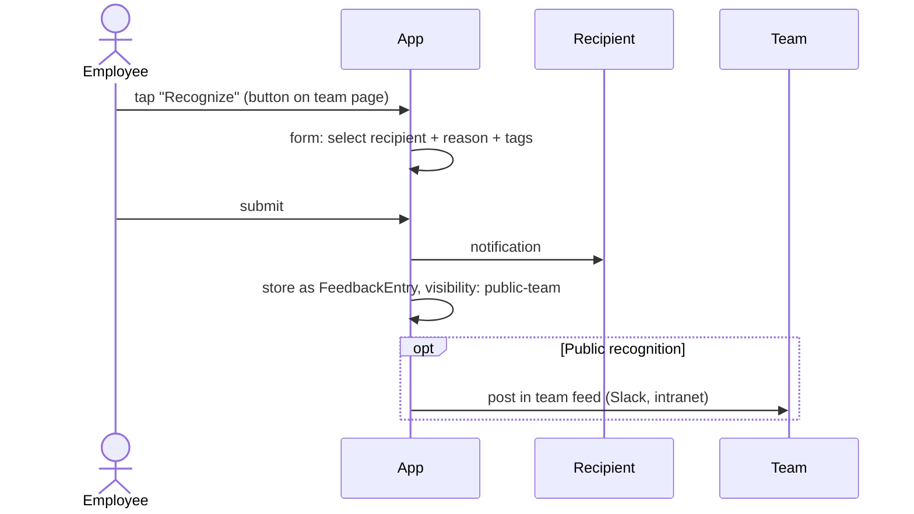
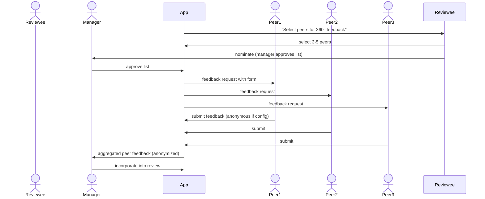

# 02 — Feedback & 1:1s

## Purpose

Continuous feedback bridges the gap between annual reviews. Effective managers feedback weekly; 1:1 meetings are critical for engagement, growth, and early issue detection.

This file specifies feedback entries, 1:1 meetings, and continuous feedback workflows.

## Feedback entry schema

```typescript
interface FeedbackEntry extends BaseDocument {
  _id: ObjectId;
  tenantId: ObjectId;
  entityId: ObjectId;
  
  // identity
  feedbackCode: string;                    // 'FB-2026-04-001234'
  
  // type
  feedbackType: 'manager-1on1' | 'peer' | 'reportee' | 'self' | 'spot-recognition' | 'developmental' | 'corrective';
  
  // participants
  fromEmployeeId: ObjectId;
  toEmployeeId: ObjectId;
  isAnonymous: boolean;                    // for peer/reportee in some setups
  
  // context
  contextType?: 'project' | 'goal' | 'incident' | 'general' | 'review-cycle';
  contextRefId?: ObjectId;                 // ref Goal / Project / Review etc.
  
  // content
  feedbackText: string;
  category?: 'strengths' | 'development-areas' | 'recognition' | 'concern' | 'suggestion';
  
  // structured fields (when used)
  competencyRatings?: Array<{
    competencyCode: string;
    rating: number;                        // 1-5
    comments?: string;
  }>;
  
  // visibility
  visibility: 'private-1on1' | 'visible-to-recipient' | 'visible-to-manager' | 'visible-to-skip-level' | 'hr-only';
  
  // tags
  tags?: string[];                         // 'communication', 'leadership', 'technical-skill'
  
  // sentiment / tone
  toneAssessment?: 'positive' | 'neutral' | 'constructive' | 'concerning';
  
  // requested follow-up
  followUpRequested: boolean;
  followUpDeadline?: Date;
  followUpStatus?: 'pending' | 'discussed' | 'closed';
  
  // metadata
  givenAt: Date;
  
  // for cycle reviews: aggregated to PerformanceReview
  cycleId?: ObjectId;
  isAggregatedToReview: boolean;
  
  createdAt: Date;
  updatedAt: Date;
  isDeleted: boolean;
}
```

## Indexes

```typescript
{ tenantId: 1, toEmployeeId: 1, givenAt: -1 }
{ tenantId: 1, fromEmployeeId: 1, givenAt: -1 }
{ tenantId: 1, contextRefId: 1 }
{ tenantId: 1, cycleId: 1, toEmployeeId: 1 }
```

## 1:1 meeting schema

```typescript
interface OneOnOneMeeting extends BaseDocument {
  _id: ObjectId;
  tenantId: ObjectId;
  entityId: ObjectId;
  
  // participants
  managerEmployeeId: ObjectId;
  reporteeEmployeeId: ObjectId;
  
  // schedule
  scheduledAt: Date;
  durationMinutes: number;                 // typically 30
  
  // recurrence
  isRecurring: boolean;
  recurringPattern?: 'weekly' | 'biweekly' | 'monthly';
  recurringSeriesId?: ObjectId;
  
  // status
  status: 'scheduled' | 'completed' | 'rescheduled' | 'cancelled' | 'no-show';
  rescheduleHistory?: Array<{ from: Date; to: Date; reason: string }>;
  
  // agenda
  agenda: Array<{
    topic: string;
    addedBy: 'manager' | 'reportee';
    addedAt: Date;
    priority?: 'high' | 'medium' | 'low';
    resolved: boolean;
    notes?: string;
  }>;
  
  // notes
  managerNotes?: string;
  reporteeNotes?: string;
  sharedNotes?: string;
  
  // action items
  actionItems: Array<{
    description: string;
    assignedTo: ObjectId;
    dueDate?: string;
    status: 'open' | 'in-progress' | 'completed' | 'dropped';
  }>;
  
  // sentiment / pulse
  reportedSentiment?: {                    // optional pulse from reportee
    energyLevel: 'high' | 'medium' | 'low';
    engagement: number;                    // 1-5
    blockersCount: number;
  };
  
  // links
  linkedFeedbackIds: ObjectId[];
  linkedGoalIds: ObjectId[];
  
  createdAt: Date;
  updatedAt: Date;
  isDeleted: boolean;
}
```

## 1:1 best practices in HRMS

The HRMS encourages:
- Recurring weekly / bi-weekly cadence
- Reportee-driven agenda (manager listens, doesn't dominate)
- Action items with owners
- Notes shared with reportee
- Pulse / sentiment tracking

UI nudges:
- "You haven't met with X for 21 days; schedule 1:1?"
- "Last 3 meetings had no action items; everything okay?"
- "Reportee energy reported low for 4 weeks; flag?"

## Feedback flows

### Spot recognition

Quick positive feedback:



### Developmental feedback

Constructive feedback with actionable suggestions:

- Manager → Reportee
- Visibility: 1:1 only
- Documented for review aggregation

### Peer feedback (360°)

Triggered during review cycle. Anonymous or named per tenant config.



## Feedback quality

To prevent spam / superficial:
- Min character count for narrative feedback
- Suggested prompts ("What did this person do well?", "What could improve?")
- Examples of good feedback
- Manager review of peer feedback before showing to reviewee

## Reportee feedback (upward)

Reportees can give feedback to managers:
- During 360° (formally)
- Continuously (anonymous channels)

Sensitive: managers may retaliate. Therefore:
- Anonymous mode for upward feedback
- Aggregated only (not single-source attribution)
- HR / skip-level review of patterns

## Self-assessment

Pre-review self-reflection:
- What went well
- What didn't
- Skills developed
- Goals achieved (with evidence)
- Career aspirations
- Asks for support

```typescript
interface SelfAssessment {
  reviewId: ObjectId;
  employeeId: ObjectId;
  
  responses: {
    accomplishments: string;               // narrative
    challenges: string;
    skillsImproved: string[];
    goalsCompletedDetails: Array<{ goalId: ObjectId; achievement: string }>;
    areasOfImprovement: string;
    careerAspirations: string;
    feedbackForManager: string;
    feedbackForOrganization: string;
  };
  
  selfRating?: number;                     // 1-5; tenant config whether visible to manager
  
  submittedAt?: Date;
  
  isComplete: boolean;
  isSubmitted: boolean;
}
```

## Continuous pulse / surveys

`[v2]` Periodic mini-surveys:
- 1-question weekly: "How was your week?"
- Monthly: engagement, manager support, growth
- Quarterly: deeper dive

Aggregated to engagement metrics; per-team trends.

## Data privacy and access controls

| Feedback type | Default visibility |
|---|---|
| 1:1 notes (manager-private) | Manager only |
| 1:1 notes (shared) | Manager + reportee |
| Peer feedback (anonymous) | Aggregated to manager + reviewee; no individual attribution |
| Reportee feedback to manager | Anonymous; aggregated; HR can view |
| Self-assessment | Reviewee + manager + HR |
| Spot recognition | Visible to team / org (public) |

`[CA-REVIEW]` DPDPA implications: feedback is personal data. Consent + retention rules apply.

## Reports

- **Feedback frequency**: feedbacks given/received per employee per quarter
- **Sentiment trends**: org-wide
- **Manager 1:1 cadence**: how often managers meet reportees
- **Action item completion**: % closed
- **Engagement signals**: pulse trends

## Open questions

`[OPEN]` Slack / Teams integration for spot recognition. Recommend: yes in v2; common request.

`[OPEN]` AI-assisted feedback prompts ("based on this person's recent work, here are 3 suggested feedback points"). Recommend: v2/v3.

`[OPEN]` 360 anonymous vs named: cultural depending. Recommend: tenant config.

`[OPEN]` Frequency of pulse surveys: too often = fatigue; too rare = stale data. Recommend: weekly 1-question optional.

## Cross-references

- [01-goals-and-okrs.md](./01-goals-and-okrs.md) — goals discussed in 1:1s
- [03-review-cycles.md](./03-review-cycles.md) — feedback aggregates into reviews
- [/00-foundations/03-identity-and-rbac.md](../00-foundations/03-identity-and-rbac.md) — manager / reportee permissions
