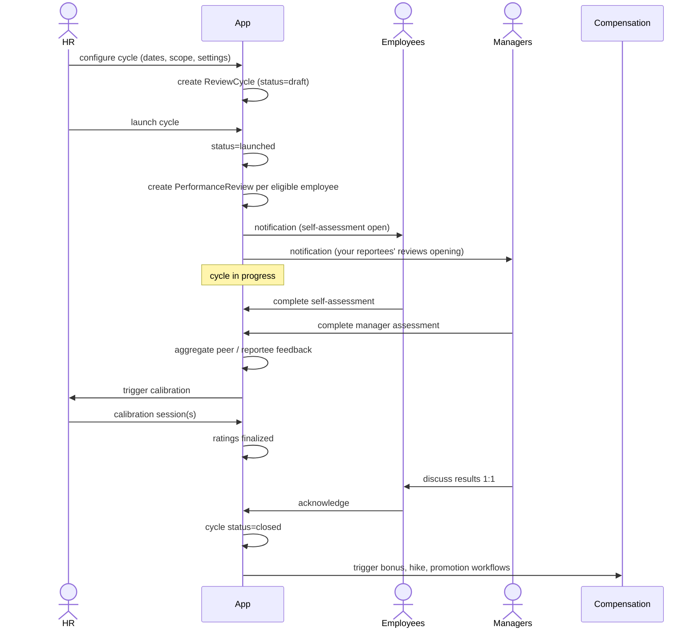
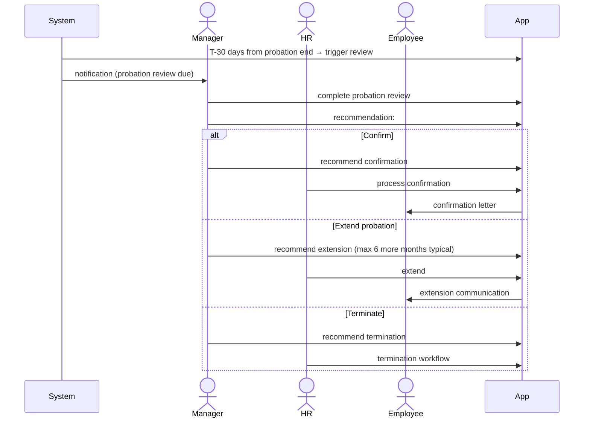

# 03 — Review Cycles

## Purpose

A review cycle is the formal periodic evaluation. The HRMS supports:

- **Annual cycle**: comprehensive year-end review
- **Mid-year**: half-year check-in
- **Quarterly**: lighter quarterly reviews
- **Probation**: end of probation review (typically 3-6 months in)
- **Project**: end-of-project or milestone-based
- **PIP**: performance improvement plan reviews (more frequent during PIP)

This file specifies cycle setup, participant flow, schemas for reviews.

## Review cycle schema

```typescript
interface ReviewCycle extends BaseDocument {
  _id: ObjectId;
  tenantId: ObjectId;
  entityId: ObjectId;
  
  // identity
  cycleCode: string;                       // 'CYCLE-FY26-ANNUAL'
  cycleName: string;
  
  // type and timing
  cycleType: 'annual' | 'mid-year' | 'quarterly' | 'probation' | 'project' | 'pip' | 'ad-hoc';
  cyclePeriod: {
    startDate: string;                     // performance period being reviewed
    endDate: string;
  };
  
  // schedule
  schedule: {
    cycleOpenDate: Date;                   // employees can start self-assessment
    selfAssessmentDeadline: Date;
    peerNominationDeadline?: Date;         // for 360
    peerFeedbackDeadline?: Date;
    managerAssessmentDeadline: Date;
    skipLevelReviewDeadline?: Date;
    calibrationStartDate: Date;
    calibrationEndDate: Date;
    finalRatingPublishDate: Date;
    discussionDeadline: Date;              // manager-reportee discussion
    cycleCloseDate: Date;
  };
  
  // participants
  applicableTo: {
    employeeCategories?: ('white-collar' | 'blue-collar')[];
    employmentTypes?: string[];
    departments?: ObjectId[];
    designationLevels?: string[];
    minServiceMonths?: number;             // exclude very recent hires
    employeeIds?: ObjectId[];              // explicit list (override)
  };
  
  // configuration
  configuration: {
    enableSelfAssessment: boolean;
    enable360Feedback: boolean;
    enableSkipLevelReview: boolean;
    enableCalibration: boolean;
    
    ratingScaleId: ObjectId;               // ref RatingScale
    forceDistributionPolicy?: { 
      enabled: boolean;
      targetDistribution?: Record<string, number>;  // e.g., {top:10, exceeds:20, meets:50, below:15, low:5}
    };
    
    enablePromotion: boolean;
    enableCompensationReview: boolean;
    enableBonusComputation: boolean;
  };
  
  // counts
  totalEligibleEmployees: number;
  reviewsCreated: number;
  reviewsCompleted: number;
  reviewsLocked: number;
  
  // status
  status: 'draft' | 'launched' | 'in-progress' | 'calibration' | 'finalizing' | 'closed' | 'cancelled';
  
  launchedAt?: Date;
  closedAt?: Date;
  
  createdAt: Date;
  updatedAt: Date;
  createdBy: ObjectId;
  isDeleted: boolean;
}
```

## Performance review schema

```typescript
interface PerformanceReview extends BaseDocument {
  _id: ObjectId;
  tenantId: ObjectId;
  entityId: ObjectId;
  cycleId: ObjectId;
  
  // identity
  reviewCode: string;                      // 'REV-FY26-ANNUAL-EMP00042'
  reviewType: 'annual' | 'mid-year' | 'probation' | 'project' | 'pip' | 'quarterly';
  
  // employee
  employeeId: ObjectId;
  employeeSnapshotAtReview: {
    designation: string;
    designationLevel: string;
    departmentId: ObjectId;
    managerId: ObjectId;
    skipManagerId?: ObjectId;
    joinedOn: string;
    serviceMonthsAtReview: number;
  };
  
  // performance period
  performancePeriod: { from: string; to: string };
  
  // input data (denormalized snapshot)
  goalsSnapshot: ObjectId[];               // refs to Goals being reviewed
  feedbackSnapshot: {
    peerFeedbackCount: number;
    reporteeFeedbackCount: number;
    managerFeedbackCount: number;
    spotRecognitionCount: number;
  };
  attendanceSummary: {
    presentDays: number;
    leaveDays: number;
    lopDays: number;
    chronicAbsenceFlag: boolean;
  };
  achievementsSnapshot?: any;
  
  // self-assessment
  selfAssessment: {
    isStarted: boolean;
    isSubmitted: boolean;
    submittedAt?: Date;
    selfAssessmentId?: ObjectId;
    selfRating?: number;
  };
  
  // 360 / peer
  peerFeedback: {
    nominatedPeerIds: ObjectId[];
    approvedPeerIds: ObjectId[];
    peerFeedbackReceived: number;
    aggregatedFeedbackId?: ObjectId;
  };
  
  // manager assessment
  managerAssessment: {
    managerId: ObjectId;
    
    isStarted: boolean;
    isSubmitted: boolean;
    submittedAt?: Date;
    
    competencyRatings?: Array<{
      competencyCode: string;
      rating: number;
      comments: string;
    }>;
    
    goalsAchievement?: Array<{
      goalId: ObjectId;
      achievementPercentage: number;
      narrativeAssessment: string;
    }>;
    
    overallStrengths: string;
    overallDevelopmentAreas: string;
    
    proposedRating?: number;               // pre-calibration
    
    promotionRecommendation?: 'yes' | 'no' | 'consider-future';
    salaryHikeRecommendation?: 'above-band' | 'standard' | 'below-band' | 'none';
    
    pipRecommendation?: 'yes' | 'no';
    pipReason?: string;
  };
  
  // skip-level review (if enabled)
  skipLevelReview?: {
    reviewerId: ObjectId;
    isCompleted: boolean;
    notes?: string;
    agreesWithManager: boolean;
    overrideRating?: number;
  };
  
  // calibration
  calibrationOutcome?: {
    calibratedRating: number;
    calibrationSession?: ObjectId;
    rationale?: string;
  };
  
  // final outcome
  finalRating?: number | string;
  finalNarrative?: string;
  
  // outcomes
  outcomes: {
    promotionGranted?: boolean;
    promotionToDesignation?: string;
    salaryHikePercentage?: number;
    salaryHikeAmount?: Decimal128;
    bonusAmount?: Decimal128;
    pipInitiated?: boolean;
    rolledOverToNextCycle?: boolean;
  };
  
  // discussion
  discussionScheduled?: Date;
  discussionCompleted: boolean;
  discussionNotes?: string;
  employeeAcknowledged: boolean;
  employeeAcknowledgedAt?: Date;
  employeeDisagreementNote?: string;
  
  // status
  status: ReviewStatus;
  
  // timing
  startedAt?: Date;
  submittedAt?: Date;
  finalizedAt?: Date;
  closedAt?: Date;
  
  createdAt: Date;
  updatedAt: Date;
  isDeleted: boolean;
}

type ReviewStatus =
  | 'pending-self-assessment'
  | 'self-assessment-in-progress'
  | 'self-assessment-submitted'
  | 'pending-peer-feedback'
  | 'peer-feedback-collected'
  | 'pending-manager-assessment'
  | 'manager-assessment-in-progress'
  | 'manager-assessment-submitted'
  | 'pending-skip-review'
  | 'skip-reviewed'
  | 'pending-calibration'
  | 'calibrated'
  | 'pending-discussion'
  | 'discussed'
  | 'finalized'
  | 'closed'
  | 'cancelled';
```

## Indexes

```typescript
{ tenantId: 1, cycleId: 1, employeeId: 1 }, unique
{ tenantId: 1, cycleId: 1, status: 1 }
{ tenantId: 1, employeeId: 1, reviewType: 1, performancePeriod: 1 }
{ tenantId: 1, 'managerAssessment.managerId': 1, status: 1 }
```

## Cycle launch flow



## Review timeline (typical annual cycle)

| Phase | Duration | Activities |
|---|---|---|
| Cycle launch | Day 1 | HR launches cycle; reviews created |
| Self-assessment | Days 1-14 | Employees self-assess |
| Peer nomination | Days 1-7 | Employees nominate peers |
| Peer feedback | Days 7-21 | Peers submit feedback |
| Manager assessment | Days 14-28 | Managers complete assessments |
| Skip-level review | Days 28-35 | Skip-managers review |
| Calibration | Days 35-49 | Calibration sessions |
| Discussion | Days 49-63 | Manager-reportee 1:1 discussions |
| Compensation actions | Days 56-70 | Hikes, bonuses, promotions effective |
| Cycle close | Day 70+ | All complete |

`[ASSUMPTION]` ~70-day end-to-end. Tenant config.

## Calibration session schema

```typescript
interface CalibrationSession extends BaseDocument {
  _id: ObjectId;
  tenantId: ObjectId;
  cycleId: ObjectId;
  
  sessionCode: string;
  
  // scope
  scopeType: 'department' | 'function' | 'level' | 'org';
  scopeRefId?: ObjectId;
  
  // participants
  facilitator: ObjectId;                   // typically HR
  managers: ObjectId[];                    // reviewing peers (other managers)
  
  // employees being calibrated
  reviewIds: ObjectId[];
  totalEmployees: number;
  
  // timing
  scheduledAt: Date;
  durationMinutes: number;
  conductedAt?: Date;
  
  // outcomes
  ratingDistributionBefore: Record<string, number>;
  ratingDistributionAfter: Record<string, number>;
  ratingChangesCount: number;
  
  // notes
  facilitatorNotes?: string;
  
  // status
  status: 'scheduled' | 'in-progress' | 'completed' | 'cancelled';
  
  createdAt: Date;
  updatedAt: Date;
  isDeleted: boolean;
}
```

## Probation review (special)

Triggered automatically when employee approaches end of probation:



## Project / milestone reviews

Some companies use project-based reviews:
- Triggered at project completion
- Project manager assesses team
- Lighter than annual

## Mid-year reviews

Lighter version:
- Goal progress
- Course-correct if needed
- No rating typically (or interim rating that doesn't affect compensation)

## PIP reviews

For underperformers:
- Bi-weekly during PIP
- Detailed against PIP plan
- Outcome decisions: pass / fail / extend

## Reports

- **Cycle Health**: % completion at each phase
- **Manager Compliance**: % of managers completing on time
- **Distribution**: ratings distribution, calibration impact
- **Cycle Comparison**: vs prior cycle
- **Bottleneck Analysis**: where cycles delay

## Open questions

`[OPEN]` Forced ranking / bell curve: love-hate. Recommend: tenant config; default not enforced.

`[OPEN]` Anonymous skip-level review: useful for honest feedback but managers' privacy. Recommend: yes; named in some tenants.

`[OPEN]` Cycle for blue-collar with simpler form. Recommend: yes; auto-applied based on category.

`[OPEN]` Long-tail employees (joined mid-cycle, short tenure): pro-rated review or skip? Recommend: include if 3+ months tenure; lighter form.

## Cross-references

- [01-goals-and-okrs.md](./01-goals-and-okrs.md) — goals reviewed
- [02-feedback-and-1on1s.md](./02-feedback-and-1on1s.md) — feedback aggregated
- [04-rating-and-calibration.md](./04-rating-and-calibration.md) — ratings
- [/03-payroll/07-bonus-calculation.md](../03-payroll/07-bonus-calculation.md) — bonus from rating
- [/01-employee/06-lifecycle-state-machine.md](../01-employee/06-lifecycle-state-machine.md) — confirmation post-probation
