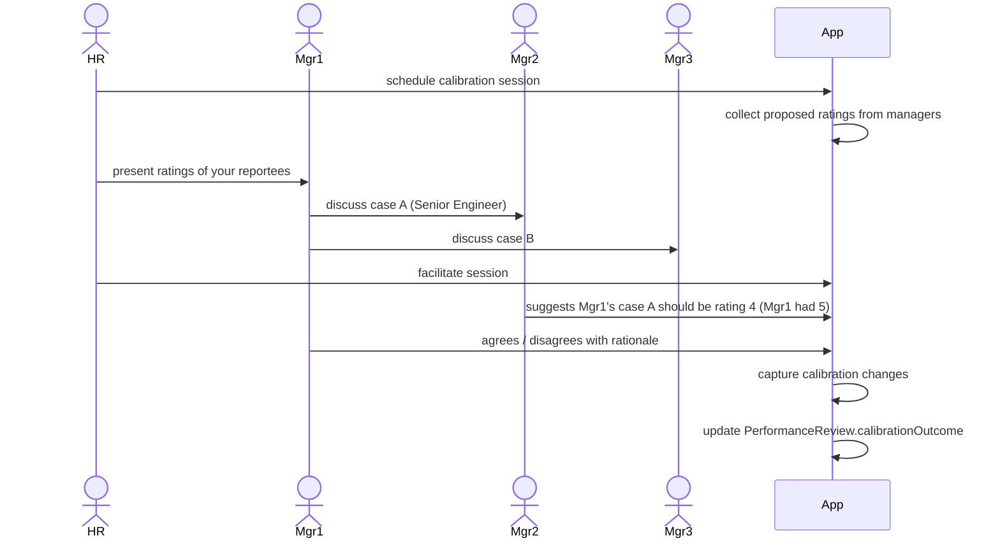
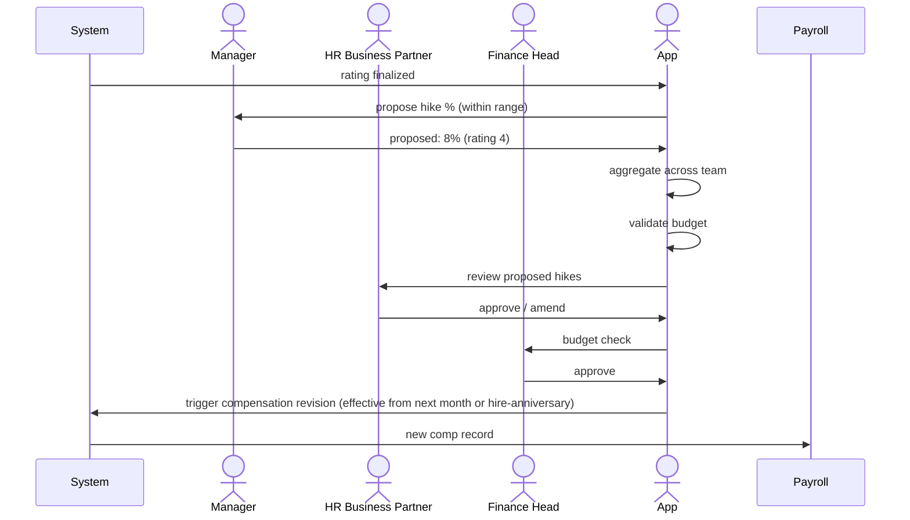

# 04 — Rating & Calibration

## Purpose

Ratings are the numeric / categorical summary of an employee's performance for a cycle. Calibration is the process of normalizing ratings across managers to ensure fairness and prevent rating drift (some managers rate everyone high; others harsh).

This file specifies rating scales, calibration mechanics, distribution policies, and rating-to-outcome linkage.

## Rating scale schema

```typescript
interface RatingScale extends BaseDocument {
  _id: ObjectId;
  tenantId: ObjectId;
  
  scaleCode: string;                       // 'STANDARD-5-POINT'
  scaleName: string;
  
  scaleType: 'numeric' | 'descriptive' | 'percentage' | 'composite';
  
  // numeric scale
  levels: Array<{
    value: number;                         // 1, 2, 3, 4, 5 OR 1-5 letters
    label: string;                         // 'Outstanding', 'Exceeds Expectations', etc.
    description: string;
    
    // for distribution policies
    targetPercentage?: number;             // soft target for forced distribution
    
    // outcome mapping
    typicalSalaryHikePercent?: number;
    typicalBonusMultiplier?: number;
    promotionEligible?: boolean;
    pipTrigger?: boolean;
  }>;
  
  // for composite (weighted multi-dim)
  dimensions?: Array<{
    name: string;                          // 'Goal Achievement' | 'Behavioral'
    weight: number;
    scaleId?: ObjectId;
  }>;
  
  isDefault: boolean;
  isActive: boolean;
  effectiveFrom: Date;
  effectiveTo?: Date;
  
  createdAt: Date;
  updatedAt: Date;
  isDeleted: boolean;
}
```

## Standard 5-point scale (default)

| Value | Label | Description | Target % | Typical hike | Bonus mult |
|---|---|---|---|---|---|
| 5 | Outstanding | Exceptional contribution; rare | 5-10% | 12-15% | 1.5-2.0× |
| 4 | Exceeds Expectations | Consistently above target | 15-25% | 8-10% | 1.2-1.5× |
| 3 | Meets Expectations | Solid performance | 50-60% | 5-7% | 1.0× |
| 2 | Needs Improvement | Below target; PIP candidate | 10-15% | 3-5% or 0% | 0.5× |
| 1 | Unsatisfactory | Major performance issues | 1-5% | 0% | 0× |

`[ASSUMPTION]` Indian SME industry typical distribution. Tenant configurable.

## Alternative scales

### 4-point (avoids "average middle")

| Value | Label |
|---|---|
| 4 | Exceeds |
| 3 | Meets |
| 2 | Partially Meets |
| 1 | Below |

### 3-point (simple)

| Value | Label |
|---|---|
| 3 | Above Bar |
| 2 | At Bar |
| 1 | Below Bar |

### Descriptive (no number)

- Outstanding
- Strong
- Solid
- Developing
- Concern

Some companies prefer no numeric to avoid mathematical mindset.

## Forced distribution / Bell curve

Some companies enforce distribution:
- Top 10%: rating 5
- Next 20%: rating 4
- Middle 50%: rating 3
- Next 15%: rating 2
- Bottom 5%: rating 1

Pros:
- Fair distinction
- Prevents grade inflation
- Identifies underperformers

Cons:
- Demoralizing if forced
- May rate good people low to fit curve
- Discouraged by modern HR thought leaders

The HRMS:
- Tenant config: `forceDistribution.enabled` (default false)
- If enabled: warns when distribution skewed; doesn't strictly enforce
- Reports distribution per manager + dept

## Calibration mechanics

Without calibration: Manager A rates all 4-5; Manager B rates all 2-3 (harsh). Same person under A vs B: different rating.

With calibration: Managers come together, present cases, normalize.



## Calibration grid

Visual tool for calibration: 9-box grid (performance × potential):

```
          Low Performance    Mid Performance    High Performance
High      Diamond in Rough  Future Star        Top Talent
Potential
Mid       Risk             Core Player        High Potential
Potential
Low       Underperformer   Steady Performer   Specialist
Potential
```

Each employee placed on grid; calibration ensures no manager places everyone in top-right.

## Rating finalization

```typescript
function finalizeRating(review: PerformanceReview): { rating: number; rationale: string } {
  // Inputs:
  // - Self-rating (advisory)
  // - Manager proposed rating
  // - Skip-level adjustment
  // - Calibration outcome
  // - Goal achievement
  // - Peer feedback
  
  let rating = review.managerAssessment.proposedRating;
  
  if (review.skipLevelReview?.overrideRating) {
    rating = review.skipLevelReview.overrideRating;
  }
  
  if (review.calibrationOutcome?.calibratedRating) {
    rating = review.calibrationOutcome.calibratedRating;
  }
  
  return {
    rating,
    rationale: composeRationale(review),
  };
}
```

## Bias detection

Patterns flagged:
- Manager rates all 5s (lenient)
- Manager rates all 2-3s (harsh)
- Gender bias (female rated lower than male in same role)
- Age bias (older rated lower)
- Tenure bias (newer rated lower)
- Department bias (one dept consistently lower)

```typescript
interface BiasDetectionReport {
  cycleId: ObjectId;
  
  managerLeniencyAnalysis: Array<{
    managerId: ObjectId;
    avgRating: number;
    distributionVsOrg: 'lenient' | 'normal' | 'harsh';
  }>;
  
  potentialDemographicBias: Array<{
    dimension: string;                     // 'gender', 'age', etc.
    biasIndicator: string;
    severity: 'low' | 'medium' | 'high';
    affectedManagers?: ObjectId[];
  }>;
}
```

`[CA-REVIEW]` Sensitive analytics. Aggregated; not blame individuals without process. Used for org-level interventions.

## Rating-to-outcome mapping

```typescript
interface RatingOutcomeMapping {
  cycleId: ObjectId;
  
  outcomes: Record<number, {                // keyed by rating value
    standardSalaryHikePercent: number;
    standardBonusMultiplier: number;
    promotionEligible: boolean;
    pipTrigger: boolean;
    
    rangeOverride?: {                      // mgr can override within range
      minHike: number;
      maxHike: number;
      minBonus: number;
      maxBonus: number;
    };
  }>;
}
```

Example FY26-27 mapping:

| Rating | Hike % | Bonus mult |
|---|---|---|
| 5 | 12-15% | 1.5-2.0× |
| 4 | 8-10% | 1.2-1.4× |
| 3 | 5-7% | 1.0× |
| 2 | 0-3% | 0.5× |
| 1 | 0% | 0× |

Manager applies within range based on goals achievement, behavioral.

## Salary hike workflow



Compensation revision flow connects to `/01-employee/03-compensation-record.md`.

## Bonus computation

Per `/03-payroll/07-bonus-calculation.md`:
- Statutory bonus: per Bonus Act
- Performance bonus: per rating × multiplier × base bonus

Performance bonus formula:
```
Performance bonus = Annual base bonus × rating multiplier × goal achievement %
```

Example:
- Pankaj's annual bonus base: ₹1,50,000
- Rating: 4 (multiplier 1.3)
- Goal achievement: 95%
- Performance bonus: 150000 × 1.3 × 0.95 = ₹1,85,250

## Rating publication

Once finalized:
- Manager schedules discussion with reportee
- Discussion before announcement (to avoid surprises)
- Reportee acknowledges in HRMS
- Disagreement note option (escalates to HR)

```typescript
interface RatingPublicationRecord {
  reviewId: ObjectId;
  publishedAt: Date;
  
  // discussion
  discussionScheduledAt?: Date;
  discussionCompleted: boolean;
  discussionDoneAt?: Date;
  
  // employee response
  employeeAcknowledged: boolean;
  employeeAcknowledgedAt?: Date;
  employeeDisagreement?: {
    raisedAt: Date;
    reason: string;
    escalatedTo?: ObjectId;
    resolutionStatus: 'pending' | 'discussed' | 'rating-adjusted' | 'closed-no-change';
    resolutionNotes?: string;
  };
}
```

## Rating override / escalation

Rare scenarios:
- HR override (e.g., manager bias detected)
- Skip-manager override
- HR head escalation

All require approval + audit + manager visibility.

## Reports

- **Rating Distribution**: per dept, per cycle, vs prior
- **Manager Calibration Effectiveness**: distribution shifts post-calibration
- **Bias Indicators**: demographic distribution analysis
- **Rating Trends**: same employees over multiple cycles
- **Outcomes Distribution**: hikes, bonuses, promotions per rating

## Open questions

`[OPEN]` Calibration as voluntary discussion vs mandatory ratings change. Recommend: tenant config; default voluntary with strong nudges.

`[OPEN]` AI-suggested rating based on goals + feedback + attendance. Recommend: v2; advisory not authoritative.

`[OPEN]` Mid-cycle calibration check (not just end). Useful for catching drift early. Recommend: optional in v2.

`[OPEN]` Public-facing rating distribution (transparency). Recommend: aggregated only at org level.

## Cross-references

- [03-review-cycles.md](./03-review-cycles.md) — reviews leading to ratings
- [05-pip-and-improvement.md](./05-pip-and-improvement.md) — low ratings → PIP
- [06-promotion-progression.md](./06-promotion-progression.md) — high ratings → promotion
- [/03-payroll/07-bonus-calculation.md](../03-payroll/07-bonus-calculation.md) — bonus
- [/01-employee/03-compensation-record.md](../01-employee/03-compensation-record.md) — comp revision
