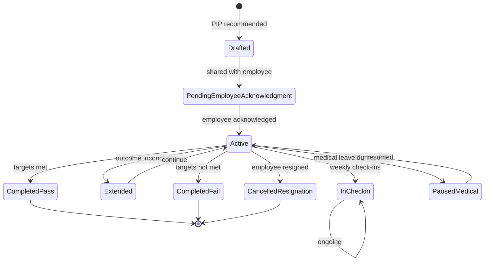
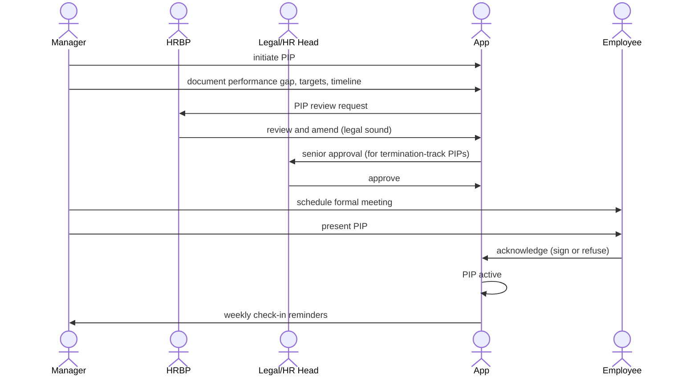

# 05 — Performance Improvement Plan (PIP)

## Purpose

A PIP is a structured intervention for employees whose performance is below expectations. It provides:

- Clear documentation of performance gaps
- Specific, measurable improvement targets
- Defined timeline (typically 30-90 days)
- Periodic check-ins
- Defined outcomes (pass / fail)

PIPs are sensitive: too lenient and they're a path to nowhere; too aggressive and they expose the company to legal challenges.

This file specifies PIP schema, workflow, monitoring, and outcomes.

## PIP schema

```typescript
interface PerformanceImprovementPlan extends BaseDocument {
  _id: ObjectId;
  tenantId: ObjectId;
  entityId: ObjectId;
  
  // identity
  pipCode: string;                         // 'PIP-2026-04-001234'
  
  // employee
  employeeId: ObjectId;
  managerId: ObjectId;
  hrBusinessPartnerId: ObjectId;
  
  // trigger
  triggerSource: 'review-rating' | 'manager-observation' | 'hr-initiated' | 'specific-incident';
  triggeringReviewId?: ObjectId;
  triggeringIncidents?: Array<{ incidentDate: Date; description: string }>;
  
  // duration
  pipStartDate: string;
  pipEndDate: string;
  durationDays: number;                    // typically 30, 60, or 90
  
  // performance gap
  performanceGap: {
    summary: string;                       // overall description
    specificAreas: Array<{
      areaCode: string;                    // 'communication' | 'technical-quality' | 'productivity'
      currentLevel: string;                // observed
      expectedLevel: string;                // standard
      evidenceDocuments?: ObjectId[];
    }>;
  };
  
  // improvement targets
  improvementTargets: Array<{
    targetCode: string;
    description: string;
    measurement: string;                   // how to measure
    currentValue: string | number;
    targetValue: string | number;
    
    weight: number;
    
    milestones: Array<{
      week: number;                        // week 1, 2, 3...
      description: string;
      targetValue?: string | number;
      isAchieved?: boolean;
      assessedAt?: Date;
      assessedBy?: ObjectId;
    }>;
    
    finalAssessment?: {
      achievedValue: string | number;
      achievementPercent: number;
      outcome: 'achieved' | 'partially-achieved' | 'not-achieved';
      notes: string;
    };
  };
  
  // support / resources
  supportPlan: {
    coachingProvided: string[];
    trainingRecommended?: string[];
    additionalResources?: string[];
    mentorAssigned?: ObjectId;
    weeklyOneOnOnesScheduled: boolean;
  };
  
  // check-ins
  checkIns: Array<{
    weekNumber: number;
    scheduledDate: string;
    actualMeetingDate?: Date;
    
    progressNotes: string;
    onTrack: boolean;
    concerns?: string;
    
    employeeFeedback?: string;
    
    completedBy: ObjectId;
    completedAt?: Date;
  }>;
  
  // employee acknowledgment (legal)
  employeeAcknowledgment: {
    pipPlanShared: boolean;
    sharedAt?: Date;
    employeeAcknowledged: boolean;
    acknowledgedAt?: Date;
    acknowledgmentDocumentId?: ObjectId;
    employeeSignedDocumentId?: ObjectId;
    
    employeeRefusedToSign?: boolean;
    refusalNotes?: string;
  };
  
  // final outcome
  finalOutcome?: {
    decidedAt: Date;
    decision: 'pass-confirmed-back-to-active' | 'extend-pip' | 'fail-termination' | 'fail-demotion' | 'fail-role-change' | 'employee-resigned-during-pip';
    
    achievementSummary: string;
    
    passDetails?: {
      restoredToActiveDate: string;
      enhancedMonitoringPeriodMonths?: number;
    };
    
    extendDetails?: {
      newEndDate: string;
      revisedTargets?: any;
      maxExtensionsAllowed: number;
    };
    
    terminationDetails?: {
      terminationDate: string;
      noticeServed: boolean;
      separationType: 'with-cause' | 'mutual-separation' | 'redundancy';
    };
    
    decisionApprovers: Array<{
      role: string;
      employeeId: ObjectId;
      decision: 'agree' | 'disagree';
      decidedAt: Date;
      notes?: string;
    }>;
    
    documentationLinks: ObjectId[];
  };
  
  // status
  status: PipStatus;
  
  // metadata
  createdAt: Date;
  updatedAt: Date;
  createdBy: ObjectId;
  isDeleted: boolean;
}

type PipStatus =
  | 'drafted'
  | 'pending-employee-acknowledgment'
  | 'active'
  | 'in-checkin'
  | 'extended'
  | 'completed-pass'
  | 'completed-fail'
  | 'cancelled-resignation'
  | 'cancelled-by-mgmt'
  | 'paused-medical'
  | 'paused-other';
```

## Indexes

```typescript
{ tenantId: 1, employeeId: 1, status: 1 }
{ tenantId: 1, pipCode: 1 }, unique
{ tenantId: 1, managerId: 1, status: 1 }
{ tenantId: 1, status: 1, pipEndDate: 1 }
```

## PIP lifecycle



## PIP creation flow



## Documenting performance gap

Critical for legal defensibility:

| Element | Why important |
|---|---|
| Specific examples | "Late delivery on Project X (Oct 15), Project Y (Nov 3)" not "always late" |
| Dates and evidence | Documented, dated, evidenced |
| Standards | What's expected (job description, prior reviews) |
| Prior feedback | "Discussed in Sept 1:1, Nov 5 review" |
| Measurable | "Code quality scores below 7/10 (industry avg 8)" |

Vague gaps ("attitude problem") don't hold up; specific behavioral / outcome gaps do.

## Improvement targets

SMART targets (Specific, Measurable, Achievable, Relevant, Time-bound):

```
Target 1: Code quality
- Current: average code review feedback score 6.2/10
- Target: 8.5/10 by week 8
- Milestones:
  - Week 2: complete refresher training on code quality
  - Week 4: 7.0/10 average
  - Week 6: 7.8/10 average
  - Week 8: 8.5/10 (final assessment)

Target 2: Delivery timeliness
- Current: 60% of tasks delivered within estimate
- Target: 90% within estimate by week 8
- Milestones: weekly task tracking
```

## Check-in workflow

Weekly during PIP:
- Manager + employee meet
- Progress against milestones
- Adjustments needed
- Documented in HRMS

```typescript
interface PipCheckIn {
  pipId: ObjectId;
  weekNumber: number;
  meetingDate: Date;
  durationMinutes: number;
  
  presentParticipants: ObjectId[];
  
  agenda: string[];
  progressNotes: string;
  
  // tracking
  milestonesAssessed: Array<{
    targetCode: string;
    milestoneIndex: number;
    isAchieved: boolean;
    notes: string;
  }>;
  
  overallProgress: 'on-track' | 'behind' | 'ahead' | 'concern';
  riskOfFailure: 'low' | 'medium' | 'high';
  
  // employee voice
  employeeFeedback: string;
  employeeMood: 'engaged' | 'stressed' | 'disengaged' | 'frustrated';
  
  // adjustments
  adjustmentsToTargets?: any;
  additionalSupportProvided?: string;
  
  // outcome of meeting
  decisions: Array<{ description: string }>;
  
  nextWeekFocus: string;
  
  signedByManager: boolean;
  acknowledgedByEmployee: boolean;
  
  documentLinks?: ObjectId[];
}
```

## PIP outcomes

### Pass

- All / most targets met
- Employee returns to active status
- Optional: enhanced monitoring period (continue weekly 1:1s for 3-6 months)
- Confirmed in writing
- No bonus / hike penalty going forward (unless prior cycle decision)

### Fail

Multiple paths:
- **Termination**: most common; with notice / severance per contract
- **Demotion**: rare; rolling back designation / level
- **Role change**: lateral move to different team / role
- **Mutual separation**: agreed exit without termination label

`[CA-REVIEW]` Each path has different legal exposure. Termination after PIP fails is defensible if PIP was fair, documented, supported, and timelines reasonable.

### Extend

If outcome inconclusive, extend (typically once, max 30 more days). Multiple extensions = inconclusive PIP = legal weakness.

## Resignation during PIP

Common: employees resign during PIP. The HRMS:
- Mark PIP as cancelled-resignation
- F&F per regular separation
- Optional: waiving notice period (manager discretion)
- No PIP outcome recorded; treats as employee-initiated

## Medical / personal leave during PIP

If employee needs medical / personal leave:
- PIP paused
- Resumed on return
- New end date adjusted

## Legal documentation

Every PIP creates:
- PIP plan PDF (signed by manager + employee)
- Weekly check-in records
- Final outcome document
- Termination letter (if applicable)

All retained 7+ years.

## HR involvement

HR Business Partner (HRBP) involved throughout:
- Drafting (legal language)
- Approving plan
- Final outcome decision
- Termination process

Some tenants require HR + Legal sign-off on terminations.

## PIP for high-performers in slump

Sometimes high-performers temporarily slump (personal issues, burnout):
- Sensitive handling: short-form PIP / "performance discussion"
- Less formal documentation initially
- Escalate to formal PIP if not improved

## Reports

- **Active PIPs**: count by stage
- **PIP Outcome**: pass / fail / cancelled rates over time
- **Manager PIP Stats**: which managers initiate most PIPs (signal of management quality or team challenges)
- **PIP Duration**: avg duration to outcome
- **Termination Patterns**: post-PIP terminations vs other separations

## Open questions

`[OPEN]` PIP automation: HRMS auto-recommends PIP based on rating (rating 1 → auto-PIP). Recommend: suggested but require manual confirmation.

`[OPEN]` Anonymous skip-level review during PIP: opportunity for employee to express concerns about PIP fairness. Recommend: yes; HR review.

`[OPEN]` PIP discussion training for managers: out of v1 scope. Tenant responsibility (or external training partners).

`[OPEN]` Cool-off period before initiating PIP after rating publication. Recommend: 2-week minimum; allows discussion + improvement before formal step.

## Cross-references

- [04-rating-and-calibration.md](./04-rating-and-calibration.md) — low rating → PIP trigger
- [03-review-cycles.md](./03-review-cycles.md) — review setup
- [/01-employee/06-lifecycle-state-machine.md](../01-employee/06-lifecycle-state-machine.md) — termination state
- [/03-payroll/09-fnf-settlement.md](../03-payroll/09-fnf-settlement.md) — F&F on termination
