# 06 — Promotion & Progression

## Purpose

Promotion is upward movement in designation / level. Progression is the broader career path including lateral moves, role expansion, level changes. The HRMS supports:

- Promotion criteria definition per role
- Promotion recommendation workflow (manager-initiated)
- Approval chain
- Compensation adjustment
- Communication and effective date
- Career path visualization

## Promotion schema

```typescript
interface Promotion extends BaseDocument {
  _id: ObjectId;
  tenantId: ObjectId;
  entityId: ObjectId;
  
  // identity
  promotionCode: string;                   // 'PROMO-2026-04-001234'
  
  // employee
  employeeId: ObjectId;
  
  // change details
  fromDesignation: string;
  fromDesignationLevel: string;
  fromDepartmentId?: ObjectId;
  fromManagerId?: ObjectId;
  fromLocationId?: ObjectId;
  
  toDesignation: string;
  toDesignationLevel: string;
  toDepartmentId?: ObjectId;
  toManagerId?: ObjectId;
  toLocationId?: ObjectId;
  
  // compensation change
  fromCtc: Decimal128;
  toCtc: Decimal128;
  changeAmount: Decimal128;
  changePercent: number;
  
  fromSalaryStructureId?: ObjectId;
  toSalaryStructureId?: ObjectId;
  
  // reason
  reason: PromotionReason;
  cycleId?: ObjectId;                      // if from review cycle
  performanceReviewId?: ObjectId;
  
  // case
  promotionRationale: string;              // narrative
  achievements: string[];
  competenciesDemonstrated: string[];
  recommendedBy: ObjectId;                 // typically manager
  
  // approval
  approvalChain: Array<{
    sequence: number;
    approverRole: string;
    approverEmployeeId?: ObjectId;
    decision?: 'approved' | 'rejected' | 'reverted';
    decidedAt?: Date;
    notes?: string;
  }>;
  currentApprovalStep: number;
  
  // effective date
  effectiveFrom: string;                   // typically 1st of month or annual cycle date
  
  // status
  status: PromotionStatus;
  
  // communication
  announcementCompleted: boolean;
  announcementDocument?: ObjectId;
  announcementChannels: ('email' | 'town-hall' | 'team-meeting' | 'intranet')[];
  
  // post-promotion
  is90DayReviewScheduled: boolean;
  ninetyDayReviewDate?: string;
  
  // metadata
  createdAt: Date;
  updatedAt: Date;
  createdBy: ObjectId;
  isDeleted: boolean;
}

type PromotionReason =
  | 'performance-cycle'                    // from annual review
  | 'merit-based-out-of-cycle'             // exceptional
  | 'role-expansion'                       // expanded responsibilities
  | 'leadership-track'                     // moving into management
  | 'specialist-track'                     // technical depth
  | 'cross-functional-move'                // change function
  | 'retention'                            // counter-offer / retention
  | 'reorganization';                      // structural change

type PromotionStatus =
  | 'recommended'
  | 'pending-approval'
  | 'approved'
  | 'announced'
  | 'effective'
  | 'completed-90day-review'
  | 'cancelled'
  | 'rolled-back';
```

## Indexes

```typescript
{ tenantId: 1, employeeId: 1, effectiveFrom: -1 }
{ tenantId: 1, promotionCode: 1 }, unique
{ tenantId: 1, status: 1, effectiveFrom: 1 }
```

## Career path / level structure

```typescript
interface CareerPath extends BaseDocument {
  _id: ObjectId;
  tenantId: ObjectId;
  
  pathCode: string;                        // 'ENG-IC-PATH'
  pathName: string;                        // 'Engineering Individual Contributor'
  
  jobFamily: string;
  
  levels: Array<{
    levelCode: string;                     // 'L1' | 'L2' | 'L3' etc.
    designation: string;                   // 'Junior Engineer' | 'Engineer' | 'Senior Engineer'
    
    // criteria
    minYearsExperience?: number;
    minTimeInPriorLevel?: number;          // months
    requiredSkills: string[];
    expectedCompetencies: Array<{ competency: string; level: number }>;
    typicalResponsibilities: string[];
    
    // expected ranges
    typicalCtcRange: { min: Decimal128; max: Decimal128 };
    
    // promotion criteria to next level
    promotionRequirements?: {
      minPriorPerformanceRating?: number;
      minTimeInLevelMonths?: number;
      certificationRequired?: string[];
      managerEndorsement: boolean;
      skipLevelReviewRequired?: boolean;
    };
    
    nextLevels?: string[];                 // possible next levels
  };
  
  isActive: boolean;
  
  createdAt: Date;
  updatedAt: Date;
  isDeleted: boolean;
}
```

## Standard career paths

### Engineering IC track (L1-L8)

| Level | Designation | Years exp | CTC range |
|---|---|---|---|
| L1 | Junior Engineer | 0-2 | ₹6-10L |
| L2 | Engineer | 2-4 | ₹10-15L |
| L3 | Senior Engineer | 4-7 | ₹15-25L |
| L4 | Staff Engineer | 7-10 | ₹25-40L |
| L5 | Senior Staff | 10-13 | ₹40-60L |
| L6 | Principal Engineer | 13-16 | ₹60-90L |
| L7 | Distinguished | 16+ | ₹90L+ |
| L8 | Fellow | rare | ₹1.5Cr+ |

`[ASSUMPTION]` India tech market FY26-27 ranges. Tenant-specific.

### Engineering management track

| Level | Designation |
|---|---|
| M1 | Engineering Manager (3-7 reports) |
| M2 | Senior Engineering Manager |
| M3 | Director of Engineering |
| M4 | Senior Director |
| M5 | VP Engineering |
| M6 | SVP / CTO |

### Sales track

| Level | Designation |
|---|---|
| L1 | Business Development Rep |
| L2 | Sales Executive |
| L3 | Senior Sales Executive |
| L4 | Account Manager |
| L5 | Sales Manager |
| L6 | Senior Sales Manager |
| L7 | Director of Sales |
| L8 | VP Sales |

### Operations / blue-collar track

| Level | Designation |
|---|---|
| W1 | Operator (Trainee) |
| W2 | Operator |
| W3 | Senior Operator |
| W4 | Lead Operator / Team Lead |
| W5 | Supervisor |
| W6 | Production Manager |

## Promotion lifecycle

```mermaid
stateDiagram-v2
    [*] --> Recommended: manager initiates
    Recommended --> PendingApproval: submitted
    PendingApproval --> Approved: all approvals
    PendingApproval --> Rejected: approver declines
    Approved --> Announced: effective date set
    Announced --> Effective: from effective date
    Effective --> Completed90DayReview: post-promo review
    Effective --> RolledBack: rare; promotion reversed
    Rejected --> [*]
    Cancelled --> [*]
    RolledBack --> [*]
    Completed90DayReview --> [*]
```



## Promotion criteria evaluation

Before recommendation:
- Time in current level (e.g., min 18 months)
- Performance rating (typically 4+ in last 1-2 cycles)
- Competency assessment per next level
- Skills met
- Manager endorsement
- Skip-level / panel review (for senior promotions)

```typescript
interface PromotionEligibilityCheck {
  employeeId: ObjectId;
  targetLevel: string;
  
  evaluation: {
    timeInLevel: { current: number; required: number; isMet: boolean };
    performanceRating: { recent: number; required: number; isMet: boolean };
    competencies: Array<{
      competencyName: string;
      currentLevel: number;
      requiredLevel: number;
      isMet: boolean;
    }>;
    skills: { matched: number; required: number; isMet: boolean };
  };
  
  isEligible: boolean;
  gaps: string[];
  recommendations: string[];
}
```

## Approval chain

Default:

| Promotion type | Approvers |
|---|---|
| Within-level (e.g., L3 to L4 IC) | Manager, HRBP, Dept Head |
| To management (IC to M1) | Manager, HRBP, Dept Head, HR Head |
| Senior leadership (M3+) | All above + Tenant Admin |

Configurable.

## Compensation adjustment on promotion

Standard:
- Promotion hike: 10-25% (varies)
- New CTC within next level's typical range
- Adjusted from effective date

```typescript
function computePromotionCompensation(
  currentCtc: Decimal128,
  toLevel: CareerLevel
): { newCtc: Decimal128; rationale: string } {
  const targetMin = toLevel.typicalCtcRange.min;
  const targetMax = toLevel.typicalCtcRange.max;
  const targetMid = targetMin.plus(targetMax).div(2);
  
  // Standard 12% promotion hike
  let newCtc = currentCtc.times(1.12);
  
  // Cap at target range
  if (newCtc.lt(targetMin)) {
    newCtc = targetMin;
  } else if (newCtc.gt(targetMax)) {
    newCtc = targetMax;
  }
  
  return {
    newCtc,
    rationale: `Promoted to ${toLevel.designation}; CTC adjusted to ₹${newCtc} within target range ₹${targetMin}-${targetMax}.`,
  };
}
```

`[ASSUMPTION]` 12% standard; tenant config.

## Out-of-cycle promotions

Most promotions happen in annual cycle. Out-of-cycle:
- Exceptional performance
- Retention (counter-offer)
- Critical role gap

Higher approval bar.

## Effective date

Typical:
- April 1 (if FY-aligned cycle)
- Hire anniversary
- 1st of next month after approval
- Special date (e.g., milestone date)

## Communication

Promotion announcement:
- Email to team / dept
- Mention in town hall
- LinkedIn announcement (if employee opts)
- Updated org chart

Sensitive:
- Co-promoted peer might feel slighted
- Skipped peers might feel demotivated
- Discussion with non-promoted reportees

## 90-day post-promotion review

Tracks whether promotion was right:
- Adjusting to new level
- Stakeholder feedback
- Early concerns

If concerns:
- Coaching support
- Adjusted expectations
- Rare: rollback (legally complex)

## Demotion / role change

Rare but possible:
- Performance issues → demotion (better than termination)
- Role didn't fit → lateral move
- Reorganization

Distinct from promotion (often handled with PIP context).

## Career path visualization

For employees:
- Current level + next levels
- Required skills / competencies
- Typical timeline
- Successful peer examples (anonymous)

ESS feature for engagement.

## Reports

- **Promotion Rate**: % promoted per cycle, per dept
- **Time to Promotion**: avg from L1→L2, L2→L3, etc.
- **Promotion Equity**: by demographic dimensions
- **Career Velocity**: fastest growing employees
- **Stagnation**: employees in same level for 3+ years

## Open questions

`[OPEN]` Promotion communication template — generic vs personalized. Recommend: template with personalization placeholders.

`[OPEN]` Internal job postings vs promotions: separate flows or same? Recommend: internal job posting (`/05-recruitment/02`) when role + dept change; promotion when level change in current role.

`[OPEN]` Promotion budget: % of salary cost reserved for promotions. Recommend: tenant policy; visible in HRMS.

`[OPEN]` Skip-level promotion (jump 2 levels): rare; allowed with extra approval. Recommend: yes; senior approval required.

## Cross-references

- [04-rating-and-calibration.md](./04-rating-and-calibration.md) — rating → promotion eligibility
- [/01-employee/02-employment-record.md](../01-employee/02-employment-record.md) — designation history
- [/01-employee/03-compensation-record.md](../01-employee/03-compensation-record.md) — CTC change
- [/05-recruitment/](../05-recruitment/) — internal applications
- [/03-payroll/01-salary-structure-builder.md](../03-payroll/01-salary-structure-builder.md) — new structure
