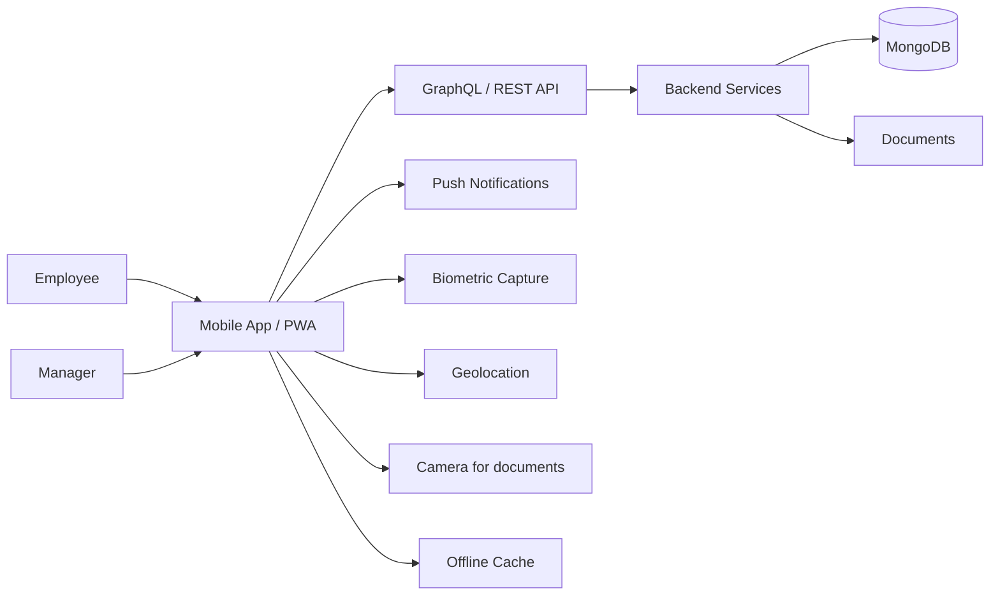

# 00 — ESS & Mobile Overview

## Purpose

Employee Self-Service (ESS) lets employees and managers interact with the HRMS without HR intervention. For an Indian SME, ESS is often the most-used surface — payslips, leave applications, attendance check-in, expense submissions.

Mobile is critical: 80%+ of Indian workforce primarily uses smartphones. Web-only HRMS fails. The HRMS ships with a Progressive Web App (PWA) at v1; native iOS / Android apps in v2.

## Scope of this folder

`/07-ess-mobile/` covers the employee-facing experience.

**In scope:**

- Employee dashboard (home screen)
- Profile self-service
- Payslip download and history
- Leave application + balance + status
- Attendance check-in / check-out
- Tax declaration / proof submission
- Expense / reimbursement claims
- Helpdesk / ticket submission
- Manager-specific features (approvals, team views)
- Mobile architecture (PWA, native, offline)
- Push notifications

**Out of scope:**

- L&D / training portal → v2 module
- Communication / chat → v2 module
- Internal social network → v3
- Wellness / benefits portal → v2

## Files in this folder

1. [01-mobile-app-architecture.md](./01-mobile-app-architecture.md) — PWA vs native, offline, push notifications
2. [02-payslips-and-tax-statements.md](./02-payslips-and-tax-statements.md) — Payslip download, IT statement, F16
3. [03-leave-and-attendance-mobile.md](./03-leave-and-attendance-mobile.md) — Leave apply, attendance check-in
4. [04-tax-declarations-and-investment-proofs.md](./04-tax-declarations-and-investment-proofs.md) — Form 12BB, proof upload
5. [05-helpdesk-and-tickets.md](./05-helpdesk-and-tickets.md) — Internal HR ticketing
6. [06-pwa-vs-native.md](./06-pwa-vs-native.md) — Implementation decision
7. [07-edge-cases.md](./07-edge-cases.md) — Edge cases

## Architectural position



## ESS principles

1. **Mobile-first**: design for smartphone users
2. **Indian-language ready**: Hindi, regional languages by region (v2)
3. **Low-bandwidth tolerant**: minimize data, support 2G fallback
4. **Offline-capable**: critical actions work offline (attendance, leave application)
5. **Notification-rich**: leave approval, payslip ready, holiday reminders
6. **Action-oriented**: reduce clicks; common actions one-tap
7. **Secure**: biometric auth on mobile

## Default mobile dashboard layout

For employee:

```
+----------------------------------+
| HOME                             |
+----------------------------------+
| Welcome, Pankaj!                 |
| Today: Apr 29, 2026 | 11:30 AM   |
+----------------------------------+
| [✓ CHECK IN]  (large button)     |
+----------------------------------+
| Quick Actions                    |
|   [📅 Apply Leave] [💰 Payslip]  |
|   [📋 Tickets]    [👤 Profile]   |
+----------------------------------+
| Leave Balance                    |
|   EL: 18.5 | CL: 5 | SL: 8       |
+----------------------------------+
| Upcoming                         |
|   • Holiday: 1 May (Maharashtra) |
|   • Performance Review: 30 May   |
|   • Payday: 1 May                |
+----------------------------------+
| Pending Actions                  |
|   • IT proof submission (pending)|
|   • Goal mid-year update          |
+----------------------------------+
```

For manager (toggle to manager view):

```
+----------------------------------+
| MANAGER VIEW                     |
+----------------------------------+
| Pending Approvals (3)            |
|   • Leave: Rahul (3 days)        |
|   • Expense: Sara (₹3,500)       |
|   • Reg: Vikram (Apr 26 missing)  |
+----------------------------------+
| Team Today (12 / 15 present)     |
|   3 absent: Rahul, Vivek, Pooja  |
+----------------------------------+
| Quick Stats                      |
|   • This week's leaves: 4        |
|   • Pending 1:1s: 2              |
|   • Reviews due: 5 (Q2 cycle)    |
+----------------------------------+
```

## Key user journeys

### Employee journey

1. **Morning check-in**: open app → tap check-in → confirms location → done
2. **Apply leave**: tap leave → select type → dates → reason → submit → manager approves
3. **Check payslip**: tap payslip → opens last month → can download PDF
4. **Submit IT proof**: tap declaration → upload → done
5. **View team birthdays / events**: home feed

### Manager journey

1. **Approve leave**: notification → tap → see balance, calendar conflicts → approve / reject
2. **Approve expense**: notification → review receipt → approve / query
3. **Daily team view**: who's in / out / on leave
4. **Quick 1:1 note**: log a feedback during 1:1

## Notification types

| Type | Trigger | Channel |
|---|---|---|
| Payslip ready | Monthly | Push + email |
| Leave approved/rejected | On decision | Push + in-app |
| Expense approved/rejected | On decision | Push + in-app |
| Holiday reminder | T-2 days | Push |
| Birthday wishes (own) | On birthday | Push |
| Performance review due | Cycle dates | Push + email |
| 1:1 reminder | T-1 hour | Push |
| New policy update | On publish | In-app + email |
| Manager: pending approvals | Daily summary | Push (if pending) |
| Critical: payroll discrepancy | Immediate | Push + SMS |

User can configure notification preferences.

## Mobile UI considerations

- Large tap targets (min 48dp)
- One-handed reach (action buttons in lower half)
- Single-purpose screens
- Empty states with clear next-action
- Loading skeleton / progress indicators
- Error states with retry
- Confirmation toasts for actions
- Pull-to-refresh on lists

## Indian context

- Hindi default language toggle (v2: regional languages)
- Currency: ₹ (Decimal128 backend; display formatted)
- Date format: DD-MM-YYYY (Indian standard)
- Time: 12-hour format default; 24-hour option
- Phone: +91 prefix
- Pincode integration (auto-fill state/district)

## Accessibility

- Screen reader compatibility
- High contrast mode
- Large text option
- Color-blind friendly palette
- Keyboard navigation (web)
- Voice input for quick actions (v2)

## Open questions (overall)

`[OPEN]` v1 PWA vs v1 native. Recommend: PWA in v1 for speed of delivery; native in v2 for performance and OS-deep features.

`[OPEN]` Single app or separate "manager" app? Recommend: single app with role-based UI toggle.

`[OPEN]` In-app chat / DM? Out of v1; build into Slack-like platform integration in v2.

`[OPEN]` Offline-first data sync strategy: how aggressive? Recommend: critical actions (attendance, leave) cached and synced; everything else online.

`[OPEN]` Multilingual: Hindi essential; others by region. Recommend: English + Hindi in v1; Tamil/Telugu/Marathi/Kannada/Bengali/Gujarati in v2.

## Cross-references

- [/02-attendance/10-mobile-and-offline.md](../02-attendance/10-mobile-and-offline.md) — attendance mobile detailed
- [/03-payroll/10-payslip-format.md](../03-payroll/10-payslip-format.md) — payslip
- [/00-foundations/03-identity-and-rbac.md](../00-foundations/03-identity-and-rbac.md) — auth and roles
