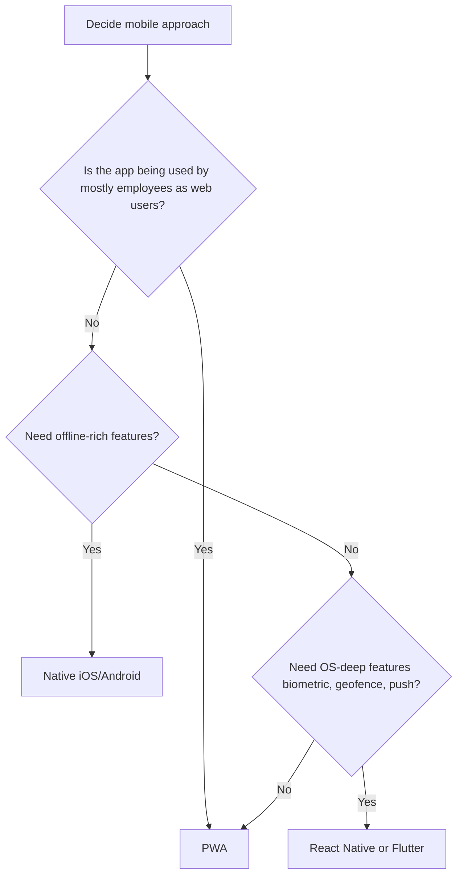
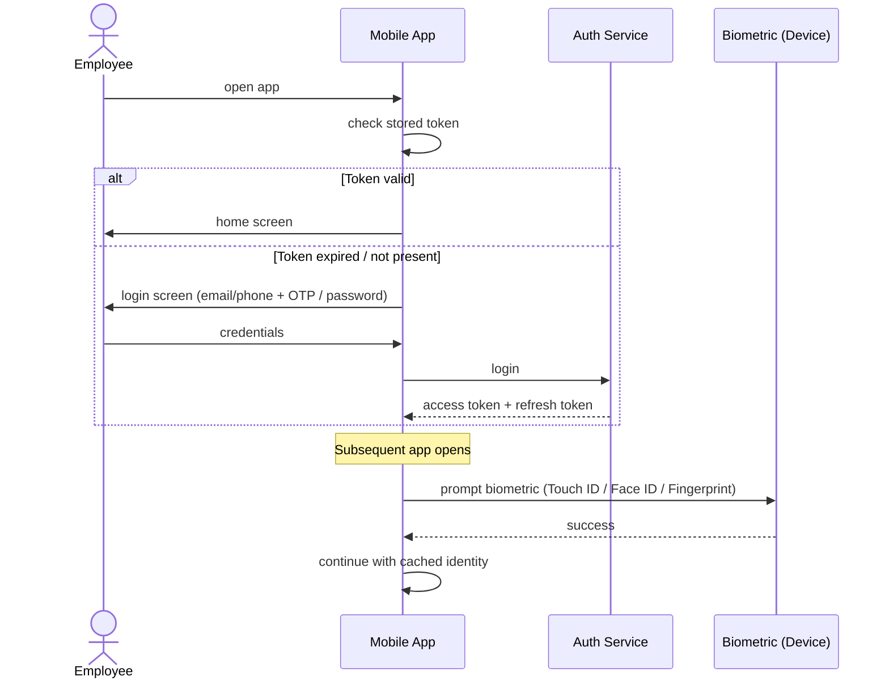
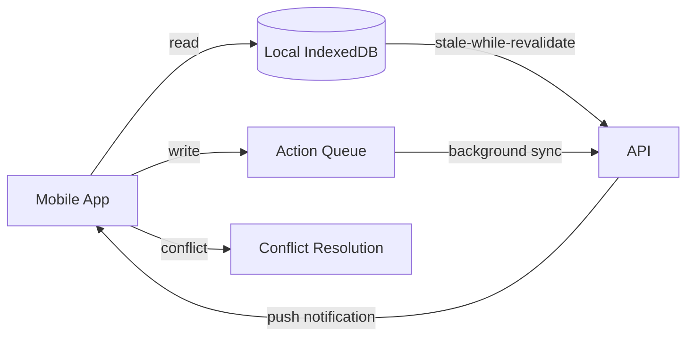

# 01 — Mobile App Architecture

## Purpose

Architectural decisions for HRMS mobile experience: PWA, native, hybrid, offline strategy, push notifications, biometric auth, geolocation.

## Decision tree



For HRMS: PWA in v1 (faster delivery, lower investment); React Native + Native in v2 (production ready, OS-deep features).

## Stack selection

`[v1]` PWA built on web stack:
- Next.js 15 (same as desktop web)
- Service Worker for offline
- Workbox for caching strategies
- Push API + Web Push protocol
- Web Crypto for credentials

`[v2]` React Native (or Flutter):
- React Native 0.74+ for code sharing with web
- Or Flutter for performance + cross-platform consistency
- Native iOS / Android for OS-deep features

## PWA architecture

```typescript
// Service worker handles
- Offline page fallback
- API request caching (stale-while-revalidate for read; queue for write)
- Background sync (deferred actions when online)
- Push notifications

// IndexedDB for local storage
- Employee profile (master data)
- Recent payslips (last 6 months)
- Leave balances
- Cached API responses
```

## Authentication

Mobile auth flow:



### Biometric auth

- Stored encryption key unlocked by biometric
- Refresh token only released after biometric pass
- 30-day session validity (config); biometric prompt every app open
- Fallback to PIN / password if biometric fails

### Token strategy

```typescript
interface MobileAuthState {
  accessToken: string;                     // short-lived, 15 min
  refreshToken: EncryptedString;           // long-lived; stored in OS keychain
  
  encryptedKey: string;                    // for IndexedDB encryption
  biometricEnrolled: boolean;
  pinCodeSet: boolean;
  
  lastTokenRefreshAt: Date;
  sessionExpiresAt: Date;
  
  deviceFingerprint: string;
  deviceTrust: 'trusted' | 'unknown' | 'suspicious';
}
```

## Offline-first design

Some actions must work offline:
- Attendance check-in / out (most critical)
- Leave application (queue for sync)
- Profile view (master data cached)
- Recent payslips (cached)

```typescript
interface OfflineActionQueue {
  actionId: string;
  actionType: 'attendance-checkin' | 'leave-apply' | 'expense-submit' | 'feedback' | 'other';
  payload: any;
  
  capturedAt: Date;
  capturedLocation?: { lat: number; lng: number };
  
  status: 'pending' | 'syncing' | 'synced' | 'failed' | 'expired';
  
  syncAttempts: number;
  lastSyncAttemptAt?: Date;
  lastErrorMessage?: string;
  
  // for attendance: allow retroactive marking
  retroactiveAllowed: boolean;
}
```

Sync strategy:
- Background sync when device comes online (Service Worker / native)
- Retries with exponential backoff
- User notified of failures
- Manual retry option

## Push notifications

`[v1]` PWA: Web Push (Firebase Cloud Messaging or Apple Push)
`[v2]` Native: APNs (iOS), FCM (Android)

```typescript
interface PushNotificationPreference {
  employeeId: ObjectId;
  
  channels: {
    payslip: boolean;
    leaveApproval: boolean;
    expenseApproval: boolean;
    holidayReminder: boolean;
    performanceReview: boolean;
    teamUpdates: boolean;
    systemAnnouncements: boolean;
  };
  
  // quiet hours
  quietHours: {
    enabled: boolean;
    startTime?: string;                    // '22:00'
    endTime?: string;                      // '07:00'
    timezone: string;
  };
  
  // device token
  deviceTokens: Array<{
    token: string;
    platform: 'web' | 'ios' | 'android';
    deviceId: string;
    addedAt: Date;
    lastUsedAt: Date;
  }>;
}
```

## Geolocation

For attendance / field workers:

```typescript
interface GeolocationCapture {
  capturedAt: Date;
  latitude: number;
  longitude: number;
  accuracy: number;                        // meters
  
  // additional context
  altitude?: number;
  heading?: number;
  speed?: number;
  
  // device-reported
  source: 'gps' | 'wifi' | 'cell' | 'fallback';
  
  // mock detection
  isMockLocation: boolean;                 // some Android allow mock; flag suspicious
}
```

`[v2]` Geo-fencing:
- Office boundaries defined
- Auto check-in when entering geo-fence
- Background location (with consent)

## Camera integration

For document capture:
- Profile photo
- Document upload (PAN, Aadhaar, etc.)
- Expense receipts
- Selfie for attendance verification

```typescript
function captureDocument(): Promise<Blob> {
  // OS camera dialog
  // Auto-detect rectangular boundaries (v2)
  // Compress + upload to S3
  // Return signed URL for storage
}
```

## Biometric attendance (v2)

`[v2]` On-device biometric verification:
- Face match (selfie at check-in vs registered photo)
- Fingerprint (less common; requires hardware)
- Liveness detection (anti-spoofing)

Vendor APIs:
- Face++  
- Trueface
- IDfy
- AuthBridge (Face Match Real-Time)

## Battery considerations

- Background location: opt-in only (drains battery)
- Push instead of polling
- Compressed API responses
- Lazy load images
- WebP format

## Network considerations

India: 2G/3G still common in rural; 4G most urban; 5G emerging.

- Compressed JSON (gzip)
- API response < 50KB ideal
- Image lazy loading + thumbnails
- Skeleton screens during load
- Prefetch on WiFi only

## Data sync architecture



### Conflict resolution

Rare in HRMS (mostly read-heavy + simple writes). When conflicts occur:
- Server wins for read data
- For writes: timestamp-based; later wins (with audit)
- Critical conflicts (payroll, leave): server-side validation always

## Performance metrics

Target SLAs:
- App launch: < 2 sec
- Action response: < 1 sec
- Offline action capture: instant
- Sync to backend: < 5 sec when online
- Push notification delivery: < 30 sec

## Versioning and updates

`[v1]` PWA: instant updates via service worker
`[v2]` Native: app store releases monthly

In-app update notifications:
- "New version available; tap to refresh" (PWA)
- "New version in App Store" (native)
- Force update for security-critical

## Crash reporting and analytics

`[v2]` Sentry / Firebase Crashlytics
- Anonymous crash reports
- User analytics (with consent per DPDPA)
- Performance monitoring

## DPDPA compliance

- Explicit consent for location, camera, contacts
- Data minimization (don't capture more than needed)
- User right to delete (clears local cache + asks server)
- Encryption at rest (device keychain + IndexedDB)
- Encryption in transit (TLS 1.3)

## Multi-tenant on mobile

Single app for all tenants:
- Tenant context loaded on login
- All data scoped per tenant
- No cross-tenant data leakage in cache
- Cache cleared on logout / tenant switch

## Open questions

`[OPEN]` Webview vs native: WebView for some screens, native for others (hybrid)? Recommend: pure native for v2; better UX.

`[OPEN]` App store distribution vs MDM-only (enterprise). Some tenants want only MDM. Recommend: support both; MDM via TestFlight / Google Play Enterprise.

`[OPEN]` Anonymous mode (no PII access without auth). Useful for some scenarios. Recommend: out of v1 scope.

`[OPEN]` Watch / wearable app for senior leaders (quick approvals)? Recommend: v3 / niche.

`[OPEN]` Voice assistant integration (Alexa, Google Assistant). Recommend: v3.

## Cross-references

- [00-overview.md](./00-overview.md) — overall ESS philosophy
- [/02-attendance/10-mobile-and-offline.md](../02-attendance/10-mobile-and-offline.md) — attendance mobile
- [/00-foundations/03-identity-and-rbac.md](../00-foundations/03-identity-and-rbac.md) — auth
- [06-pwa-vs-native.md](./06-pwa-vs-native.md) — implementation choice
