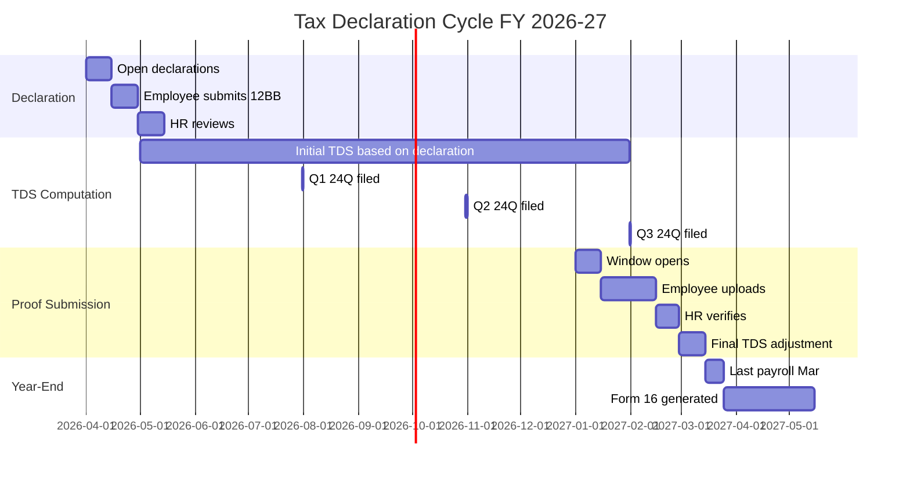

# 04 — Tax Declarations & Investment Proofs

## Purpose

Form 12BB declarations and Q4 proof submissions are the most error-prone employee tax workflows. ESS streamlines the flow.

## Annual declaration cycle



## Declaration UI

```
+----------------------------------+
| Tax Declaration FY 2026-27       |
+----------------------------------+
| Status: NOT SUBMITTED            |
| Deadline: 30 April 2026          |
+----------------------------------+
| Step 1: Choose tax regime        |
|   ⊙ New regime (default)         |
|   ○ Old regime                   |
| [More info]                      |
+----------------------------------+
| (For new regime, declarations    |
|  apply differently — most        |
|  exemptions don't apply)         |
+----------------------------------+
| Step 2: HRA Exemption (if old)   |
|   I pay rent: ⊙ Yes ○ No         |
|   Monthly rent: ₹25,000          |
|   Landlord PAN: ABCDE1234F        |
|   Property address: [text]       |
+----------------------------------+
| Step 3: Section 80C (max ₹1.5L)  |
|   PF (auto)         ₹21,600      |
|   Insurance         ₹50,000      |
|   PPF               ₹0           |
|   ELSS              ₹0           |
|   Home loan princ.  ₹0           |
|   Children tuition  ₹0           |
|   Other             ₹0           |
|   ─────────────────────────       |
|   Total             ₹71,600      |
+----------------------------------+
| Step 4: Section 80D (Health Ins) |
|   Self / family     ₹25,000      |
|   Parents (senior)  ₹50,000      |
+----------------------------------+
| Step 5: Other Deductions         |
|   80E - Education loan           |
|   80G - Donations                |
|   80EE - First-time home loan    |
|   ...                            |
+----------------------------------+
| [SAVE DRAFT] [SUBMIT]            |
+----------------------------------+
```

## Old vs new regime

Helper to compare:

```
+----------------------------------+
| Regime Comparison                |
+----------------------------------+
| Salary: ₹15,00,000               |
+----------------------------------+
| OLD REGIME                       |
|   Less: Std Deduction   ₹50,000  |
|   Less: HRA Exemption  ₹1,80,000 |
|   Less: 80C            ₹1,50,000 |
|   Less: 80D              ₹75,000 |
|   ─────────────────────────       |
|   Taxable               ₹10,45,000│
|   Tax (with cess)        ₹1,30,624│
+----------------------------------+
| NEW REGIME                       |
|   Less: Std Deduction   ₹75,000  |
|   ─────────────────────────       |
|   Taxable               ₹14,25,000│
|   Tax (with cess)         ₹83,200 │
+----------------------------------+
| Saving with new regime           |
|   ₹47,424                        |
+----------------------------------+
```

`[CA-REVIEW]` Computation accuracy critical. Must use IT Act 2025 slabs verified by tenant CA.

## Declaration validation

- HRA exemption requires: rent payment, landlord PAN (if rent > ₹1L/year)
- 80C: capped at ₹1.5L (excluding NPS extra)
- 80D: capped at ₹25K + ₹50K parents (senior)
- 80E: education loan must be from approved lender
- Home loan: principal under 80C, interest under 24(b)

Inline validation prevents errors.

## Proof submission window

Q4 (Jan-Mar): proofs collected.

```
+----------------------------------+
| Proof Submission                 |
| Deadline: 15 February 2027       |
+----------------------------------+
| Pending Items:                   |
+----------------------------------+
| Insurance (₹50,000 declared)     |
|   Status: NOT SUBMITTED          |
|   [📤 UPLOAD]                    |
+----------------------------------+
| HRA - Rent Receipts              |
|   Apr to Dec ₹25,000/month       |
|   Status: SUBMITTED               |
|   [VIEW]                         |
+----------------------------------+
| 80D - Parents Health Insurance   |
|   Status: SUBMITTED ✓             |
+----------------------------------+
| Bank fixed deposit               |
|   Status: NOT DECLARED            |
|   [+ ADD]                        |
+----------------------------------+
```

## Upload flow

```
+----------------------------------+
| Upload Proof: Insurance Premium  |
+----------------------------------+
| Insurance Type:                  |
|   ⊙ Life Insurance               |
|   ○ Health Insurance              |
|   ○ Other                         |
+----------------------------------+
| Insurer Name: HDFC Life            |
| Policy Number: 12345678901         |
| Premium Amount: ₹50,000             |
| Period Covered: Apr 2026 - Mar 2027  |
| Receipt Date: 15 Feb 2027            |
+----------------------------------+
| Receipt Document                 |
|   📷 Take Photo                  |
|   📁 Upload from Files          |
+----------------------------------+
| ✓ I confirm this is genuine      |
+----------------------------------+
| [SUBMIT]                         |
+----------------------------------+
```

After submission:
- Status: 'awaiting verification'
- HR / Finance reviews
- If approved → applied to tax
- If rejected → reason + re-upload option

## Verification flow

Verifier (HR / Finance):

```
+----------------------------------+
| Verify Proof: Pankaj Kumar       |
| Insurance - ₹50,000               |
+----------------------------------+
| [📷 View Document]               |
+----------------------------------+
| Validation Checklist             |
|   ✓ Document is legible          |
|   ✓ Beneficiary is the employee  |
|   ✓ Period covers FY              |
|   ✓ Premium amount matches       |
|   ☐ Verify with public records   |
+----------------------------------+
| Decision                         |
|   [APPROVE] [REJECT] [QUERY]     |
+----------------------------------+
```

## TDS impact tracking

Declarations fed into TDS engine (`/03-payroll/05-payroll-engine.md`):
- April: tentative declaration; TDS proportional
- Mid-year: revisit if salary changed (promotion, etc.)
- Q4: actual proofs verified; TDS adjusted

End of FY: total tax should ≈ liability per actual income.

## Example flow for Pankaj

April 2026 (declaration):
- Old regime
- HRA: ₹3L expected
- 80C: ₹1.5L
- 80D: ₹50K
- Total deductions: ~₹5.5L
- Projected tax: ₹X
- Monthly TDS: X/12 = ₹y

December 2026 (Q3 review):
- Actual rent paid Jan-Dec: ₹3L on track
- 80C: planned ₹1.5L; current ₹71K (PF only)
- Risk: short-fall
- Notification: complete remaining 80C investments

January 2027 (proof window):
- Pankaj uploads:
  - Rent receipts (12 months)
  - PPF deposit ₹50K
  - Life insurance ₹50K
- HR verifies
- Section 80C becomes 21,600 + 50,000 + 50,000 = ₹1,21,600 (vs declared 150K → shortfall ₹28K)

February 2027 (TDS adjustment):
- Recompute TDS with verified deductions
- February + March payslips: corrected TDS

May 2027 (Form 16):
- Final TDS reconciled
- Filed in Form 24Q Q4
- Pankaj receives Form 16

## Error handling

| Error | Action |
|---|---|
| Missing PAN for landlord | Block submission; require entry |
| Premium amount > declared | Allow with HR review |
| Period mismatch | Flag for clarification |
| Document unreadable | Reject with reason; re-upload |
| Suspected fraud | Flag for legal review |

## Open questions

`[OPEN]` Auto-fill from past year. Recommend: yes; copy declarations from prior FY.

`[OPEN]` Bulk upload (multiple proofs at once). Recommend: yes for similar types.

`[OPEN]` AI-based document recognition (extract amount from receipt). Recommend: v2; uses accuracy.

`[OPEN]` Pre-filled HRA receipts (employee provides landlord PAN once). Recommend: yes; recurring template.

`[OPEN]` Regime switch mid-year: complicated; some IT departments allow only at FY start. Recommend: tenant default at FY start; mid-year requires HR approval.

## Cross-references

- [02-payslips-and-tax-statements.md](./02-payslips-and-tax-statements.md) — payslips
- [/04-compliance/03-tds-and-income-tax.md](../04-compliance/03-tds-and-income-tax.md) — Form 12BB / 16
- [/03-payroll/04-pre-payroll-inputs.md](../03-payroll/04-pre-payroll-inputs.md) — declarations input
- [/03-payroll/05-payroll-engine.md](../03-payroll/05-payroll-engine.md) — TDS in payroll
