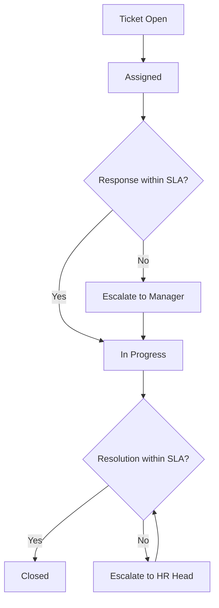

# 05 — Helpdesk & Tickets

## Purpose

HR helpdesk handles employee queries / issues — from "I can't access my payslip" to "I need help with policy clarification." A dedicated ticketing system organizes these and routes appropriately.

## Ticket schema

```typescript
interface HrTicket extends BaseDocument {
  _id: ObjectId;
  tenantId: ObjectId;
  entityId: ObjectId;
  
  // identity
  ticketCode: string;                      // 'TKT-2026-04-001234'
  
  // raised by
  raisedByEmployeeId: ObjectId;
  raisedAt: Date;
  raisedVia: 'mobile' | 'web' | 'email' | 'phone' | 'whatsapp';
  
  // category
  primaryCategory: TicketCategory;
  subCategory?: string;                    // ticket-specific
  
  // content
  subject: string;
  description: string;
  
  // attachments
  attachmentDocumentIds: ObjectId[];
  
  // priority
  priority: 'low' | 'medium' | 'high' | 'urgent';
  // (urgent: payroll error, ESI insurance issue, harassment)
  
  // sentiment
  sentiment?: 'positive' | 'neutral' | 'frustrated' | 'angry';
  
  // assignment
  assignedToEmployeeId?: ObjectId;
  assignedTeam?: 'hr-operations' | 'payroll' | 'compliance' | 'it-support' | 'admin' | 'finance' | 'leadership';
  assignedAt?: Date;
  
  // SLA
  responseSlaHours: number;                // first response time
  resolutionSlaHours: number;              // total resolution
  responseDueAt: Date;
  resolutionDueAt: Date;
  
  isResponseLate: boolean;
  isResolutionLate: boolean;
  
  // resolution
  status: TicketStatus;
  
  resolutionNotes?: string;
  resolutionDate?: Date;
  resolutionTimeMinutes?: number;
  
  // satisfaction
  satisfactionRating?: number;             // 1-5 from employee
  satisfactionFeedback?: string;
  satisfactionRatedAt?: Date;
  
  // history
  comments: Array<{
    commentId: string;
    by: ObjectId;
    role: 'requester' | 'assignee' | 'manager' | 'hr-admin';
    isInternal: boolean;                   // not visible to requester
    text: string;
    attachments?: ObjectId[];
    createdAt: Date;
  }>;
  
  statusChanges: Array<{
    fromStatus: string;
    toStatus: string;
    changedBy: ObjectId;
    changedAt: Date;
    notes?: string;
  }>;
  
  // escalation
  isEscalated: boolean;
  escalatedTo?: ObjectId;
  escalatedAt?: Date;
  escalationReason?: string;
  
  // relation to other entities
  relatedEntityType?: 'payroll' | 'leave-application' | 'expense-claim' | 'benefit-claim' | 'policy' | 'other';
  relatedEntityId?: ObjectId;
  
  createdAt: Date;
  updatedAt: Date;
  isDeleted: boolean;
}

type TicketCategory =
  | 'payroll-issue'
  | 'leave-issue'
  | 'attendance-issue'
  | 'tax-tds-query'
  | 'document-request'
  | 'policy-question'
  | 'benefits-query'
  | 'grievance'
  | 'harassment'
  | 'safety-concern'
  | 'it-equipment'
  | 'office-facilities'
  | 'travel-expense'
  | 'reimbursement'
  | 'general-query'
  | 'feedback-suggestion';

type TicketStatus =
  | 'open'
  | 'assigned'
  | 'in-progress'
  | 'awaiting-employee-response'
  | 'awaiting-third-party'
  | 'resolved'
  | 'closed'
  | 'escalated'
  | 'reopened';
```

## Indexes

```typescript
{ tenantId: 1, ticketCode: 1 }, unique
{ tenantId: 1, raisedByEmployeeId: 1, status: 1 }
{ tenantId: 1, assignedToEmployeeId: 1, status: 1 }
{ tenantId: 1, status: 1, raisedAt: -1 }
{ tenantId: 1, primaryCategory: 1, status: 1 }
{ tenantId: 1, isResolutionLate: 1 }
```

## Ticket creation flow

```mermaid
sequenceDiagram
    actor Employee
    participant App
    participant Routing as Routing Engine
    participant HRTeam
    
    Employee->>App: tap "Help" or "Raise Ticket"
    App->>Employee: category selector
    Employee->>App: select category
    Employee->>App: enter subject + description
    Employee->>App: attach files (optional)
    Employee->>App: submit
    
    App->>Routing: route ticket (category + tenant rules)
    Routing->>App: assign to HR Operations team
    
    App->>HRTeam: notification
    App->>Employee: confirmation (Ticket #TKT-2026-04-001234)
    
    HRTeam->>App: respond / clarify
    App->>Employee: notification
    
    Employee->>App: response (if needed)
    App->>HRTeam: notification
    
    HRTeam->>App: resolve
    App->>Employee: notification (closed; rate experience)
    Employee->>App: 5★ rating + feedback
```

## Auto-routing rules

```typescript
interface TicketRoutingRule {
  ruleCode: string;
  
  conditions: {
    categories?: TicketCategory[];
    keywords?: string[];                   // in subject / description
    sentiment?: string[];
    employeeRole?: string[];
    department?: ObjectId[];
  };
  
  routing: {
    team?: string;
    employeeId?: ObjectId;
    priorityOverride?: string;
    slaOverride?: { responseHrs: number; resolutionHrs: number };
  };
  
  isActive: boolean;
  priority: number;                        // for rule conflicts
}
```

Default routing:

| Category | Team | Initial SLA |
|---|---|---|
| payroll-issue | HR Operations + Payroll | 24h response, 72h resolution |
| leave-issue | HR Operations | 24h, 72h |
| tax-tds-query | Finance / Tax | 48h, 5 days |
| harassment | HR Head + Compliance | 4h, 24h (initial) |
| safety-concern | HR + EHS | 4h, 24h |
| benefits-query | HR Benefits | 48h, 5 days |
| general-query | HR Operations | 48h, 7 days |

## Ticket UI (employee view)

```
+----------------------------------+
| Help / Tickets                    |
+----------------------------------+
| [+ RAISE NEW]                    |
+----------------------------------+
| Active Tickets (2)                |
+----------------------------------+
| #TKT-2026-04-001234              |
| Subject: PF amount different     |
|          in March payslip        |
| Status: In Progress              |
| Last update: 2 hours ago         |
| [VIEW]                           |
+----------------------------------+
| #TKT-2026-04-001125              |
| Subject: Need help understanding |
|          tax slabs                |
| Status: Resolved                 |
| Resolved on: 25 Apr 2026         |
| [VIEW] [RATE]                    |
+----------------------------------+
| Past Tickets (12)                |
+----------------------------------+
```

## Ticket detail view

```
+----------------------------------+
| #TKT-2026-04-001234              |
| Status: In Progress (assigned)   |
+----------------------------------+
| Subject                           |
|   PF amount different in March   |
+----------------------------------+
| Description                      |
|   My PF deduction in March was   |
|   ₹2,400 instead of usual ₹1,800 |
|   Why?                            |
+----------------------------------+
| Category: Payroll Issue          |
| Priority: Medium                 |
| Raised: 28 Apr 2026 11:30         |
| SLA: response by 29 Apr 11:30     |
+----------------------------------+
| Conversation                     |
|                                   |
| [Pankaj] - 28 Apr 11:30          |
|   ...                            |
|                                   |
| [HR Ops] - 28 Apr 14:30           |
|   Hi Pankaj, March PF includes   |
|   3% retro adjustment from Feb.  |
|   Will share details by EOD.     |
|                                   |
| [Pankaj] - 28 Apr 15:00           |
|   Thanks. Looking forward to it. |
|                                   |
+----------------------------------+
| [REPLY]                          |
+----------------------------------+
```

## HR / Assignee view

```
+----------------------------------+
| HR DESK                          |
+----------------------------------+
| Assigned to me (4)                |
+----------------------------------+
| #TKT-2026-04-001234              |
| Pankaj Kumar - Payroll Issue     |
| Priority: Medium                 |
| ⏰ SLA: 22h remaining             |
| [TAKE ACTION]                    |
+----------------------------------+
| Filters:                          |
| [Status] [Priority] [Category]   |
| [Assigned to] [Date]             |
+----------------------------------+
| Statistics                       |
|   Avg response: 6h               |
|   Avg resolution: 28h            |
|   Open: 24                       |
|   Overdue: 3                     |
+----------------------------------+
```

## Knowledge base integration

`[v2]` AI-suggested articles based on query:
- Auto-suggest FAQ
- Reduce ticket volume by self-service
- "Did you mean...?" search

## Escalation

If SLA breached or sensitive category:



## Sensitive tickets

For categories like `harassment`, `grievance`:
- Confidential (visible to limited people)
- HR Head + Compliance Officer initial assignees
- Legal review path
- Special protocols
- Anonymous option (some tenants)

```typescript
interface SensitiveTicketProtocol {
  category: TicketCategory;
  isAnonymousAllowed: boolean;
  initialAssignees: ObjectId[];
  legalReviewRequired: boolean;
  externalConsultantInvolvement: boolean;
  retentionPolicy: 'standard-7yr' | 'extended-15yr' | 'permanent';
  
  responseProtocol: {
    immediate24hAction: string;            // e.g., "Acknowledge receipt; ensure safety"
    investigationProcess: string;
    confidentialityCommitment: boolean;
  };
}
```

## Ticket reopening

If employee says issue not actually resolved:
- Reopen ticket
- New SLA timer
- Notify original assignee + manager
- Pattern detection (frequent reopens = quality issue)

## Reports

- **Ticket Volume**: by category, time
- **Avg Response / Resolution Time**: per category
- **SLA Breach Rate**: per category, per assignee
- **Customer Satisfaction (CSAT)**: from ratings
- **Top Issues**: trending complaints
- **Frequent Reopeners**: indicators of poor first-time resolution

## Metrics dashboard

```
+----------------------------------+
| HR Helpdesk Health (April 2026)  |
+----------------------------------+
| Tickets raised:        342       |
| Tickets resolved:       310       |
| Open:                    32       |
| Overdue:                  4 (1.2%)|
+----------------------------------+
| Avg first response:    6.5h      |
| Avg resolution:        24h       |
| CSAT:                  4.3/5     |
+----------------------------------+
| Top categories                   |
|   Payroll-issue        85 (25%)  |
|   Leave-issue          62 (18%)  |
|   Document-request     42 (12%)  |
|   Tax-query            38 (11%)  |
|   ...                            |
+----------------------------------+
```

## Bulk actions

For HR:
- Bulk assign / re-assign
- Bulk close (e.g., all stale > 90 days)
- Mass communication (e.g., status update to many tickets)

## Open questions

`[OPEN]` AI auto-categorization (categorize based on description). Recommend: v2; manual fallback.

`[OPEN]` Chatbot first-line resolution (FAQ + simple actions). Recommend: v2/v3.

`[OPEN]` Customer satisfaction (CSAT) feedback opt-out. Recommend: optional; high response rate when prompted gently.

`[OPEN]` Anonymous tickets for harassment / grievance: how anonymous? Cannot be fully (HR needs context); pseudo-anonymous (HR head only sees identity). Recommend: tenant config.

`[OPEN]` Knowledge base maintenance: who creates / updates articles? Recommend: HR ops + community wiki for v2.

## Cross-references

- [00-overview.md](./00-overview.md) — overall ESS
- [/00-foundations/03-identity-and-rbac.md](../00-foundations/03-identity-and-rbac.md) — assignee permissions
- [/08-workflow/](../08-workflow/) (Phase 5) — workflow integration
