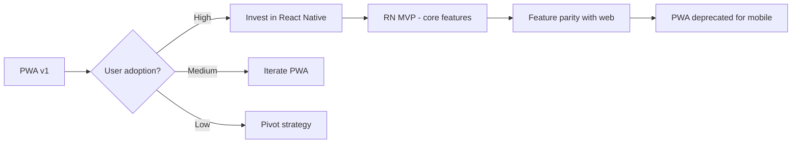

# 06 — PWA vs Native (Implementation Decision)

## Purpose

A focused decision document on the mobile platform strategy: PWA, React Native, Flutter, or fully native. This file provides comparison, recommended path, and migration roadmap.

## Comparison matrix

| Aspect | PWA | React Native | Flutter | Native iOS+Android |
|---|---|---|---|---|
| Initial dev cost | Low (reuses web) | Medium | Medium | High |
| Time to v1 ship | 4-6 weeks | 8-12 weeks | 8-12 weeks | 12-16 weeks |
| Code sharing with web | Excellent | Good | Limited | None |
| Performance | Good | Good | Excellent | Excellent |
| Offline support | Limited | Good | Good | Excellent |
| Push notifications | Limited (web push) | Full (FCM/APNs) | Full | Full |
| Native APIs | Limited | Most | Most | All |
| App store distribution | No (or via TWA) | Yes | Yes | Yes |
| Biometric auth | Limited (Web Auth) | Full | Full | Full |
| Geofence (background) | No | Yes | Yes | Yes |
| Camera/document scan | Basic | Good | Good | Excellent |
| Update frequency | Instant | App store cycle | App store cycle | App store cycle |
| Storage on device | IndexedDB (limited) | SQLite | SQLite/Hive | Native |
| Cost long-term | Low maintenance | Medium | Medium | High |
| User experience | Good | Very good | Excellent | Excellent |
| Indian market fit | OK | Strong | Strong | Strong |

## Recommended path

`[v1]` — Q3-Q4 2026 launch:
- **PWA primary**
- Web responsive design
- Service worker for basic offline
- Web push notifications
- Goal: ship MVP fast, iterate based on usage

`[v2]` — H1 2027:
- **React Native** for primary mobile experience
- Code sharing with web
- Native push notifications
- Biometric auth
- Geofencing
- Better offline

`[v3]` — H2 2027:
- Native iOS / Android for performance-critical paths
- Wearable support (Watch app for managers)
- Deeper OS integration

## PWA implementation (v1)

### Tech stack

```typescript
// next.config.js
const withPWA = require('next-pwa')({
  dest: 'public',
  register: true,
  skipWaiting: true,
  runtimeCaching: [
    {
      urlPattern: /^https:\/\/api\.tenantname\.com\/.*$/,
      handler: 'NetworkFirst',
      options: {
        cacheName: 'api-cache',
        networkTimeoutSeconds: 10,
        expiration: {
          maxEntries: 200,
          maxAgeSeconds: 60 * 60 * 24,    // 1 day
        },
      },
    },
    {
      urlPattern: /\.(?:png|jpg|jpeg|svg|gif|webp)$/,
      handler: 'CacheFirst',
      options: {
        cacheName: 'image-cache',
      },
    },
  ],
});

module.exports = withPWA({/* ...other config */});
```

### Service worker

```javascript
// service-worker.js
self.addEventListener('install', (event) => {
  event.waitUntil(
    caches.open('hrms-static-v1').then((cache) => {
      return cache.addAll([
        '/',
        '/offline',
        '/manifest.json',
        '/icons/icon-192.png',
      ]);
    })
  );
});

self.addEventListener('fetch', (event) => {
  // Stale-while-revalidate strategy
  // Detail: per-route patterns
});

self.addEventListener('push', (event) => {
  const data = event.data?.json();
  const title = data?.title || 'HRMS';
  const options = {
    body: data?.body,
    icon: '/icons/icon-192.png',
    badge: '/icons/badge.png',
    data: data?.url,
  };
  event.waitUntil(self.registration.showNotification(title, options));
});

self.addEventListener('notificationclick', (event) => {
  event.notification.close();
  event.waitUntil(
    clients.openWindow(event.notification.data || '/')
  );
});
```

### Manifest

```json
{
  "name": "HRMS by Tenant",
  "short_name": "HRMS",
  "start_url": "/",
  "display": "standalone",
  "background_color": "#ffffff",
  "theme_color": "#1a73e8",
  "icons": [
    { "src": "/icons/icon-192.png", "sizes": "192x192", "type": "image/png" },
    { "src": "/icons/icon-512.png", "sizes": "512x512", "type": "image/png" }
  ]
}
```

### Offline action queue

```typescript
class OfflineQueue {
  private dbName = 'hrms-offline';
  
  async enqueue(action: OfflineAction) {
    const db = await this.openDb();
    const tx = db.transaction('actions', 'readwrite');
    await tx.objectStore('actions').add({
      ...action,
      id: crypto.randomUUID(),
      timestamp: Date.now(),
      status: 'pending',
    });
    
    // Register sync event
    if ('serviceWorker' in navigator && 'SyncManager' in window) {
      const reg = await navigator.serviceWorker.ready;
      await reg.sync.register('sync-actions');
    }
  }
  
  async sync() {
    const db = await this.openDb();
    const tx = db.transaction('actions', 'readwrite');
    const pending = await tx.objectStore('actions').index('status').getAll('pending');
    
    for (const action of pending) {
      try {
        await this.executeAction(action);
        await tx.objectStore('actions').delete(action.id);
      } catch (err) {
        action.retryCount = (action.retryCount || 0) + 1;
        if (action.retryCount > 5) {
          action.status = 'failed';
        }
        await tx.objectStore('actions').put(action);
      }
    }
  }
}
```

### Web push setup

```typescript
async function subscribeToPush() {
  const reg = await navigator.serviceWorker.ready;
  const subscription = await reg.pushManager.subscribe({
    userVisibleOnly: true,
    applicationServerKey: VAPID_PUBLIC_KEY,
  });
  
  // Send subscription to server
  await fetch('/api/push/subscribe', {
    method: 'POST',
    body: JSON.stringify(subscription),
    headers: { 'Content-Type': 'application/json' },
  });
}
```

## React Native (v2)

### Stack

- React Native 0.74+
- Expo for managed workflow (good for SME apps)
- React Navigation
- TanStack Query for data
- MMKV for storage
- React Native Push Notifications
- React Native Biometrics

### Code sharing with web

```typescript
// shared/api/usePayslip.ts (web + native)
export function usePayslip(id: string) {
  return useQuery(['payslip', id], () => fetchPayslip(id));
}

// web/PayslipPage.tsx
export default function PayslipPage({ id }) {
  const { data } = usePayslip(id);
  return <div>{data.netPay}</div>;
}

// native/PayslipScreen.tsx
export default function PayslipScreen({ route }) {
  const { data } = usePayslip(route.params.id);
  return <Text>{data.netPay}</Text>;
}
```

Estimated 60-70% logic shared.

## Flutter (alternative for v2)

If React Native doesn't fit:
- Flutter excels in pixel-perfect UI consistency
- Single codebase (Dart)
- Excellent performance
- Strong tooling
- Larger app size

For Indian SME context, React Native chosen for code sharing with web frontend (Next.js).

## Migration paths

### v1 (PWA) → v2 (RN)



Migration:
- Identify top 5 mobile workflows (attendance, leave, payslip, expense, ticket)
- Build RN versions
- Soft launch (internal testing → 10% of tenants → all)
- Maintain PWA for 6 months as fallback
- Deprecate PWA for mobile after RN stable

### Data continuity

- IndexedDB → AsyncStorage / MMKV (one-time migration)
- Push subscriptions: re-subscribe on RN install
- Auth tokens: re-login required (one-time)

## App store strategy

### iOS App Store

- Apple Developer Account: $99/year
- Submission process: 1-3 days review
- Categories: Business / Productivity
- Pricing: Free; in-app purchase: not applicable (B2B SaaS)
- Privacy nutrition labels mandatory
- App Tracking Transparency framework

### Google Play Store

- Google Play Developer: $25 one-time
- Review: minutes to days
- Categories: Business
- Permissions: location, camera, biometric, push
- Data Safety section mandatory

### Enterprise / MDM distribution

For tenants requiring controlled distribution:
- Apple Business Manager
- Google Play for Work
- Custom .ipa / .apk for sideload (Android)
- TestFlight for iOS beta

## Cost analysis

`[v1]` PWA-only:
- Dev: ~₹15-25 lakhs (4-6 month sprint)
- Hosting: minimal (already running web)
- Maintenance: low

`[v2]` React Native:
- Dev: ~₹35-50 lakhs (8-12 weeks)
- Apple developer: $99/year
- Google Play: $25 one-time
- Push services (FCM): free up to 100 msg/sec (sufficient)
- Maintenance: medium

`[v3]` Native:
- Dev: ~₹50-75 lakhs (12-16 weeks)
- Maintenance: high (separate teams)

## Open questions

`[OPEN]` Single React Native app or separate apps for employees vs managers? Recommend: single app with role-based UI; reduces ops.

`[OPEN]` Background sync precision: how aggressive? Apple iOS limits background activity. Android more permissive. Recommend: rely on push for triggers; background sync for data refresh.

`[OPEN]` In-app updates (without app store cycle): React Native CodePush. Recommend: yes for critical fixes; major updates via app store.

`[OPEN]` Voice input (e.g., for ticket creation). Recommend: v3 nice-to-have.

`[OPEN]` AR features (e.g., virtual office tour for new hires). Recommend: out of scope.

## Cross-references

- [00-overview.md](./00-overview.md) — ESS overview
- [01-mobile-app-architecture.md](./01-mobile-app-architecture.md) — architecture details
- [/02-attendance/10-mobile-and-offline.md](../02-attendance/10-mobile-and-offline.md) — mobile attendance
