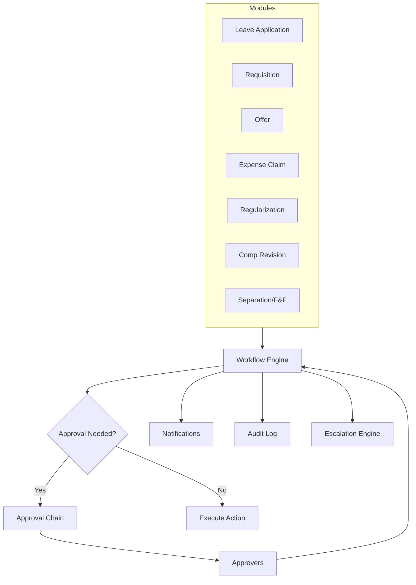

# 00 — Workflow Module Overview

## Purpose

Approvals, delegations, escalations, and routing logic appear everywhere across the HRMS — leave applications, requisitions, offers, expense claims, regularizations, comp revisions, terminations, F&F. Without a unified workflow engine, every module reinvents this.

`/08-workflow/` specifies the workflow engine: a generic, configurable, auditable approval framework used by all other modules.

## Scope of this folder

**In scope:**

- Workflow definition schema (states, transitions, conditions)
- Approval chain configuration (role-based, dynamic, multi-level)
- Delegation rules (vacation, role-based)
- Escalation policies (SLA breaches, no-action timeouts)
- Conditional routing (e.g., CTC > ₹50L needs tenant admin)
- Audit and traceability
- Notifications integration
- Workflow builder UI
- Pre-built workflow templates

**Out of scope:**

- Module-specific business logic — that lives in respective modules
- BPM-grade orchestration → simple approval flows only in v1
- External integrations → v2

## Files in this folder

1. [01-workflow-engine.md](./01-workflow-engine.md) — Engine architecture, state machine, execution
2. [02-approval-chains.md](./02-approval-chains.md) — Chain types, configuration, dynamic resolution
3. [03-delegation-and-escalation.md](./03-delegation-and-escalation.md) — Delegation rules, escalation triggers
4. [04-workflow-templates.md](./04-workflow-templates.md) — Pre-built workflows shipped with platform
5. [05-edge-cases.md](./05-edge-cases.md) — Edge cases

## Architectural position



Every approvable action in HRMS becomes a `WorkflowInstance` managed by the engine.

## Key entities (overview)

```typescript
interface WorkflowDefinition extends BaseDocument {
  workflowCode: string;
  applicableTo: WorkflowEntityType;        // 'leave-application' | 'offer' | etc.
  
  states: WorkflowState[];
  transitions: WorkflowTransition[];
  
  approvalChainConfig: ApprovalChainConfig;
  escalationPolicy: EscalationPolicy;
  
  // ... more in 01-workflow-engine.md
}

interface WorkflowInstance extends BaseDocument {
  workflowDefinitionId: ObjectId;
  entityRefId: ObjectId;                   // ref Leave / Offer / etc.
  entityType: WorkflowEntityType;
  
  currentState: string;
  history: WorkflowStateChange[];
  
  pendingApprovals: PendingApproval[];
  // ... more in 01
}
```

## Design principles

1. **Generic engine, specific config**: one engine; per-module / per-tenant configuration
2. **Auditability**: every state change tracked, immutable
3. **Idempotency**: actions can be safely retried
4. **Composability**: workflows can be chained (offer approval → comp revision approval)
5. **Tenant flexibility**: tenants tweak chains without engineering involvement

## Integration with audit

Per `/00-foundations/04-audit-and-compliance-hooks.md`, every workflow state change is in audit log with hash chain.

## Open questions (overall)

`[OPEN]` Build vs buy: workflow engines exist (Camunda, Temporal). Recommend: build lightweight in v1 (avoid heavy deps); consider Temporal for v2 if complex orchestration needed.

`[OPEN]` Visual workflow builder: powerful but expensive to build. Recommend: form-based config in v1; visual builder v2.

`[OPEN]` Cross-tenant workflow templates marketplace. Recommend: out of scope.

`[OPEN]` Email-based approval (approve via email link without logging in). Recommend: yes — high adoption value; use signed token approach.

## Cross-references

- All other modules use this engine
- [/00-foundations/04-audit-and-compliance-hooks.md](../00-foundations/04-audit-and-compliance-hooks.md) — audit
- [/00-foundations/03-identity-and-rbac.md](../00-foundations/03-identity-and-rbac.md) — roles for approvers
