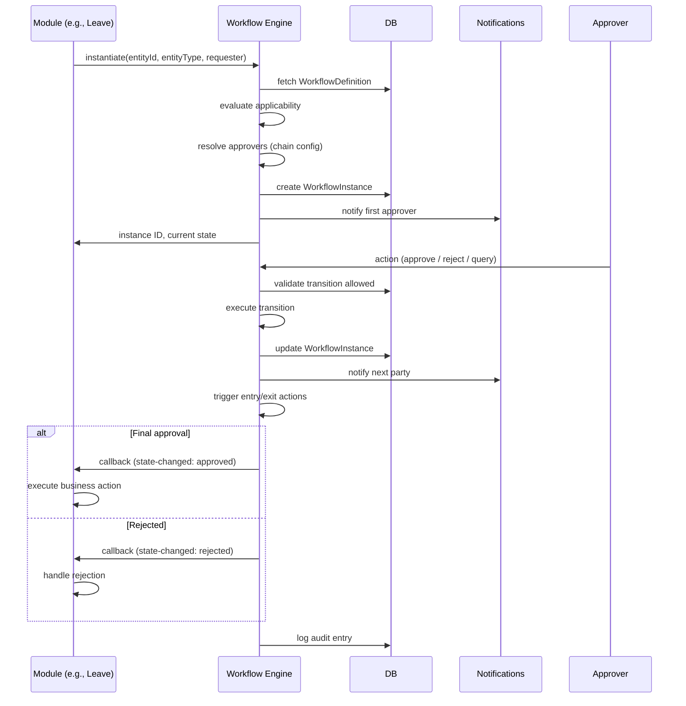

# 01 — Workflow Engine

## Purpose

Specifies the workflow engine: state machine, definition schema, instance schema, execution model, and integration patterns.

## Workflow definition schema

```typescript
interface WorkflowDefinition extends BaseDocument {
  _id: ObjectId;
  tenantId: ObjectId;
  entityId?: ObjectId;                     // null = tenant-wide; entity-specific override
  
  // identity
  workflowCode: string;                    // 'leave-application' | 'offer-approval' | etc.
  workflowName: string;
  description: string;
  
  // applicability
  applicableTo: {
    entityType: WorkflowEntityType;
    triggerEvent: string;                  // 'on-create' | 'on-update' | 'on-status-change'
    
    conditions?: WorkflowCondition[];      // AND-ed conditions
    
    employeeFilters?: {
      employmentTypes?: string[];
      departments?: ObjectId[];
      designationLevels?: string[];
      categories?: ('white-collar' | 'blue-collar')[];
      locations?: ObjectId[];
    };
  };
  
  // states
  states: WorkflowState[];
  initialState: string;
  finalStates: string[];                   // terminal (success / reject / cancelled)
  
  // transitions
  transitions: WorkflowTransition[];
  
  // approval chain
  approvalChainConfig: ApprovalChainConfig;
  
  // escalation
  escalationPolicy?: EscalationPolicy;
  
  // notifications
  notificationConfig: NotificationConfig;
  
  // versioning
  version: number;
  isActive: boolean;
  effectiveFrom: Date;
  effectiveTo?: Date;
  
  createdAt: Date;
  updatedAt: Date;
  createdBy: ObjectId;
  isDeleted: boolean;
}

type WorkflowEntityType =
  | 'leave-application'
  | 'attendance-regularization'
  | 'overtime-claim'
  | 'expense-claim'
  | 'requisition'
  | 'offer'
  | 'compensation-revision'
  | 'promotion'
  | 'transfer'
  | 'separation'
  | 'fnf-settlement'
  | 'pip'
  | 'document-approval'
  | 'policy-acknowledgment'
  | 'asset-request'
  | 'access-request'
  | 'travel-request'
  | 'training-request'
  | 'custom';

interface WorkflowState {
  stateCode: string;                       // 'draft', 'pending-approval', 'approved', etc.
  stateName: string;
  category: 'initial' | 'pending' | 'in-review' | 'approved' | 'rejected' | 'cancelled' | 'terminal';
  
  isInitial: boolean;
  isFinal: boolean;
  
  // SLAs
  slaInHours?: number;
  
  // entry actions (auto)
  entryActions?: WorkflowAction[];
  // exit actions
  exitActions?: WorkflowAction[];
  
  // permissions
  visibleToRoles?: string[];
  editableByRoles?: string[];
}

interface WorkflowTransition {
  transitionCode: string;
  fromState: string;
  toState: string;
  
  // who can trigger
  triggeringRoles: string[];               // 'approver', 'requester', 'system', etc.
  
  // conditions
  conditions?: WorkflowCondition[];
  
  // confirmation
  requiresComment: boolean;
  requiresAttachment: boolean;
  
  // post-transition
  triggerActions?: WorkflowAction[];
}

interface WorkflowCondition {
  field: string;                           // 'amount', 'employee.designationLevel', etc.
  operator: 'eq' | 'ne' | 'gt' | 'gte' | 'lt' | 'lte' | 'in' | 'not-in' | 'contains' | 'matches';
  value: any;
}

interface WorkflowAction {
  actionType: 'send-notification' | 'create-task' | 'update-entity' | 'webhook' | 'audit-log' | 'compute-derived';
  actionConfig: any;
}

interface NotificationConfig {
  onStateChange: Array<{
    state: string;
    notify: ('requester' | 'approver' | 'manager' | 'hr' | 'custom')[];
    customRecipientIds?: ObjectId[];
    channels: ('email' | 'in-app' | 'push' | 'sms' | 'whatsapp')[];
    templateCode: string;
  }>;
}
```

## Workflow instance schema

```typescript
interface WorkflowInstance extends BaseDocument {
  _id: ObjectId;
  tenantId: ObjectId;
  entityId: ObjectId;
  
  // identity
  instanceCode: string;                    // 'WI-2026-04-001234'
  
  // links
  workflowDefinitionId: ObjectId;
  workflowVersion: number;                 // version pinned at creation
  
  entityType: WorkflowEntityType;
  entityRefId: ObjectId;                   // ref Leave / Offer / etc.
  
  // requester
  requesterEmployeeId: ObjectId;
  requestedAt: Date;
  
  // current state
  currentState: string;
  
  // history
  history: WorkflowStateChange[];
  
  // pending approvals (active)
  pendingApprovals: Array<{
    approvalCode: string;                  // 'AP-2026-04-001234-1'
    sequence: number;
    approverEmployeeId: ObjectId;
    approverRoleSnapshot: string;
    
    actionDeadline: Date;
    notificationsSent: number;
    
    isDelegated: boolean;
    delegatedFromEmployeeId?: ObjectId;
    
    isEscalated: boolean;
    escalatedFromEmployeeId?: ObjectId;
    
    status: 'pending' | 'approved' | 'rejected' | 'queried' | 'reverted' | 'expired-delegated';
  }>;
  
  // completed approvals
  completedApprovals: Array<{
    approvalCode: string;
    approverEmployeeId: ObjectId;
    decision: 'approved' | 'rejected' | 'reverted' | 'queried';
    decidedAt: Date;
    comment?: string;
    attachmentDocumentIds?: ObjectId[];
  }>;
  
  // SLA tracking
  slaStartAt: Date;
  slaDeadline?: Date;
  slaWarningAt?: Date;
  isSlaBreached: boolean;
  
  // termination
  isTerminated: boolean;
  terminatedAt?: Date;
  terminationReason?: 'completed-success' | 'completed-rejected' | 'cancelled' | 'expired' | 'superseded';
  
  // contextual data
  contextSnapshot: any;                    // entity data at creation, for audit
  
  // ID for replay / idempotency
  idempotencyKey?: string;
  
  createdAt: Date;
  updatedAt: Date;
  isDeleted: boolean;
}

interface WorkflowStateChange {
  fromState: string;
  toState: string;
  changedAt: Date;
  changedBy: ObjectId | 'system';
  transitionCode: string;
  
  comment?: string;
  attachments?: ObjectId[];
  
  durationInPriorState?: number;           // ms
}
```

## Indexes

```typescript
// WorkflowDefinition
{ tenantId: 1, workflowCode: 1, isActive: 1 }
{ tenantId: 1, applicableTo.entityType: 1 }

// WorkflowInstance
{ tenantId: 1, instanceCode: 1 }, unique
{ tenantId: 1, entityRefId: 1 }
{ tenantId: 1, requesterEmployeeId: 1, currentState: 1 }
{ tenantId: 1, pendingApprovals.approverEmployeeId: 1, currentState: 1 }
{ tenantId: 1, slaDeadline: 1, currentState: 1 }
{ tenantId: 1, currentState: 1 }
```

## Execution model



## Approval chain types

### Sequential

Approvers signed off one after another:

```
Manager → HR Manager → Finance Head → Tenant Admin
```

Each waits for prior. Any reject cascades back.

### Parallel (any-N)

Multiple approvers; need N approvals:

```
Need 2 of: [Manager A, Manager B, Manager C]
```

Use case: peer review.

### Parallel (all)

All approvers must sign off; can do in parallel:

```
[Manager, HR Manager, Compliance Officer] all approve
```

### Conditional branching

Different chains based on conditions:

```
If amount > ₹50,000: chain A (with finance)
Else: chain B (without finance)
```

Configured as `approvalChainConfig.conditions[]`.

### Dynamic resolution

Approvers resolved at instance creation based on requester's hierarchy:

```typescript
// Config:
{
  steps: [
    { resolveBy: 'requester.directManager' },
    { resolveBy: 'role:hr-manager:requester.entity' },
    {
      resolveBy: 'conditional',
      conditions: [
        { if: 'amount > 50000', then: 'role:finance-head' },
        { if: 'amount > 100000', then: 'role:tenant-admin' },
      ],
    },
  ],
}
```

## Action handlers (callbacks)

Modules register callbacks for state changes:

```typescript
interface WorkflowCallback {
  workflowEntityType: WorkflowEntityType;
  
  onApprove: (instance: WorkflowInstance) => Promise<void>;
  onReject: (instance: WorkflowInstance) => Promise<void>;
  onCancel: (instance: WorkflowInstance) => Promise<void>;
  
  // optional
  onStateChange?: (instance: WorkflowInstance, fromState: string, toState: string) => Promise<void>;
}

// Module example
const leaveCallback: WorkflowCallback = {
  workflowEntityType: 'leave-application',
  
  onApprove: async (instance) => {
    const leave = await Leave.findById(instance.entityRefId);
    leave.status = 'approved';
    leave.approvedAt = new Date();
    await leave.save();
    await deductLeaveBalance(leave);
    await sendApprovalEmail(leave);
  },
  
  onReject: async (instance) => {
    const leave = await Leave.findById(instance.entityRefId);
    leave.status = 'rejected';
    leave.rejectedAt = new Date();
    leave.rejectionReason = instance.completedApprovals[instance.completedApprovals.length - 1].comment;
    await leave.save();
    await sendRejectionEmail(leave);
  },
};
```

## Idempotency

Each workflow action carries an `idempotencyKey`. Replays detected:
- If key matches existing action: return prior result
- Prevents double-approve on network retries

## Email-based approval

Approvers can approve via email link:

```typescript
function generateApprovalLink(instance, approver, decision): string {
  const token = signToken({
    instanceId: instance._id,
    approverId: approver._id,
    decision,
    expiresAt: Date.now() + 7 * 24 * 3600 * 1000,
  });
  
  return `https://app.tenant.com/approve?token=${token}`;
}
```

Token-based; one-click approve / reject without login.

`[CA-REVIEW]` Email-based approval increases convenience; security via short-lived signed tokens. Audit retains full trail.

## Workflow termination

Reasons:
- All approvals received → completed-success
- Any approver rejects → completed-rejected
- Requester cancels → cancelled
- SLA expires (config) → expired
- Superseded by newer request → superseded

Terminated workflows immutable; new request creates new instance.

## Workflow versioning

When a tenant updates a workflow definition:
- Existing instances continue with their pinned version
- New instances use latest version
- Audit shows which version each instance used

## Cancellation

Requester can cancel own pending workflow:
- Limited to certain states (e.g., before any approval)
- Or anytime with reason

Approvers can also "revert" (send back for changes):
- Requester gets opportunity to fix and resubmit
- Same workflow instance continues (not a new one)

## Error handling

If module callback throws:
- Workflow state still updated
- Module retried up to 3 times
- After failure: moved to dead-letter queue
- Alert to admin
- Manual intervention possible

## Open questions

`[OPEN]` Long-running workflows (months): keep WorkflowInstance active or archive? Recommend: active until terminated; archive 1 year after termination.

`[OPEN]` Workflow chaining (one workflow's completion triggers another). Recommend: yes via callbacks; explicit chain config.

`[OPEN]` Manual override by HR / admin (force approve / reject). Recommend: yes with reason; logged separately.

`[OPEN]` Workflow analytics: bottleneck detection, average approval time per chain. Recommend: yes — useful for tenants.

## Cross-references

- [02-approval-chains.md](./02-approval-chains.md) — chain detail
- [03-delegation-and-escalation.md](./03-delegation-and-escalation.md) — delegation
- [/00-foundations/04-audit-and-compliance-hooks.md](../00-foundations/04-audit-and-compliance-hooks.md) — audit integration
- [/00-foundations/03-identity-and-rbac.md](../00-foundations/03-identity-and-rbac.md) — role resolution
