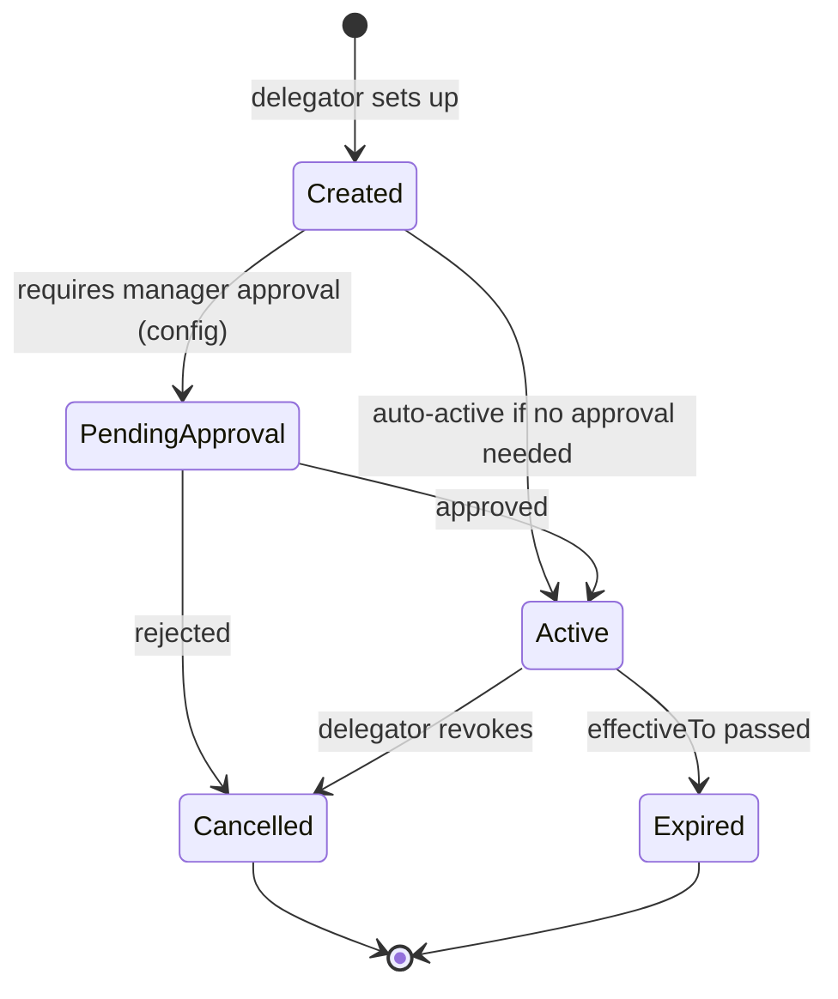

# 03 — Delegation & Escalation

## Purpose

Delegation handles temporary unavailability (vacations, sick leave). Escalation handles SLA breaches and stuck approvals. Both are critical for keeping workflows moving.

## Delegation schema

```typescript
interface DelegationRule extends BaseDocument {
  _id: ObjectId;
  tenantId: ObjectId;
  
  // delegator
  fromEmployeeId: ObjectId;
  
  // delegate
  toEmployeeId: ObjectId;
  
  // scope
  scopeType: 'all-approvals' | 'specific-types' | 'specific-instances';
  applicableEntityTypes?: WorkflowEntityType[];
  
  // value-based scope (don't delegate high-value)
  amountLimit?: Decimal128;                // delegate only if amount ≤ limit
  
  // time-bound
  effectiveFrom: Date;
  effectiveTo: Date;
  
  // reason
  reason: 'vacation' | 'leave' | 'temporary-assignment' | 'maternity' | 'other';
  reasonNotes?: string;
  
  // notifications
  notifyDelegator: boolean;
  notifyOnEachAction: boolean;
  
  // self-protection
  preventDelegateRedelegation: boolean;    // delegate cannot re-delegate further
  
  // approval state
  isApproved: boolean;
  approvedBy?: ObjectId;                   // some tenants require manager approval
  
  // audit
  createdAt: Date;
  createdBy: ObjectId;                     // typically delegator
  isActive: boolean;
  isDeleted: boolean;
}
```

## Delegation lifecycle



## Delegation usage

### Vacation example

Pankaj (HR Manager) is going on vacation Apr 15 - Apr 25.

```typescript
{
  fromEmployeeId: pankaj_id,
  toEmployeeId: rakesh_id,                 // Senior HR Specialist
  scopeType: 'all-approvals',
  effectiveFrom: '2026-04-15T00:00:00+05:30',
  effectiveTo: '2026-04-25T23:59:59+05:30',
  reason: 'vacation',
  preventDelegateRedelegation: true,
  isApproved: true,
}
```

During this period:
- Any workflow needing Pankaj's approval auto-routes to Rakesh
- Audit log notes: "Approved by Rakesh on behalf of Pankaj (delegation)"
- Notifications go to Rakesh
- Pankaj can still approve if he chooses (returning briefly)

### High-value protection

For Pankaj (Tenant Admin), delegate only handles small approvals:

```typescript
{
  fromEmployeeId: pankaj_id,
  toEmployeeId: hr_director_id,
  scopeType: 'specific-types',
  applicableEntityTypes: ['leave-application', 'expense-claim'],
  amountLimit: 50000,                      // delegate handles only ≤ ₹50K
  // ... above ₹50K stays with Pankaj or escalates
}
```

### Re-delegation prevention

If delegate (Rakesh) takes vacation during Pankaj's vacation:
- Default: Rakesh's delegation doesn't apply (would create chain)
- Workflows wait for Rakesh OR escalate
- `preventDelegateRedelegation: true` enforces

## Auto-resolution at runtime

When workflow needs to assign an approver:

```typescript
async function resolveActiveApprover(
  designatedApprover: Employee,
  context: WorkflowContext
): Promise<{ approver: Employee; isDelegated: boolean; delegatorId?: ObjectId }> {
  // Check active delegations
  const activeDelegation = await DelegationRule.findOne({
    tenantId: context.tenantId,
    fromEmployeeId: designatedApprover._id,
    isActive: true,
    effectiveFrom: { $lte: new Date() },
    effectiveTo: { $gte: new Date() },
    
    // scope match
    $or: [
      { scopeType: 'all-approvals' },
      {
        scopeType: 'specific-types',
        applicableEntityTypes: context.entityType,
      },
    ],
    
    // amount limit
    $or: [
      { amountLimit: { $exists: false } },
      { amountLimit: { $gte: context.entityValue || 0 } },
    ],
  });
  
  if (activeDelegation) {
    const delegate = await Employee.findById(activeDelegation.toEmployeeId);
    return { approver: delegate, isDelegated: true, delegatorId: designatedApprover._id };
  }
  
  return { approver: designatedApprover, isDelegated: false };
}
```

## Escalation policy schema

```typescript
interface EscalationPolicy {
  policyCode: string;
  
  // triggers
  triggers: Array<{
    triggerType: 'sla-breach' | 'no-action-timeout' | 'critical-priority';
    
    // for sla-breach / timeout
    triggerAfterHours?: number;
    repeatEveryHours?: number;
    
    // action
    escalationAction: EscalationAction;
  }>;
  
  // safety nets
  maxEscalationLevels: number;             // don't escalate forever
  
  // notification preferences
  notifyOriginalApprover: boolean;
  notifyEscalatee: boolean;
  notifyHr: boolean;
}

type EscalationAction =
  | { type: 'remind-current-approver'; channels: ('email' | 'push' | 'sms')[] }
  | { type: 'notify-managers'; levels: number }
  | { type: 'auto-escalate-to'; resolution: ApproverResolution }
  | { type: 'auto-reject-with-reason'; reasonCode: string }
  | { type: 'flag-for-hr-review' }
  | { type: 'webhook'; url: string };
```

## Escalation lifecycle

```mermaid
sequenceDiagram
    participant Engine
    participant Approver
    participant Manager as Approver's Manager
    participant HR
    
    Engine->>Approver: notification (action needed; SLA 48h)
    
    Note over Engine: 24 hours pass; no action
    
    Engine->>Approver: reminder (75% of SLA)
    
    Note over Engine: 48 hours pass; SLA breached
    
    Engine->>Approver: SLA breach notification
    Engine->>Manager: escalation notification (your reportee has pending)
    
    Note over Engine: 72 hours; still no action
    
    Engine->>Engine: trigger auto-escalation
    Engine->>Manager: now you must approve (next-level)
    Engine->>Approver: notice (escalated)
    
    Note over Engine: 96 hours
    
    Engine->>HR: alert (chronic delay pattern)
```

## Escalation examples

### Standard SLA breach escalation

```typescript
const standardEscalation: EscalationPolicy = {
  policyCode: 'STANDARD-SLA-ESC',
  triggers: [
    {
      triggerType: 'sla-breach',
      triggerAfterHours: 0.75 * stepSla,   // 75% of SLA
      escalationAction: {
        type: 'remind-current-approver',
        channels: ['email', 'push'],
      },
    },
    {
      triggerType: 'sla-breach',
      triggerAfterHours: 1.0 * stepSla,
      escalationAction: {
        type: 'notify-managers',
        levels: 1,
      },
    },
    {
      triggerType: 'sla-breach',
      triggerAfterHours: 1.5 * stepSla,
      escalationAction: {
        type: 'auto-escalate-to',
        resolution: { type: 'requester-skip-manager' },
      },
    },
  ],
  maxEscalationLevels: 3,
  notifyHr: true,
};
```

### Critical urgency

```typescript
const criticalEscalation: EscalationPolicy = {
  policyCode: 'CRITICAL-URGENT',
  triggers: [
    {
      triggerType: 'critical-priority',
      triggerAfterHours: 2,                // very fast
      escalationAction: {
        type: 'remind-current-approver',
        channels: ['email', 'push', 'sms', 'whatsapp'],
      },
    },
    {
      triggerType: 'sla-breach',
      triggerAfterHours: 4,
      escalationAction: {
        type: 'auto-escalate-to',
        resolution: { type: 'role-in-entity', role: 'hr-head', entityScope: 'tenant' },
      },
    },
  ],
  maxEscalationLevels: 2,
  notifyHr: true,
};
```

## SLA tracking

For each pending approval:

```typescript
interface SlaTracking {
  workflowInstanceId: ObjectId;
  approvalCode: string;
  
  approverEmployeeId: ObjectId;
  
  startedAt: Date;
  slaInHours: number;
  deadlineAt: Date;
  
  warningAt: Date;                         // typically 75% mark
  warningTriggered: boolean;
  
  breachAt: Date;                          // = deadline
  breachTriggered: boolean;
  
  escalationsAttempted: number;
  escalationHistory: Array<{
    triggeredAt: Date;
    triggerType: string;
    actionTaken: string;
    result?: any;
  }>;
}
```

## Reminder cadence

| Stage | Channels | Frequency |
|---|---|---|
| Initial assignment | Email + In-app | Once |
| 50% of SLA | Email + In-app | Once |
| 75% of SLA | Email + In-app + Push | Once |
| 100% of SLA (breach) | Email + Push + SMS | Daily until action |
| 150% of SLA | Email + Push + SMS + WhatsApp | Daily |
| Auto-escalation triggers | All channels | Once at escalation |

Tenant configurable.

## Out-of-office notifications

When delegation activates:
- Auto-reply email from delegator
- ESS shows "Out of office; approvals delegated to [delegate]"
- Managers / requesters informed transparently

## Auto-escalation safety

To prevent runaway escalations:
- Max escalation levels (default 3)
- Don't escalate to requester themselves
- Don't escalate above tenant admin
- Notify HR if escalation reaches max

## Manual escalation (by requester)

Requester can manually escalate if SLA breached:
- "My leave is urgent; escalating"
- Goes to next-level approver immediately
- Audit log

## Escalation analytics

Track:
- Avg escalations per workflow
- Top approvers escalated
- Patterns (Mondays after weekends, vacations)

Improvement opportunities:
- Coach approvers
- Adjust SLAs
- Update delegation defaults

## Open questions

`[OPEN]` Auto-approval after multiple escalations (very last resort, with audit). Recommend: NO; always escalate to higher human; auto-approval too risky.

`[OPEN]` Cross-tenant delegation (one tenant's approver delegated to another). Recommend: never; security risk.

`[OPEN]` Smart delegation suggestions (HRMS suggests delegate based on availability and similar role). Recommend: v2.

`[OPEN]` Vacation-aware auto-delegation (when employee approves vacation, prompt for delegation setup). Recommend: yes — proactive UX.

## Cross-references

- [01-workflow-engine.md](./01-workflow-engine.md) — engine
- [02-approval-chains.md](./02-approval-chains.md) — chains
- [/00-foundations/03-identity-and-rbac.md](../00-foundations/03-identity-and-rbac.md) — role hierarchy
- [/02-attendance/03-leave-types-and-policies.md](../02-attendance/03-leave-types-and-policies.md) — vacation triggers delegation
