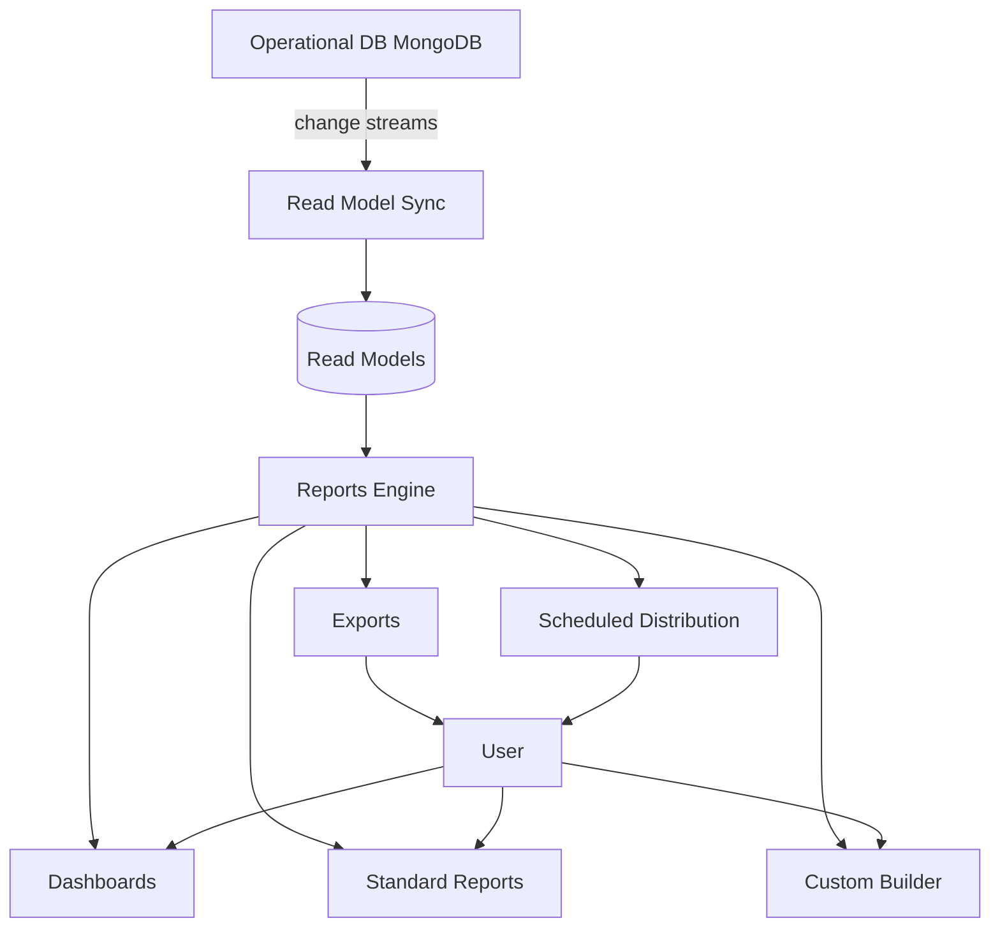

# 00 — Analytics Module Overview

## Purpose

Analytics turn HRMS data into decisions. The module covers:

- Standard reports (catalog of pre-built reports)
- Custom report builder (HR self-service)
- Dashboards (role-based views)
- Data exports (Excel, CSV, PDF, API)
- Scheduled reports
- KPIs and metrics framework
- Predictive analytics (v2/v3)

The HRMS surfaces data tenants couldn't easily get from spreadsheet-driven HR.

## Scope of this folder

**In scope:**

- Reports architecture (read models, materialized views)
- Standard report catalog
- Custom report builder (tenant DIY)
- Dashboard configuration
- Export formats and API
- Scheduled distribution
- KPIs and benchmarks

**Out of scope:**

- BI tool integrations (Tableau, Power BI) → v2; native API enables it
- AI / ML predictive (attrition forecasts) → v2/v3
- Data warehouse / lakehouse → out of scope
- Real-time event streaming → out of scope
- Cross-tenant benchmarking → v3

## Files in this folder

1. [01-reports-architecture.md](./01-reports-architecture.md) — Read models, query patterns, performance
2. [02-standard-reports-catalog.md](./02-standard-reports-catalog.md) — All pre-built reports
3. [03-custom-report-builder.md](./03-custom-report-builder.md) — Tenant-built reports
4. [04-dashboards.md](./04-dashboards.md) — Role-based dashboards
5. [05-exports-and-api.md](./05-exports-and-api.md) — Export formats, API access
6. [06-scheduled-distribution.md](./06-scheduled-distribution.md) — Email digests, distribution lists

## Architectural position



## Design principles

1. **Operational vs analytical separation**: don't slow down operations with reporting queries
2. **Pre-aggregated**: complex reports use materialized views
3. **Tenant-scoped always**: no cross-tenant data leakage
4. **Permission-aware**: respect RBAC and field-level security
5. **Self-service**: HR builds custom reports without IT help
6. **Exportable**: every report exportable
7. **Schedulable**: every report can be scheduled

## Read model strategy

For most reports, MongoDB queries on operational data work fine (with proper indexes). For complex analytics (cross-module joins, time-series aggregations), maintain read models:

```typescript
interface ReadModel {
  modelCode: string;                       // 'employee-headcount-monthly', 'payroll-summary-by-dept', etc.
  
  source: {
    collections: string[];                 // 'employees', 'payrollLines', 'leaves'
    refreshStrategy: 'change-stream' | 'scheduled' | 'on-demand';
    refreshFrequency?: string;             // for scheduled
  };
  
  schema: any;                             // schema of read model
  indexes: any[];
  
  retention: 'permanent' | 'rolling' | 'archived';
  retentionPeriod?: string;
}
```

Examples of read models:
- Daily headcount per dept
- Monthly payroll aggregates
- Leave usage summaries
- Recruitment funnel snapshots

Maintained via MongoDB change streams or scheduled refresh.

## Permissions

Reports respect:
- RBAC (only see data within scope)
- Field-level security (PII masked unless authorized)
- Sub-org filtering (only see own dept / entity unless admin)

```typescript
interface ReportPermission {
  reportCode: string;
  
  visibleToRoles: string[];                // who can run this
  
  // data scope
  scopeFilter: {
    type: 'all-tenant' | 'entity-only' | 'department-only' | 'self-only' | 'team-only';
  };
  
  // field-level
  sensitiveFieldsMasked: string[];         // CTC, address, etc.
  fullAccessRoles: string[];
}
```

## Example: HR Manager runs salary report

- HR Manager has role 'hr-manager'
- Report: "Salary by Department"
- Permission: visible to hr-manager, hr-head, tenant-admin
- Scope: their entity only
- Sensitive fields: full CTC visible (HR can see)
- Other masking: bank account masked

## Performance considerations

Operational queries (real-time, fast):
- Single employee lookup
- Pending workflows for current user
- Today's attendance

Analytical queries (slower, OK):
- Cross-module reports
- Time-series
- Aggregations across years

For very large tenants (10K+ employees, multi-year data):
- Pre-aggregated views
- Caching
- Async generation for heavy reports
- Pagination

## Open questions (overall)

`[OPEN]` Tableau / Power BI native connector. Recommend: yes in v2; expose REST API + sample dashboards.

`[OPEN]` Real-time vs near-real-time. Most HR data doesn't need real-time. Recommend: hourly refresh for read models; real-time for dashboards.

`[OPEN]` Cross-tenant benchmarking (anonymized). Marketplace play. Recommend: v3.

`[OPEN]` AI insights ("Your absenteeism is 30% above industry average"). Recommend: v3.

`[OPEN]` Embed-able reports (iframe in customer's intranet). Recommend: v2.

## Cross-references

- All other modules generate analytics data
- [/00-foundations/03-identity-and-rbac.md](../00-foundations/03-identity-and-rbac.md) — permissions
- [/00-foundations/04-audit-and-compliance-hooks.md](../00-foundations/04-audit-and-compliance-hooks.md) — audit
