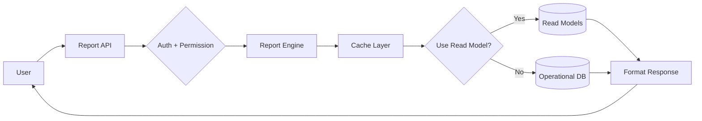

# 01 — Reports Architecture

## Purpose

Architecture for HRMS reports: how queries are structured, how performance is maintained, how read models work, how permissions enforced.

## Query layers



## Report execution flow

```typescript
async function runReport(reportRequest: ReportRequest, user: User): Promise<ReportResult> {
  // 1. Resolve report definition
  const reportDef = await ReportDefinition.findOne({ reportCode: reportRequest.reportCode });
  if (!reportDef) throw new Error('Report not found');
  
  // 2. Permission check
  await checkReportPermission(user, reportDef);
  
  // 3. Apply user scope
  const scopedFilters = applyScope(reportRequest.filters, user, reportDef);
  
  // 4. Cache check
  const cacheKey = computeCacheKey(reportDef, scopedFilters, user);
  const cached = await cache.get(cacheKey);
  if (cached) return cached;
  
  // 5. Resolve data source (read model or live query)
  const data = reportDef.useReadModel
    ? await queryReadModel(reportDef.readModelCode, scopedFilters)
    : await queryOperational(reportDef.queryDefinition, scopedFilters);
  
  // 6. Apply field-level masking
  const masked = applyFieldMasking(data, user, reportDef);
  
  // 7. Format output
  const result = formatReport(masked, reportDef.outputFormat);
  
  // 8. Cache (TTL)
  await cache.set(cacheKey, result, reportDef.cacheTtlSeconds || 300);
  
  // 9. Audit log
  await audit.log({ user, reportCode, scope: scopedFilters });
  
  return result;
}
```

## Report definition schema

```typescript
interface ReportDefinition extends BaseDocument {
  _id: ObjectId;
  
  reportCode: string;                      // 'headcount-summary', 'salary-by-dept'
  reportName: string;
  description: string;
  category: ReportCategory;
  
  // applicability
  applicableEntityTypes?: ('factory' | 'shop' | 'commercial' | 'all')[];
  
  // permissions
  visibleToRoles: string[];
  scopeOptions: ('all-tenant' | 'entity' | 'department' | 'team' | 'self')[];
  defaultScope: string;
  
  // filters
  availableFilters: ReportFilter[];
  defaultFilters?: any;
  
  // grouping
  groupingOptions?: Array<{
    field: string;
    label: string;
  }>;
  
  // aggregations
  metrics: Array<{
    metricCode: string;
    label: string;
    aggregation: 'count' | 'sum' | 'avg' | 'min' | 'max' | 'distinct-count' | 'percentile';
    field: string;
    unit?: string;
  }>;
  
  // dimensions
  dimensions: Array<{
    dimensionCode: string;
    label: string;
    field: string;
    type: 'time-series' | 'categorical' | 'numeric-bucket' | 'geographic';
  }>;
  
  // visualization
  defaultVisualization: 'table' | 'bar-chart' | 'line-chart' | 'pie-chart' | 'heatmap' | 'scatter' | 'kpi-tile';
  availableVisualizations: string[];
  
  // data source
  useReadModel: boolean;
  readModelCode?: string;
  queryDefinition?: any;                   // MongoDB pipeline / aggregation
  
  // performance
  cacheTtlSeconds: number;
  estimatedExecutionTimeMs: number;
  isExpensive: boolean;                    // requires async generation
  
  // exports
  exportFormats: ('csv' | 'excel' | 'pdf' | 'json')[];
  
  // sensitive fields
  sensitiveFieldsMaskedFor: { 
    field: string;
    maskedExceptForRoles: string[];
  }[];
  
  // versioning
  version: number;
  isActive: boolean;
  isShipped: boolean;                      // platform vs custom
  
  createdAt: Date;
  updatedAt: Date;
  createdBy: ObjectId;
  isDeleted: boolean;
}

interface ReportFilter {
  filterCode: string;
  label: string;
  field: string;
  type: 'date-range' | 'date-picker' | 'select' | 'multi-select' | 'text' | 'numeric-range' | 'boolean';
  options?: Array<{ value: any; label: string }>;
  defaultValue?: any;
  isRequired: boolean;
}

type ReportCategory =
  | 'headcount-and-organization'
  | 'attendance-and-leave'
  | 'payroll-and-compensation'
  | 'recruitment'
  | 'performance'
  | 'compliance-and-statutory'
  | 'finance-and-accounting'
  | 'employee-experience'
  | 'diversity-and-inclusion'
  | 'custom';
```

## Read model patterns

### Daily snapshot

For headcount reporting:

```typescript
interface DailyHeadcountSnapshot {
  tenantId: ObjectId;
  entityId: ObjectId;
  asOfDate: string;                        // YYYY-MM-DD
  
  totalActive: number;
  byCategory: { 'white-collar': number; 'blue-collar': number };
  byDepartment: Record<string, number>;
  byLocation: Record<string, number>;
  byEmploymentType: Record<string, number>;
  byGender: Record<string, number>;
  byTenureBucket: Record<string, number>;
  byDesignationLevel: Record<string, number>;
  
  // separations / additions
  newJoinersToday: number;
  separationsToday: number;
  
  computedAt: Date;
}
```

Refreshed daily at midnight (cron). Reports query this for fast headcount.

### Monthly aggregates

For payroll trends:

```typescript
interface MonthlyPayrollAggregate {
  tenantId: ObjectId;
  entityId: ObjectId;
  period: string;                          // 'YYYY-MM'
  
  totalGross: Decimal128;
  totalNet: Decimal128;
  totalEmployerCost: Decimal128;
  
  totalEmployees: number;
  avgGross: Decimal128;
  medianGross: Decimal128;
  
  byDepartment: Record<string, {
    employees: number;
    totalGross: Decimal128;
    avgGross: Decimal128;
  }>;
  
  byBucket: {
    junior: { count: number; totalGross: Decimal128 };
    mid: { count: number; totalGross: Decimal128 };
    senior: { count: number; totalGross: Decimal128 };
    leadership: { count: number; totalGross: Decimal128 };
  };
  
  // statutory
  totalPF: Decimal128;
  totalESI: Decimal128;
  totalPT: Decimal128;
  totalTDS: Decimal128;
  
  // arrears
  totalArrears: Decimal128;
  
  computedAt: Date;
}
```

Refreshed at payroll close. Used for trend reports.

### Leave usage rolling

```typescript
interface LeaveUsageRolling {
  tenantId: ObjectId;
  employeeId: ObjectId;
  
  rollingPeriod: 'last-7-days' | 'last-30-days' | 'last-90-days' | 'last-365-days' | 'fy-ytd';
  asOfDate: Date;
  
  byLeaveType: Record<string, {
    daysTaken: number;
    daysRemaining: number;
    daysApplied: number;
  }>;
  
  totalDaysAbsent: number;
  totalLopDays: number;
  
  computedAt: Date;
}
```

Refreshed daily.

## Indexes for read models

```typescript
// Daily headcount
{ tenantId: 1, entityId: 1, asOfDate: -1 }, unique on (tenantId, entityId, asOfDate)
{ tenantId: 1, asOfDate: -1 }              // for tenant-wide

// Monthly payroll aggregate
{ tenantId: 1, entityId: 1, period: -1 }, unique
{ tenantId: 1, period: -1 }

// Employee tenure bucket
{ tenantId: 1, employeeId: 1, asOfDate: -1 }
```

## Query patterns

### MongoDB aggregation example

For "Headcount by Department":

```typescript
async function headcountByDepartment(tenantId, entityId, asOfDate) {
  return await Employee.aggregate([
    {
      $match: {
        tenantId,
        ...(entityId && { entityId }),
        joinedOn: { $lte: asOfDate },
        $or: [
          { separatedOn: null },
          { separatedOn: { $gt: asOfDate } },
        ],
        isDeleted: false,
      },
    },
    {
      $group: {
        _id: '$departmentId',
        count: { $sum: 1 },
        avgTenureMonths: { $avg: { $divide: [{ $subtract: [asOfDate, '$joinedOn'] }, 30 * 24 * 3600 * 1000] } },
        whiteCollar: { $sum: { $cond: [{ $eq: ['$category', 'white-collar'] }, 1, 0] } },
        blueCollar: { $sum: { $cond: [{ $eq: ['$category', 'blue-collar'] }, 1, 0] } },
      },
    },
    {
      $lookup: {
        from: 'departments',
        localField: '_id',
        foreignField: '_id',
        as: 'dept',
      },
    },
    { $unwind: '$dept' },
    {
      $project: {
        departmentName: '$dept.name',
        count: 1,
        avgTenureMonths: 1,
        whiteCollar: 1,
        blueCollar: 1,
      },
    },
    { $sort: { count: -1 } },
  ]);
}
```

## Caching

Three layers:
1. **Result cache** (Redis): per query+user, TTL 5-30 min
2. **Read model cache** (in-memory): for hot read models, TTL 1 min
3. **CDN** (rare): for public dashboards (not in v1)

Cache invalidation:
- Time-based TTL primary
- Event-based for critical (e.g., new joiner → invalidate headcount)

## Async report generation

For expensive reports:

```mermaid
sequenceDiagram
    User->>App: request report
    App->>Job Queue: enqueue
    App->>User: "Generation in progress; we'll email when ready"
    
    Job Queue->>Worker: process
    Worker->>DB: query
    Worker->>S3: store result
    Worker->>User: email + in-app notification
    
    User->>App: open notification
    App->>S3: download
```

Jobs use BullMQ (per existing tenant infra patterns). Workers compute, store, notify.

## Pagination and infinite-scroll

For large result sets:
- Default: 50 rows
- Max: 1000 rows per page
- Offset-based or cursor-based (cursor preferred)

Export bypasses pagination (full result in file).

## Pivoting

Reports can pivot data:
- Rows = employees
- Columns = months
- Values = leave days

`[v2]` Excel-like pivot UI.

## Filtering and slicing

Report runs with filters:
- Time range
- Entity / department / location
- Employee category / role
- Custom predicates

User can save filter presets.

## Drill-down

Reports support hierarchical drill:
- Total → Per Entity → Per Department → Per Employee
- Each click drills down

## Open questions

`[OPEN]` Maximum result set size. Recommend: 100K rows for in-app; bigger triggers async export.

`[OPEN]` Concurrent reports running. Per-tenant rate limits. Recommend: 5 concurrent per user; tenant-wide 50.

`[OPEN]` Custom field display: tenant-defined fields appear in standard reports? Recommend: yes; via field metadata.

`[OPEN]` Aggregation across multi-tenant (for parent companies). Recommend: out of v1; v2 with explicit consent.

## Cross-references

- [02-standard-reports-catalog.md](./02-standard-reports-catalog.md) — catalog
- [03-custom-report-builder.md](./03-custom-report-builder.md) — custom reports
- [04-dashboards.md](./04-dashboards.md) — dashboards
- [/00-foundations/03-identity-and-rbac.md](../00-foundations/03-identity-and-rbac.md) — permissions
