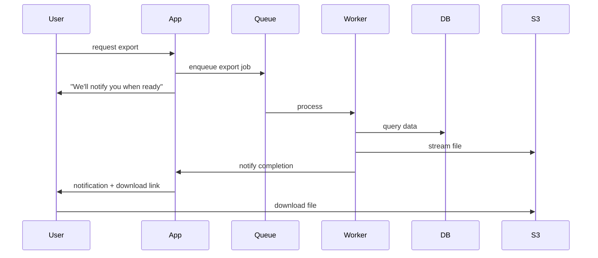

# 05 — Exports & API

## Purpose

Specifies how data exits the HRMS — manual exports (CSV, Excel, PDF), bulk exports, and API access for integrations.

## Export formats

### CSV

Simple tabular data:
- One row per record
- UTF-8 with BOM (for Excel Hindi/regional language compatibility)
- Quoted strings
- ISO date format

### Excel (.xlsx)

Rich:
- Multiple sheets (one per report section)
- Headers with formatting
- Cell types (numbers, dates, currency)
- Formulas (occasional, e.g., totals)
- Charts embedded
- Pivot tables (advanced)

Library: SheetJS / ExcelJS

### PDF

For reports / payslips / certificates:
- Letterhead
- Charts as images (server-rendered)
- Tables with proper formatting
- Page numbers
- QR code (verification)

Library: Puppeteer (HTML→PDF) or pdfmake

### JSON

For API consumers:
- Standard JSON structure
- Pagination metadata
- Schema versioning

## Export request schema

```typescript
interface ExportRequest extends BaseDocument {
  _id: ObjectId;
  tenantId: ObjectId;
  
  // identity
  exportCode: string;                      // 'EXP-2026-04-001234'
  
  // requested
  reportCode: string;
  filters: any;
  format: 'csv' | 'excel' | 'pdf' | 'json';
  
  // requested by
  requestedBy: ObjectId;
  requestedAt: Date;
  
  // estimated
  estimatedRows: number;
  estimatedSizeBytes: number;
  estimatedDurationSeconds: number;
  
  // sync vs async
  isAsync: boolean;
  
  // execution
  status: 'queued' | 'in-progress' | 'completed' | 'failed' | 'cancelled' | 'expired';
  startedAt?: Date;
  completedAt?: Date;
  errorMessage?: string;
  
  // output
  outputDocumentId?: ObjectId;
  outputUrl?: string;                      // signed S3 URL with TTL
  outputUrlExpiresAt?: Date;
  
  // download tracking
  downloadCount: number;
  lastDownloadedAt?: Date;
  
  // retention
  retainUntil: Date;                       // typically 7 days
  
  createdAt: Date;
  updatedAt: Date;
  isDeleted: boolean;
}
```

## Sync vs async

Export decision:

| Estimated rows | Strategy |
|---|---|
| < 1000 | Sync (immediate download) |
| 1000-50000 | Sync with progress (in-app) |
| > 50000 | Async (background; email/in-app notification when ready) |

User experience:

```
For < 1K rows: instant download
For 1-50K: spinner + "Generating... 80% complete"
For > 50K: "We're preparing your file. We'll notify you in [X minutes]."
```

## Async export flow



## Bulk exports

For very large data:
- Compressed ZIP
- Multiple files (one per dept / location, etc.)
- Streamed (don't buffer in memory)
- Resumable downloads

## Export permissions

User can only export:
- Reports they have access to
- Data within their scope
- Sensitive fields per their role

Export audit:
- Every export logged (who, what, when)
- Bulk exports flagged for review
- Suspicious patterns alerted

## Export retention

Generated files:
- Stored in S3
- TTL: 7 days (default; tenant config)
- Auto-deleted after TTL
- Re-runnable from request history

## File security

- Encrypted at rest (S3 SSE)
- Signed URLs with expiry
- Optional password protection (config)
- Watermarking (sensitive reports include user identity)

## API access

For integrations:

### Authentication

- API keys (per tenant + per integration)
- OAuth 2.0 for user-context APIs
- JWT bearer tokens for session APIs

### Endpoints

```
GET /api/v1/employees                     # list
GET /api/v1/employees/:id                 # detail
POST /api/v1/employees                    # create
PATCH /api/v1/employees/:id               # update

GET /api/v1/payroll-runs                  # list payroll runs
GET /api/v1/payroll-runs/:id/lines        # payroll lines

GET /api/v1/leaves                        # list leaves
POST /api/v1/leaves                       # apply leave

GET /api/v1/reports/:reportCode           # run report
GET /api/v1/reports/:reportCode/export    # export report

GET /api/v1/audit-events                  # audit log

POST /api/v1/webhooks                     # register webhook
```

### Rate limiting

- 1000 requests/min per API key (default)
- 10000 requests/hr
- Burst tolerance: 100 req in 10 sec
- 429 responses with Retry-After header

### Pagination

```typescript
GET /api/v1/employees?page=1&pageSize=50&sortBy=joinedOn&sortOrder=desc

Response:
{
  data: [...],
  pagination: {
    page: 1,
    pageSize: 50,
    totalCount: 850,
    totalPages: 17,
    hasMore: true,
    nextCursor: 'abc123',
  },
  meta: {
    apiVersion: '1.0',
    timestamp: '2026-04-29T12:00:00+05:30',
  },
}
```

### Filtering

```
GET /api/v1/employees?
  filter[status]=active&
  filter[departmentId]=dept_123&
  filter[joinedOn][gte]=2026-01-01
```

### Field selection

```
GET /api/v1/employees?fields=fullName,email,designation
```

### Versioning

URL versioning: `/api/v1/`, `/api/v2/`

Backward compatibility:
- v1 maintained 24+ months after v2 launch
- Deprecation warnings in headers
- Migration guides

### Webhooks

```typescript
interface WebhookSubscription {
  webhookCode: string;
  tenantId: ObjectId;
  
  url: string;                             // tenant-provided endpoint
  events: string[];                        // 'employee.created', 'payroll.completed', etc.
  
  // security
  secretToken: string;                     // for HMAC signing
  
  // retry
  retryPolicy: {
    maxRetries: number;
    backoffStrategy: 'exponential' | 'linear';
  };
  
  // health
  isActive: boolean;
  lastSuccessfulDelivery?: Date;
  consecutiveFailures: number;
  disabledAfterFailures: number;           // auto-disable after N consecutive failures
}
```

Standard webhook events:
- `employee.created`, `employee.updated`, `employee.separated`
- `payroll.run.started`, `payroll.run.completed`, `payroll.locked`
- `leave.applied`, `leave.approved`, `leave.rejected`
- `offer.sent`, `offer.accepted`, `offer.declined`
- `compliance.filing.submitted`
- ... (full event taxonomy)

### API documentation

OpenAPI 3.0 spec generated. Interactive docs available.

## Bulk operations API

```
POST /api/v1/employees/bulk
Body: { employees: [...] }

Returns: { created: N, errors: [...], jobId: 'job_abc' }

GET /api/v1/jobs/:jobId   # check status
```

For: bulk creates, bulk updates, bulk imports.

## Read-only data warehouse access (v2)

For BI tools:
- Read replica with daily refresh
- SQL-like access (e.g., via Stitch, Fivetran connector)
- Pre-aggregated views

## Open questions

`[OPEN]` GraphQL endpoint (in addition to REST). Tenant Bilpaid uses GraphQL. Recommend: yes for v2; consistent with broader stack.

`[OPEN]` Real-time event stream (e.g., Kafka). For sophisticated tenants. Recommend: v3.

`[OPEN]` Self-service API key management for tenants. Recommend: yes in v1 — admin can create/revoke keys.

`[OPEN]` Bulk export size cap (per tenant per day). Recommend: 1 GB; enterprise tier allows more.

`[OPEN]` API analytics for tenants (their integration usage). Recommend: yes; useful insight.

## Cross-references

- [01-reports-architecture.md](./01-reports-architecture.md) — engine
- [02-standard-reports-catalog.md](./02-standard-reports-catalog.md) — exportable reports
- [03-custom-report-builder.md](./03-custom-report-builder.md) — custom exports
- [/00-foundations/03-identity-and-rbac.md](../00-foundations/03-identity-and-rbac.md) — API permissions
